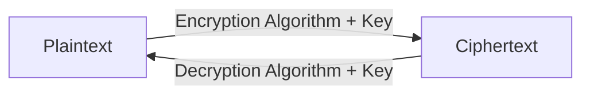

# Debian Encryption

## Introduction

Encryption is a fundamental component of modern computer security. In Debian Linux, encryption provides a powerful way to protect sensitive data from unauthorized access. Whether you're securing personal files, system configurations, or entire disk partitions, Debian offers robust encryption tools and frameworks that can help safeguard your information.

This guide will walk you through the basics of encryption in Debian systems, covering both file-level and full-disk encryption techniques. We'll explore the underlying concepts, implementation steps, and best practices to help you effectively incorporate encryption into your Debian security strategy.

## Understanding Encryption Basics

Before diving into Debian-specific tools, let's understand what encryption actually does:

Encryption is the process of converting readable data (plaintext) into an unreadable format (ciphertext) using mathematical algorithms and a key. Only someone with the proper key can decrypt the data back to its original form.



In Debian, encryption can be applied at different levels:

1. **File-level encryption**: Encrypting individual files or directories
2. **Container-level encryption**: Encrypting virtual containers that hold multiple files
3. **Partition-level encryption**: Encrypting entire partitions
4. **Full-disk encryption**: Encrypting the entire disk except for the boot partition

## File Encryption Tools in Debian

### GnuPG (GPG)

GnuPG is a complete implementation of the OpenPGP standard and comes pre-installed on most Debian systems. It's primarily used for encrypting and signing files and communications.

#### Installing GPG

```bash
sudo apt update
sudo apt install gnupg
```

#### Basic GPG Usage

To encrypt a file for your own use:

```bash
# Generate a key pair if you don't have one
gpg --gen-key

# Encrypt a file
gpg --encrypt --recipient your.email@example.com sensitive_document.txt
```

This produces a file named `sensitive_document.txt.gpg` that can only be decrypted with your private key.

To decrypt the file:

```bash
gpg --decrypt sensitive_document.txt.gpg > decrypted_document.txt
```

### Creating Encrypted Archives with `zip`

For simple encrypted archives, you can use the `zip` command with encryption:

```bash
# Install zip if not already available
sudo apt install zip

# Create an encrypted zip archive
zip -e secure_archive.zip document1.txt document2.txt
```

You'll be prompted to enter and confirm a password. The resulting archive will be encrypted and can only be extracted with the correct password.

## Directory and Volume Encryption with eCryptfs

eCryptfs is a cryptographic filesystem for Linux that allows you to encrypt directories without having to create separate partitions.

### Setting Up an Encrypted Home Directory

Debian allows you to encrypt a user's home directory during installation, but you can also set it up later:

```bash
# Install necessary packages
sudo apt install ecryptfs-utils

# Migrate an existing home directory to an encrypted one
sudo ecryptfs-migrate-home -u username
```

After migration, you'll need to log in as the user to complete the setup. The system will automatically mount the encrypted directory when you log in.

### Creating an Encrypted Private Directory

You can also create a separate encrypted directory for sensitive files:

```bash
# Create an encrypted private directory
ecryptfs-setup-private
```

This creates a `~/Private` directory that's encrypted when not in use and decrypted when you access it with your login password.

## Full Disk Encryption with LUKS

Linux Unified Key Setup (LUKS) is the standard for Linux hard disk encryption. It enables you to encrypt entire partitions, including the system partition.

### Setting Up LUKS During Debian Installation

The easiest way to implement full disk encryption is during Debian installation:

1. When you reach the partitioning step, select "Guided - use entire disk and set up encrypted LVM"
2. Follow the prompts to set up your encryption passphrase
3. Complete the installation as normal

### Encrypting a New Partition with LUKS

To encrypt a new partition after installation:

```bash
# Install necessary packages
sudo apt install cryptsetup

# Format the partition with LUKS
sudo cryptsetup luksFormat /dev/sdXY

# Open the encrypted partition
sudo cryptsetup luksOpen /dev/sdXY encrypted_data

# Create a filesystem on the encrypted partition
sudo mkfs.ext4 /dev/mapper/encrypted_data

# Mount the filesystem
sudo mkdir -p /mnt/encrypted_data
sudo mount /dev/mapper/encrypted_data /mnt/encrypted_data
```

To automatically mount the encrypted partition at boot, you'll need to edit `/etc/crypttab` and `/etc/fstab`.

### Example of `/etc/crypttab` Entry

```
encrypted_data UUID=your-device-uuid none luks
```

### Example of `/etc/fstab` Entry

```
/dev/mapper/encrypted_data /mnt/encrypted_data ext4 defaults 0 2
```

## Key Management Best Practices

Proper key management is crucial for maintaining security:

1. **Use strong passphrases**: Longer is better, with a mix of characters
2. **Back up your keys**: Store backups in secure, separate locations
3. **Consider key rotation**: Change encryption keys periodically
4. **Protect against physical attacks**: Consider measures against cold boot attacks

## Real-World Examples

### Scenario 1: Securing a Developer's Laptop

A software developer might set up their Debian laptop with:

1. Full disk encryption using LUKS
2. GPG keys for signing Git commits and encrypting sensitive communications
3. An encrypted container for client-specific code repositories

### Scenario 2: Protecting a Home Server

A home server running Debian might implement:

1. Encrypted storage volumes for media files and backups
2. Encrypted configuration files containing API keys and passwords
3. Secure remote access with encrypted SSH connections

### Scenario 3: Compliance Requirements for a Small Business

A small business might configure their Debian servers with:

1. Full disk encryption to comply with data protection regulations
2. Encrypted backups of customer data
3. Encrypted communication channels for all sensitive information

## Performance Considerations

Encryption adds computational overhead. Consider these performance factors:

1. Modern CPUs with AES-NI instruction set offer hardware acceleration for encryption
2. SSD performance impact is usually less noticeable than with HDDs
3. RAM usage increases with encryption processes

To check if your CPU supports AES-NI:

```bash
grep -m1 -o aes /proc/cpuinfo
```

If the output shows "aes", your CPU supports hardware acceleration for AES encryption.

## Common Issues and Troubleshooting

### Recovery from Lost Passphrases

LUKS supports multiple key slots, allowing you to have backup passphrases:

```bash
# Add a secondary passphrase to LUKS
sudo cryptsetup luksAddKey /dev/sdXY
```

### Dealing with Encrypted Swap

If your system uses encrypted swap, hibernation may require additional configuration:

```bash
# Check if swap is encrypted
ls -l /dev/mapper/ | grep swap
```

### Performance Problems

If encryption is causing performance issues:

```bash
# Check CPU usage during file operations
top

# Consider using a different cipher with better performance
sudo cryptsetup benchmark
```

## Summary

Encryption in Debian provides robust protection for your data at various levels, from individual files to entire disk partitions. By implementing appropriate encryption techniques and following best practices for key management, you can significantly enhance the security of your Debian systems.

Remember that encryption is just one aspect of a comprehensive security strategy. It should be combined with other security measures like regular updates, proper access controls, and network security to create a robust defense for your systems and data.

## Additional Resources and Exercises

### Further Reading

- The [Debian Security Manual](https://www.debian.org/doc/manuals/securing-debian-manual/)
- The [GnuPG Documentation](https://gnupg.org/documentation/)
- The [LUKS/dm-crypt Documentation](https://gitlab.com/cryptsetup/cryptsetup/-/wikis/home)

### Practice Exercises

1. **Basic Exercise**: Create an encrypted archive of personal documents using GPG
2. **Intermediate Exercise**: Set up an encrypted directory using eCryptfs and automate mounting with your login
3. **Advanced Exercise**: Configure a Debian system with a custom partitioning scheme, encrypting specific partitions with LUKS
4. **Expert Challenge**: Implement a layered encryption strategy with both file-level and partition-level encryption, ensuring keys are properly managed and backed up

By practicing these exercises, you'll gain hands-on experience with Debian encryption tools and develop the skills to implement secure encryption strategies in your own environments.