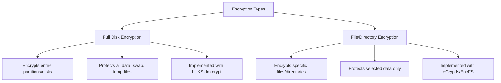

# Debian Disk Encryption

## Introduction

Disk encryption is a critical security measure that protects your data from unauthorized access if your device is lost, stolen, or compromised. On Debian systems, disk encryption transforms your data into unreadable ciphertext that can only be accessed with the correct encryption key or passphrase.

This guide explains how to implement, manage, and troubleshoot disk encryption on Debian systems. We'll focus primarily on LUKS (Linux Unified Key Setup), which is the standard disk encryption specification for Linux.

## Why Use Disk Encryption?

- **Data Protection**: Prevents unauthorized access to sensitive information
- **Compliance**: Helps meet regulatory requirements (GDPR, HIPAA, etc.)
- **Theft Protection**: Renders data unreadable if hardware is stolen
- **Peace of Mind**: Adds an essential layer of security to your system

## Understanding Disk Encryption Concepts

Before diving into implementation, let's understand some key concepts:

### Full Disk Encryption vs. File/Directory Encryption



### LUKS (Linux Unified Key Setup)

LUKS is the standard for Linux hard disk encryption. It:
- Stores encryption setup information in the partition header
- Allows multiple passphrases for the same encrypted data
- Facilitates secure passphrase changes

## Setting Up Disk Encryption

### Method 1: During Debian Installation

The easiest way to implement full disk encryption is during the initial Debian installation:

1. **Boot from Debian installation media**
2. **Select "Guided - use entire disk and set up encrypted LVM" in the partitioning step**

![Debian Installer Encryption Option]

3. **Follow the prompts to configure encryption:**
   - Choose the disk to encrypt
   - Set up your encryption passphrase (make it strong!)
   - Configure your LVM partitions

4. **Complete the installation as normal**

After installation, your system will prompt for the encryption passphrase during boot before the operating system loads.

### Method 2: Encrypting Existing Data

For systems already running Debian, you can encrypt individual partitions:

1. **Install necessary packages:**

```bash
sudo apt update
sudo apt install cryptsetup
```

2. **Back up your data** (This process will erase the partition!)

3. **Identify the partition to encrypt:**

```bash
lsblk
```

4. **Create an encrypted LUKS container:**

```bash
sudo cryptsetup luksFormat /dev/sdXY
```

Example output:
```
This will overwrite data on /dev/sdXY irrevocably.

Are you sure? (Type uppercase yes): YES
Enter passphrase for /dev/sdXY: 
Verify passphrase: 
```

5. **Open the encrypted container:**

```bash
sudo cryptsetup luksOpen /dev/sdXY encrypted_data
```

6. **Create a filesystem on the encrypted container:**

```bash
sudo mkfs.ext4 /dev/mapper/encrypted_data
```

7. **Mount the encrypted filesystem:**

```bash
sudo mkdir /mnt/encrypted
sudo mount /dev/mapper/encrypted_data /mnt/encrypted
```

8. **Restore your data to the encrypted partition**

## Automating Mount at Boot

To automatically mount encrypted partitions at boot:

1. **Get the UUID of your encrypted partition:**

```bash
sudo blkid /dev/sdXY
```

Example output:
```
/dev/sdXY: UUID="abcdef12-3456-7890-abcd-ef1234567890" TYPE="crypto_LUKS"
```

2. **Edit the crypttab file:**

```bash
sudo nano /etc/crypttab
```

Add a line like:
```
encrypted_data UUID=abcdef12-3456-7890-abcd-ef1234567890 none luks
```

3. **Update /etc/fstab to mount the decrypted device:**

```bash
sudo nano /etc/fstab
```

Add a line like:
```
/dev/mapper/encrypted_data /mnt/encrypted ext4 defaults 0 2
```

## Managing LUKS Encrypted Volumes

### Adding Additional Passphrases

One of LUKS's strengths is the ability to have multiple passphrases:

```bash
sudo cryptsetup luksAddKey /dev/sdXY
```

You'll be prompted for an existing passphrase and then the new one.

### Removing Passphrases

If a passphrase is compromised, you can remove it:

```bash
sudo cryptsetup luksRemoveKey /dev/sdXY
```

### Changing a Passphrase

To change an existing passphrase:

```bash
sudo cryptsetup luksChangeKey /dev/sdXY
```

### Viewing LUKS Header Information

To see information about the encryption setup:

```bash
sudo cryptsetup luksDump /dev/sdXY
```

Example output:
```
LUKS header information for /dev/sdXY

Version:       	1
Cipher name:   	aes
Cipher mode:   	xts-plain64
Hash spec:     	sha256
Payload offset:	4096
MK bits:       	512
MK digest:     	53 5b e4 21 73 c9 5a 4b 80 06 2d 04 62 0f 52 ef 95 79 33 56 
MK salt:       	74 d7 be 34 48 7d 77 5d 12 ad 9d 8b 57 78 4f c2 
               	78 3a 9d 11 3d 93 82 59 d7 37 8a 4c 53 80 c3 8e 
MK iterations: 	51750
UUID:          	abcdef12-3456-7890-abcd-ef1234567890

Key Slot 0: ENABLED
	Iterations:         	206918
	Salt:               	42 d7 be 7e 48 7d 77 5d 12 ad 9d 8b 57 78 4f c2 
                        	e9 31 4a c5 5d 12 74 9a b2 09 60 f7 44 30 fd d5 
	Key material offset:	8
	AF stripes:            	4000
Key Slot 1: DISABLED
Key Slot 2: DISABLED
Key Slot 3: DISABLED
Key Slot 4: DISABLED
Key Slot 5: DISABLED
Key Slot 6: DISABLED
Key Slot 7: DISABLED
```

## Using Encrypted Swap

Swap space can contain sensitive data. To encrypt it:

1. **Edit /etc/crypttab:**

```bash
sudo nano /etc/crypttab
```

Add:
```
cryptswap UUID=your-swap-uuid /dev/urandom swap,offset=1024,cipher=aes-xts-plain64
```

2. **Modify /etc/fstab:**

```bash
sudo nano /etc/fstab
```

Update your swap entry:
```
/dev/mapper/cryptswap none swap sw 0 0
```

## Encrypting Home Directories with ecryptfs-utils

For more granular encryption:

```bash
sudo apt install ecryptfs-utils
sudo ecryptfs-migrate-home -u username
```

After logging out and back in, record your recovery passphrase:

```bash
ecryptfs-unwrap-passphrase
```

## Performance Considerations

Encryption adds some performance overhead:

- **CPU Usage**: Modern CPUs have AES-NI instructions that minimize impact
- **Disk I/O**: Slight decrease in read/write speeds (typically 5-15%)
- **Boot Time**: Longer due to decryption and passphrase prompt

## Troubleshooting Common Issues

### Forgotten Passphrase

If you forget your LUKS passphrase and have no other key slots configured, the data is permanently inaccessible. This is why it's crucial to:
- Create backup key slots
- Store passphrases securely
- Consider key escrow for organizational deployments

### System Won't Boot After Encryption

If your system doesn't boot after setting up encryption:

1. **Check if the LUKS partition is properly specified in /etc/crypttab**
2. **Verify that your initramfs includes the necessary modules:**

```bash
sudo update-initramfs -u
```

3. **Make sure GRUB is configured to support encryption:**

```bash
sudo nano /etc/default/grub
```

Add or modify:
```
GRUB_ENABLE_CRYPTODISK=y
```

Then update GRUB:
```bash
sudo update-grub
```

## Advanced: Using TPM for Disk Encryption

For newer systems with TPM (Trusted Platform Module), you can bind encryption keys to your hardware:

```bash
sudo apt install tpm2-tools
sudo systemd-cryptenroll --tpm2-device=auto /dev/sdXY
```

This offers the convenience of automatic decryption on trusted hardware while maintaining security.

## Best Practices

1. **Use strong, memorable passphrases**
2. **Keep backups of your data (encrypted, of course)**
3. **Configure multiple key slots with different passphrases**
4. **Update your encryption settings when major Debian versions are released**
5. **Consider the security vs. convenience trade-offs**

## Summary

Disk encryption in Debian provides a strong layer of data protection. We've covered:
- Setting up encryption during installation and on existing systems
- Managing LUKS volumes and passphrases
- Automating the mount process
- Troubleshooting common issues
- Advanced configurations

By implementing disk encryption, you significantly improve your system's security posture and protect sensitive data from unauthorized access.

## Additional Resources

- [Debian Wiki on Disk Encryption](https://wiki.debian.org/Encryption)
- The `man cryptsetup` command for detailed options
- The LUKS specification at [GitLab](https://gitlab.com/cryptsetup/cryptsetup)

## Exercises

1. Set up a test virtual machine with full disk encryption during installation
2. Create an encrypted USB drive using LUKS
3. Configure your system to use encrypted swap
4. Practice adding and removing LUKS key slots
5. Create a disaster recovery plan for your encrypted data