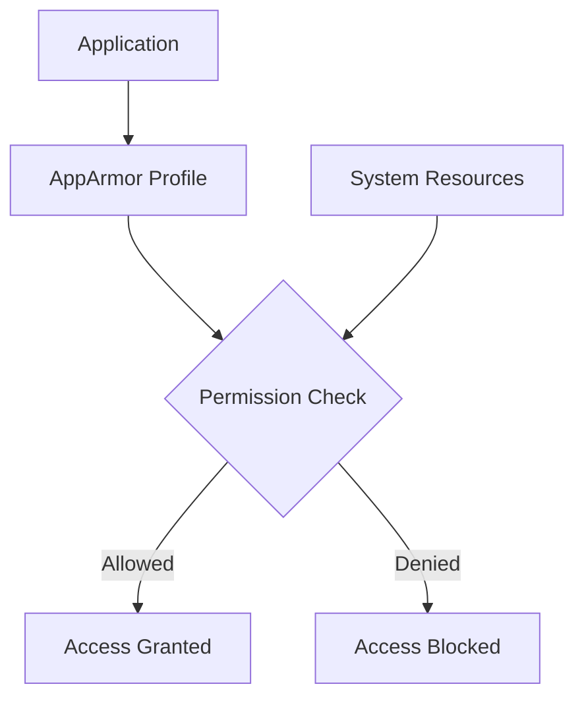

# Debian AppArmor

## Introduction

AppArmor (Application Armor) is a powerful security module for Linux systems that helps protect your Debian installation from both internal and external threats. Unlike traditional Unix permissions that focus on who can access files, AppArmor focuses on what programs can do - allowing you to restrict the capabilities of specific applications.

In this guide, we'll explore how AppArmor works on Debian systems, how to configure it properly, and how it can enhance your system's security posture. Whether you're setting up a personal computer or a production server, understanding AppArmor will give you an additional layer of security beyond standard user permissions.

## What is AppArmor?

AppArmor is a Mandatory Access Control (MAC) system that restricts programs to a limited set of resources. It works by binding access control attributes to programs rather than to users.



Key features of AppArmor include:

- **Path-based access control**: Restricts what files a program can access
- **Resource limitations**: Controls capabilities like network access
- **Default deny stance**: Unless explicitly allowed, actions are denied
- **Profiles**: Configuration files that define what a program can do

## AppArmor vs. Traditional Linux Security

Before diving deeper, let's understand how AppArmor differs from traditional Linux security mechanisms:

| Feature | Traditional Linux Permissions | AppArmor |
|---------|-------------------------------|----------|
| Focus | User/group ownership | Application behavior |
| Control granularity | File level | Path and capability level |
| Configuration | `chmod`, `chown` | Profile configuration files |
| Approach | Discretionary (DAC) | Mandatory (MAC) |
| Protection against | Unauthorized users | Compromised applications |

## Getting Started with AppArmor on Debian

### Installation

AppArmor comes pre-installed on most modern Debian systems, but you might need to install additional utilities:

```bash
sudo apt update
sudo apt install apparmor apparmor-utils apparmor-profiles
```

### Checking AppArmor Status

To verify that AppArmor is running on your system:

```bash
sudo aa-status
```

Example output:

```
apparmor module is loaded.
18 profiles are loaded.
15 profiles are in enforce mode.
   /usr/bin/evince
   /usr/bin/evince-previewer
   ...
3 profiles are in complain mode.
   /usr/bin/firefox
   ...
0 processes have profiles defined.
0 processes are in enforce mode.
0 processes are in complain mode.
0 processes are unconfined but have a profile defined.
```

### Enabling AppArmor at Boot

To ensure AppArmor starts automatically at system boot:

```bash
sudo systemctl enable apparmor
sudo systemctl start apparmor
```

## Understanding AppArmor Profiles

AppArmor profiles are the heart of the system. They define what resources an application can access.

### Profile Locations

Profiles are stored in two main locations:

- `/etc/apparmor.d/` - System profiles
- `/var/lib/apparmor/profiles/` - Generated profiles

### Profile Modes

AppArmor profiles operate in two primary modes:

1. **Enforce mode**: Actively blocks unauthorized actions
2. **Complain mode**: Logs violations but allows them (useful for testing)

### Basic Profile Structure

A typical AppArmor profile has this structure:

```
/path/to/program {
  # Include common rules
  #include <abstractions/base>
  
  # File permissions
  /path/to/readable/file r,
  /path/to/writable/file rw,
  /directory/** r,
  
  # Network permissions
  network inet tcp,
  
  # Capability permissions
  capability setuid,
}
```

## Creating Your First AppArmor Profile

Let's create a simple profile for a custom script. We'll use the `aa-genprof` tool which helps generate profiles by monitoring an application's behavior.

### Sample Script

First, let's create a simple script to profile:

```bash
echo '#!/bin/bash
echo "Hello from AppArmor test"
date > /tmp/apparmor-test.log
cat /etc/hostname
' | sudo tee /usr/local/bin/apparmor-test.sh

sudo chmod +x /usr/local/bin/apparmor-test.sh
```

### Generating the Profile

Now, let's generate a profile for this script:

```bash
sudo aa-genprof /usr/local/bin/apparmor-test.sh
```

This starts the profile generation process. In another terminal, run the script:

```bash
/usr/local/bin/apparmor-test.sh
```

Back in the `aa-genprof` terminal, press 'S' to scan for events. You'll see messages about the script's access attempts. For each one, you can allow or deny access.

After completing the process, a profile is created in `/etc/apparmor.d/usr.local.bin.apparmor-test.sh`.

### Examining the Generated Profile

The generated profile might look like:

```
#include <tunables/global>

/usr/local/bin/apparmor-test.sh {
  #include <abstractions/base>
  #include <abstractions/bash>
  
  /etc/hostname r,
  /tmp/apparmor-test.log w,
  /usr/bin/cat mrix,
  /usr/bin/date mrix,
}
```

## Managing Profiles

### Listing Profiles

To list all profiles:

```bash
sudo aa-status
```

### Changing Profile Modes

To switch a profile from enforce to complain mode:

```bash
sudo aa-complain /path/to/program
```

To switch back to enforce mode:

```bash
sudo aa-enforce /path/to/program
```

### Disabling a Profile

To temporarily disable a profile:

```bash
sudo ln -s /etc/apparmor.d/program /etc/apparmor.d/disable/
sudo apparmor_parser -R /etc/apparmor.d/program
```

### Enabling a Disabled Profile

```bash
sudo rm /etc/apparmor.d/disable/program
sudo apparmor_parser -a /etc/apparmor.d/program
```

## Real-World Examples

Let's explore some practical examples of AppArmor in action on Debian systems.

### Securing a Web Server

For a web server like Apache, AppArmor can limit what the server can access:

```
#include <tunables/global>

/usr/sbin/apache2 {
  #include <abstractions/base>
  #include <abstractions/apache2-common>
  
  # Allow reading web content
  /var/www/** r,
  
  # Allow reading configuration
  /etc/apache2/** r,
  
  # Allow writing to logs
  /var/log/apache2/** w,
  
  # Deny access to personal user files
  deny /home/** rwx,
  
  # Required capabilities
  capability net_bind_service,
  capability setgid,
  capability setuid,
}
```

### Protecting Sensitive Applications

For applications handling sensitive data, like a database:

```
#include <tunables/global>

/usr/sbin/mysqld {
  #include <abstractions/base>
  #include <abstractions/mysql>
  
  # Database files
  /var/lib/mysql/ r,
  /var/lib/mysql/** rwk,
  
  # Configuration
  /etc/mysql/** r,
  
  # Log files
  /var/log/mysql/** w,
  
  # Explicitly deny access to other data
  deny /home/** rwx,
  deny /var/www/** rwx,
  
  # Network access
  network inet tcp,
}
```

## Troubleshooting AppArmor

When applications start behaving unexpectedly, AppArmor might be blocking necessary access.

### Checking AppArmor Logs

The most important step is to check the logs:

```bash
sudo grep "apparmor" /var/log/syslog
```

or 

```bash
sudo dmesg | grep apparmor
```

Example log entry:

```
May 25 15:23:47 debian kernel: [12345.678901] audit: type=1400 audit(1621945427.123:567): apparmor="DENIED" operation="open" profile="/usr/bin/firefox" name="/home/user/.config/secret.txt" pid=12345 comm="firefox" requested_mask="r" denied_mask="r" fsuid=1000 ouid=1000
```

### Understanding Denial Messages

Let's break down the log entry:

- `apparmor="DENIED"`: Action was blocked
- `operation="open"`: The type of operation
- `profile="/usr/bin/firefox"`: The AppArmor profile involved
- `name="/home/user/.config/secret.txt"`: The file being accessed
- `requested_mask="r"`: Read permission was requested
- `denied_mask="r"`: Read permission was denied

### Adding Missing Permissions

If a legitimate action is being blocked, update the profile:

1. Switch to complain mode temporarily:
   ```bash
   sudo aa-complain /path/to/program
   ```

2. Run the program normally to gather logs.

3. Use the aa-logprof tool to update the profile:
   ```bash
   sudo aa-logprof
   ```

4. Switch back to enforce mode:
   ```bash
   sudo aa-enforce /path/to/program
   ```

## Advanced AppArmor Techniques

### Using Variables in Profiles

AppArmor supports variables to make profiles more flexible:

```
#include <tunables/global>

/usr/bin/myapp {
  #include <abstractions/base>
  
  @{HOME}/.myapp/** rw,
  @{PROC}/@{pid}/status r,
}
```

### Creating Profile Abstractions

For reusable sets of rules, create abstractions in `/etc/apparmor.d/abstractions/`:

```
# /etc/apparmor.d/abstractions/myapp-base

# Basic file access
/etc/myapp/** r,
/var/lib/myapp/** rw,

# Logging
/var/log/myapp/ w,
/var/log/myapp/** w,

# Configuration
owner @{HOME}/.myapp/ rw,
owner @{HOME}/.myapp/** rw,
```

Then include it in other profiles:

```
#include <abstractions/myapp-base>
```

### Profile Stacking

AppArmor supports stacking profiles for added security:

```
/usr/bin/python3 {
  ... python profile rules ...
  
  /path/to/python/script.py {
    ... script-specific rules ...
  }
}
```

## Best Practices for AppArmor on Debian

1. **Start in complain mode**: When creating new profiles, start in complain mode to avoid breaking applications.

2. **Use profile generation tools**: Tools like `aa-genprof` and `aa-logprof` make profile creation easier.

3. **Test thoroughly**: Test all application functionality before switching to enforce mode.

4. **Monitor logs regularly**: Keep an eye on AppArmor logs to catch potential issues.

5. **Update profiles after software updates**: Software updates might change application behavior, requiring profile updates.

6. **Use abstractions**: Create and use abstractions for common patterns to maintain consistency.

7. **Document your profiles**: Add comments to explain why certain permissions are granted.

8. **Focus on high-risk applications first**: Prioritize securing applications that handle sensitive data or have network access.

## Summary

AppArmor provides a powerful layer of security for Debian systems by restricting what applications can do, even if they're compromised. By focusing on application behavior rather than just user permissions, AppArmor helps mitigate many common security vulnerabilities.

In this guide, we've covered:
- The basics of AppArmor and how it differs from traditional Linux security
- Installing and configuring AppArmor on Debian
- Creating and managing AppArmor profiles
- Troubleshooting common AppArmor issues
- Advanced techniques for more flexible and powerful profiles
- Best practices for using AppArmor effectively

By implementing AppArmor as part of your overall security strategy, you can significantly reduce the risk of successful attacks against your Debian system.

## Additional Resources

- [Debian Wiki: AppArmor](https://wiki.debian.org/AppArmor)
- [Ubuntu AppArmor Documentation](https://ubuntu.com/server/docs/security-apparmor) (also applicable to Debian)
- [AppArmor Project Page](https://apparmor.net/)

## Exercises

1. Install AppArmor and check its status on your Debian system.
2. Create a simple bash script and generate an AppArmor profile for it.
3. Examine the default profiles in `/etc/apparmor.d/` and try to understand their purpose.
4. Modify a profile to add or remove permissions and observe the effect.
5. Put a profile in complain mode, use the application, and then analyze the logs to see what would have been denied.
6. Create a custom abstraction for a set of permissions you might reuse.
7. Secure a service running on your system with a custom AppArmor profile.