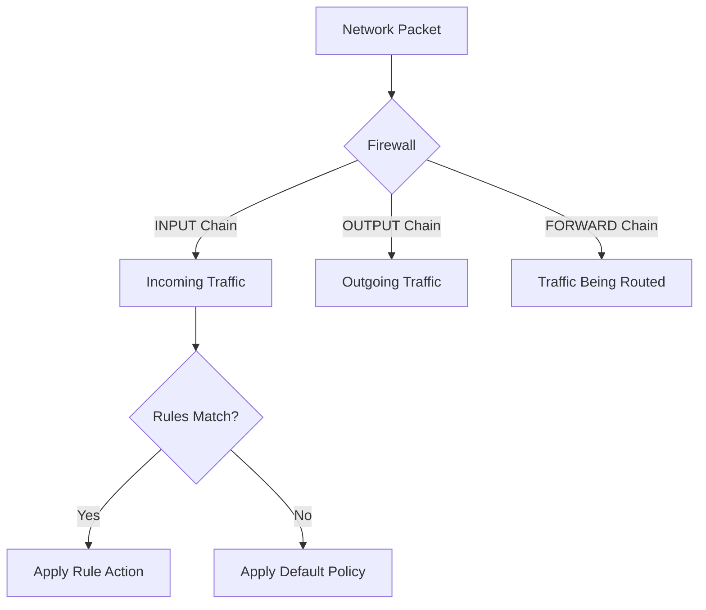

# Debian Firewall Configuration

## Introduction

A firewall is a crucial security component that monitors and controls incoming and outgoing network traffic based on predetermined security rules. On Debian systems, firewalls provide an essential layer of protection against unauthorized access, malicious attacks, and potential security breaches.

This guide will walk you through configuring firewalls on Debian Linux, covering multiple firewall solutions including iptables, UFW (Uncomplicated Firewall), and nftables. By the end, you'll understand how to implement basic and advanced firewall rules to secure your Debian system.

## Firewall Options in Debian

Debian supports several firewall solutions:

1. **iptables**: The traditional Linux firewall, powerful but complex
2. **UFW**: A user-friendly interface for iptables
3. **nftables**: The modern replacement for iptables (default in newer Debian versions)

Let's explore each option in detail.

## Understanding Firewall Concepts

Before diving into specific implementations, let's understand some key firewall concepts:

- **Chains**: The paths that network packets take (INPUT, OUTPUT, FORWARD)
- **Rules**: Instructions that tell the firewall what to do with specific packets
- **Policies**: Default actions when no rules match
- **States**: Track the state of connections (NEW, ESTABLISHED, RELATED)



## UFW (Uncomplicated Firewall)

UFW is designed to be easy to use while providing solid security. It's a frontend for iptables that simplifies firewall management.

### Installing UFW

```bash
sudo apt update
sudo apt install ufw
```

### Basic UFW Commands

Check the status of UFW:

```bash
sudo ufw status
```

Output:
```
Status: inactive
```

Enable UFW:

```bash
sudo ufw enable
```

Output:
```
Firewall is active and enabled on system startup
```

Disable UFW:

```bash
sudo ufw disable
```

### Setting Up Basic Rules

Allow SSH connections (port 22):

```bash
sudo ufw allow ssh
# or by port number
sudo ufw allow 22/tcp
```

Allow HTTP and HTTPS:

```bash
sudo ufw allow http
sudo ufw allow https
# or by port numbers
sudo ufw allow 80/tcp
sudo ufw allow 443/tcp
```

Deny a specific port:

```bash
sudo ufw deny 3306/tcp
```

### Working with Service Names

UFW can use service names defined in `/etc/services`:

```bash
sudo ufw allow from 192.168.1.0/24 to any port ssh
```

### Rate Limiting

Prevent brute force attacks by limiting connection attempts:

```bash
sudo ufw limit ssh
```

This allows up to 6 connections in 30 seconds from the same IP address.

### Checking Rules

List all rules with numbers:

```bash
sudo ufw status numbered
```

Output:
```
Status: active

     To                         Action      From
     --                         ------      ----
[ 1] 22/tcp                     ALLOW IN    Anywhere
[ 2] 80/tcp                     ALLOW IN    Anywhere
[ 3] 443/tcp                    ALLOW IN    Anywhere
[ 4] 22/tcp (v6)                ALLOW IN    Anywhere (v6)
[ 5] 80/tcp (v6)                ALLOW IN    Anywhere (v6)
[ 6] 443/tcp (v6)               ALLOW IN    Anywhere (v6)
```

### Deleting Rules

Delete a rule by number:

```bash
sudo ufw delete 2
```

Or by the actual rule:

```bash
sudo ufw delete allow 80/tcp
```

## iptables

iptables is the traditional Linux firewall tool that provides granular control over network traffic. It's more complex than UFW but offers greater flexibility.

### Installing iptables

```bash
sudo apt update
sudo apt install iptables iptables-persistent
```

The `iptables-persistent` package helps save your rules across reboots.

### Basic iptables Commands

View current rules:

```bash
sudo iptables -L -v
```

Output (for a fresh installation):
```
Chain INPUT (policy ACCEPT 0 packets, 0 bytes)
 pkts bytes target     prot opt in     out     source               destination

Chain FORWARD (policy ACCEPT 0 packets, 0 bytes)
 pkts bytes target     prot opt in     out     source               destination

Chain OUTPUT (policy ACCEPT 0 packets, 0 bytes)
 pkts bytes target     prot opt in     out     source               destination
```

### Setting Up a Basic Firewall

Here's a step-by-step approach to create a basic iptables firewall:

1. Set default policies:

```bash
sudo iptables -P INPUT DROP
sudo iptables -P FORWARD DROP
sudo iptables -P OUTPUT ACCEPT
```

2. Allow loopback traffic:

```bash
sudo iptables -A INPUT -i lo -j ACCEPT
```

3. Allow established and related connections:

```bash
sudo iptables -A INPUT -m conntrack --ctstate ESTABLISHED,RELATED -j ACCEPT
```

4. Allow SSH (adjust as needed):

```bash
sudo iptables -A INPUT -p tcp --dport 22 -j ACCEPT
```

5. Allow HTTP and HTTPS:

```bash
sudo iptables -A INPUT -p tcp --dport 80 -j ACCEPT
sudo iptables -A INPUT -p tcp --dport 443 -j ACCEPT
```

6. Save the rules:

```bash
sudo netfilter-persistent save
```

### Advanced iptables Rules

Limit SSH connection attempts:

```bash
sudo iptables -A INPUT -p tcp --dport 22 -m state --state NEW -m recent --set
sudo iptables -A INPUT -p tcp --dport 22 -m state --state NEW -m recent --update --seconds 60 --hitcount 4 -j DROP
```

Allow traffic from a specific IP address:

```bash
sudo iptables -A INPUT -s 192.168.1.100 -j ACCEPT
```

Allow traffic from a subnet:

```bash
sudo iptables -A INPUT -s 192.168.1.0/24 -j ACCEPT
```

Log dropped packets:

```bash
sudo iptables -A INPUT -j LOG --log-prefix "IPTables-Dropped: " --log-level 4
```

### Saving and Restoring Rules

Save the current rules:

```bash
sudo sh -c "iptables-save > /etc/iptables/rules.v4"
```

Restore saved rules:

```bash
sudo iptables-restore < /etc/iptables/rules.v4
```

## nftables

nftables is the modern replacement for iptables, offering more efficient processing and a more unified structure. It's the default firewall in newer Debian versions.

### Installing nftables

```bash
sudo apt update
sudo apt install nftables
```

Enable and start the nftables service:

```bash
sudo systemctl enable nftables
sudo systemctl start nftables
```

### Basic nftables Configuration

nftables uses a configuration file at `/etc/nftables.conf`. Here's a basic example:

```bash
#!/usr/sbin/nft -f

flush ruleset

table inet filter {
    chain input {
        type filter hook input priority 0; policy drop;

        # Allow established/related connections
        ct state established,related accept

        # Allow loopback
        iifname lo accept

        # Allow SSH, HTTP, HTTPS
        tcp dport {22, 80, 443} accept

        # Count and log dropped packets
        counter log prefix "nftables dropped: "
    }

    chain forward {
        type filter hook forward priority 0; policy drop;
    }

    chain output {
        type filter hook output priority 0; policy accept;
    }
}
```

### Working with nftables

List the current ruleset:

```bash
sudo nft list ruleset
```

Output (based on the example config):
```
table inet filter {
    chain input {
        type filter hook input priority filter; policy drop;
        ct state established,related accept
        iifname "lo" accept
        tcp dport { ssh, http, https } accept
        counter packets 42 bytes 3152 log prefix "nftables dropped: " 
    }
    chain forward {
        type filter hook forward priority filter; policy drop;
    }
    chain output {
        type filter hook output priority filter; policy accept;
    }
}
```

Apply the configuration:

```bash
sudo nft -f /etc/nftables.conf
```

Save the current configuration:

```bash
sudo sh -c "nft list ruleset > /etc/nftables.conf"
```

### nftables vs iptables Syntax Comparison

Here's a quick comparison between iptables and nftables commands:

| Action | iptables | nftables |
|--------|----------|----------|
| Allow SSH | `iptables -A INPUT -p tcp --dport 22 -j ACCEPT` | `nft add rule inet filter input tcp dport 22 accept` |
| Set default policy | `iptables -P INPUT DROP` | `nft add chain inet filter input { type filter hook input priority 0\; policy drop\; }` |
| Allow established connections | `iptables -A INPUT -m conntrack --ctstate ESTABLISHED,RELATED -j ACCEPT` | `nft add rule inet filter input ct state established,related accept` |

## Practical Examples

Let's walk through some real-world firewall configurations for common scenarios.

### Web Server Configuration

This configuration secures a standard web server:

```bash
# Using UFW
sudo ufw default deny incoming
sudo ufw default allow outgoing
sudo ufw allow ssh
sudo ufw allow http
sudo ufw allow https
sudo ufw enable
```

### Database Server Configuration

Securing a database server that should only accept connections from specific web servers:

```bash
# Using iptables
sudo iptables -P INPUT DROP
sudo iptables -P FORWARD DROP
sudo iptables -P OUTPUT ACCEPT
sudo iptables -A INPUT -i lo -j ACCEPT
sudo iptables -A INPUT -m conntrack --ctstate ESTABLISHED,RELATED -j ACCEPT
sudo iptables -A INPUT -p tcp --dport 22 -j ACCEPT
sudo iptables -A INPUT -p tcp -s 192.168.1.10 --dport 3306 -j ACCEPT
sudo iptables -A INPUT -p tcp -s 192.168.1.11 --dport 3306 -j ACCEPT
sudo netfilter-persistent save
```

### Application Server Configuration

For a server running multiple services:

```bash
# Using nftables
table inet filter {
    chain input {
        type filter hook input priority 0; policy drop;
        
        # Allow established/related connections
        ct state established,related accept
        
        # Allow loopback
        iifname lo accept
        
        # Allow SSH with rate limiting
        tcp dport 22 ct state new limit rate 10/minute accept
        
        # Allow web traffic
        tcp dport {80, 443} accept
        
        # Allow application-specific ports
        tcp dport {8080, 8443} accept
        
        # Allow ICMP (ping)
        ip protocol icmp accept
        
        # Count and log dropped packets
        counter log prefix "nftables dropped: "
    }
    
    chain forward {
        type filter hook forward priority 0; policy drop;
    }
    
    chain output {
        type filter hook output priority 0; policy accept;
    }
}
```

## Best Practices for Firewall Configuration

1. **Follow the principle of least privilege**: Only allow necessary services and ports
2. **Use stateful filtering**: Allow established and related connections
3. **Implement rate limiting**: Protect against brute force attacks
4. **Log dropped packets**: For troubleshooting and security monitoring
5. **Test your rules**: Verify they work as expected before applying them permanently
6. **Document your configuration**: Keep track of what rules you've applied and why
7. **Regularly audit and update**: Review your rules periodically to remove unnecessary ones

## Troubleshooting Firewall Issues

### Common Problems and Solutions

1. **Locked out of SSH**:
   - If you've locked yourself out of your server, you'll need physical access or console access through your provider to fix the rules.
   
2. **Service not accessible**:
   - Check if the firewall is blocking the port: `sudo ufw status` or `sudo iptables -L -v`
   - Verify the service is running: `sudo systemctl status <service-name>`
   - Test locally: `curl localhost:<port>`

3. **Rules not persisting after reboot**:
   - For iptables, install iptables-persistent: `sudo apt install iptables-persistent`
   - For nftables, enable the service: `sudo systemctl enable nftables`

4. **Checking for blocked connections**:
   - View the kernel log: `sudo dmesg | grep DROP`
   - Check syslog: `sudo grep "iptables\|ufw\|nftables" /var/log/syslog`

### Diagnostic Commands

Test if a port is open:

```bash
nc -zv localhost 22
```

Output:
```
Connection to localhost 22 port [tcp/ssh] succeeded!
```

Check which process is listening on a port:

```bash
sudo ss -tulpn | grep LISTEN
```

Output:
```
tcp   LISTEN 0      128          0.0.0.0:22        0.0.0.0:*    users:(("sshd",pid=1234,fd=3))
tcp   LISTEN 0      128             [::]:22           [::]:*    users:(("sshd",pid=1234,fd=4))
```

## Summary

Firewalls are essential for securing Debian systems against unauthorized access and potential threats. In this guide, we've covered:

- Different firewall options available in Debian: UFW, iptables, and nftables
- Basic configuration for each firewall option
- Advanced rules for more specific security requirements
- Practical examples for common server configurations
- Best practices for firewall management
- Troubleshooting techniques for common firewall issues

By implementing proper firewall rules, you can significantly enhance the security of your Debian system and protect it from various network-based attacks.

## Additional Resources and Exercises

### Resources

- [Debian Wiki: Uncomplicated Firewall (UFW)](https://wiki.debian.org/Uncomplicated%20Firewall%20%28ufw%29)
- [Debian Wiki: nftables](https://wiki.debian.org/nftables)
- [Netfilter Project](https://www.netfilter.org/) (home of iptables and nftables)
- [Linux Kernel Documentation: nftables](https://www.kernel.org/doc/html/latest/networking/nftables.html)

### Exercises

1. **Basic UFW Setup**:
   - Install UFW and configure it to allow only SSH, HTTP, and HTTPS traffic
   - Test your configuration by trying to access other ports

2. **iptables Rate Limiting**:
   - Configure iptables to limit SSH connection attempts to 3 per minute
   - Test your configuration using a script that attempts to establish multiple connections

3. **nftables Sets**:
   - Create an nftables configuration that uses sets to allow traffic from a group of trusted IP addresses
   - Implement logging for all denied connections

4. **Firewall Audit**:
   - Create a script that checks your current firewall configuration against a baseline
   - The script should alert you to any unauthorized changes or security concerns