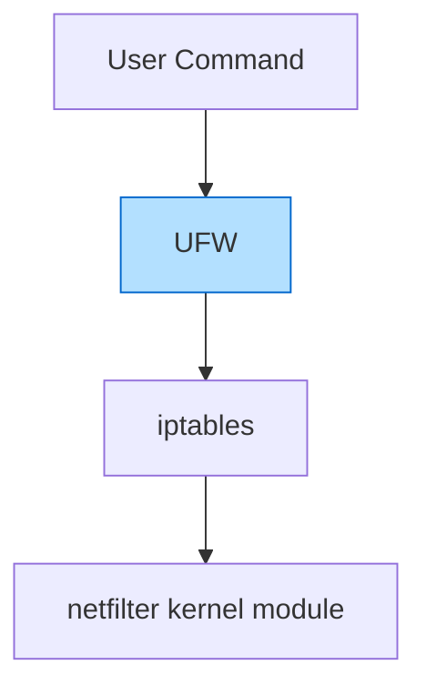

## Introduction

When it comes to server security, a properly configured firewall is your first line of defense. On Debian systems, the **Uncomplicated Firewall (UFW)** provides a user-friendly layer on top of the powerful but complex iptables firewall system. True to its name, UFW makes firewall management straightforward even for beginners, without sacrificing functionality.

This guide will walk you through the process of setting up and configuring UFW on your Debian system to create a secure environment for your applications and services.

## What is UFW?

UFW (Uncomplicated Firewall) is a frontend for iptables, designed to simplify the process of configuring a firewall. It provides a more user-friendly interface for managing firewall rules, making it accessible for beginners while still being powerful enough for advanced users.



By default, UFW denies all incoming connections and allows all outgoing connections. This "default deny" approach is a security best practice, as it means you explicitly choose which services to expose.

## Installing UFW on Debian

UFW is available in the standard Debian repositories, making installation straightforward:

```bash
sudo apt update
sudo apt install ufw
```

After installation, UFW is installed but not enabled by default. This gives you a chance to configure your rules before activating the firewall.

## Basic UFW Commands

### Checking Status

To check the current status of UFW:

```bash
sudo ufw status
```

If UFW hasn't been enabled yet, you'll see:

```
Status: inactive
```

Once enabled, the output will show the current rules:

```
Status: active

To                         Action      From
--                         ------      ----
22/tcp                     ALLOW       Anywhere
80/tcp                     ALLOW       Anywhere
443/tcp                    ALLOW       Anywhere
22/tcp (v6)                ALLOW       Anywhere (v6)
80/tcp (v6)                ALLOW       Anywhere (v6)
443/tcp (v6)               ALLOW       Anywhere (v6)
```

For a more detailed view, use:

```bash
sudo ufw status verbose
```

### Enabling and Disabling UFW

To enable UFW:

```bash
sudo ufw enable
```

This will start the firewall and apply your configured rules. UFW will also be set to start on system boot.

To disable UFW:

```bash
sudo ufw disable
```

This will stop the firewall and disable it from starting at boot.

## Configuring Basic Rules

Before enabling UFW, it's crucial to set up rules for essential services. If you're connecting via SSH, make sure to allow SSH connections first to avoid locking yourself out.

### Default Policies

UFW's default policies determine how to handle traffic that doesn't match any rules:

```bash
sudo ufw default deny incoming
sudo ufw default allow outgoing
```

These commands set UFW to:
- Deny all incoming connections by default
- Allow all outgoing connections by default

This is a secure default configuration that only allows services you explicitly permit.

### Allowing Specific Services

You can allow connections to specific services by service name or port number:

By service name (using service definitions from `/etc/services`):

```bash
sudo ufw allow ssh
sudo ufw allow http
sudo ufw allow https
```

By port number:

```bash
sudo ufw allow 22/tcp
sudo ufw allow 80/tcp
sudo ufw allow 443/tcp
```

Both methods yield the same result, but using service names can be more readable.

### Allowing Connections from Specific IP Addresses

To allow connections from a specific IP address:

```bash
sudo ufw allow from 192.168.1.100
```

This allows all connections from the specified IP address.

To restrict it to a specific port:

```bash
sudo ufw allow from 192.168.1.100 to any port 22
```

### Working with IP Ranges and Subnets

For IP ranges, you can specify a subnet:

```bash
sudo ufw allow from 192.168.1.0/24
```

This allows connections from any IP in the 192.168.1.0/24 subnet (192.168.1.1 through 192.168.1.254).

To restrict it to a specific port:

```bash
sudo ufw allow from 192.168.1.0/24 to any port 22
```

## Denying Connections

You can explicitly deny connections using similar syntax:

```bash
sudo ufw deny http
sudo ufw deny from 192.168.1.10
```

These rules explicitly reject connections rather than simply not allowing them.

## Managing Rules

### Listing Rules with Numbers

To see your rules with their corresponding numbers (useful for deletion):

```bash
sudo ufw status numbered
```

Example output:

```
Status: active

     To                         Action      From
     --                         ------      ----
[ 1] 22/tcp                     ALLOW IN    Anywhere
[ 2] 80/tcp                     ALLOW IN    Anywhere
[ 3] 443/tcp                    ALLOW IN    Anywhere
[ 4] 22/tcp (v6)                ALLOW IN    Anywhere (v6)
[ 5] 80/tcp (v6)                ALLOW IN    Anywhere (v6)
[ 6] 443/tcp (v6)               ALLOW IN    Anywhere (v6)
```

### Deleting Rules

To delete a rule, you can either:

Delete by rule number:

```bash
sudo ufw delete 2
```

This would delete the second rule in the list above (allowing HTTP).

Delete by actual rule:

```bash
sudo ufw delete allow 80/tcp
```

This accomplishes the same thing by specifying the exact rule.

### Resetting All Rules

If you want to start over from scratch:

```bash
sudo ufw reset
```

This will disable UFW and delete all rules.

## Advanced UFW Usage

### Rate Limiting

UFW can help protect against brute force attacks by limiting connection attempts. For example, to limit SSH connections:

```bash
sudo ufw limit ssh
```

This creates a rule that allows SSH connections but limits them to 6 attempts within 30 seconds from a single IP address.

### Creating Application Profiles

UFW supports application profiles that make it easy to manage rules for specific applications. These profiles are stored in `/etc/ufw/applications.d/`.

To see available application profiles:

```bash
sudo ufw app list
```

Example output:

```
Available applications:
  OpenSSH
  Nginx Full
  Nginx HTTP
  Nginx HTTPS
```

To get details about a specific profile:

```bash
sudo ufw app info 'Nginx Full'
```

Example output:

```
Profile: Nginx Full
Title: Web Server (Nginx, HTTP + HTTPS)
Description: Small, but very powerful and efficient web server

Ports:
  80,443/tcp
```

To allow an application by its profile:

```bash
sudo ufw allow 'Nginx Full'
```

### Creating Custom Application Profiles

You can create custom application profiles for your specific needs. Create a new file in `/etc/ufw/applications.d/` with the following format:

```
[MyApp]
title=My Custom Application
description=My application description
ports=8080/tcp
```

After creating the file, reload the profiles:

```bash
sudo ufw app update all
```

Then you can use your custom profile:

```bash
sudo ufw allow MyApp
```

## Common UFW Use Cases

### Securing a Web Server

For a basic web server serving HTTP and HTTPS:

```bash
sudo ufw allow 22/tcp  # SSH for administration
sudo ufw allow 80/tcp  # HTTP
sudo ufw allow 443/tcp # HTTPS
sudo ufw enable
```

### Securing a Database Server

For a database server (like MySQL/MariaDB) that should only be accessible from specific web servers:

```bash
sudo ufw allow 22/tcp  # SSH for administration
sudo ufw allow from 192.168.1.10 to any port 3306  # Web server 1
sudo ufw allow from 192.168.1.11 to any port 3306  # Web server 2
sudo ufw enable
```

### Setting Up a Simple Home Server

For a home server with various services:

```bash
sudo ufw allow 22/tcp     # SSH
sudo ufw allow 80/tcp     # HTTP
sudo ufw allow 443/tcp    # HTTPS
sudo ufw allow 32400/tcp  # Plex Media Server
sudo ufw allow 8096/tcp   # Jellyfin/Emby
sudo ufw enable
```

## Logging and Monitoring

### Enabling Logging

UFW can log firewall events, which is useful for troubleshooting and security monitoring:

```bash
sudo ufw logging on
```

You can adjust the logging level with:

```bash
sudo ufw logging low|medium|high|full
```

The logs are stored in `/var/log/ufw.log` and are also integrated with the system log.

### Reading Logs

To view the UFW logs:

```bash
sudo grep "UFW" /var/log/syslog
```

Or for real-time monitoring:

```bash
sudo tail -f /var/log/ufw.log
```

### Interpreting UFW Logs

Here's an example log entry and what it means:

```
Feb 15 12:34:56 server kernel: [123456.789012] [UFW BLOCK] IN=eth0 OUT= MAC=00:11:22:33:44:55:66:77:88:99:aa:bb:cc:dd SRC=1.2.3.4 DST=5.6.7.8 LEN=60 TOS=0x00 PREC=0x00 TTL=54 ID=12345 DF PROTO=TCP SPT=56789 DPT=22 WINDOW=29200 RES=0x00 SYN URGP=0
```

This indicates that UFW blocked a connection:
- From IP address 1.2.3.4 (SRC)
- To IP address 5.6.7.8 (DST)
- Attempting to access port 22 (DPT) - SSH
- From source port 56789 (SPT)
- Using TCP protocol (PROTO=TCP)

## Troubleshooting UFW

### Common Issues

#### Locked Out of SSH

If you've enabled UFW without allowing SSH:

1. Access the server directly (physically or via console access from your hosting provider)
2. Log in and disable UFW:
   ```bash
   sudo ufw disable
   ```
3. Add the SSH rule and re-enable:
   ```bash
   sudo ufw allow ssh
   sudo ufw enable
   ```

#### UFW Not Starting on Boot

Check the UFW systemd service:

```bash
sudo systemctl status ufw
```

If it's not enabled, enable it:

```bash
sudo systemctl enable ufw
```

#### Rules Not Working as Expected

Verify your rules and their order:

```bash
sudo ufw status numbered
```

Remember that UFW processes rules in order until it finds a match. If you have a deny rule before an allow rule for the same traffic, the deny will take precedence.

## Best Practices

1. **Always allow SSH before enabling UFW** to avoid locking yourself out.
2. **Follow the principle of least privilege** - only open ports that are absolutely necessary.
3. **Use specific rules rather than broad ones** - prefer allowing specific IP addresses over allowing everyone.
4. **Regularly audit your firewall rules** to remove unnecessary ones.
5. **Enable logging** for troubleshooting and security monitoring.
6. **Test your configuration** thoroughly before deploying to production.
7. **Document your firewall rules** for future reference and troubleshooting.
8. **Consider rate limiting** for public-facing services to mitigate brute force attacks.

## Summary

UFW provides an accessible yet powerful way to manage your Debian server's firewall. By understanding the basic commands and concepts, you can significantly enhance your system's security posture.

In this tutorial, we've covered:
- Installing and enabling UFW
- Configuring basic allow and deny rules
- Managing rules for various services and IP addresses
- Advanced features like rate limiting and application profiles
- Logging and troubleshooting

Remember that a firewall is just one component of a comprehensive security strategy. It should be combined with other practices such as regular updates, strong authentication, and proper service configuration to create a robust security posture.

## Additional Resources

### Official Documentation
- [Ubuntu UFW Wiki](https://help.ubuntu.com/community/UFW) (applicable to Debian as well)
- [Debian Security Manual](https://www.debian.org/doc/manuals/securing-debian-manual/index.en.html)

### Practice Exercises

1. Set up UFW on a test system and configure it to allow SSH, HTTP, and HTTPS.
2. Create a custom application profile for a service of your choice.
3. Configure UFW to allow access to a service only from your local network.
4. Enable logging and analyze the logs after attempting connections to closed ports.
5. Set up rate limiting for SSH and test it by making multiple connection attempts.