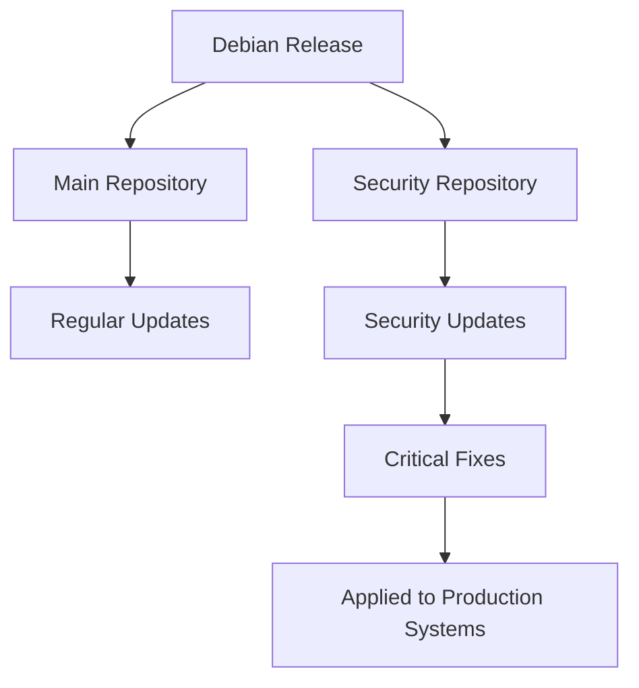

# Debian Security Updates

## Introduction

Security is a critical aspect of managing any operating system, and Debian Linux is no exception. Debian Security Updates are patches and fixes released by the Debian Security Team to address vulnerabilities discovered in packages within the Debian distribution. Understanding how to properly configure, manage, and apply these updates is essential for maintaining a secure system.

In this guide, we'll explore how Debian handles security updates, how to configure your system to receive them, and best practices for applying these updates in various environments.

## Understanding Debian Security Updates

### What are Security Updates?

Security updates are specific patches designed to fix vulnerabilities in software without adding new features or fixing non-security bugs. Debian distinguishes between regular updates and security updates to help system administrators apply critical security fixes without risking system stability with non-security changes.

### The Debian Security Team

The Debian Security Team is responsible for:

1. Receiving and responding to vulnerability reports
2. Coordinating with upstream developers
3. Preparing fixed packages
4. Publishing security advisories
5. Maintaining the security infrastructure

### Debian Security Advisories (DSAs)

When a security vulnerability is fixed, the Debian Security Team issues a Debian Security Advisory (DSA). Each DSA includes:

- A unique identifier (e.g., DSA-5423-1)
- Affected package names
- Vulnerability description
- Impact assessment
- Fix information
- References to CVE IDs when applicable

You can browse all DSAs at [https://www.debian.org/security/](https://www.debian.org/security/)

## Configuring Security Updates

### Security Repository Structure

Debian maintains dedicated security repositories for each release:



### Setting Up Security Repositories

To ensure your system receives security updates, you need to configure the appropriate repository in your `/etc/apt/sources.list` file.

For Debian 12 (Bookworm):

```bash
deb http://security.debian.org/debian-security bookworm-security main contrib non-free-firmware
```

For Debian 11 (Bullseye):

```bash
deb http://security.debian.org/debian-security bullseye-security main contrib non-free
```

For Debian 10 (Buster):

```bash
deb http://security.debian.org/debian-security buster/updates main contrib non-free
```

Note the difference in format between Debian 12/11 and Debian 10. This is due to a repository structure change starting with Bullseye.

## Managing Security Updates

### Checking for Available Updates

To check for available security updates, first update your package index:

```bash
sudo apt update
```

Then, you can list security updates specifically:

```bash
apt list --upgradable | grep -i security
```

Sample output:
```
libc6/bookworm-security 2.33-8+deb12u1 amd64 [upgradable from: 2.33-8]
openssl/bookworm-security 3.0.9-1+deb12u1 amd64 [upgradable from: 3.0.9-1]
```

### Installing Security Updates

To install only security updates:

```bash
sudo apt upgrade -t bookworm-security
```

Replace `bookworm-security` with your Debian version's security suite.

### Automating Security Updates

For servers or systems requiring automatic updates, you can use the `unattended-upgrades` package:

1. Install the package:
   ```bash
   sudo apt install unattended-upgrades apt-listchanges
   ```

2. Configure it:
   ```bash
   sudo dpkg-reconfigure unattended-upgrades
   ```

3. Edit the configuration file to focus on security updates:
   ```bash
   sudo nano /etc/apt/apt.conf.d/50unattended-upgrades
   ```

   Ensure this line is uncommented:
   ```
   Unattended-Upgrade::Origins-Pattern {
       "origin=Debian,codename=${distro_codename}-security";
   };
   ```

### Testing Security Updates in Production Environments

For critical production environments, it's advisable to:

1. Test updates on a staging system first
2. Take a backup or snapshot before applying updates
3. Schedule updates during maintenance windows
4. Have a rollback plan ready

## Practical Examples

### Example 1: Handling a Critical Security Update

Let's walk through an example of handling a critical security update for OpenSSL:

1. You receive an alert about a critical OpenSSL vulnerability
2. Check if your system is affected:

   ```bash
   dpkg -l | grep openssl
   ```

   Output:
   ```
   ii  libssl1.1      1.1.1n-0+deb11u4  amd64  Secure Sockets Layer toolkit - shared libraries
   ii  openssl        1.1.1n-0+deb11u4  amd64  Secure Sockets Layer toolkit - utilities
   ```

3. Check for available updates:

   ```bash
   sudo apt update
   apt list --upgradable | grep openssl
   ```

   Output:
   ```
   openssl/bullseye-security 1.1.1n-0+deb11u5 amd64 [upgradable from: 1.1.1n-0+deb11u4]
   ```

4. Apply the security update:

   ```bash
   sudo apt install openssl
   ```

5. Verify the update was applied:

   ```bash
   dpkg -l | grep openssl
   ```

   Output:
   ```
   ii  libssl1.1      1.1.1n-0+deb11u5  amd64  Secure Sockets Layer toolkit - shared libraries
   ii  openssl        1.1.1n-0+deb11u5  amd64  Secure Sockets Layer toolkit - utilities
   ```

6. Check if services using OpenSSL need to be restarted:

   ```bash
   sudo needrestart
   ```

### Example 2: Creating a Security Update Policy Script

Here's a simple bash script that you can use to automate checking and notifying about security updates:

```bash
#!/bin/bash
# security_updates_check.sh - Check for Debian security updates

# Update package index
apt-get update -qq

# Count security updates
SECURITY_UPDATES=$(apt list --upgradable 2>/dev/null | grep -i security | wc -l)

# Send notification if updates exist
if [ $SECURITY_UPDATES -gt 0 ]; then
    echo "ATTENTION: $SECURITY_UPDATES security updates available"
    echo "List of security updates:"
    apt list --upgradable 2>/dev/null | grep -i security
    
    # Optional: send email notification
    # echo "ATTENTION: $SECURITY_UPDATES security updates available on $(hostname)" | \
    # mail -s "Security Updates Required" admin@example.com
else
    echo "System is up to date with security patches"
fi
```

Save this as `/usr/local/bin/security_updates_check.sh`, make it executable with `chmod +x /usr/local/bin/security_updates_check.sh`, and add it to your crontab to run daily:

```bash
# Add to crontab with: sudo crontab -e
0 7 * * * /usr/local/bin/security_updates_check.sh > /var/log/security_updates.log
```

## Best Practices for Debian Security Updates

1. **Stay Informed:** Subscribe to the [debian-security-announce](https://lists.debian.org/debian-security-announce/) mailing list.

2. **Regular Updates:** Schedule regular maintenance windows for applying security updates.

3. **Minimal Installations:** Install only necessary packages to reduce the attack surface.

4. **Version Tracking:** Maintain an inventory of installed packages and their versions.

5. **Testing:** Test updates in a staging environment before applying to production.

6. **Automation:** Use tools like `unattended-upgrades` for automated security updates.

7. **Monitoring:** Implement monitoring to detect failed updates or compromised systems.

8. **Documentation:** Document your update procedures and maintain change logs.

## Troubleshooting Security Updates

### Common Issues and Solutions

1. **Repository Access Issues**

   If you can't access the security repository:
   
   ```bash
   sudo apt update
   W: Failed to fetch http://security.debian.org/debian-security/dists/bookworm-security/InRelease
   ```
   
   Solution:
   - Check your internet connection
   - Verify you have the correct repository URL
   - Try a different mirror

2. **Package Conflicts**

   When dependencies prevent updates:
   
   ```bash
   The following packages have unmet dependencies:
    libssl1.1 : Conflicts: libssl1.1:i386 but 1.1.1d-0+deb10u3 is installed
   ```
   
   Solution:
   - Update both architecture packages together
   - Resolve held packages:
     ```bash
     sudo apt-mark unhold package_name
     ```

3. **Disk Space Issues**

   When you run out of disk space:
   
   ```bash
   You don't have enough free space in /var/cache/apt/archives/
   ```
   
   Solution:
   - Clear APT cache:
     ```bash
     sudo apt clean
     ```
   - Find and remove unnecessary files:
     ```bash
     sudo du -sh /var/* | sort -hr | head -10
     ```

## Summary

Security updates are a critical component of maintaining a secure Debian system. In this guide, we've covered:

- How Debian handles security updates and advisories
- Configuring security repositories correctly
- Methods for checking and applying security updates
- Automating the update process
- Best practices for managing updates in production environments
- Troubleshooting common issues

By following these practices, you can ensure your Debian systems remain protected against known vulnerabilities while maintaining system stability.

## Additional Resources

- [Debian Security Information](https://www.debian.org/security/)
- [Debian Security FAQ](https://www.debian.org/security/faq)
- [Unattended Upgrades Documentation](https://wiki.debian.org/UnattendedUpgrades)
- [Debian Package Tracking System](https://packages.debian.org/)

## Exercises

1. Set up a Debian virtual machine and configure it to receive security updates.
2. Write a script that emails you when critical security updates are available.
3. Create a test environment to practice applying security updates to a web server running services like Apache or Nginx.
4. Compare the security repository configurations across different Debian versions.
5. Research a recent Debian Security Advisory and understand how it was addressed in the distribution.