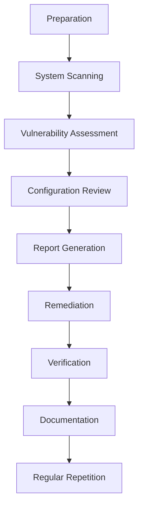

# Debian Security Auditing

## Introduction

Security auditing is a critical process for maintaining the integrity and safety of any Debian system. It involves systematic examination of your system's security controls, configurations, and potential vulnerabilities. For beginners stepping into the world of Debian administration, understanding how to properly audit your system is a fundamental skill that helps prevent security breaches before they occur.

In this guide, we'll explore the process of performing security audits on Debian systems, introduce essential tools, and provide practical examples that you can implement right away. Whether you're managing a personal server or responsible for enterprise systems, these auditing practices will help you build a more secure Debian environment.

## Why Security Auditing Matters

Before diving into the technical aspects, let's understand why security auditing is crucial:

- **Proactive Defense**: Identify security issues before attackers can exploit them
- **Compliance Requirements**: Meet organizational or regulatory security standards
- **System Integrity**: Ensure your system operates as intended without unauthorized modifications
- **Trust**: Build confidence in your system's security posture

## Basic Security Audit Process

Security auditing follows a structured approach that can be visualized as follows:



Let's break down each step and explore the tools and commands you'll use.

## Essential Debian Security Auditing Tools

### 1. Lynis - Comprehensive Security Auditing

Lynis is an open-source security auditing tool that performs hundreds of checks on your system. It's a perfect starting point for beginners.

#### Installation

```bash
sudo apt update
sudo apt install lynis
```

#### Basic Audit

```bash
sudo lynis audit system
```

#### Sample Output

```
[+] Boot and services
------------------------------------
  [+] Bootloader
    - Checking presence GRUB                                      [ FOUND ]
    - Checking presence GRUB2                                     [ FOUND ]
    - Checking for password protection                            [ CONFIGURED ]

[+] System Tools
------------------------------------
  [+] Scanning process information
    - Processes: 186 running
  [+] Automation tooling
    - No automation tools found                                   [ OK ]

[ ... more output ... ]

Lynis security scan details:

  Hardening index : 65 [#############         ]
  Tests performed : 204
  Plugins enabled : 0

  Firewall          [V]  Malware scanner     [X]
  Accounting        [V]  SELinux             [X]  PHP             [X]
  This scan  : 2023-03-15 15:30:22 +0100 
  Last scan  : --
```

### 2. Rkhunter - Rootkit Hunter

Rkhunter scans for rootkits, backdoors, and local exploits on your system.

#### Installation

```bash
sudo apt update
sudo apt install rkhunter
```

#### Running a Check

```bash
sudo rkhunter --check
```

#### Updating Rkhunter Database

```bash
sudo rkhunter --update
sudo rkhunter --propupd
```

### 3. Chkrootkit - Another Rootkit Detector

This tool provides an alternative method to detect rootkits.

#### Installation

```bash
sudo apt update
sudo apt install chkrootkit
```

#### Running a Scan

```bash
sudo chkrootkit
```

### 4. Tiger - The Unix Security Audit Tool

Tiger performs various security checks and creates detailed reports.

#### Installation

```bash
sudo apt update
sudo apt install tiger
```

#### Running Tiger

```bash
sudo tiger
```

#### Viewing Reports

```bash
less /var/log/tiger/tiger.log
```

## Conducting a Basic Security Audit

Let's walk through a basic audit process using these tools:

### Step 1: System Preparation

Before starting your audit, ensure your system is up-to-date:

```bash
sudo apt update
sudo apt upgrade
```

### Step 2: Initial System Assessment

Check for currently installed packages and services:

```bash
dpkg -l | grep -i security
systemctl list-units --type=service --state=running
```

### Step 3: Run Lynis for Comprehensive Audit

```bash
sudo lynis audit system
```

Pay special attention to "warnings" and "suggestions" in the output.

### Step 4: Check for Rootkits

```bash
sudo rkhunter --check
sudo chkrootkit
```

Review the outputs for any detected issues.

### Step 5: Audit User Accounts and Permissions

Check for users with root privileges:

```bash
grep -Po '^sudo.+:\K.*$' /etc/group
```

Review user accounts that can log in:

```bash
grep -v -E "nologin|false" /etc/passwd
```

Check for accounts with empty passwords:

```bash
sudo awk -F: '($2 == "") {print}' /etc/shadow
```

### Step 6: Network Security Audit

Check open ports and listening services:

```bash
sudo netstat -tulpn
# or
sudo ss -tulpn
```

Verify firewall rules:

```bash
sudo iptables -L -v
# If using ufw
sudo ufw status verbose
```

## Advanced Security Auditing

As you become more comfortable with basic auditing, you can advance to more sophisticated techniques:

### File Integrity Monitoring with AIDE

AIDE (Advanced Intrusion Detection Environment) helps monitor file changes.

#### Installation

```bash
sudo apt update
sudo apt install aide
```

#### Initialize the Database

```bash
sudo aideinit
# This can take some time
```

#### Move the Initial Database to the Active Location

```bash
sudo mv /var/lib/aide/aide.db.new /var/lib/aide/aide.db
```

#### Check for File Changes

```bash
sudo aide --check
```

### Audit User Activities with auditd

The Linux Audit system helps track security-relevant events.

#### Installation

```bash
sudo apt update
sudo apt install auditd audispd-plugins
```

#### Configure Audit Rules

Create a basic audit rule file:

```bash
sudo nano /etc/audit/rules.d/security.rules
```

Add rules like:

```
# Monitor changes to authentication configuration
-w /etc/pam.d/ -p wa -k pam_config
-w /etc/nsswitch.conf -p wa -k nsswitch_config

# Monitor user and group changes
-w /etc/passwd -p wa -k passwd_changes
-w /etc/group -p wa -k group_changes
-w /etc/shadow -p wa -k shadow_changes

# Monitor command execution
-a exit,always -F arch=b64 -S execve -k command_execution
```

#### Restart the Audit Service

```bash
sudo systemctl restart auditd
```

#### View Audit Logs

```bash
sudo ausearch -k passwd_changes
```

## Compliance Checking

For environments requiring specific compliance standards, tools like OpenSCAP can be helpful.

### Installing OpenSCAP

```bash
sudo apt update
sudo apt install libopenscap8 openscap-scanner ssg-debian
```

### Running a Compliance Scan

```bash
sudo oscap xccdf eval --profile xccdf_org.ssgproject.content_profile_standard --results scan-results.xml --report scan-report.html /usr/share/xml/scap/ssg/content/ssg-debian10-ds.xml
```

This generates an HTML report of compliance with the selected security profile.

## Automating Security Audits

For regular monitoring, you can automate your security audits using cron jobs.

### Create a Security Audit Script

```bash
sudo nano /usr/local/bin/security-audit.sh
```

Add the following content:

```bash
#!/bin/bash

# Set output directory
OUTDIR="/var/log/security-audits/$(date +%Y-%m-%d)"
mkdir -p $OUTDIR

# Run Lynis
echo "Running Lynis audit..."
sudo lynis audit system --quiet --report-file $OUTDIR/lynis-report.dat

# Run Rkhunter
echo "Running Rkhunter check..."
sudo rkhunter --check --skip-keypress --report-warnings-only > $OUTDIR/rkhunter-report.txt

# Check for open ports
echo "Checking open ports..."
sudo ss -tulpn > $OUTDIR/open-ports.txt

# Check for failed login attempts
echo "Checking failed logins..."
grep "Failed password" /var/log/auth.log > $OUTDIR/failed-logins.txt

echo "Audit completed. Reports saved to $OUTDIR"
```

### Make it Executable

```bash
sudo chmod +x /usr/local/bin/security-audit.sh
```

### Schedule Regular Audits with Cron

```bash
sudo crontab -e
```

Add a line to run the script weekly:

```
0 2 * * 0 /usr/local/bin/security-audit.sh
```

This will run the audit every Sunday at 2 AM.

## Real-World Example: Securing a Debian Web Server

Let's apply our auditing knowledge to a real-world scenario: securing a Debian web server running Apache.

### Initial Audit

First, run a comprehensive audit:

```bash
sudo lynis audit system
```

Let's say Lynis identifies these issues:
1. SSH allows password authentication
2. Apache has unnecessary modules enabled
3. File permissions on web directories are too permissive

### Remediation Steps

#### 1. Secure SSH Configuration

Edit the SSH config file:

```bash
sudo nano /etc/ssh/sshd_config
```

Make these changes:

```
PasswordAuthentication no
PermitRootLogin no
Protocol 2
```

Restart SSH:

```bash
sudo systemctl restart ssh
```

#### 2. Audit and Secure Apache

Check enabled modules:

```bash
sudo apache2ctl -M
```

Disable unnecessary modules:

```bash
sudo a2dismod status autoindex
sudo systemctl restart apache2
```

#### 3. Fix File Permissions

```bash
sudo find /var/www/ -type d -exec chmod 755 {} \;
sudo find /var/www/ -type f -exec chmod 644 {} \;
sudo chown -R www-data:www-data /var/www/
```

### Verification

After making changes, run another audit to verify improvements:

```bash
sudo lynis audit system
```

Your hardening index should have improved, and the previously identified issues should be resolved.

## Best Practices for Ongoing Security

- **Regular Updates**: Keep your system updated with security patches
- **Least Privilege**: Follow the principle of least privilege for all accounts
- **Defense in Depth**: Implement multiple security layers
- **Regular Auditing**: Establish a schedule for security audits
- **Documentation**: Keep records of your security configurations and audit results
- **Learning**: Stay informed about new security threats and mitigation techniques

## Common Issues and Troubleshooting

### High CPU Usage During Audits

Security scans can be resource-intensive. Schedule them during off-hours or use the `nice` command:

```bash
sudo nice -n 19 lynis audit system
```

### False Positives

Security tools sometimes report false positives. Always verify findings before making changes:

```bash
# Example: Verifying a suspicious process
ps aux | grep [process_name]
```

### Dealing with Locked Packages

If you encounter locked package errors during remediation:

```bash
# Check for locked processes
sudo lsof /var/lib/dpkg/lock
# Wait and try again or reboot if necessary
```

## Summary

Security auditing is an essential practice for maintaining secure Debian systems. In this guide, we've covered:

- The importance and basic process of security auditing
- Essential security auditing tools like Lynis, Rkhunter, and AIDE
- Step-by-step procedures for conducting basic and advanced audits
- Automating security audits with scripts and cron jobs
- A real-world example of securing a Debian web server
- Best practices for ongoing security maintenance

By implementing these auditing practices regularly, you'll significantly improve your Debian system's security posture and be better prepared to defend against potential threats.

## Additional Resources

For further learning, consider exploring:

- The [Debian Security Information](https://www.debian.org/security/) official page
- The Lynis [documentation and best practices](https://cisofy.com/documentation/lynis/)
- The [Center for Internet Security (CIS) Benchmarks](https://www.cisecurity.org/cis-benchmarks/) for Debian
- The [Debian Hardening Guide](https://wiki.debian.org/Hardening)

## Exercises

To reinforce your learning, try these exercises:

1. Run a complete Lynis audit and address at least three security suggestions
2. Set up AIDE for file integrity monitoring and test it by making controlled changes
3. Create a custom security audit script that checks for issues specific to your environment
4. Configure auditd to monitor a critical directory and test the logging capabilities
5. Compare the security of two Debian systems using the tools discussed in this guide

Remember, security is an ongoing process. Regular auditing, combined with prompt remediation of discovered issues, forms the foundation of a strong security posture for your Debian systems.