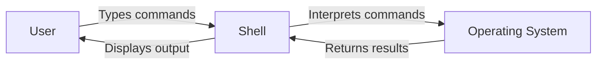

# Debian Shell Introduction

## What is the Shell?

The shell is a command-line interpreter that provides an interface for users to interact with the operating system. In Debian Linux, the default shell is Bash (Bourne Again SHell), which is a powerful and versatile command processor.

Think of the shell as a text-based "middleman" between you and the core of the operating system. When you type commands, the shell interprets them and communicates with the operating system to perform the requested tasks.



## Why Learn Shell Scripting?

Learning shell scripting in Debian offers several advantages:

1. **Automation**: Automate repetitive tasks with scripts
2. **System Administration**: Manage system resources efficiently 
3. **Customization**: Tailor your environment to your needs
4. **Portable Skills**: Shell scripting knowledge transfers to other Unix-like systems
5. **Powerful Combinations**: Chain simple commands to solve complex problems

## Getting Started with the Debian Shell

### Accessing the Shell

In Debian, you can access the shell in several ways:

1. Open the Terminal application (often called "Terminal" or "Konsole")
2. Press `Ctrl+Alt+T` (keyboard shortcut in many Debian desktop environments)
3. Switch to a virtual console by pressing `Ctrl+Alt+F1` through `Ctrl+Alt+F6`

When you open a terminal, you'll see something like this:

```
username@hostname:~$ 
```

This is your **command prompt**, where you'll type your commands.

### Basic Shell Navigation

Let's start with some basic navigation commands:

```bash
# Display current directory
pwd

# List files and directories
ls

# Change directory
cd /path/to/directory

# Go to home directory
cd ~
```

**Example input and output:**

```
username@debian:~$ pwd
/home/username

username@debian:~$ ls
Documents  Downloads  Pictures  Videos

username@debian:~$ cd Documents
username@debian:~/Documents$ pwd
/home/username/Documents

username@debian:~/Documents$ cd ~
username@debian:~$
```

### File Operations

Here are some common file operations:

```bash
# Create a new empty file
touch filename.txt

# Create a directory
mkdir my_directory

# Copy a file
cp source.txt destination.txt

# Move or rename a file
mv oldname.txt newname.txt

# Remove a file (be careful!)
rm filename.txt

# Remove an empty directory
rmdir my_directory
```

**Example usage:**

```
username@debian:~$ touch my_first_script.sh
username@debian:~$ ls
Documents  Downloads  my_first_script.sh  Pictures  Videos

username@debian:~$ mkdir Scripts
username@debian:~$ mv my_first_script.sh Scripts/
username@debian:~$ ls Scripts/
my_first_script.sh
```

## Understanding Shell Commands

### Command Structure

Most shell commands follow this basic structure:

```
command [options] [arguments]
```

- **command**: The program you want to run
- **options**: Flags that modify the command's behavior (usually prefixed with `-` or `--`)
- **arguments**: The items the command should operate on

### Examples of Command Options

The `ls` command with different options:

```bash
# Simple listing
ls

# Detailed listing
ls -l

# Show hidden files
ls -a

# Combining options
ls -la

# Human-readable file sizes
ls -lh
```

**Output example:**

```
username@debian:~$ ls -l
total 16
drwxr-xr-x 2 username username 4096 Mar 10 15:20 Documents
drwxr-xr-x 2 username username 4096 Mar 10 15:20 Downloads
drwxr-xr-x 2 username username 4096 Mar 10 15:20 Pictures
drwxr-xr-x 2 username username 4096 Mar 10 15:20 Videos
```

## Your First Shell Script

Shell scripts are text files containing a series of commands that the shell can execute. Let's create a simple script:

1. Create a file called `hello.sh`:

```bash
# Create the file
touch hello.sh

# Open it in a text editor (nano is beginner-friendly)
nano hello.sh
```

2. Add the following content to the file:

```bash
#!/bin/bash

# This is a comment
echo "Hello, Debian World!"
echo "Today is $(date)"
echo "Your username is $USER"
```

3. Save and exit (`Ctrl+O`, then `Ctrl+X` in nano)

4. Make the script executable:

```bash
chmod +x hello.sh
```

5. Run the script:

```bash
./hello.sh
```

**Expected output:**

```
username@debian:~$ ./hello.sh
Hello, Debian World!
Today is Fri Mar 13 10:25:30 EDT 2025
Your username is username
```

### Script Components Explained

Let's break down the script:

- `#!/bin/bash` - Called a "shebang" or "hashbang", it tells the system which interpreter to use
- `# This is a comment` - Comments help document your code but aren't executed
- `echo "Text"` - Prints text to the terminal
- `$(date)` - Command substitution: runs the `date` command and inserts its output
- `$USER` - Variable: contains your username

## Shell Variables

Variables store data that can be referenced and manipulated. In Bash:

```bash
# Assigning variables (no spaces around =)
name="Debian User"

# Using variables (prefix with $)
echo "Hello, $name!"

# Command output to variable
current_directory=$(pwd)
echo "You are in: $current_directory"
```

### Environment Variables

The shell has pre-defined environment variables:

```bash
# Display all environment variables
env

# Common environment variables
echo "Home directory: $HOME"
echo "Username: $USER"
echo "Shell path: $SHELL"
echo "PATH: $PATH"
```

## Input and Output

### User Input

To make interactive scripts, use the `read` command:

```bash
#!/bin/bash

echo "What's your name?"
read user_name

echo "Hello, $user_name! Nice to meet you."
```

### Redirecting Output

You can redirect command output:

```bash
# Save output to a file (overwrites existing content)
ls > file_list.txt

# Append output to a file
echo "New line" >> notes.txt

# Redirect error messages
command_that_might_fail 2> errors.log

# Redirect both output and errors
command > output.txt 2>&1
```

## Conditional Statements

Conditional statements let your scripts make decisions:

```bash
#!/bin/bash

echo "Enter a number:"
read number

if [ $number -gt 10 ]; then
    echo "The number is greater than 10"
elif [ $number -eq 10 ]; then
    echo "The number is exactly 10"
else
    echo "The number is less than 10"
fi
```

## Looping

Loops allow repetitive tasks:

### For Loops

```bash
#!/bin/bash

echo "Counting from 1 to 5:"
for i in 1 2 3 4 5; do
    echo "Number: $i"
done

echo "Listing all text files:"
for file in *.txt; do
    echo "Found file: $file"
done
```

### While Loops

```bash
#!/bin/bash

count=1
while [ $count -le 5 ]; do
    echo "Count: $count"
    count=$((count + 1))
done
```

## Practical Example: System Information Script

Let's create a useful script that displays system information:

```bash
#!/bin/bash

# system_info.sh - A script to display system information

echo "===== System Information ====="
echo "Hostname: $(hostname)"
echo "Kernel version: $(uname -r)"
echo "CPU information: $(grep "model name" /proc/cpuinfo | head -n 1 | cut -d ':' -f 2)"
echo "Memory total: $(free -h | grep "Mem:" | awk '{print $2}')"
echo "Disk usage: $(df -h / | grep "/" | awk '{print $5}')"
echo "Uptime: $(uptime -p)"
echo "============================="
```

**Expected output:**

```
===== System Information =====
Hostname: debian-machine
Kernel version: 5.10.0-18-amd64
CPU information:  Intel(R) Core(TM) i5-8250U CPU @ 1.60GHz
Memory total: 7.7Gi
Disk usage: 45%
Uptime: up 3 days, 7 hours, 15 minutes
=============================
```

## Common Shell Tools

Debian comes with many powerful command-line tools:

- `grep`: Search for patterns in files
- `sed`: Stream editor for filtering and transforming text
- `awk`: Text processing language for data extraction
- `find`: Search for files in a directory hierarchy
- `sort`: Sort lines of text files
- `uniq`: Report or omit repeated lines
- `cut`: Remove sections from each line of files
- `tr`: Translate or delete characters

**Example usage:**

```bash
# Find all bash scripts in the current directory
find . -name "*.sh"

# Count lines in a file
wc -l filename.txt

# Search for a pattern in files
grep "error" log.txt

# Replace text in a file
sed 's/old/new/g' file.txt

# Extract specific columns from CSV
cut -d ',' -f 1,3 data.csv
```

## Summary

In this introduction to the Debian shell, we've covered:

- Basic shell concepts and navigation
- File operations
- Command structure and options
- Creating and running shell scripts
- Variables and environment variables
- Input and output redirection
- Conditional statements and loops
- A practical system information script
- Common shell tools

The shell is a powerful interface for interacting with your Debian system. As you become more comfortable with these basic concepts, you'll be able to write increasingly sophisticated scripts to automate tasks and manage your system efficiently.

## Exercises

1. Create a script that backs up all `.txt` files in your home directory to a folder called `backups`.
2. Write a script that asks the user for a directory path and counts how many files are in that directory.
3. Create a system monitoring script that checks if a specific process is running and notifies you if it's not.
4. Write a script that takes a filename as an argument and reports whether it's a file, directory, or something else.
5. Create a script that generates a report of the 5 largest files in a directory provided by the user.

## Additional Resources

- The Debian Reference Manual (`man bash`)
- GNU Bash Manual (`info bash`)
- The Linux Command Line by William Shotts (online book)
- Shell scripting tutorials on the Debian Wiki