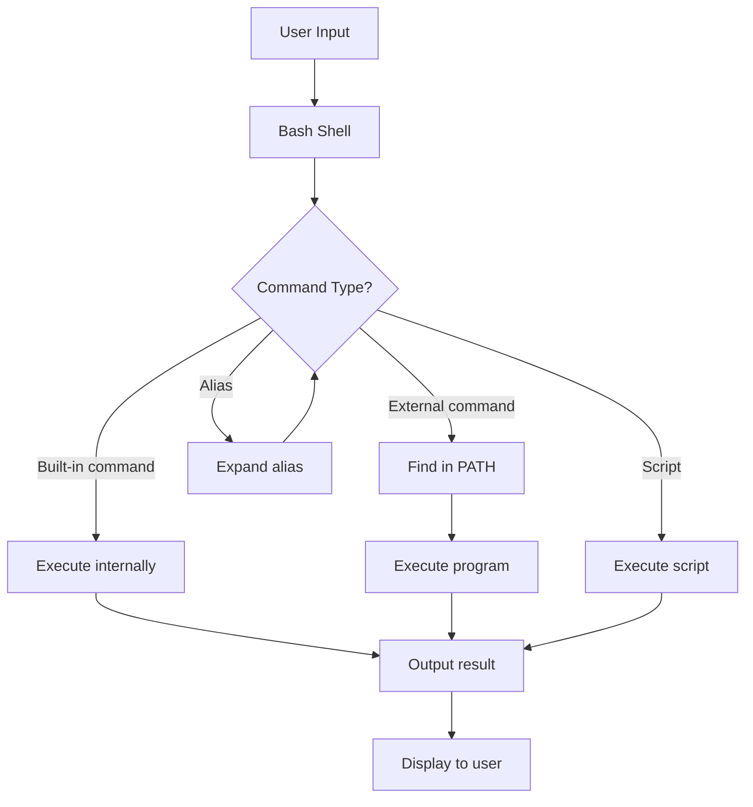

# Debian Bash Basics

## Introduction

The Bash shell (Bourne Again SHell) is the default command-line interface in Debian Linux. It provides a powerful way to interact with your system, execute commands, and automate tasks. Whether you're a system administrator, developer, or Linux enthusiast, understanding Bash basics is essential for effective use of Debian systems.

In this tutorial, we'll explore the fundamental concepts of Bash in Debian, from navigating the filesystem to executing basic commands and understanding shell scripting principles. By the end of this guide, you'll have a solid foundation to build upon for more advanced shell scripting techniques.

## Getting Started with the Terminal

### Opening the Terminal

In Debian, you can open a terminal in several ways:
- Keyboard shortcut: `Ctrl+Alt+T`
- From the application menu: Look for "Terminal" or "Konsole" depending on your desktop environment
- Right-click on the desktop: Some desktop environments offer a "Open Terminal" option

When you open a terminal, you'll see a prompt that typically looks like this:

```bash
username@hostname:~$
```

This prompt provides important information:
- `username`: Your current user
- `hostname`: The name of your computer
- `~`: Your current directory (~ represents your home directory)
- `$`: Indicates you're logged in as a regular user (a `#` would indicate root privileges)

## Basic Navigation Commands

### Checking Your Current Location

To know where you are in the filesystem:

```bash
pwd
```

Example output:
```
/home/username
```

### Listing Files and Directories

List files and directories in your current location:

```bash
ls
```

For more detailed information:

```bash
ls -l
```

Example output:
```
total 32
drwxr-xr-x 2 username username 4096 Mar 13 15:30 Documents
drwxr-xr-x 2 username username 4096 Mar 13 15:30 Downloads
drwxr-xr-x 2 username username 4096 Mar 13 15:30 Music
drwxr-xr-x 2 username username 4096 Mar 13 15:30 Pictures
drwxr-xr-x 2 username username 4096 Mar 13 15:30 Public
drwxr-xr-x 2 username username 4096 Mar 13 15:30 Templates
drwxr-xr-x 2 username username 4096 Mar 13 15:30 Videos
-rw-r--r-- 1 username username  220 Mar 13 15:30 .bash_logout
```

To show hidden files (files that start with a dot):

```bash
ls -a
```

Combining options:

```bash
ls -la
```

### Changing Directories

Move to a different directory:

```bash
cd Documents
```

Go back to the parent directory:

```bash
cd ..
```

Go to your home directory:

```bash
cd
# or
cd ~
```

Go to the root directory:

```bash
cd /
```

Navigate to an absolute path:

```bash
cd /var/log
```

## File Operations

### Creating Files and Directories

Create a new directory:

```bash
mkdir my_folder
```

Create nested directories:

```bash
mkdir -p parent/child/grandchild
```

Create an empty file:

```bash
touch myfile.txt
```

### Copying Files and Directories

Copy a file:

```bash
cp source.txt destination.txt
```

Copy a file to another directory:

```bash
cp myfile.txt my_folder/
```

Copy a directory and its contents:

```bash
cp -r source_directory destination_directory
```

### Moving and Renaming

Move a file:

```bash
mv source.txt destination.txt
```

Rename a file:

```bash
mv oldname.txt newname.txt
```

Move a file to a directory:

```bash
mv myfile.txt my_folder/
```

### Deleting Files and Directories

Remove a file:

```bash
rm myfile.txt
```

Remove an empty directory:

```bash
rmdir my_folder
```

Remove a directory and all its contents:

```bash
rm -r my_folder
```

⚠️ **Warning**: Be extremely careful with `rm -r` and never use `rm -rf /` as it will delete your entire system without asking for confirmation.

## Viewing and Editing Files

### Viewing File Contents

Display the entire file:

```bash
cat myfile.txt
```

View a file one page at a time:

```bash
less myfile.txt
```
(Press `q` to exit less)

See the first 10 lines of a file:

```bash
head myfile.txt
```

See the last 10 lines of a file:

```bash
tail myfile.txt
```

Follow a file in real-time (useful for logs):

```bash
tail -f /var/log/syslog
```

### Basic Text Editors

Debian comes with several text editors:

1. **nano** - Beginner-friendly:

```bash
nano myfile.txt
```

Common nano shortcuts:
- `Ctrl+O`: Save file
- `Ctrl+X`: Exit
- `Ctrl+G`: Help

2. **vim** - More advanced:

```bash
vim myfile.txt
```

Basic vim commands:
- `i`: Enter insert mode
- `Esc`: Return to command mode
- `:w`: Save file
- `:q`: Quit
- `:wq`: Save and quit

## Command Execution and Control

### Running Commands

Execute a command:

```bash
echo "Hello, Debian!"
```

Output:
```
Hello, Debian!
```

Run multiple commands on one line:

```bash
mkdir test && cd test && touch newfile.txt
```

### Command History

View command history:

```bash
history
```

Re-run the previous command:

```bash
!!
```

Search through command history:
- Press `Ctrl+R` and start typing
- Press `Ctrl+R` again to cycle through matches

### Keyboard Shortcuts

Useful terminal shortcuts:
- `Ctrl+C`: Terminate the current command
- `Ctrl+Z`: Suspend the current command
- `Ctrl+D`: Log out of current session
- `Ctrl+L`: Clear the screen (same as `clear` command)
- `Tab`: Auto-complete commands and filenames

## Input/Output and Redirection

### Standard Streams

Bash uses three main streams:
- Standard input (stdin): Input to commands
- Standard output (stdout): Normal command output
- Standard error (stderr): Error messages

### Redirection Operators

Redirect output to a file (overwrites):

```bash
echo "This is a test" > output.txt
```

Append output to a file:

```bash
echo "More text" >> output.txt
```

Redirect errors to a file:

```bash
command 2> errors.txt
```

Redirect both output and errors to different files:

```bash
command > output.txt 2> errors.txt
```

Redirect both output and errors to the same file:

```bash
command > all.txt 2>&1
# Or using newer syntax
command &> all.txt
```

### Pipes

Pipes connect the output of one command to the input of another:

```bash
ls -l | grep "\.txt"
```

Chain multiple commands:

```bash
cat /var/log/syslog | grep ERROR | less
```

## Finding Things

### Locate Files

Search for files by name:

```bash
find /home -name "*.txt"
```

Find files modified within the last 24 hours:

```bash
find /home -mtime -1
```

Find files larger than 10MB:

```bash
find /home -size +10M
```

### Search File Contents

Search for text in files:

```bash
grep "search_term" file.txt
```

Recursive search in a directory:

```bash
grep -r "search_term" /home/username/Documents
```

Case-insensitive search:

```bash
grep -i "search_term" file.txt
```

## Bash Variables and Environment

### Working with Variables

Assign a value to a variable:

```bash
my_var="Hello World"
```

Access a variable's value:

```bash
echo $my_var
```

Output:
```
Hello World
```

### Environment Variables

Display all environment variables:

```bash
env
```

Display a specific environment variable:

```bash
echo $HOME
```

Set an environment variable for the current session:

```bash
export MY_VAR="some value"
```

### The PATH Variable

The `PATH` variable tells Bash where to look for executable files:

```bash
echo $PATH
```

Output might look like:
```
/usr/local/sbin:/usr/local/bin:/usr/sbin:/usr/bin:/sbin:/bin
```

Add a directory to your PATH temporarily:

```bash
export PATH=$PATH:/new/directory
```

## Introduction to Bash Scripting

### Your First Bash Script

1. Create a file named `hello.sh`:

```bash
touch hello.sh
```

2. Edit the file with nano:

```bash
nano hello.sh
```

3. Add the following content:

```bash
#!/bin/bash

# This is a comment
echo "Hello, Debian Bash Scripting!"
echo "Current date and time: $(date)"
echo "Your username is: $USER"
```

4. Save and exit (Ctrl+O, Enter, Ctrl+X in nano)

5. Make the script executable:

```bash
chmod +x hello.sh
```

6. Run the script:

```bash
./hello.sh
```

Output:
```
Hello, Debian Bash Scripting!
Current date and time: Thu Mar 13 15:45:32 EDT 2025
Your username is: username
```

### Basic Script Structure

A typical bash script includes:

```bash
#!/bin/bash

# Script description
# Author: Your Name
# Date: March 13, 2025

# Variables
greeting="Hello"
name="World"

# Main code
echo "$greeting, $name!"

# Exit with success status
exit 0
```

### Conditional Statements

Basic if-else structure:

```bash
#!/bin/bash

file="test.txt"

if [ -f "$file" ]; then
    echo "The file $file exists."
else
    echo "The file $file does not exist."
    touch "$file"
    echo "The file $file has been created."
fi
```

### Loops

For loop example:

```bash
#!/bin/bash

echo "Counting from 1 to 5:"

for i in {1..5}; do
    echo "Number: $i"
done
```

While loop example:

```bash
#!/bin/bash

counter=1

while [ $counter -le 5 ]; do
    echo "Counter: $counter"
    ((counter++))
done
```

## Practical Examples

### Example 1: System Information Script

Create a script that displays basic system information:

```bash
#!/bin/bash

echo "===== System Information ====="
echo "Hostname: $(hostname)"
echo "Kernel Version: $(uname -r)"
echo "CPU Information: $(lscpu | grep 'Model name' | sed 's/Model name: *//')"
echo "Memory Information:"
free -h
echo "Disk Usage:"
df -h | grep '^/dev/'
echo "============================="
```

### Example 2: Backup Script

A simple script to create a backup of important files:

```bash
#!/bin/bash

# Configuration
backup_dir="/home/username/backups"
source_dir="/home/username/Documents"
date_format=$(date +%Y-%m-%d-%H-%M-%S)
backup_file="backup-$date_format.tar.gz"

# Create backup directory if it doesn't exist
mkdir -p "$backup_dir"

# Create the backup
echo "Creating backup of $source_dir..."
tar -czf "$backup_dir/$backup_file" "$source_dir"

# Check if backup was successful
if [ $? -eq 0 ]; then
    echo "Backup created successfully: $backup_dir/$backup_file"
    echo "Backup size: $(du -h "$backup_dir/$backup_file" | cut -f1)"
else
    echo "Backup failed!"
    exit 1
fi

# List existing backups
echo "Existing backups:"
ls -lh "$backup_dir" | grep "backup-"

exit 0
```

### Example 3: Log File Analyzer

Script to analyze a log file for errors:

```bash
#!/bin/bash

# Configuration
log_file="/var/log/syslog"
search_term="error"

# Check if log file exists
if [ ! -f "$log_file" ]; then
    echo "Error: Log file $log_file does not exist."
    exit 1
fi

# Count occurrences of the search term
echo "Analyzing $log_file for '$search_term'..."
count=$(grep -i "$search_term" "$log_file" | wc -l)
echo "Found $count occurrences of '$search_term'"

# Display the most recent errors
echo "Most recent errors:"
grep -i "$search_term" "$log_file" | tail -5

exit 0
```

## Command Flow Visualization

Here's a visualization of how commands flow in the Bash shell:



## Summary

In this tutorial, we've covered the essential Bash basics for Debian Linux:

- Terminal navigation and file operations
- Viewing and editing files
- Command execution and control
- Input/output redirection and pipes
- Finding files and searching content
- Working with variables and environment
- Introduction to Bash scripting with practical examples

Mastering these fundamentals will provide you with a solid foundation for efficiently working with Debian systems and developing more advanced shell scripts.

## Additional Resources and Exercises

### Resources for Further Learning

1. The Bash manual: Access through `man bash`
2. GNU Bash documentation: [GNU Bash Manual](https://www.gnu.org/software/bash/manual/)
3. Debian Documentation: [Debian Manuals](https://www.debian.org/doc/)

### Practice Exercises

1. **Navigation Challenge**: 
   - Create a directory structure with at least 3 levels
   - Navigate between directories using both absolute and relative paths
   - Create files at different levels and list them

2. **File Manipulation**:
   - Create a file with some text
   - Copy it to a new location
   - Append more text to it
   - Count the number of words and lines in the file

3. **Simple Script Creation**:
   - Write a script that asks for the user's name and greets them
   - Make the script executable and run it

4. **Advanced Script Project**:
   - Create a script that monitors system resources (CPU, memory, disk) and logs the information
   - Add a feature to alert when resources exceed certain thresholds

5. **Redirection Practice**:
   - Use redirection to combine the contents of multiple files
   - Use pipes to filter and transform text data

Remember, the best way to learn Bash is by practicing regularly. Start with simple commands and scripts, then gradually tackle more complex tasks as you build confidence and understanding.