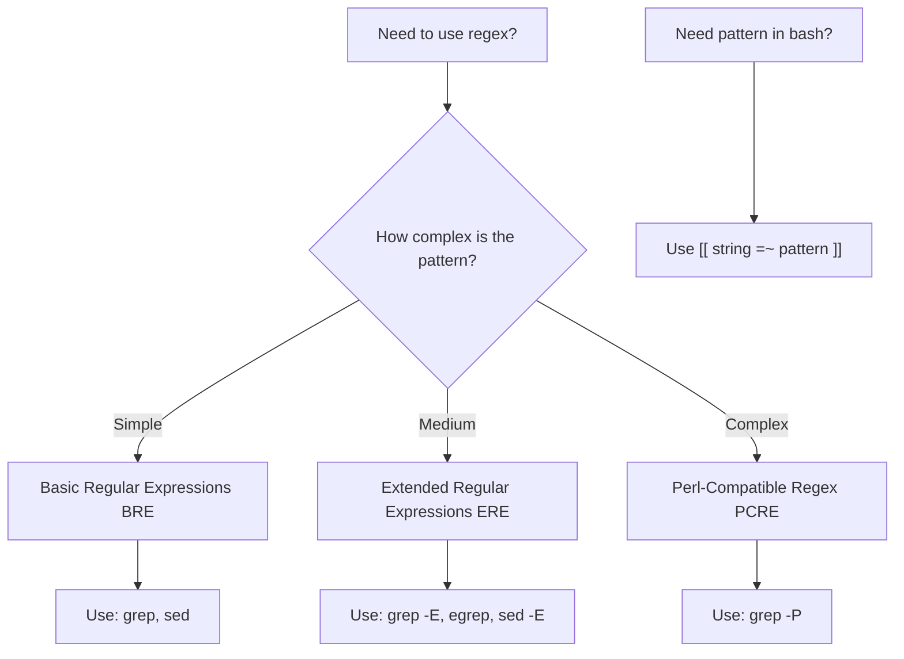

# Debian Regular Expressions

## Introduction

Regular expressions (regex or regexp) are powerful pattern-matching tools that allow you to search, extract, and manipulate text based on specific patterns. In Debian shell scripting, regular expressions are essential for processing text files, validating input, and automating various tasks. This guide will introduce you to the fundamentals of regular expressions specifically within the Debian shell environment, helping you harness their power for your shell scripting needs.

While regular expressions follow similar principles across different programming environments, Debian's shell utilities like `grep`, `sed`, and `awk` have some specific implementations and syntax variations that are important to understand.

## Regular Expression Basics

### What Are Regular Expressions?

Regular expressions are special text strings that define search patterns. Think of them as a mini-language for describing patterns in text. These patterns can be used to:

- Search for specific text
- Validate input format (like email addresses or phone numbers)
- Extract information from text
- Replace or transform text content

### Types of Regular Expressions in Debian

In Debian shell scripting, you'll encounter three main types of regular expressions:

1. **Basic Regular Expressions (BRE)** - The default in tools like `grep` and `sed`
2. **Extended Regular Expressions (ERE)** - Used with `grep -E`, `egrep`, or `sed -E`
3. **Perl-Compatible Regular Expressions (PCRE)** - Available with `grep -P` and some other tools

Let's explore each of these types with practical examples.

## Basic Regular Expressions (BRE)

Basic Regular Expressions are the default pattern type in many Debian shell utilities.

### Basic Characters and Metacharacters

In BRE, most characters match themselves, but certain characters have special meanings:

| Character | Description |
|-----------|-------------|
| `.` | Matches any single character except newline |
| `^` | Matches the start of a line |
| `$` | Matches the end of a line |
| `[...]` | Matches any one character inside the brackets |
| `[^...]` | Matches any one character NOT inside the brackets |
| `*` | Matches zero or more of the preceding character |
| `\` | Escape character to use metacharacters literally |

### Examples with `grep`

Let's see some examples using `grep` with Basic Regular Expressions:

```bash
# Search for lines containing "debian"
grep "debian" /etc/os-release

# Search for lines starting with "NAME"
grep "^NAME" /etc/os-release

# Search for lines ending with "debian"
grep "debian$" /etc/apt/sources.list

# Search for "deb" or "Deb" (character class)
grep "[dD]eb" /etc/apt/sources.list

# Search for any character followed by "eb"
grep ".eb" /etc/apt/sources.list
```

Let's look at some example input and output:

Input file (`/etc/os-release` partial content):
```
PRETTY_NAME="Debian GNU/Linux 11 (bullseye)"
NAME="Debian GNU/Linux"
VERSION_ID="11"
VERSION="11 (bullseye)"
```

Output of `grep "^NAME" /etc/os-release`:
```
NAME="Debian GNU/Linux"
```

### Character Classes

Character classes allow you to match any character from a set:

```bash
# Match any digit
grep "[0-9]" file.txt

# Match any lowercase letter
grep "[a-z]" file.txt

# Match any uppercase letter
grep "[A-Z]" file.txt

# Match any letter or digit
grep "[a-zA-Z0-9]" file.txt

# Match anything except digits
grep "[^0-9]" file.txt
```

### Repetition with BRE

In Basic Regular Expressions, only the `*` operator is available by default:

```bash
# Match zero or more 'l' characters
grep "l*" file.txt

# To match one or more 'l' characters, you need to write
grep "ll*" file.txt
```

To use other repetition operators in BRE, you need to escape them:

```bash
# Match one or more 'l' characters using \+
grep "l\+" file.txt

# Match zero or one 'l' character using \?
grep "l\?" file.txt
```

## Extended Regular Expressions (ERE)

Extended Regular Expressions offer more features and a more intuitive syntax. You can use ERE by using `grep -E`, `egrep`, or `sed -E`.

### Additional Metacharacters in ERE

ERE adds several new operators and simplifies the use of others:

| Character | Description |
|-----------|-------------|
| `+` | Matches one or more of the preceding character |
| `?` | Matches zero or one of the preceding character |
| `|` | Acts as an OR operator |
| `()` | Groups patterns together |
| `{}` | Specifies exact repetition count |

### Examples with `egrep` or `grep -E`

```bash
# Search for "debian" or "ubuntu"
grep -E "debian|ubuntu" /etc/apt/sources.list

# Search for one or more digits
grep -E "[0-9]+" /etc/os-release

# Search for an optional "s" after "debian"
grep -E "debian?s" file.txt

# Group patterns
grep -E "(deb|Deb)(ian)?" file.txt
```

Example input (`/etc/apt/sources.list`):
```
deb http://deb.debian.org/debian bullseye main
deb http://security.debian.org/debian-security bullseye-security main
deb http://deb.debian.org/debian bullseye-updates main
# Some commented out Ubuntu sources
# deb http://archive.ubuntu.com/ubuntu focal main
```

Output of `grep -E "debian|ubuntu" /etc/apt/sources.list`:
```
deb http://deb.debian.org/debian bullseye main
deb http://security.debian.org/debian-security bullseye-security main
deb http://deb.debian.org/debian bullseye-updates main
# Some commented out Ubuntu sources
# deb http://archive.ubuntu.com/ubuntu focal main
```

### Repetition with ERE

ERE makes repetition operators easier to use without escaping:

```bash
# Match exactly 3 digits
grep -E "[0-9]{3}" file.txt

# Match 2 to 4 digits
grep -E "[0-9]{2,4}" file.txt

# Match 2 or more digits
grep -E "[0-9]{2,}" file.txt

# Match up to 3 digits
grep -E "[0-9]{,3}" file.txt
```

## Perl-Compatible Regular Expressions (PCRE)

For more advanced pattern matching, Debian provides PCRE support with `grep -P`. PCRE offers a rich set of features used in many programming languages.

### Additional Features in PCRE

PCRE adds many advanced features:

- Non-greedy matching with `*?`, `+?`, etc.
- Lookahead and lookbehind assertions
- More escape sequences and character classes
- Named capture groups

### Examples with `grep -P`

```bash
# Match a word boundary with \b
grep -P "\bdebian\b" file.txt

# Use lookahead to find "debian" only if followed by a space
grep -P "debian(?= )" file.txt

# Use \d for digits (shorthand for [0-9])
grep -P "\d+" /etc/os-release

# Use \s for whitespace characters
grep -P "debian\s+version" file.txt
```

Input:
```
Debian is a Linux distribution.
My debian-based system.
This is debian version 11.
```

Output of `grep -P "\bdebian\b" file.txt`:
```
This is debian version 11.
```

### PCRE Shorthand Character Classes

PCRE offers convenient shorthand notation:

| Pattern | Description | Equivalent |
|---------|-------------|------------|
| `\d` | Any digit | `[0-9]` |
| `\D` | Any non-digit | `[^0-9]` |
| `\w` | Any word character | `[a-zA-Z0-9_]` |
| `\W` | Any non-word character | `[^a-zA-Z0-9_]` |
| `\s` | Any whitespace | `[ \t
\r\f\v]` |
| `\S` | Any non-whitespace | `[^ \t
\r\f\v]` |

## Practical Examples in Debian Shell Scripting

Let's explore some common practical examples of using regular expressions in Debian shell scripting.

### Example 1: Extracting IP Addresses

This script extracts IPv4 addresses from a log file:

```bash
#!/bin/bash

# Extract IPv4 addresses using grep with PCRE
grep -oP '\b(?:\d{1,3}\.){3}\d{1,3}\b' /var/log/apache2/access.log

# Or using extended regular expressions
grep -oE '[0-9]{1,3}\.[0-9]{1,3}\.[0-9]{1,3}\.[0-9]{1,3}' /var/log/apache2/access.log
```

The `-o` option tells `grep` to only output the matched portion, not the entire line.

### Example 2: Validating Email Addresses

This script validates email addresses:

```bash
#!/bin/bash

validate_email() {
  local email="$1"
  if [[ $email =~ ^[a-zA-Z0-9._%+-]+@[a-zA-Z0-9.-]+\.[a-zA-Z]{2,}$ ]]; then
    echo "$email is a valid email address"
  else
    echo "$email is NOT a valid email address"
  fi
}

validate_email "user@example.com"
validate_email "invalid@email"
```

Output:
```
user@example.com is a valid email address
invalid@email is NOT a valid email address
```

Note that in Bash scripts, you can use the `=~` operator for regex matching with the `[[ ]]` construct.

### Example 3: Extracting Information with `sed`

Using `sed` with regular expressions to extract information:

```bash
#!/bin/bash

# Sample file: contacts.txt
# John Doe, 555-123-4567, john@example.com
# Jane Smith, 555-987-6543, jane@example.com

# Extract only the email addresses
sed -E 's/.*,\s*([^,]+@[^,]+)$/\1/' contacts.txt

# Extract names and phone numbers
sed -E 's/([^,]+),\s*([^,]+),\s*.*/Name: \1, Phone: \2/' contacts.txt
```

For a file with the following content:
```
John Doe, 555-123-4567, john@example.com
Jane Smith, 555-987-6543, jane@example.com
```

Output of the first `sed` command:
```
john@example.com
jane@example.com
```

Output of the second `sed` command:
```
Name: John Doe, Phone: 555-123-4567
Name: Jane Smith, Phone: 555-987-6543
```

### Example 4: Finding Files with `find` and Regex

Using `find` with regex to locate specific files:

```bash
#!/bin/bash

# Find all .deb files in /var/cache/apt/archives
find /var/cache/apt/archives -type f -regex ".*\.deb$"

# Find all configuration files that end with .conf or .config
find /etc -type f -regex ".*\.\(conf\|config\)$"
```

### Example 5: Parsing Command Output

This script extracts package names and versions from `dpkg`:

```bash
#!/bin/bash

# List installed packages with versions
dpkg -l | grep -E '^ii' | awk '{print $2 " - " $3}'

# Find packages matching a pattern
list_packages() {
  local pattern="$1"
  dpkg -l | grep -E "^ii.*$pattern" | awk '{print $2 " - " $3}'
}

list_packages "python3"
```

## Regular Expressions with Other Debian Tools

### awk

`awk` is a powerful text processing tool that uses regular expressions extensively:

```bash
#!/bin/bash

# Print only lines where the first field contains "debian"
awk '$1 ~ /debian/' file.txt

# Print lines where any field matches the regex
awk '/debian/' file.txt

# Replace "debian" with "Debian" in the second field
awk '{gsub(/debian/, "Debian", $2); print}' file.txt
```

### Using Regex in Bash Scripts

Bash itself supports regex matching with the `=~` operator:

```bash
#!/bin/bash

if [[ "$HOSTNAME" =~ ^db[0-9]+\.example\.com$ ]]; then
  echo "This is a database server"
fi

# Extract version number from string
version_string="Debian version 11.2"
if [[ $version_string =~ version\ ([0-9]+\.[0-9]+) ]]; then
  echo "Version: ${BASH_REMATCH[1]}"
fi
```

Output of the version extraction:
```
Version: 11.2
```

## Regular Expression Flow Chart

Here's a flowchart to help you decide which type of regular expression to use in different scenarios:



## Common Regex Patterns in Debian Administration

Here are some commonly used regex patterns for Debian system administration:

### Finding Configuration Files

```bash
# Find all enabled configuration files in Apache
find /etc/apache2/sites-enabled -type f -regex ".*\.conf$"
```

### Parsing Log Files

```bash
# Extract all HTTP 404 errors from Apache logs
grep -E '" 404 ' /var/log/apache2/access.log

# Find all failed login attempts
grep -E "Failed password" /var/log/auth.log
```

### System Information Extraction

```bash
# Extract kernel version
uname -a | grep -oP 'Debian \d+\.\d+\.\d+'

# Find all listening network ports
netstat -tuln | grep -oP ':\d+' | grep -oP '\d+' | sort -n | uniq
```

## Summary

Regular expressions are a powerful tool in Debian shell scripting, allowing you to manipulate text, extract information, and automate complex tasks efficiently. In this guide, we've covered:

1. The basics of regular expressions in Debian
2. The three main types: Basic (BRE), Extended (ERE), and Perl-Compatible (PCRE)
3. Common patterns and usage with tools like `grep`, `sed`, and `awk`
4. Practical examples for Debian system administration and shell scripting
5. Best practices for using regex effectively

With practice, you'll become more comfortable with regular expressions and be able to solve complex text processing problems with just a few lines of code.

## Exercises

To solidify your understanding, try these exercises:

1. Write a script to extract all IPv6 addresses from the output of `ip addr show`
2. Create a regex to validate Debian package names (lowercase letters, digits, and hyphens)
3. Write a sed command to convert all Debian package repository lines in `/etc/apt/sources.list` to use HTTPS instead of HTTP
4. Create a script that finds all configuration files in `/etc` that contain deprecated options
5. Write a regex to extract all email addresses from a text file, handling various valid email formats

## Additional Resources

- `man grep` - The grep manual with detailed regex information
- `man sed` - The sed manual with transformation examples
- `man bash` - The bash manual with information on regex in Bash
- [Debian Wiki: Regular Expressions](https://wiki.debian.org/RegularExpression)
- [GNU Basic Regular Expressions](https://www.gnu.org/software/grep/manual/html_node/Basic-Regular-Expressions.html)