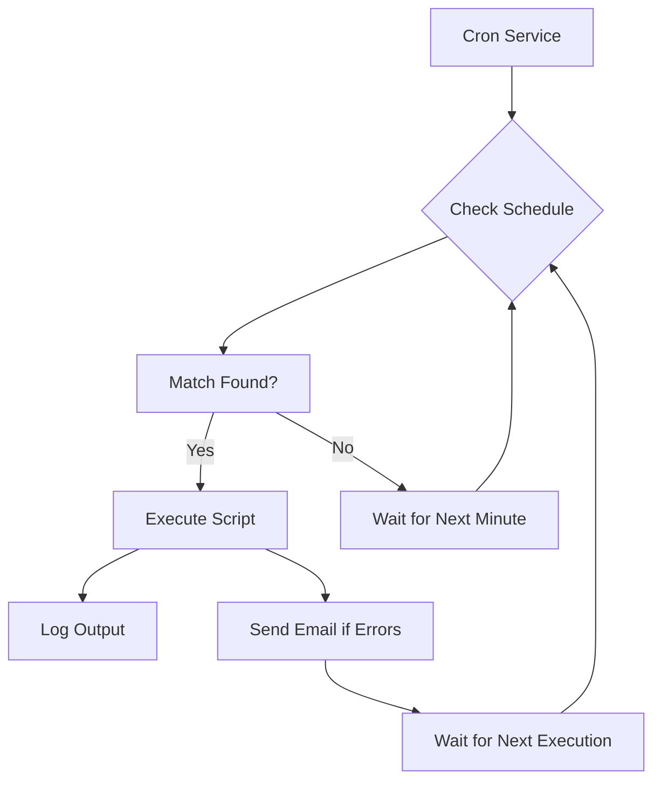

# Debian Automation

## Introduction

Automation is a crucial skill for any Debian system administrator or power user. By automating repetitive tasks, you can save time, reduce human error, and ensure consistency in your system management. In this guide, we'll explore how to use shell scripting in Debian to automate common tasks, from basic file operations to system maintenance and beyond.

Debian automation leverages the power of shell scripts (primarily Bash) to execute sequences of commands automatically. This allows you to perform complex operations with minimal human intervention, making system administration more efficient and reliable.

## Why Automate Tasks in Debian?

Before diving into the technical details, let's understand why automation is valuable:

- **Time savings**: Tasks that might take minutes or hours manually can be reduced to seconds
- **Consistency**: Scripts perform tasks the same way every time, eliminating human error
- **Documentation**: Scripts serve as documentation for how tasks should be performed
- **Scalability**: Easily apply the same operations across multiple systems

## Basic Automation Principles

### Shell Script Fundamentals

A shell script is simply a text file containing a series of commands that the shell can execute. In Debian, the default shell is Bash (Bourne Again SHell).

Let's create a simple script that prints system information:

```bash
#!/bin/bash

# My first automation script
echo "=== System Information Report ==="
echo "Hostname: $(hostname)"
echo "Kernel Version: $(uname -r)"
echo "System Uptime: $(uptime -p)"
echo "Disk Usage: $(df -h / | awk 'NR==2 {print $5}')"
echo "Memory Usage: $(free -m | awk 'NR==2 {print $3 "/" $2 " MB"}')"
```

**Input**: Save this script as `system_info.sh` and make it executable with `chmod +x system_info.sh`

**Output**:
```
=== System Information Report ===
Hostname: debian-server
Kernel Version: 5.10.0-18-amd64
System Uptime: up 3 days, 7 hours, 42 minutes
Disk Usage: 43%
Memory Usage: 1240/3950 MB
```

### Making Scripts Executable

For a script to be executable, you need to:

1. Add a shebang line at the beginning (`#!/bin/bash`)
2. Give the file execution permissions with `chmod +x script_name.sh`
3. Run it with `./script_name.sh` or place it in a directory in your PATH

## Automating System Tasks

### Scheduled Backups

One of the most common automation tasks is creating regular backups. Here's a script that backs up important directories:

```bash
#!/bin/bash

# Configuration
BACKUP_DIR="/var/backups/daily"
DIRECTORIES=("/etc" "/home/user/documents" "/var/www")
TIMESTAMP=$(date +%Y%m%d-%H%M%S)
BACKUP_FILE="$BACKUP_DIR/backup-$TIMESTAMP.tar.gz"

# Create backup directory if it doesn't exist
mkdir -p "$BACKUP_DIR"

# Create the backup
echo "Creating backup: $BACKUP_FILE"
tar -czf "$BACKUP_FILE" "${DIRECTORIES[@]}" 2>/dev/null

# Check if backup was successful
if [ $? -eq 0 ]; then
    echo "Backup created successfully"
    echo "Backup size: $(du -h "$BACKUP_FILE" | cut -f1)"
    
    # Clean up old backups (keep last 7 days)
    find "$BACKUP_DIR" -name "backup-*.tar.gz" -mtime +7 -delete
    echo "Old backups cleaned up"
else
    echo "Backup failed"
fi
```

**Input**: Schedule this script with cron to run daily:
```
# Add to crontab with: crontab -e
0 2 * * * /path/to/backup_script.sh > /var/log/backup.log 2>&1
```

**Output**:
```
Creating backup: /var/backups/daily/backup-20240313-020000.tar.gz
Backup created successfully
Backup size: 156M
Old backups cleaned up
```

### System Updates Automation

Keeping Debian updated is essential for security. Here's a script to automate updates:

```bash
#!/bin/bash

# Log file location
LOG_FILE="/var/log/system-update-$(date +%Y%m%d).log"

# Start logging
echo "=== System Update $(date) ===" | tee -a "$LOG_FILE"

# Update package lists
echo "Updating package lists..." | tee -a "$LOG_FILE"
apt-get update 2>&1 | tee -a "$LOG_FILE"

# Check if updates are available
UPDATES=$(apt-get -s upgrade | grep -P '^\d+ upgraded' | cut -d' ' -f1)
echo "Available updates: $UPDATES" | tee -a "$LOG_FILE"

if [ "$UPDATES" -gt 0 ]; then
    # Perform the upgrade
    echo "Performing system upgrade..." | tee -a "$LOG_FILE"
    apt-get -y upgrade 2>&1 | tee -a "$LOG_FILE"
    
    # Check if reboot is required
    if [ -f /var/run/reboot-required ]; then
        echo "System requires a reboot!" | tee -a "$LOG_FILE"
        
        # Optional: Automatically reboot at a specific time
        # echo "System will reboot at 3:00 AM" | tee -a "$LOG_FILE"
        # at 3:00 <<< "shutdown -r now"
    fi
else
    echo "No updates available." | tee -a "$LOG_FILE"
fi

echo "Update process completed." | tee -a "$LOG_FILE"
```

**Note**: This script requires root permissions to run, so you should run it with `sudo` or as the root user.

## Automating Repetitive Tasks

### Batch File Processing

Automation shines when processing multiple files. Let's create a script that converts all .jpg files in a directory to .png format:

```bash
#!/bin/bash

# Check if ImageMagick is installed
if ! command -v convert &> /dev/null; then
    echo "Error: ImageMagick is not installed. Install it with:"
    echo "sudo apt-get install imagemagick"
    exit 1
fi

# Check if directory argument is provided
if [ $# -eq 0 ]; then
    echo "Usage: $0 <directory>"
    exit 1
fi

INPUT_DIR="$1"

# Check if directory exists
if [ ! -d "$INPUT_DIR" ]; then
    echo "Error: Directory not found: $INPUT_DIR"
    exit 1
fi

# Count JPG files
jpg_files=($(find "$INPUT_DIR" -maxdepth 1 -type f -name "*.jpg"))
count=${#jpg_files[@]}

echo "Found $count JPG files to convert"

# Convert each JPG to PNG
converted=0
for jpg_file in "${jpg_files[@]}"; do
    base_name=$(basename "$jpg_file" .jpg)
    png_file="$INPUT_DIR/$base_name.png"
    
    echo "Converting: $jpg_file → $png_file"
    convert "$jpg_file" "$png_file"
    
    if [ $? -eq 0 ]; then
        ((converted++))
    else
        echo "Failed to convert: $jpg_file"
    fi
done

echo "Conversion complete: $converted of $count files converted successfully"
```

**Input**:
```
./convert_images.sh ~/Pictures
```

**Output**:
```
Found 24 JPG files to convert
Converting: /home/user/Pictures/vacation1.jpg → /home/user/Pictures/vacation1.png
Converting: /home/user/Pictures/vacation2.jpg → /home/user/Pictures/vacation2.png
[...]
Conversion complete: 24 of 24 files converted successfully
```

### User Account Management

Managing multiple user accounts can be automated. Here's a script to create new users from a CSV file:

```bash
#!/bin/bash

# This script creates users from a CSV file with format:
# username,full_name,group,shell

CSV_FILE="$1"

# Check if CSV file is provided
if [ -z "$CSV_FILE" ] || [ ! -f "$CSV_FILE" ]; then
    echo "Error: Please provide a valid CSV file"
    echo "Usage: $0 <csv_file>"
    exit 1
fi

# Check if running as root
if [ "$(id -u)" -ne 0 ]; then
    echo "Error: This script must be run as root"
    exit 1
fi

# Read CSV and create users
while IFS=, read -r username full_name group shell; do
    # Skip header line if present
    if [ "$username" = "username" ]; then continue; fi
    
    # Check if user already exists
    if id "$username" &>/dev/null; then
        echo "User $username already exists, skipping"
        continue
    fi
    
    # Create group if it doesn't exist
    if ! getent group "$group" &>/dev/null; then
        echo "Creating group: $group"
        groupadd "$group"
    fi
    
    # Create user
    echo "Creating user: $username ($full_name)"
    useradd -m -c "$full_name" -g "$group" -s "$shell" "$username"
    
    # Generate a random password
    password=$(openssl rand -base64 12)
    echo "$username:$password" | chpasswd
    
    echo "  Username: $username"
    echo "  Password: $password"
    echo "  User must change password at next login"
    passwd -e "$username" > /dev/null
    
    echo "User $username created successfully"
    echo "-------------------------------------"
done < "$CSV_FILE"

echo "User creation process completed"
```

**Input**:
Create a CSV file named `users.csv`:
```
username,full_name,group,shell
jsmith,John Smith,developers,/bin/bash
agarcia,Ana Garcia,designers,/bin/bash
rjones,Robert Jones,sysadmins,/bin/bash
```

Run the script:
```
sudo ./create_users.sh users.csv
```

**Output**:
```
Creating group: developers
Creating user: jsmith (John Smith)
  Username: jsmith
  Password: dGVzdDEyMwo=
  User must change password at next login
User jsmith created successfully
-------------------------------------
Creating group: designers
Creating user: agarcia (Ana Garcia)
  Username: agarcia
  Password: ZmFrZXBhc3M=
  User must change password at next login
User agarcia created successfully
-------------------------------------
Creating group: sysadmins
Creating user: rjones (Robert Jones)
  Username: rjones
  Password: cGFzc3dvcmQ=
  User must change password at next login
User rjones created successfully
-------------------------------------
User creation process completed
```

## Advanced Automation Techniques

### Workflow Automation with Multiple Scripts

For complex automation scenarios, you can create a suite of scripts that work together. Here's a simple example of a master script that calls other scripts in sequence:

```bash
#!/bin/bash
# main_automation.sh - Master automation script

# Configuration
SCRIPTS_DIR="/path/to/scripts"
LOG_DIR="/var/log/automation"
DATE=$(date +%Y%m%d)
LOG_FILE="$LOG_DIR/automation-$DATE.log"

# Create log directory if it doesn't exist
mkdir -p "$LOG_DIR"

# Function to run a script and log its output
run_script() {
    local script="$1"
    local script_name=$(basename "$script")
    
    echo "=======================================" >> "$LOG_FILE"
    echo "Running $script_name at $(date)" >> "$LOG_FILE"
    echo "=======================================" >> "$LOG_FILE"
    
    # Run the script and capture output
    if [ -x "$script" ]; then
        "$script" >> "$LOG_FILE" 2>&1
        result=$?
        
        if [ $result -eq 0 ]; then
            echo "$script_name completed successfully" >> "$LOG_FILE"
        else
            echo "$script_name failed with exit code $result" >> "$LOG_FILE"
        fi
    else
        echo "Error: $script_name is not executable" >> "$LOG_FILE"
    fi
    
    echo "" >> "$LOG_FILE"
}

# Main execution
echo "Starting automation run at $(date)" >> "$LOG_FILE"

# Run each script in order
run_script "$SCRIPTS_DIR/1-backup.sh"
run_script "$SCRIPTS_DIR/2-system_update.sh"
run_script "$SCRIPTS_DIR/3-cleanup.sh"
run_script "$SCRIPTS_DIR/4-report.sh"

echo "Automation completed at $(date)" >> "$LOG_FILE"

# Optional: Generate an email report
mail -s "Daily Automation Report $DATE" admin@example.com < "$LOG_FILE"
```

### Monitoring with Automation

Automation can help monitor system health. Here's a script that checks critical services and sends alerts if any issues are detected:

```bash
#!/bin/bash
# service_monitor.sh - Monitor critical services and alert on failures

# Configuration
SERVICES=("nginx" "mysql" "ssh" "postfix")
ADMIN_EMAIL="admin@example.com"
HOSTNAME=$(hostname)

# Function to check if a service is running
check_service() {
    local service="$1"
    systemctl is-active --quiet "$service"
    return $?
}

# Function to restart a service
restart_service() {
    local service="$1"
    echo "Attempting to restart $service..."
    systemctl restart "$service"
    sleep 2
    
    # Check if restart was successful
    if check_service "$service"; then
        echo "$service was successfully restarted"
        return 0
    else
        echo "Failed to restart $service"
        return 1
    fi
}

# Initialize report
report=""
failed_services=0

# Check each service
for service in "${SERVICES[@]}"; do
    if check_service "$service"; then
        report+="✅ $service is running
"
    else
        report+="❌ $service is DOWN
"
        ((failed_services++))
        
        # Attempt to restart the service
        if restart_service "$service"; then
            report+="  ↳ Successfully restarted $service
"
        else
            report+="  ↳ Failed to restart $service
"
        fi
    fi
done

# Add system load information
load=$(cat /proc/loadavg | cut -d' ' -f1-3)
memory=$(free -h | awk '/^Mem:/ {print $3 "/" $2}')
disk=$(df -h / | awk 'NR==2 {print $5}')

report+="
System Status:
"
report+="Load Average: $load
"
report+="Memory Usage: $memory
"
report+="Disk Usage: $disk
"

# Send alert if there are problems
if [ $failed_services -gt 0 ]; then
    echo -e "Service Alert on $HOSTNAME: $failed_services service(s) are down

$report" | \
    mail -s "🚨 SERVICE ALERT on $HOSTNAME" "$ADMIN_EMAIL"
else
    # Optionally send a daily summary
    # echo -e "All services on $HOSTNAME are running properly

$report" | \
    # mail -s "✅ Services OK on $HOSTNAME" "$ADMIN_EMAIL"
    echo "All services are running properly"
fi

# Display report
echo -e "$report"
```

## Automating with Cron Jobs

Cron is the standard scheduler in Debian that allows you to run scripts automatically at specified times.

### Cron Syntax

The basic format of a cron job is:

```
minute hour day-of-month month day-of-week command
```

For example:
- `0 2 * * * /path/to/script.sh` - Run the script daily at 2:00 AM
- `*/15 * * * * /path/to/script.sh` - Run the script every 15 minutes
- `0 9-17 * * 1-5 /path/to/script.sh` - Run the script hourly from 9 AM to 5 PM, Monday to Friday

### Setting Up Cron Jobs

To add a cron job:

1. Edit your user's crontab with `crontab -e`
2. Add your schedule in the proper format
3. Save and exit

Here's a mermaid diagram showing how cron scheduling works:



## Best Practices for Debian Automation

When creating automation scripts, follow these best practices:

### 1. Error Handling

Always include error handling in your scripts:

```bash
#!/bin/bash

# Set script to exit on error
set -e

# Function for error handling
handle_error() {
    echo "Error occurred at line $1"
    exit 1
}

# Set error trap
trap 'handle_error $LINENO' ERR

# Script commands
echo "Starting process..."
# Commands here
echo "Process completed successfully"
```

### 2. Logging

Implement proper logging in your scripts:

```bash
#!/bin/bash

# Log file
LOG_FILE="/var/log/myscript.log"

# Logging function
log() {
    local timestamp=$(date +"%Y-%m-%d %H:%M:%S")
    echo "[$timestamp] $1" >> "$LOG_FILE"
    echo "[$timestamp] $1"
}

log "Script started"
# Script commands here
log "Operation completed"
```

### 3. Configuration Files

Keep configuration separate from script logic:

```bash
#!/bin/bash

# Load configuration
CONFIG_FILE="/etc/myscript/config.conf"

if [ -f "$CONFIG_FILE" ]; then
    source "$CONFIG_FILE"
else
    echo "Error: Configuration file not found"
    exit 1
fi

# Now use variables from config file
echo "Using backup directory: $BACKUP_DIR"
```

Example configuration file (`config.conf`):
```
# Configuration for backup script
BACKUP_DIR="/var/backups"
RETENTION_DAYS=7
BACKUP_USER="backupuser"
```

### 4. Making Scripts Adaptable

Write scripts that can adapt to different environments:

```bash
#!/bin/bash

# Detect system memory and adjust settings
TOTAL_MEM=$(free -m | awk '/^Mem:/ {print $2}')

if [ "$TOTAL_MEM" -lt 1024 ]; then
    # Low memory settings
    MAX_WORKERS=2
    BUFFER_SIZE="64M"
elif [ "$TOTAL_MEM" -lt 4096 ]; then
    # Medium memory settings
    MAX_WORKERS=4
    BUFFER_SIZE="128M"
else
    # High memory settings
    MAX_WORKERS=8
    BUFFER_SIZE="256M"
fi

echo "Configuring with $MAX_WORKERS workers and $BUFFER_SIZE buffer"
```

## Creating an Automation Framework

For more advanced automation, consider developing a framework that organizes your scripts:

```
/opt/automation/
├── bin/                   # Executable scripts
│   ├── backup.sh
│   ├── monitor.sh
│   └── update.sh
├── conf/                  # Configuration files
│   ├── backup.conf
│   ├── monitor.conf
│   └── update.conf
├── lib/                   # Shared functions
│   ├── common.sh
│   ├── logging.sh
│   └── notifications.sh
└── logs/                  # Log files
    ├── backup/
    ├── monitor/
    └── update/
```

A common library file (`lib/common.sh`) might look like:

```bash
#!/bin/bash
# Common functions for automation scripts

# Base directories
SCRIPT_DIR="$(dirname "$(readlink -f "$0")")"
BASE_DIR="$(dirname "$SCRIPT_DIR")"
LIB_DIR="$BASE_DIR/lib"
CONF_DIR="$BASE_DIR/conf"
LOG_DIR="$BASE_DIR/logs"

# Source other libraries
source "$LIB_DIR/logging.sh"
source "$LIB_DIR/notifications.sh"

# Common functions
validate_config() {
    if [ ! -f "$1" ]; then
        log_error "Configuration file not found: $1"
        exit 1
    fi
    source "$1"
}

check_prerequisites() {
    for cmd in "$@"; do
        if ! command -v "$cmd" &> /dev/null; then
            log_error "Required command not found: $cmd"
            exit 1
        fi
    done
}

is_root() {
    if [ "$(id -u)" -ne 0 ]; then
        log_error "This script must be run as root"
        exit 1
    fi
}
```

## Summary

Debian automation through shell scripting is a powerful way to streamline system administration tasks. By creating well-structured scripts, you can automate everything from simple file operations to complex system maintenance workflows.

We've covered:
- Basic shell scripting for automation
- System task automation (backups, updates)
- Batch file processing
- User account management
- Advanced techniques with multiple scripts
- System monitoring
- Cron job scheduling
- Best practices for robust automation

By applying these techniques, you can significantly reduce manual work, minimize errors, and maintain a more reliable Debian system.

## Practice Exercises

1. Create a script that monitors disk usage and sends an alert when any filesystem exceeds 80% capacity.
2. Write a script that automatically rotates log files older than 30 days, compressing them and moving them to an archive directory.
3. Develop a script that checks for security updates specifically and applies them automatically.
4. Create a simple automation framework with configuration files and shared libraries.
5. Write a script that automates the installation and configuration of a web server (Apache or Nginx) with standard security settings.

## Additional Resources

- The Debian Administrator's Handbook
- Bash Guide for Beginners by Machtelt Garrels
- Advanced Bash-Scripting Guide by Mendel Cooper
- Shell Scripting: Expert Recipes for Linux, Bash, and more by Steve Parker
- The Linux Command Line by William Shotts