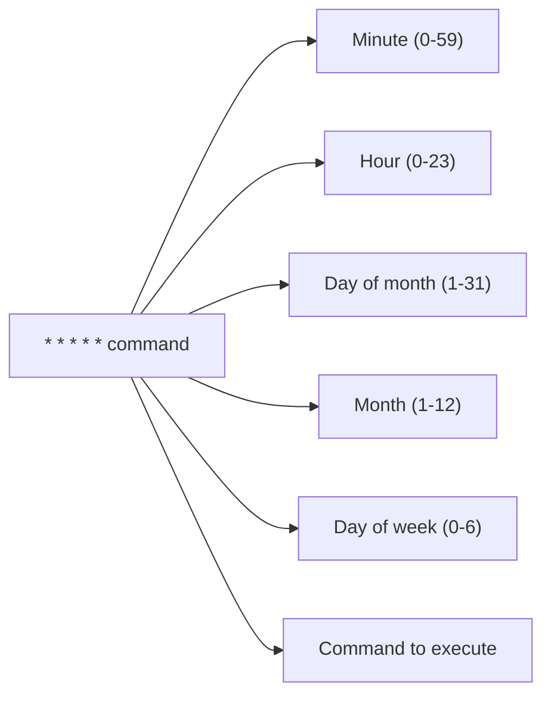

# Debian Cron Jobs

## Introduction

Cron jobs are a powerful feature in Unix-like operating systems, including Debian, that allow users to schedule tasks to run automatically at specified intervals. Whether you need to perform system maintenance, run backups, or execute recurring scripts, cron provides a reliable way to automate these tasks without manual intervention.

In this guide, we'll explore how to work with cron jobs on Debian systems, from basic concepts to practical applications. By the end, you'll be comfortable creating, managing, and troubleshooting cron jobs for various automation needs.

## Understanding Cron

### What is Cron?

Cron is a time-based job scheduler in Unix-like operating systems. The name comes from the Greek word "chronos," meaning time. The cron daemon runs in the background and executes scheduled commands (called "cron jobs") at specified dates and times.

### Cron Components

On Debian systems, the cron system consists of:

1. **cron daemon** - The background service that checks and executes scheduled jobs
2. **crontab files** - Configuration files that define scheduled jobs
3. **system cron directories** - Special directories for system-wide scheduled tasks

## Basic Cron Usage

### The crontab Command

The primary way to manage user cron jobs is through the `crontab` command:

```bash
# View your current cron jobs
crontab -l

# Edit your cron jobs
crontab -e

# Remove all your cron jobs
crontab -r
```

When you run `crontab -e` for the first time, you'll be prompted to choose a text editor. Once selected, a file will open where you can define your cron jobs.

### Crontab Syntax

Each line in a crontab file represents a single scheduled job and follows this format:

```
* * * * * command_to_execute
```

The five asterisks represent, from left to right:
1. Minute (0-59)
2. Hour (0-23)
3. Day of month (1-31)
4. Month (1-12)
5. Day of week (0-6, where 0 is Sunday)

After these time fields comes the command you want to execute.

Here's a diagram showing the crontab time fields:



### Crontab Examples

Let's look at some examples to better understand the syntax:

```bash
# Run a script every day at 3:30 AM
30 3 * * * /path/to/script.sh

# Run a command every Monday at 8:15 AM
15 8 * * 1 /path/to/command

# Run a backup script on the first day of every month at midnight
0 0 1 * * /path/to/backup.sh

# Run a script every 15 minutes
*/15 * * * * /path/to/script.sh

# Run a command at 10:30 AM only on weekdays (Monday to Friday)
30 10 * * 1-5 /path/to/command
```

## Special Crontab Syntax

### Special Time Strings

Cron provides special strings for common scheduling patterns:

```bash
# Run a command at system startup
@reboot /path/to/command

# Other special strings
@yearly   # Run once a year (0 0 1 1 *)
@monthly  # Run once a month (0 0 1 * *)
@weekly   # Run once a week (0 0 * * 0)
@daily    # Run once a day (0 0 * * *)
@hourly   # Run once an hour (0 * * * *)
```

### Using Multiple Values

You can specify multiple values for a single time field:

```bash
# Run at minutes 0, 15, 30, and 45 of every hour
0,15,30,45 * * * * /path/to/command

# Run at 3 AM and 3 PM every day
0 3,15 * * * /path/to/command
```

### Using Ranges

You can specify ranges for time fields:

```bash
# Run every hour from 9 AM to 5 PM on weekdays
0 9-17 * * 1-5 /path/to/command
```

### Using Step Values

You can use step values with ranges or asterisks:

```bash
# Run every 2 hours
0 */2 * * * /path/to/command

# Run every 10 minutes during business hours on weekdays
*/10 9-17 * * 1-5 /path/to/command
```

## System-wide Cron Directories

In addition to user crontabs, Debian provides system-wide cron directories for different scheduling needs:

- `/etc/cron.hourly/` - Scripts run every hour
- `/etc/cron.daily/` - Scripts run daily
- `/etc/cron.weekly/` - Scripts run weekly
- `/etc/cron.monthly/` - Scripts run monthly

To use these directories, simply place your executable scripts in the appropriate folder. Ensure your scripts are executable by running:

```bash
chmod +x /etc/cron.daily/my-script
```

## Practical Examples

Let's explore some real-world examples of using cron jobs on Debian systems.

### Example 1: System Updates

Automatically update your Debian system packages once a day:

```bash
# Create a script for updates
cat > /home/user/scripts/update-system.sh << 'EOF'
#!/bin/bash
# Log file for updates
LOG_FILE="/var/log/auto-update.log"

# Output date to log
echo "===== System update started at $(date) =====" >> $LOG_FILE

# Update package lists and upgrade installed packages
apt-get update >> $LOG_FILE 2>&1
apt-get -y upgrade >> $LOG_FILE 2>&1

echo "===== System update completed at $(date) =====" >> $LOG_FILE
EOF

# Make the script executable
chmod +x /home/user/scripts/update-system.sh

# Schedule it to run daily at 4 AM
crontab -l | { cat; echo "0 4 * * * /home/user/scripts/update-system.sh"; } | crontab -
```

### Example 2: Database Backup

Create a daily backup of a MySQL database:

```bash
# Create a backup script
cat > /home/user/scripts/db-backup.sh << 'EOF'
#!/bin/bash
# Configuration
BACKUP_DIR="/home/user/backups"
DB_NAME="my_database"
DB_USER="db_user"
DB_PASS="db_password"
DATE=$(date +"%Y-%m-%d")

# Create backup directory if it doesn't exist
mkdir -p $BACKUP_DIR

# Create the backup
mysqldump -u $DB_USER -p$DB_PASS $DB_NAME | gzip > "$BACKUP_DIR/$DB_NAME-$DATE.sql.gz"

# Remove backups older than 7 days
find $BACKUP_DIR -name "*.sql.gz" -type f -mtime +7 -delete
EOF

# Make the script executable
chmod +x /home/user/scripts/db-backup.sh

# Schedule it to run daily at 1 AM
crontab -l | { cat; echo "0 1 * * * /home/user/scripts/db-backup.sh"; } | crontab -
```

### Example 3: Log Rotation

Implement a simple log rotation system:

```bash
# Create a log rotation script
cat > /home/user/scripts/rotate-logs.sh << 'EOF'
#!/bin/bash
# Log file to rotate
LOG_FILE="/var/log/my-application.log"
BACKUP_DIR="/var/log/archives"

# Create backup directory if it doesn't exist
mkdir -p $BACKUP_DIR

# Get current date for the archive file name
DATE=$(date +"%Y-%m-%d")

# Copy current log to archive with date
cp $LOG_FILE "$BACKUP_DIR/my-application-$DATE.log"

# Clear the original log file
> $LOG_FILE

# Remove archives older than 30 days
find $BACKUP_DIR -name "my-application-*.log" -type f -mtime +30 -delete
EOF

# Make the script executable
chmod +x /home/user/scripts/rotate-logs.sh

# Schedule it to run weekly on Sunday at midnight
crontab -l | { cat; echo "0 0 * * 0 /home/user/scripts/rotate-logs.sh"; } | crontab -
```

## Environment Variables in Cron Jobs

Cron jobs run in a limited environment, which can sometimes cause commands to fail even though they work fine when executed manually. To address this, you can set environment variables within your crontab:

```bash
# Setting environment variables in crontab
SHELL=/bin/bash
PATH=/usr/local/sbin:/usr/local/bin:/usr/sbin:/usr/bin:/sbin:/bin
MAILTO=user@example.com

# Now the cron job with proper environment
0 2 * * * /path/to/script.sh
```

The `MAILTO` variable is particularly useful as it will send any output from your cron jobs to the specified email address.

## Capturing Output from Cron Jobs

By default, cron sends any command output via email to the user. You can redirect the output to files instead:

```bash
# Send standard output to a log file
0 3 * * * /path/to/script.sh > /path/to/logfile.log

# Send standard output and errors to a log file
0 3 * * * /path/to/script.sh > /path/to/logfile.log 2>&1

# Discard all output (send to null device)
0 3 * * * /path/to/script.sh > /dev/null 2>&1
```

## Troubleshooting Cron Jobs

If your cron jobs aren't running as expected, here are some troubleshooting steps:

### 1. Check Cron Service Status

Ensure the cron service is running:

```bash
systemctl status cron
```

If it's not running, start it:

```bash
sudo systemctl start cron
```

### 2. Check Cron Logs

Examine the system logs for cron-related messages:

```bash
grep CRON /var/log/syslog
```

### 3. Test Your Command Manually

Before scheduling, test your command or script manually to ensure it runs correctly.

### 4. Common Issues and Solutions

1. **Path problems**: Specify absolute paths to all commands and files in your cron jobs.
2. **Permission issues**: Ensure your scripts have execute permissions.
3. **Missing dependencies**: Cron's environment might not include all the variables your script needs.
4. **Syntax errors**: Double-check your crontab syntax.

## Security Considerations

When working with cron jobs, keep these security practices in mind:

1. **Restrict permissions** on your scripts to prevent unauthorized access.
2. **Don't store sensitive information** (like passwords) directly in crontab files.
3. **Review logs regularly** to monitor the execution of scheduled tasks.
4. **Use specific user accounts** for different types of cron jobs.

## Summary

Cron jobs are a powerful tool for automating tasks on Debian systems. In this guide, we've covered:

- The basics of cron and crontab syntax
- How to schedule tasks at various intervals
- System-wide cron directories
- Practical examples for common automation needs
- Troubleshooting techniques for cron jobs
- Security considerations

Mastering cron jobs will significantly enhance your ability to automate and maintain Debian systems efficiently. With the knowledge gained from this guide, you can now create and manage scheduled tasks to handle a wide range of automation requirements.

## Additional Resources and Exercises

### Resources

- The `man crontab` and `man 5 crontab` manual pages provide detailed information about crontab usage and syntax.
- The [Debian Wiki](https://wiki.debian.org) contains additional information about system administration, including cron job management.

### Exercises

1. **Basic Scheduling**: Create a cron job that displays the current date and time every 5 minutes and logs the output to a file.

2. **System Monitoring**: Write a script that checks system resources (CPU, memory, disk space) and sends an email alert if usage exceeds certain thresholds. Schedule it to run every hour.

3. **Website Availability**: Create a script that checks if a website is accessible and logs the results. Schedule it to run every 15 minutes.

4. **Log Analysis**: Write a script that analyzes log files for specific patterns or errors and generates a daily report. Schedule it to run daily.

By working through these exercises, you'll gain practical experience with cron jobs and reinforce your understanding of task automation on Debian systems.