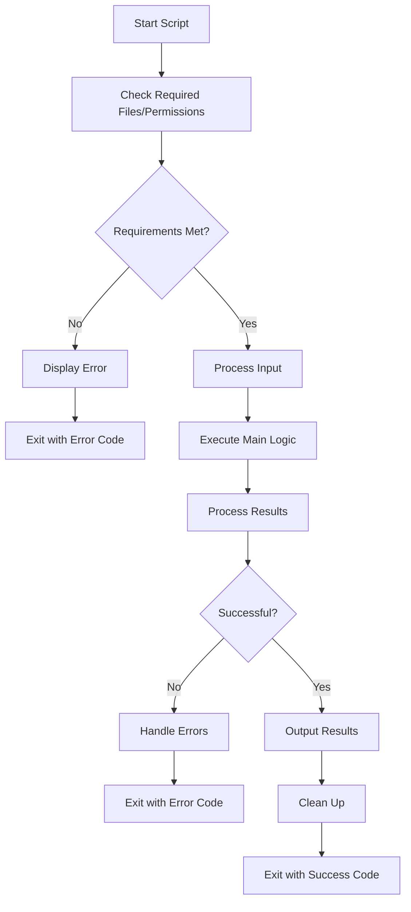

# Debian Script Creation

## Introduction

Shell scripting is a powerful skill for Debian Linux users, allowing you to automate tasks, combine complex commands, and create custom utilities. A shell script is essentially a text file containing a series of commands that are executed sequentially. In Debian environments, the default shell is Bash (Bourne Again SHell), making Bash scripting the most common form of shell scripting on Debian systems.

In this tutorial, we'll walk through the fundamentals of creating, executing, and debugging shell scripts in Debian. Whether you're a system administrator looking to automate routine tasks or a beginner wanting to deepen your understanding of Linux, mastering shell scripting will significantly enhance your productivity.

## Getting Started with Shell Scripts

### What Is a Shell Script?

A shell script is a plain text file containing a sequence of commands that the shell can execute. Think of it as a "recipe" of commands that you would normally type into the terminal manually.

### Creating Your First Script

Let's start with a simple "Hello, World!" script:

1. Open a text editor (like nano, vim, or gedit):

```bash
nano hello.sh
```

2. Type the following content:

```bash
#!/bin/bash

# This is my first shell script
echo "Hello, World!"
```

3. Save the file and exit the editor.

### Understanding the Script Components

Let's break down what each part of this script does:

- `#!/bin/bash`: Known as the "shebang" line, it tells the system which interpreter to use (in this case, Bash)
- `# This is my first shell script`: A comment (not executed)
- `echo "Hello, World!"`: The actual command that prints text to the terminal

### Making the Script Executable

Before you can run your script, you need to make it executable:

```bash
chmod +x hello.sh
```

### Running Your Script

There are several ways to run your script:

1. Using the full path:

```bash
./hello.sh
```

Output:
```
Hello, World!
```

2. Using bash directly:

```bash
bash hello.sh
```

Output:
```
Hello, World!
```

## Script Creation Best Practices

### Script Structure

A well-structured shell script typically follows this pattern:

```bash
#!/bin/bash

# Script metadata
# Name: example.sh
# Description: An example script demonstrating structure
# Author: Your Name
# Date: March 13, 2025

# Define variables
GREETING="Hello"
NAME="Debian User"

# Define functions
say_hello() {
    echo "$GREETING, $NAME!"
    echo "Today is $(date)"
}

# Main script execution
echo "Starting script..."
say_hello
echo "Script completed."
```

Output:
```
Starting script...
Hello, Debian User!
Today is Thu Mar 13 14:30:25 EDT 2025
Script completed.
```

### Variable Naming Conventions

- Use uppercase for constants: `MAX_COUNT=10`
- Use lowercase for regular variables: `user_name="John"`
- Avoid spaces around the equals sign: `count=5` (not `count = 5`)

### Comments

Add meaningful comments to explain complex logic:

```bash
# Calculate the average of the input numbers
sum=0
count=0
for num in "$@"; do
    sum=$((sum + num))
    count=$((count + 1))
done
# Avoid division by zero
if [ $count -ne 0 ]; then
    average=$((sum / count))
    echo "Average: $average"
else
    echo "No numbers provided"
fi
```

## Script Parameters and Input

### Command-Line Arguments

Command-line arguments are accessible using special variables:

- `$0`: Script name
- `$1`, `$2`, ...: First, second, etc. arguments
- `$#`: Number of arguments
- `$@`: All arguments as separate strings
- `$*`: All arguments as a single string

Example script (`args.sh`):

```bash
#!/bin/bash

echo "Script name: $0"
echo "First argument: $1"
echo "Second argument: $2"
echo "Number of arguments: $#"
echo "All arguments: $@"
```

Running the script:

```bash
./args.sh apple banana
```

Output:
```
Script name: ./args.sh
First argument: apple
Second argument: banana
Number of arguments: 2
All arguments: apple banana
```

### Reading User Input

You can make interactive scripts using the `read` command:

```bash
#!/bin/bash

echo "What is your name?"
read name
echo "Hello, $name! Nice to meet you."

# Reading with a prompt
read -p "What is your favorite color? " color
echo "$color is a great choice!"

# Reading with a timeout
read -t 5 -p "Quick! Type something within 5 seconds: " quick_input
echo "You typed: $quick_input"
```

Sample interaction:
```
What is your name?
Alex
Hello, Alex! Nice to meet you.
What is your favorite color? blue
blue is a great choice!
Quick! Type something within 5 seconds: Debian
You typed: Debian
```

## Control Structures

### Conditional Statements

The `if` statement allows you to execute code based on conditions:

```bash
#!/bin/bash

# Check if file exists
if [ -f "/etc/passwd" ]; then
    echo "The passwd file exists."
else
    echo "The passwd file does not exist."
fi

# Check a number
read -p "Enter a number: " num
if [ "$num" -lt 10 ]; then
    echo "That's a small number."
elif [ "$num" -lt 100 ]; then
    echo "That's a medium number."
else
    echo "That's a large number."
fi
```

### Loops

#### For Loop

```bash
#!/bin/bash

# Simple counting
echo "Counting from 1 to 5:"
for i in {1..5}; do
    echo "Number: $i"
done

# Looping through files
echo -e "
Text files in current directory:"
for file in *.txt; do
    if [ -f "$file" ]; then
        echo "- $file"
    fi
done

# Looping with a specific step
echo -e "
Even numbers from 2 to 10:"
for i in {2..10..2}; do
    echo "$i"
done
```

#### While Loop

```bash
#!/bin/bash

# Countdown example
counter=5
echo "Countdown:"
while [ $counter -gt 0 ]; do
    echo "$counter..."
    counter=$((counter - 1))
    sleep 1
done
echo "Blast off!"

# Reading file line by line
echo -e "
Reading /etc/hostname line by line:"
while read -r line; do
    echo "Line: $line"
done < /etc/hostname
```

### Case Statement

The `case` statement is useful for handling multiple conditions:

```bash
#!/bin/bash

read -p "Enter a fruit name: " fruit

case "$fruit" in
    "apple")
        echo "Apples are red or green."
        ;;
    "banana")
        echo "Bananas are yellow."
        ;;
    "orange")
        echo "Oranges are orange."
        ;;
    *)
        echo "I don't know what color $fruit is."
        ;;
esac
```

## Working with Files and Directories

### File Operations

```bash
#!/bin/bash

# Create a directory if it doesn't exist
dir_name="test_directory"
if [ ! -d "$dir_name" ]; then
    mkdir "$dir_name"
    echo "Created directory: $dir_name"
else
    echo "Directory already exists: $dir_name"
fi

# Create a file with some content
file_name="$dir_name/test_file.txt"
echo "This is a test file created by a shell script." > "$file_name"
echo "Created file: $file_name"

# Append content to the file
echo "Adding a second line to the file..." >> "$file_name"
echo "File updated."

# Display file content
echo -e "
File content:"
cat "$file_name"

# Check file size
size=$(stat -c %s "$file_name")
echo -e "
File size: $size bytes"
```

### Processing Text Files

Let's create a script that counts words in a text file:

```bash
#!/bin/bash

# Check if filename was provided
if [ $# -eq 0 ]; then
    echo "Usage: $0 <filename>"
    exit 1
fi

filename="$1"

# Check if file exists
if [ ! -f "$filename" ]; then
    echo "Error: File '$filename' not found."
    exit 2
fi

# Count lines, words, and characters
lines=$(wc -l < "$filename")
words=$(wc -w < "$filename")
chars=$(wc -c < "$filename")

echo "File statistics for '$filename':"
echo "Lines: $lines"
echo "Words: $words"
echo "Characters: $chars"

# Find the 3 most common words
echo -e "
Most common words:"
tr -s '[:space:]' '
' < "$filename" | grep -v "^\s*$" | sort | uniq -c | sort -nr | head -3
```

## Error Handling and Debugging

### Exit Codes

Shell scripts return exit codes to indicate success or failure:
- 0: Success
- Non-zero (1-255): Failure

```bash
#!/bin/bash

# Example of checking exit codes
ls /etc/passwd > /dev/null
if [ $? -eq 0 ]; then
    echo "The file /etc/passwd exists."
else
    echo "The file /etc/passwd does not exist."
fi

# Setting custom exit codes
if [ $# -eq 0 ]; then
    echo "Error: No arguments provided."
    exit 1
fi

echo "Script completed successfully."
exit 0
```

### Debugging Techniques

You can enable debugging in your scripts using:

```bash
#!/bin/bash -x  # Print each command before execution
```

Or within the script:

```bash
#!/bin/bash

# Enable debugging for part of the script
set -x  # Turn on debugging
echo "This command is visible in debug output"
ls -la /tmp
set +x  # Turn off debugging

echo "This command is not visible in debug output"
```

For more verbose debugging, use:

```bash
#!/bin/bash

set -e  # Exit immediately if a command exits with non-zero status
set -u  # Treat unset variables as an error
set -o pipefail  # Return value of a pipeline is the value of the last command to exit with non-zero status

# Your script commands here
```

## Practical Examples

### System Monitoring Script

This script monitors system resources and logs them:

```bash
#!/bin/bash

log_file="/tmp/system_monitor.log"

echo "===== System Monitor: $(date) =====" >> "$log_file"

# CPU usage
cpu_usage=$(top -bn1 | grep "Cpu(s)" | awk '{print $2 + $4}')
echo "CPU Usage: ${cpu_usage}%" >> "$log_file"

# Memory usage
memory_info=$(free -m | grep Mem)
total_mem=$(echo "$memory_info" | awk '{print $2}')
used_mem=$(echo "$memory_info" | awk '{print $3}')
mem_percentage=$((used_mem * 100 / total_mem))

echo "Memory Usage: ${mem_percentage}% (${used_mem}MB / ${total_mem}MB)" >> "$log_file"

# Disk usage
disk_usage=$(df -h / | grep /)
disk_size=$(echo "$disk_usage" | awk '{print $2}')
disk_used=$(echo "$disk_usage" | awk '{print $3}')
disk_percent=$(echo "$disk_usage" | awk '{print $5}')

echo "Disk Usage: $disk_percent ($disk_used / $disk_size)" >> "$log_file"

# Active user count
user_count=$(who | wc -l)
echo "Active Users: $user_count" >> "$log_file"

echo -e "System information logged to $log_file"
```

### Backup Script

This script creates a backup of a specified directory:

```bash
#!/bin/bash

# Configuration
source_dir="$HOME/Documents"
backup_dir="$HOME/Backups"
date_format=$(date +"%Y%m%d_%H%M%S")
backup_filename="backup_${date_format}.tar.gz"

# Create backup directory if it doesn't exist
if [ ! -d "$backup_dir" ]; then
    mkdir -p "$backup_dir"
    echo "Created backup directory: $backup_dir"
fi

# Perform the backup
echo "Starting backup of $source_dir..."
tar -czf "$backup_dir/$backup_filename" -C "$(dirname "$source_dir")" "$(basename "$source_dir")"

# Check if backup was successful
if [ $? -eq 0 ]; then
    echo "Backup completed successfully: $backup_dir/$backup_filename"
    echo "Backup size: $(du -h "$backup_dir/$backup_filename" | cut -f1)"
    
    # Keep only the 5 most recent backups
    echo "Cleaning old backups..."
    ls -t "$backup_dir"/backup_*.tar.gz | tail -n +6 | xargs -r rm
    echo "Backup retention: Keeping the 5 most recent backups."
else
    echo "Backup failed!"
fi
```

### Package Management Script

A script to update Debian packages and clean up:

```bash
#!/bin/bash

logfile="/var/log/system_update.log"

# Function to log messages
log_message() {
    echo "$(date '+%Y-%m-%d %H:%M:%S') - $1" | tee -a "$logfile"
}

# Check for root privileges
if [ "$(id -u)" -ne 0 ]; then
    log_message "Error: This script must be run as root"
    exit 1
fi

log_message "Starting system update"

# Update package lists
log_message "Updating package lists..."
apt-get update >> "$logfile" 2>&1
if [ $? -ne 0 ]; then
    log_message "Error updating package lists"
    exit 2
fi

# Upgrade packages
log_message "Upgrading packages..."
apt-get -y upgrade >> "$logfile" 2>&1
if [ $? -ne 0 ]; then
    log_message "Error upgrading packages"
    exit 3
fi

# Clean up
log_message "Cleaning up..."
apt-get -y autoremove >> "$logfile" 2>&1
apt-get -y autoclean >> "$logfile" 2>&1

log_message "System update completed successfully"

# Show summary
upgradable=$(apt list --upgradable 2>/dev/null | grep -v "Listing..." | wc -l)
log_message "Packages that still need upgrading: $upgradable"

echo -e "
Update summary:"
echo "===================="
echo "Update completed at: $(date)"
echo "Log file: $logfile"
if [ "$upgradable" -eq 0 ]; then
    echo "Status: All packages up to date"
else
    echo "Status: $upgradable packages still need upgrading (distribution upgrade may be needed)"
fi
```

## Script Scheduling with Cron

You can schedule your scripts to run automatically using cron:

```bash
#!/bin/bash

# This script demonstrates how to set up a cron job

# Edit the crontab
echo "Editing crontab..."
cat << EOF > /tmp/new_cron
# Run system update every Sunday at 2 AM
0 2 * * 0 /path/to/update_system.sh

# Backup Documents folder every day at 3 AM
0 3 * * * /path/to/backup_script.sh

# Check disk space every hour
0 * * * * /path/to/check_disk_space.sh
EOF

echo "Preview of the crontab:"
cat /tmp/new_cron

read -p "Do you want to install this crontab? (y/n): " answer
if [ "$answer" = "y" ]; then
    crontab /tmp/new_cron
    echo "Crontab installed successfully."
else
    echo "Crontab installation cancelled."
fi

rm /tmp/new_cron
```

## Script Visualization

Here's a flowchart showing how a typical shell script processes:



## Summary

In this tutorial, you've learned:

- How to create and run shell scripts in Debian
- Basic script structure and best practices
- Working with variables, parameters, and user input
- Control structures like if statements, loops, and case statements
- File and directory operations
- Error handling and debugging techniques
- Practical script examples for system tasks
- How to schedule scripts with cron

Shell scripting is a powerful skill that grows with practice. Start with simple scripts and gradually tackle more complex projects as your confidence builds.

## Additional Resources and Exercises

### Resources

- The [Bash manual](https://www.gnu.org/software/bash/manual/) - Comprehensive reference
- [Advanced Bash-Scripting Guide](https://tldp.org/LDP/abs/html/) - In-depth tutorials and examples
- `man bash` - Bash manual page in the terminal

### Exercises

1. **File Organizer**: Write a script that organizes files in a directory based on their extension (moving images to an Images folder, documents to a Documents folder, etc.).

2. **Log Analyzer**: Create a script that parses a log file and reports the number of errors, warnings, and information messages.

3. **User Management**: Develop a script that creates a new user, sets their password, and assigns them to specific groups.

4. **Website Monitoring**: Write a script that checks if a website is accessible and sends a notification if it's down.

5. **Directory Size Tracker**: Create a script that tracks the size of specified directories over time and generates a report of the growth.

As you work through these exercises, remember to start small, test frequently, and build up your scripts incrementally. Happy scripting!