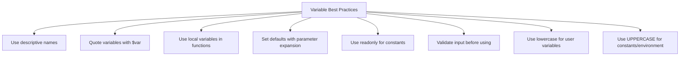

# Debian Variables

Variables are essential components of shell scripting in Debian and other Linux distributions. They allow you to store and manipulate data, making your scripts more flexible and powerful. This guide will introduce you to variables in Debian shell scripting, how to define them, use them, and apply them in real-world scenarios.

## Introduction to Variables in Debian

In Debian shell scripting (which typically uses Bash - the Bourne Again SHell), variables serve as containers for storing data that can be referenced and manipulated throughout your script. There are two main types of variables you'll work with:

1. **Shell Variables** - Local to the shell session where they're defined
2. **Environment Variables** - Available to the shell and all its child processes

Understanding how to work with these variables is fundamental to effective shell scripting in Debian systems.

## Defining and Using Shell Variables

### Basic Variable Assignment

In Bash, you can define variables using the following syntax:

```bash
variable_name=value
```

Important rules to remember:
- No spaces around the equals sign
- Variable names are case-sensitive
- Variable names should start with a letter or underscore
- Names can include letters, numbers, and underscores

Let's look at some examples:

```bash
#!/bin/bash

# Assigning string values
name="Debian User"
greeting="Hello"

# Assigning numeric values
age=25
year=2025

# Displaying variable values
echo $greeting, $name!
echo "You are $age years old."
```

Output:
```
Hello, Debian User!
You are 25 years old.
```

### Variable Referencing

To reference a variable's value, prepend the variable name with a dollar sign (`$`):

```bash
echo $variable_name
```

For clarity, especially when embedding variables within strings, you can use curly braces:

```bash
echo ${variable_name}
```

Example showing the difference:

```bash
#!/bin/bash

fruit="apple"
echo "I like $fruit juice."
echo "I like ${fruit}s."
```

Output:
```
I like apple juice.
I like apples.
```

In the second line, using `${fruit}` allows us to append 's' directly to the variable value.

## Environment Variables in Debian

Environment variables are special variables that affect the behavior of the shell and programs run from it. They're accessible by any child process spawned from the shell.

### Common Environment Variables

Debian systems come with many predefined environment variables:

```bash
#!/bin/bash

# Display some common environment variables
echo "User's home directory: $HOME"
echo "Current user name: $USER"
echo "Current shell: $SHELL"
echo "Search path for commands: $PATH"
echo "Current working directory: $PWD"
```

Sample output:
```
User's home directory: /home/debian_user
Current user name: debian_user
Current shell: /bin/bash
Search path for commands: /usr/local/sbin:/usr/local/bin:/usr/sbin:/usr/bin:/sbin:/bin
Current working directory: /home/debian_user/scripts
```

### Setting Environment Variables

To set an environment variable temporarily:

```bash
export VARIABLE_NAME=value
```

To make it permanent for your user, add it to `~/.bashrc` or `~/.profile`:

```bash
echo 'export VARIABLE_NAME=value' >> ~/.bashrc
source ~/.bashrc  # Apply changes without logging out
```

For system-wide variables, add them to `/etc/environment` or create a file in `/etc/profile.d/`.

## Variable Manipulation

Bash provides powerful ways to manipulate variable values.

### String Operations

```bash
#!/bin/bash

message="Welcome to Debian"

# String length
echo "Length of message: ${#message}"

# Substring extraction (starting at position 0, taking 7 characters)
echo "First word: ${message:0:7}"

# Substring from position 11 to end
echo "Last word: ${message:11}"
```

Output:
```
Length of message: 17
First word: Welcome
Last word: Debian
```

### Default Values and Parameter Expansion

Bash provides special syntax for handling variables that might be unset:

```bash
#!/bin/bash

# Use default value if variable is unset or empty
echo "Hello, ${name:-World}!"

# Assign default value if variable is unset or empty
: ${config_file:="/etc/default.conf"}
echo "Using config file: $config_file"
```

Output (if `name` is not set):
```
Hello, World!
Using config file: /etc/default.conf
```

## Variable Types and Conversions

While Bash doesn't have explicit variable types, you can manipulate variables as if they were typed:

### Numeric Operations

```bash
#!/bin/bash

# Integer variables
x=15
y=7

# Arithmetic expansion
sum=$((x + y))
difference=$((x - y))
product=$((x * y))
quotient=$((x / y))
remainder=$((x % y))

echo "Sum: $sum"
echo "Difference: $difference"
echo "Product: $product"
echo "Quotient: $quotient"
echo "Remainder: $remainder"

# Increment and decrement
((x++))
((y--))
echo "After increment/decrement: x=$x, y=$y"
```

Output:
```
Sum: 22
Difference: 8
Product: 105
Quotient: 2
Remainder: 1
After increment/decrement: x=16, y=6
```

### Array Variables

Bash supports indexed and associative arrays:

```bash
#!/bin/bash

# Indexed array
debian_versions=("Stretch" "Buster" "Bullseye" "Bookworm")

echo "Second Debian version: ${debian_versions[1]}"
echo "All versions: ${debian_versions[@]}"
echo "Number of versions: ${#debian_versions[@]}"

# Loop through array
echo "Debian versions:"
for version in "${debian_versions[@]}"; do
    echo "- $version"
done

# Associative array (requires Bash 4+)
declare -A package_versions
package_versions[apache]="2.4.56"
package_versions[mysql]="8.0.33"
package_versions[php]="8.2.7"

echo "Apache version: ${package_versions[apache]}"
```

Output:
```
Second Debian version: Buster
All versions: Stretch Buster Bullseye Bookworm
Number of versions: 4
Debian versions:
- Stretch
- Buster
- Bullseye
- Bookworm
Apache version: 2.4.56
```

## Command Substitution

You can store command output in variables using command substitution:

```bash
#!/bin/bash

# Store command output in a variable
current_date=$(date +"%Y-%m-%d")
kernel_version=$(uname -r)
system_uptime=$(uptime -p)

echo "Today is: $current_date"
echo "Kernel version: $kernel_version"
echo "System uptime: $system_uptime"

# Count files in current directory
file_count=$(ls -1 | wc -l)
echo "Files in current directory: $file_count"
```

Sample output:
```
Today is: 2025-03-13
Kernel version: 5.15.0-25-generic
System uptime: up 3 days, 7 hours, 15 minutes
Files in current directory: 23
```

## Reading User Input into Variables

Interactive scripts can read user input using the `read` command:

```bash
#!/bin/bash

echo "What's your name?"
read username

echo "How old are you?"
read age

echo "Hello, $username! You are $age years old."

# Read with a prompt
read -p "What's your favorite Debian version? " debian_version
echo "You chose $debian_version."

# Read with timeout and default
read -t 5 -p "Quick! Name a shell command (5s timeout): " command || command="ls"
echo "Command: $command"
```

Sample interaction:
```
What's your name?
Alice
How old are you?
28
Hello, Alice! You are 28 years old.
What's your favorite Debian version? Bullseye
You chose Bullseye.
Quick! Name a shell command (5s timeout): grep
Command: grep
```

## Practical Examples

### Example 1: Creating a Simple Backup Script

```bash
#!/bin/bash

# Configuration variables
backup_dir="/var/backups/custom"
source_dir="/home/debian_user/projects"
backup_filename="backup_$(date +%Y%m%d_%H%M%S).tar.gz"

# Create backup directory if it doesn't exist
if [ ! -d "$backup_dir" ]; then
    mkdir -p "$backup_dir"
    echo "Created backup directory: $backup_dir"
fi

# Create backup
echo "Creating backup of $source_dir..."
tar -czf "$backup_dir/$backup_filename" "$source_dir"

# Check if backup was successful
if [ $? -eq 0 ]; then
    echo "Backup successful: $backup_dir/$backup_filename"
    echo "Backup size: $(du -h "$backup_dir/$backup_filename" | cut -f1)"
else
    echo "Backup failed!"
fi
```

### Example 2: System Information Dashboard

```bash
#!/bin/bash

# Colors using variables
RED='\033[0;31m'
GREEN='\033[0;32m'
YELLOW='\033[0;33m'
NC='\033[0m' # No Color

# System information
hostname=$(hostname)
os_version=$(cat /etc/debian_version)
kernel=$(uname -r)
uptime=$(uptime -p)
memory=$(free -h | awk '/^Mem:/ {print $3 " used out of " $2}')
disk_usage=$(df -h / | awk 'NR==2 {print $5 " used (" $3 " out of " $2 ")"}')
load=$(cat /proc/loadavg | awk '{print $1 ", " $2 ", " $3}')

# Display information
echo -e "${GREEN}=== System Information Dashboard ===${NC}"
echo -e "${YELLOW}Hostname:${NC}     $hostname"
echo -e "${YELLOW}Debian:${NC}       $os_version"
echo -e "${YELLOW}Kernel:${NC}       $kernel"
echo -e "${YELLOW}Uptime:${NC}       $uptime"
echo -e "${YELLOW}Memory:${NC}       $memory"
echo -e "${YELLOW}Disk Usage:${NC}   $disk_usage"
echo -e "${YELLOW}Load Average:${NC} $load"

# Check for high resource usage
disk_percent=$(df -h / | awk 'NR==2 {print $5}' | tr -d '%')
if [ "$disk_percent" -gt 90 ]; then
    echo -e "${RED}WARNING: Disk usage is very high!${NC}"
fi

mem_percent=$(free | awk '/^Mem:/ {print int($3/$2 * 100)}')
if [ "$mem_percent" -gt 90 ]; then
    echo -e "${RED}WARNING: Memory usage is very high!${NC}"
fi
```

### Example 3: Configuration File Parser

```bash
#!/bin/bash

# Define the configuration file
config_file="/etc/myapp/config.conf"

# Default values
declare -A config
config[port]=8080
config[log_level]="info"
config[max_connections]=100
config[data_dir]="/var/lib/myapp"

# Read configuration file if it exists
if [ -f "$config_file" ]; then
    echo "Reading configuration from $config_file"
    
    while IFS='=' read -r key value; do
        # Skip comments and empty lines
        if [[ ! $key =~ ^[[:space:]]*# && -n $key ]]; then
            # Remove leading/trailing whitespace
            key=$(echo $key | xargs)
            value=$(echo $value | xargs)
            
            # Store in config array
            if [ -n "$key" ]; then
                config[$key]=$value
                echo "Setting $key = $value"
            fi
        fi
    done < "$config_file"
else
    echo "Configuration file not found, using defaults"
fi

# Use the configuration values
echo "Application configuration:"
echo "Port: ${config[port]}"
echo "Log Level: ${config[log_level]}"
echo "Max Connections: ${config[max_connections]}"
echo "Data Directory: ${config[data_dir]}"

# Example of using these values
if [ "${config[log_level]}" = "debug" ]; then
    echo "Debug mode is enabled!"
fi
```

## Variable Scope and Exports

Understanding variable scope is crucial in shell scripting:

```bash
#!/bin/bash

# Global variable
global_var="I am global"

# Function with local variable
function demo_scope() {
    local local_var="I am local"
    echo "Inside function: local_var = $local_var"
    echo "Inside function: global_var = $global_var"
}

# Call the function
demo_scope

# Try to access the local variable
echo "Outside function: global_var = $global_var"
echo "Outside function: local_var = $local_var"
```

Output:
```
Inside function: local_var = I am local
Inside function: global_var = I am global
Outside function: global_var = I am global
Outside function: local_var = 
```

The local variable is not accessible outside its function.

### Exporting Variables to Child Processes

Variables are not passed to child processes unless exported:

```bash
#!/bin/bash

# Set a regular variable
regular_var="Not exported"

# Set and export another variable
export_var="Exported variable"
export export_var

echo "From parent script:"
echo "regular_var = $regular_var"
echo "export_var = $export_var"

# Run a child process
echo -e "
From child process:"
bash -c 'echo "regular_var = $regular_var"; echo "export_var = $export_var"'
```

Output:
```
From parent script:
regular_var = Not exported
export_var = Exported variable

From child process:
regular_var = 
export_var = Exported variable
```

Only the exported variable is visible to the child process.

## Debugging Variables

When debugging scripts, these techniques can help:

```bash
#!/bin/bash

# Enable debug mode
set -x

# Variables to debug
name="Debian Developer"
version=11
is_active=true

# Some operations
full_info="${name} using version ${version}"
version=$((version + 1))

# Disable debug mode
set +x

echo "Final info: $full_info"
```

Output (with debug information):
```
+ name='Debian Developer'
+ version=11
+ is_active=true
+ full_info='Debian Developer using version 11'
+ version=12
+ set +x
Final info: Debian Developer using version 11
```

## Variable Best Practices

Here are some best practices for working with variables in Debian shell scripts:



Example implementing these best practices:

```bash
#!/bin/bash

# Constants (uppercase, readonly)
readonly MAX_ATTEMPTS=3
readonly CONFIG_DIR="/etc/myapp"

# Function with local variables and validation
function process_user() {
    # Local variables (lowercase)
    local username="$1"
    local user_id="$2"
    
    # Validate input
    if [ -z "$username" ]; then
        echo "Error: Username cannot be empty" >&2
        return 1
    fi
    
    # Default value with parameter expansion
    local group="${3:-users}"
    
    echo "Processing user: $username (ID: $user_id, Group: $group)"
    
    # More processing...
    return 0
}

# Main script
echo "Starting user processing (max $MAX_ATTEMPTS attempts)"

# Call function with proper quoting
if process_user "john_doe" "1001"; then
    echo "User processed successfully"
else
    echo "Failed to process user"
fi
```

## Summary

In this guide, we've explored the fundamentals of working with variables in Debian shell scripting:

- We learned how to define and reference both shell and environment variables
- We covered various techniques for manipulating variable values, including string operations and parameter expansion
- We explored how to work with different variable types, including strings, numbers, and arrays
- We demonstrated practical examples of using variables in real-world scripts
- We discussed variable scope, exporting, and debugging techniques
- We outlined best practices for working with variables in shell scripts

Variables are the building blocks of shell scripting in Debian systems. Mastering their use will allow you to create more flexible, maintainable, and powerful scripts.

## Further Learning

To continue building your Debian shell scripting skills:

1. Experiment with the examples provided in this guide
2. Try modifying the practical examples to solve your own automation tasks
3. Read the Bash manual by running `man bash` in your terminal
4. Explore advanced parameter expansions with `help parameter-expansion`

### Exercises

1. Write a script that counts the number of files with different extensions in a directory
2. Create a script that reads a configuration file and validates each setting
3. Write a backup script that uses variables to customize the backup location, source directories, and retention policy
4. Create a system monitoring script that alerts you when resource usage exceeds customizable thresholds