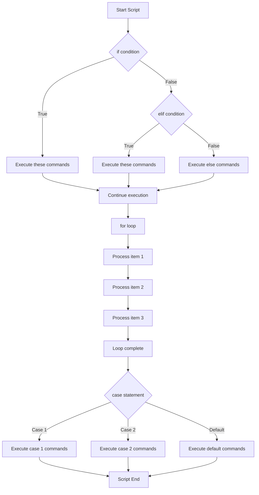

# Debian Control Structures

## Introduction

Control structures are fundamental building blocks in shell scripting that allow you to control the flow of execution in your scripts. In Debian systems, which typically use the Bash shell, these control structures help you make decisions, repeat actions, and handle different conditions - turning simple scripts into powerful automation tools.

In this guide, we'll explore the essential control structures available in Debian shell scripting:

- Conditional statements (`if`, `else`, `elif`)
- Loops (`for`, `while`, `until`)
- Case statements
- Logical operators and test conditions

Whether you're writing simple maintenance scripts or complex deployment tools, mastering these control structures will significantly enhance your ability to create effective shell scripts on Debian systems.

## Conditional Statements

### The `if` Statement

The `if` statement allows your script to make decisions based on whether a condition is true or false.

#### Basic Syntax

```bash
if [ condition ]; then
    # commands to execute if condition is true
fi
```

#### Example: Checking if a File Exists

```bash
#!/bin/bash

# Script to check if a configuration file exists
CONFIG_FILE="/etc/myapp/config.conf"

if [ -f "$CONFIG_FILE" ]; then
    echo "Configuration file exists."
fi
```

**Output (when file exists):**
```
Configuration file exists.
```

### `if-else` Statement

The `if-else` statement extends the basic `if` by providing an alternative action when the condition is false.

#### Syntax

```bash
if [ condition ]; then
    # commands to execute if condition is true
else
    # commands to execute if condition is false
fi
```

#### Example: Checking Package Installation

```bash
#!/bin/bash

# Check if Apache web server is installed
if dpkg -l | grep -q apache2; then
    echo "Apache is installed on this system."
else
    echo "Apache is not installed. Installing now..."
    apt-get update && apt-get install -y apache2
fi
```

### `if-elif-else` Statement

For multiple conditions, you can use the `elif` (else if) statement.

#### Syntax

```bash
if [ condition1 ]; then
    # commands for condition1
elif [ condition2 ]; then
    # commands for condition2
else
    # commands if no conditions are true
fi
```

#### Example: System Memory Check

```bash
#!/bin/bash

# Script to check system memory and provide recommendations
MEM_FREE=$(free -m | grep Mem | awk '{print $4}')

if [ "$MEM_FREE" -lt 100 ]; then
    echo "WARNING: System memory is critically low (Less than 100MB free)"
elif [ "$MEM_FREE" -lt 500 ]; then
    echo "NOTICE: System memory is running low (Less than 500MB free)"
else
    echo "INFO: System memory is sufficient ($MEM_FREE MB free)"
fi
```

**Possible Output:**
```
NOTICE: System memory is running low (Less than 500MB free)
```

## Test Conditions

The square brackets `[ ]` in conditionals are actually calls to the `test` command. Here are common test conditions used in Debian shell scripts:

### File Test Operators

| Operator | Description |
|----------|-------------|
| `-e file` | True if file exists |
| `-f file` | True if file is a regular file |
| `-d file` | True if file is a directory |
| `-r file` | True if file is readable |
| `-w file` | True if file is writable |
| `-x file` | True if file is executable |

### String Test Operators

| Operator | Description |
|----------|-------------|
| `-z string` | True if string is empty |
| `-n string` | True if string is not empty |
| `string1 = string2` | True if strings are equal |
| `string1 != string2` | True if strings are not equal |

### Numeric Comparison Operators

| Operator | Description |
|----------|-------------|
| `num1 -eq num2` | True if numbers are equal |
| `num1 -ne num2` | True if numbers are not equal |
| `num1 -gt num2` | True if num1 is greater than num2 |
| `num1 -ge num2` | True if num1 is greater than or equal to num2 |
| `num1 -lt num2` | True if num1 is less than num2 |
| `num1 -le num2` | True if num1 is less than or equal to num2 |

### Example: Using Various Test Conditions

```bash
#!/bin/bash

# Testing various conditions
FILE="/etc/passwd"
DIR="/var/log"
NUM1=10
NUM2=20
STRING1="Debian"
STRING2="Ubuntu"

# File tests
if [ -f "$FILE" ]; then
    echo "$FILE is a regular file"
fi

if [ -d "$DIR" ]; then
    echo "$DIR is a directory"
fi

# Numeric comparisons
if [ "$NUM1" -lt "$NUM2" ]; then
    echo "$NUM1 is less than $NUM2"
fi

# String comparisons
if [ "$STRING1" != "$STRING2" ]; then
    echo "$STRING1 is not equal to $STRING2"
fi
```

**Output:**
```
/etc/passwd is a regular file
/var/log is a directory
10 is less than 20
Debian is not equal to Ubuntu
```

## Logical Operators

Logical operators allow you to combine multiple conditions:

- `&&` (AND): True if both conditions are true
- `||` (OR): True if either condition is true
- `!` (NOT): Negates a condition

### Example: Using Logical Operators

```bash
#!/bin/bash

# Script to check system requirements
DISK_SPACE=$(df -h / | awk 'NR==2 {print $4}' | sed 's/G//')
RAM=$(free -m | grep Mem | awk '{print $2}')

# Check if both disk space and RAM meet requirements
if [ "${DISK_SPACE%.*}" -ge 5 ] && [ "$RAM" -ge 1024 ]; then
    echo "System meets minimum requirements"
else
    echo "System does not meet requirements"
    
    # Check individual requirements
    if [ "${DISK_SPACE%.*}" -lt 5 ]; then
        echo "- Insufficient disk space (less than 5GB)"
    fi
    
    if [ "$RAM" -lt 1024 ]; then
        echo "- Insufficient RAM (less than 1GB)"
    fi
fi
```

## Loops

Loops allow you to repeat a set of commands multiple times. Debian shell scripting supports several types of loops.

### `for` Loops

The `for` loop iterates over a list of items.

#### Basic Syntax

```bash
for item in [list]
do
    # commands to execute for each item
done
```

#### Example: Processing a List of Files

```bash
#!/bin/bash

# Back up configuration files
for config in /etc/apache2/sites-available/*.conf
do
    echo "Backing up $config"
    cp "$config" "/backup/$(basename "$config").bak"
done
```

**Output:**
```
Backing up /etc/apache2/sites-available/000-default.conf
Backing up /etc/apache2/sites-available/default-ssl.conf
```

#### Example: Numeric For Loop

```bash
#!/bin/bash

# Display a countdown
echo "Starting countdown:"
for i in {10..1}
do
    echo "$i..."
    sleep 1
done
echo "Blast off!"
```

**Output:**
```
Starting countdown:
10...
9...
8...
7...
6...
5...
4...
3...
2...
1...
Blast off!
```

### `while` Loops

The `while` loop continues executing as long as a specified condition is true.

#### Syntax

```bash
while [ condition ]
do
    # commands to execute
done
```

#### Example: Reading File Line by Line

```bash
#!/bin/bash

# Read and display each line of a file
echo "Contents of /etc/hosts:"
while read -r line
do
    echo "  $line"
done < /etc/hosts
```

**Output:**
```
Contents of /etc/hosts:
  127.0.0.1 localhost
  127.0.1.1 debian
  # The following lines are desirable for IPv6 capable hosts
  ::1     localhost ip6-localhost ip6-loopback
  ff02::1 ip6-allnodes
  ff02::2 ip6-allrouters
```

#### Example: Waiting for Service to Start

```bash
#!/bin/bash

# Wait for MySQL to start
MAX_ATTEMPTS=30
counter=0

echo "Waiting for MySQL to start..."
while ! systemctl is-active --quiet mysql; do
    counter=$((counter + 1))
    echo "Attempt $counter of $MAX_ATTEMPTS"
    
    if [ $counter -ge $MAX_ATTEMPTS ]; then
        echo "MySQL failed to start after $MAX_ATTEMPTS attempts"
        exit 1
    fi
    
    sleep 2
done

echo "MySQL is now running!"
```

### `until` Loops

The `until` loop continues until a condition becomes true (opposite of `while`).

#### Syntax

```bash
until [ condition ]
do
    # commands to execute
done
```

#### Example: Waiting for File to Exist

```bash
#!/bin/bash

# Wait until a lock file is removed
LOCK_FILE="/var/lock/myapp.lock"

echo "Waiting for lock to be released..."
until [ ! -f "$LOCK_FILE" ]
do
    echo "Lock file still exists, waiting..."
    sleep 5
done

echo "Lock has been released. Proceeding..."
```

### Loop Control: `break` and `continue`

- `break`: Exits the loop immediately
- `continue`: Skips to the next iteration

#### Example: Using break and continue

```bash
#!/bin/bash

# Process files but skip hidden files and break on errors
for file in /etc/apt/*
do
    # Skip hidden files
    if [[ $(basename "$file") == .* ]]; then
        echo "Skipping hidden file: $file"
        continue
    fi
    
    # Process the file
    echo "Processing $file"
    
    # Break the loop if a directory is encountered
    if [ -d "$file" ]; then
        echo "Directory found, stopping process"
        break
    fi
done
```

## Case Statements

The `case` statement provides a cleaner way to match multiple values against a single variable.

### Syntax

```bash
case $variable in
    pattern1)
        # commands for pattern1
        ;;
    pattern2)
        # commands for pattern2
        ;;
    *)
        # default commands
        ;;
esac
```

### Example: Service Management Script

```bash
#!/bin/bash

# Simple service control script
SERVICE="apache2"

case "$1" in
    start)
        echo "Starting $SERVICE service"
        systemctl start "$SERVICE"
        ;;
    stop)
        echo "Stopping $SERVICE service"
        systemctl stop "$SERVICE"
        ;;
    restart)
        echo "Restarting $SERVICE service"
        systemctl restart "$SERVICE"
        ;;
    status)
        echo "Checking $SERVICE status"
        systemctl status "$SERVICE"
        ;;
    *)
        echo "Usage: $0 {start|stop|restart|status}"
        exit 1
        ;;
esac
```

**Example Usage:**
```
$ ./service_control.sh start
Starting apache2 service
```

### Advanced Example: Backup Script with Options

```bash
#!/bin/bash

# Backup script with multiple options
BACKUP_DIR="/backup"
DATE=$(date +%Y-%m-%d)

case "$1" in
    full)
        echo "Performing full system backup"
        tar -czf "$BACKUP_DIR/full-backup-$DATE.tar.gz" /etc /home /var/www
        ;;
    config)
        echo "Backing up configuration files only"
        tar -czf "$BACKUP_DIR/config-backup-$DATE.tar.gz" /etc
        ;;
    web)
        echo "Backing up web content only"
        tar -czf "$BACKUP_DIR/web-backup-$DATE.tar.gz" /var/www
        ;;
    db)
        echo "Backing up databases"
        mysqldump --all-databases > "$BACKUP_DIR/databases-$DATE.sql"
        ;;
    *)
        echo "Usage: $0 {full|config|web|db}"
        echo "  full   - Full system backup"
        echo "  config - Configuration files only"
        echo "  web    - Web content only"
        echo "  db     - Database dump"
        exit 1
        ;;
esac

echo "Backup completed successfully"
```

## Advanced Control Flow with Subshells and Functions

### Subshells

You can use parentheses `( )` to execute commands in a subshell:

```bash
#!/bin/bash

# Main script continues even if subshell fails
echo "Starting main script"

# These commands run in a subshell
(
    cd /nonexistent-directory
    echo "This won't be printed because cd failed"
) || echo "Subshell failed but main script continues"

echo "Main script is still running"
```

### Functions with Control Structures

Functions can contain their own control structures and can be used to organize complex scripts:

```bash
#!/bin/bash

# Function to check and install packages
check_install_package() {
    local package_name="$1"
    
    if dpkg -l | grep -q "$package_name"; then
        echo "Package $package_name is already installed"
        return 0
    else
        echo "Installing package $package_name..."
        apt-get update && apt-get install -y "$package_name"
        
        if [ $? -eq 0 ]; then
            echo "Successfully installed $package_name"
            return 0
        else
            echo "Failed to install $package_name"
            return 1
        fi
    fi
}

# Function to set up a web server
setup_web_server() {
    # Install required packages
    for pkg in apache2 php libapache2-mod-php
    do
        check_install_package "$pkg" || return 1
    done
    
    # Configure Apache
    echo "Configuring Apache..."
    a2enmod rewrite
    
    # Restart service
    systemctl restart apache2
    
    echo "Web server setup complete"
    return 0
}

# Main script
echo "Setting up web server environment"
if setup_web_server; then
    echo "Setup completed successfully"
else
    echo "Setup failed"
    exit 1
fi
```

## Flow Control Visualization

Here's a visualization of how control structures direct the flow of execution in a shell script:



## Real-World Examples

### Example 1: System Maintenance Script

This script performs maintenance tasks on a Debian system based on the day of the week:

```bash
#!/bin/bash

# Debian system maintenance script
LOGFILE="/var/log/system_maintenance.log"
DAY=$(date +%u)  # 1-7, where 1 is Monday

log_message() {
    echo "$(date): $1" >> "$LOGFILE"
    echo "$1"
}

check_disk_space() {
    DISK_USAGE=$(df -h / | awk 'NR==2 {print $5}' | sed 's/%//')
    if [ "$DISK_USAGE" -gt 90 ]; then
        log_message "WARNING: Disk space critical ($DISK_USAGE%)"
        return 1
    fi
    log_message "Disk space OK ($DISK_USAGE%)"
    return 0
}

# Main script starts here
log_message "Starting system maintenance"

# Check disk space first
if ! check_disk_space; then
    log_message "Running emergency cleanup"
    apt-get clean
    find /var/log -type f -name "*.gz" -delete
fi

# Run different tasks based on the day of the week
case "$DAY" in
    1) # Monday - Update package lists
        log_message "Running Monday task: Updating package lists"
        apt-get update
        ;;
    3) # Wednesday - Run upgrades
        log_message "Running Wednesday task: System upgrade"
        apt-get update && apt-get upgrade -y
        ;;
    5) # Friday - Clean old packages
        log_message "Running Friday task: Cleaning old packages"
        apt-get autoremove -y
        apt-get autoclean
        ;;
    7) # Sunday - Full maintenance
        log_message "Running Sunday task: Full maintenance"
        apt-get update
        apt-get upgrade -y
        apt-get autoremove -y
        apt-get autoclean
        ;;
    *)
        log_message "No scheduled tasks for today"
        ;;
esac

# Final checks
if systemctl is-active --quiet apache2; then
    log_message "Apache is running normally"
else
    log_message "WARNING: Apache is not running, attempting to start"
    systemctl start apache2
fi

log_message "System maintenance completed"
```

### Example 2: Batch File Processing Script

This script processes multiple files in a directory, performing different operations based on file type:

```bash
#!/bin/bash

# Batch file processing script for /var/www/uploads
UPLOAD_DIR="/var/www/uploads"
PROCESSED_DIR="/var/www/processed"
FAILED_DIR="/var/www/failed"
LOG_FILE="/var/log/file_processor.log"

# Ensure directories exist
for dir in "$PROCESSED_DIR" "$FAILED_DIR"; do
    if [ ! -d "$dir" ]; then
        mkdir -p "$dir"
    fi
done

log_message() {
    local message="$1"
    echo "$(date '+%Y-%m-%d %H:%M:%S'): $message" >> "$LOG_FILE"
}

process_file() {
    local file="$1"
    local filename=$(basename "$file")
    local extension="${filename##*.}"
    
    log_message "Processing $filename"
    
    # Process based on file extension
    case "$extension" in
        jpg|jpeg|png|gif)
            # Process image files
            log_message "Image file detected, optimizing"
            
            if command -v optipng > /dev/null && [[ "$extension" == "png" ]]; then
                optipng "$file"
            elif command -v jpegoptim > /dev/null && [[ "$extension" == "jpg" || "$extension" == "jpeg" ]]; then
                jpegoptim "$file"
            fi
            
            mv "$file" "$PROCESSED_DIR/"
            return 0
            ;;
        csv)
            # Process CSV files
            log_message "CSV file detected, validating"
            
            # Check if file has at least one header and one data row
            if [ "$(wc -l < "$file")" -lt 2 ]; then
                log_message "ERROR: CSV file $filename is too short"
                mv "$file" "$FAILED_DIR/"
                return 1
            fi
            
            mv "$file" "$PROCESSED_DIR/"
            return 0
            ;;
        pdf)
            # Process PDF files 
            log_message "PDF file detected"
            mv "$file" "$PROCESSED_DIR/"
            return 0
            ;;
        *)
            # Unknown file type
            log_message "WARNING: Unsupported file type: $extension"
            mv "$file" "$FAILED_DIR/"
            return 1
            ;;
    esac
}

# Main execution
log_message "Starting batch file processing"

# Get initial file count
FILE_COUNT=$(find "$UPLOAD_DIR" -type f | wc -l)
log_message "Found $FILE_COUNT files to process"

# Process each file
PROCESSED=0
FAILED=0

for file in "$UPLOAD_DIR"/*; do
    # Skip if not a file
    if [ ! -f "$file" ]; then
        continue
    fi
    
    # Process the file
    if process_file "$file"; then
        PROCESSED=$((PROCESSED + 1))
    else
        FAILED=$((FAILED + 1))
    fi
done

log_message "Processing complete: $PROCESSED files processed, $FAILED files failed"

# Notify admin if any files failed
if [ "$FAILED" -gt 0 ]; then
    echo "Warning: $FAILED files failed processing. Check $LOG_FILE for details." | \
    mail -s "File Processing Alert" admin@example.com
fi
```

## Summary

Control structures are the backbone of shell scripting in Debian systems, allowing you to create dynamic and powerful scripts. We've covered:

1. **Conditional statements**:
   - `if`, `else`, and `elif` for decision making
   - Test conditions for files, strings, and numbers
   - Logical operators for combining conditions

2. **Loops**:
   - `for` loops for iterating through lists
   - `while` loops for condition-based iteration
   - `until` loops for waiting until conditions are met
   - Loop control with `break` and `continue`

3. **Case statements**:
   - Pattern matching for multiple conditions
   - Cleaner alternative to nested if-else statements

4. **Advanced concepts**:
   - Subshells for isolated execution
   - Functions for code organization
   - Real-world applications

By mastering these control structures, you can write shell scripts that handle complex logic, automate system administration tasks, and create robust solutions for your Debian systems.

## Additional Resources

### Practice Exercises

1. **Simple Backup Script**: Create a script that backs up your home directory only if it has changed since the last backup.

2. **Log Analysis**: Write a script that reads the Apache access log and counts hits by IP address.

3. **Service Monitor**: Create a script that checks if essential services are running and restarts them if needed.

4. **Disk Space Alert**: Write a script that monitors disk space and sends an alert when usage exceeds 80%.

### Further Reading

- The Debian Administrator's Handbook
- Advanced Bash Scripting Guide (available at tldp.org)
- Linux Shell Scripting Cookbook

Remember that shell scripting skills develop with practice. Start with small scripts and gradually incorporate more complex control structures as you gain confidence.