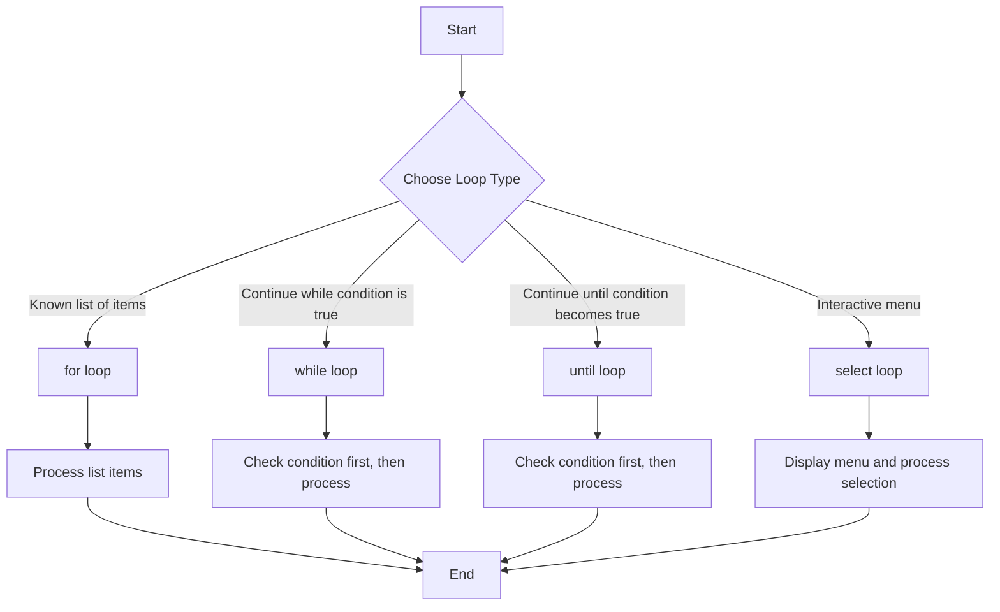

# Debian Loops

Loops are essential structures in shell scripting that allow you to execute a block of code repeatedly. In Debian (and other Linux distributions using Bash), loops are powerful tools for automating repetitive tasks, processing files, and creating robust scripts.

## Introduction to Loops

In shell scripting, loops provide a way to iterate through lists of items or execute commands multiple times based on specific conditions. Debian's Bash shell supports several types of loops:

- `for` loops
- `while` loops
- `until` loops
- `select` loops (for interactive menus)

Each loop type has specific use cases, but they all share the common purpose of reducing repetitive code and making scripts more efficient.

## The `for` Loop

The `for` loop is commonly used to iterate through a list of values. It's especially useful when processing multiple files, directories, or predefined sets of values.

### Basic Syntax

```bash
for variable in list
do
    # Commands to execute
done
```

### Example 1: Simple Iteration

```bash
#!/bin/bash

# Iterate through a list of fruits
for fruit in apple orange banana kiwi
do
    echo "I like $fruit"
done
```

**Output:**
```
I like apple
I like orange
I like banana
I like kiwi
```

### Example 2: Processing Files

```bash
#!/bin/bash

# Iterate through text files in the current directory
for file in *.txt
do
    echo "Processing file: $file"
    # Count lines in each file
    lines=$(wc -l < "$file")
    echo "  - Contains $lines lines"
done
```

**Output (assuming you have sample.txt, notes.txt, and data.txt):**
```
Processing file: data.txt
  - Contains 15 lines
Processing file: notes.txt
  - Contains 8 lines
Processing file: sample.txt
  - Contains 23 lines
```

### Example 3: Numerical Iteration

```bash
#!/bin/bash

# Count from 1 to 5
for (( i=1; i<=5; i++ ))
do
    echo "Number: $i"
done
```

**Output:**
```
Number: 1
Number: 2
Number: 3
Number: 4
Number: 5
```

## The `while` Loop

The `while` loop executes a block of code as long as a specified condition is true.

### Basic Syntax

```bash
while [ condition ]
do
    # Commands to execute
done
```

### Example 1: Counter with `while`

```bash
#!/bin/bash

# Initialize counter
counter=1

# Execute while counter is less than or equal to 5
while [ $counter -le 5 ]
do
    echo "Counter: $counter"
    # Increment counter
    ((counter++))
done
```

**Output:**
```
Counter: 1
Counter: 2
Counter: 3
Counter: 4
Counter: 5
```

### Example 2: Reading File Line by Line

```bash
#!/bin/bash

# File to read
file="/etc/passwd"

# Read file line by line
while IFS= read -r line
do
    # Print first 50 characters of each line
    echo "${line:0:50}..."
done < "$file"
```

**Output (first few lines):**
```
root:x:0:0:root:/root:/bin/bash...
daemon:x:1:1:daemon:/usr/sbin:/usr/sbin/nologin...
bin:x:2:2:bin:/bin:/usr/sbin/nologin...
```

### Example 3: User Input Processing

```bash
#!/bin/bash

echo "Enter names (type 'done' when finished):"

while true
do
    read name
    if [ "$name" = "done" ]; then
        break
    fi
    echo "Hello, $name!"
done

echo "All names processed."
```

**Sample Interaction:**
```
Enter names (type 'done' when finished):
John
Hello, John!
Alice
Hello, Alice!
Bob
Hello, Bob!
done
All names processed.
```

## The `until` Loop

The `until` loop is the opposite of the `while` loop. It executes until a specified condition becomes true.

### Basic Syntax

```bash
until [ condition ]
do
    # Commands to execute
done
```

### Example: Using `until` Loop

```bash
#!/bin/bash

# Initialize counter
counter=5

# Execute until counter reaches 0
until [ $counter -eq 0 ]
do
    echo "Countdown: $counter"
    # Decrement counter
    ((counter--))
done

echo "Blast off!"
```

**Output:**
```
Countdown: 5
Countdown: 4
Countdown: 3
Countdown: 2
Countdown: 1
Blast off!
```

## The `select` Loop

The `select` loop creates a numbered menu from which users can select items. It's useful for interactive scripts.

### Basic Syntax

```bash
select variable in list
do
    # Commands to execute based on selection
done
```

### Example: Simple Menu

```bash
#!/bin/bash

echo "Select your favorite programming language:"

select language in "Python" "Bash" "JavaScript" "Java" "C++" "Exit"
do
    case $language in
        "Python")
            echo "Python is great for automation and data science."
            ;;
        "Bash")
            echo "Bash is powerful for system administration."
            ;;
        "JavaScript")
            echo "JavaScript powers the web."
            ;;
        "Java")
            echo "Java is widely used in enterprise applications."
            ;;
        "C++")
            echo "C++ provides low-level control and high performance."
            ;;
        "Exit")
            echo "Goodbye!"
            break
            ;;
        *)
            echo "Invalid selection. Please try again."
            ;;
    esac
done
```

**Sample Interaction:**
```
Select your favorite programming language:
1) Python
2) Bash
3) JavaScript
4) Java
5) C++
6) Exit
#? 2
Bash is powerful for system administration.
#? 6
Goodbye!
```

## Loop Control

There are special commands to control the flow within loops:

- `break`: Exit the loop immediately
- `continue`: Skip the rest of the current iteration and move to the next
- `exit`: Terminate the script entirely

### Example: Using `break` and `continue`

```bash
#!/bin/bash

# Process numbers from 1 to 10
for (( i=1; i<=10; i++ ))
do
    # Skip even numbers
    if (( i % 2 == 0 )); then
        echo "Skipping even number: $i"
        continue
    fi
    
    # Stop if we reach 7
    if (( i == 7 )); then
        echo "Reached 7, breaking the loop"
        break
    fi
    
    echo "Processing odd number: $i"
done

echo "Loop completed"
```

**Output:**
```
Processing odd number: 1
Skipping even number: 2
Processing odd number: 3
Skipping even number: 4
Processing odd number: 5
Skipping even number: 6
Reached 7, breaking the loop
Loop completed
```

## Practical Applications

### Example 1: Batch File Processing

This script finds all JPEG files in the current directory and creates a backup copy:

```bash
#!/bin/bash

echo "Backing up JPEG files..."

# Count the number of files
count=0

# Process each JPEG file
for image in *.jpg
do
    # Skip if no JPG files exist
    if [ "$image" = "*.jpg" ]; then
        echo "No JPEG files found!"
        break
    fi
    
    # Create backup with timestamp
    timestamp=$(date +%Y%m%d_%H%M%S)
    backup_name="${image%.jpg}_${timestamp}.backup.jpg"
    
    # Copy the file
    cp "$image" "$backup_name"
    
    echo "Backed up: $image → $backup_name"
    ((count++))
done

echo "Backup complete! Processed $count files."
```

### Example 2: System Monitoring Script

This script checks system resources every 5 seconds:

```bash
#!/bin/bash

# How many times to check (10 checks)
checks=10
count=1

echo "Starting system monitoring..."
echo "TIMESTAMP | CPU % | MEM % | DISK % (/) "
echo "----------------------------------------"

while [ $count -le $checks ]
do
    # Get timestamp
    timestamp=$(date +"%H:%M:%S")
    
    # Get CPU usage (simplified)
    cpu_usage=$(top -bn1 | grep "Cpu(s)" | awk '{print $2 + $4}' | cut -d. -f1)
    
    # Get memory usage
    mem_usage=$(free | grep Mem | awk '{print int($3/$2 * 100)}')
    
    # Get disk usage for root filesystem
    disk_usage=$(df -h / | awk 'NR==2 {print $5}' | tr -d '%')
    
    # Print results
    echo "$timestamp | CPU: ${cpu_usage}% | MEM: ${mem_usage}% | DISK: ${disk_usage}%"
    
    # Increment counter
    ((count++))
    
    # Wait 5 seconds before next check
    sleep 5
done

echo "Monitoring complete!"
```

### Example 3: Data Processing Pipeline

This script demonstrates a simple data processing pipeline using loops:

```bash
#!/bin/bash

data_file="sample_data.txt"

# Create sample data if it doesn't exist
if [ ! -f "$data_file" ]; then
    echo "Creating sample data file..."
    echo "10,apples,2.5" > "$data_file"
    echo "5,oranges,3.0" >> "$data_file"
    echo "8,bananas,1.8" >> "$data_file"
    echo "12,grapes,4.0" >> "$data_file"
fi

echo "Processing data from $data_file"
echo "--------------------------"
echo "ITEM | QUANTITY | PRICE | TOTAL"
echo "--------------------------"

# Initialize grand total
grand_total=0

# Process each line in the data file
while IFS="," read -r quantity item price
do
    # Calculate total for this item
    total=$(echo "$quantity * $price" | bc)
    
    # Add to grand total
    grand_total=$(echo "$grand_total + $total" | bc)
    
    # Display formatted output
    printf "%-10s | %8d | $%4.2f | $%6.2f
" "$item" "$quantity" "$price" "$total"
    
done < "$data_file"

echo "--------------------------"
echo "GRAND TOTAL: $$(echo $grand_total) | bc)"
```

## Nested Loops

Loops can be nested within other loops for more complex iterations.

### Example: Multiplication Table

```bash
#!/bin/bash

echo "Multiplication Table (1-5):"
echo "-------------------------"

# Outer loop for rows
for (( i=1; i<=5; i++ ))
do
    # Inner loop for columns
    for (( j=1; j<=5; j++ ))
    do
        # Calculate product
        product=$((i * j))
        
        # Print with formatting
        printf "%3d " $product
    done
    
    # New line after each row
    echo ""
done

echo "-------------------------"
```

**Output:**
```
Multiplication Table (1-5):
-------------------------
  1   2   3   4   5 
  2   4   6   8  10 
  3   6   9  12  15 
  4   8  12  16  20 
  5  10  15  20  25 
-------------------------
```

## Loop Performance Considerations

When working with loops in shell scripts, keep these performance tips in mind:

1. **Minimize external commands** inside loops, especially for large iterations
2. **Use native Bash operations** when possible instead of external utilities
3. **Consider alternatives** like `xargs` for processing large datasets
4. **Use proper quoting** to handle filenames with spaces and special characters
5. **Initialize variables** outside loops when their value doesn't change

## Flow Diagram of Loop Types



## Summary

Loops are fundamental constructs in Debian shell scripting that allow for:

- Automating repetitive tasks
- Processing multiple files efficiently
- Creating interactive scripts
- Building data processing pipelines
- Implementing system administration tools

By mastering the different types of loops (`for`, `while`, `until`, and `select`) and understanding how to control their execution with commands like `break` and `continue`, you can create powerful and efficient shell scripts for various tasks on Debian systems.

## Additional Resources

- Practice by writing scripts that process log files
- Try creating a backup script that uses loops to process directories
- Experiment with creating a system monitoring dashboard
- Challenge yourself to rewrite existing scripts to use loops for better efficiency

## Exercises

1. Write a script that counts the number of files of each type (by extension) in a directory
2. Create a script that pings a list of servers and reports which ones are online
3. Write a script that monitors disk space and sends an alert if usage exceeds 80%
4. Create a menu-driven script for common system administration tasks
5. Write a script that analyzes a log file and reports the frequency of different error types