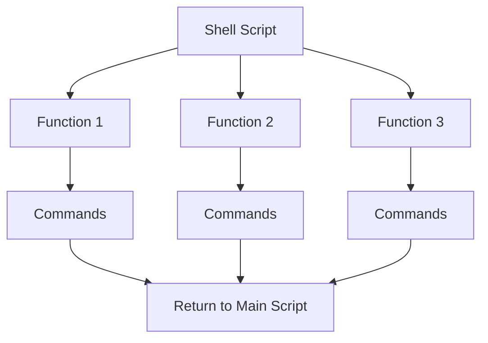

# Debian Functions

## Introduction

Functions are essential building blocks in shell scripting that allow you to organize your code into reusable, modular components. In Debian-based systems, functions work within the Bash shell (the default shell) to help you avoid redundancy, improve readability, and make maintenance easier. Think of functions as mini-scripts within your main script that you can call whenever needed.

This guide will walk you through creating and using functions in Debian shell scripts, from basic syntax to advanced techniques that will help streamline your scripting workflow.

## What Are Shell Functions?

A shell function is a group of commands that together perform a specific task. Once defined, you can "call" or execute this group of commands by referring to the function name, rather than rewriting the same commands multiple times.



## Basic Function Syntax

In Debian shell scripting, there are two common ways to define a function:

### Method 1: Using the `function` keyword

```bash
function function_name {
    # Commands go here
    echo "This is a function"
}
```

### Method 2: Using just the function name (POSIX-compliant)

```bash
function_name() {
    # Commands go here
    echo "This is a function"
}
```

Both methods work in Debian's default Bash shell, but the second method is more portable across different Unix-like systems. To call your function, simply use its name:

```bash
function_name
```

Let's see a complete basic example:

```bash
#!/bin/bash

# Define a simple greeting function
say_hello() {
    echo "Hello, Debian shell scripting learner!"
}

# Call the function
say_hello
```

**Output:**
```
Hello, Debian shell scripting learner!
```

## Function Parameters

Functions become more powerful when they can accept parameters. In shell functions, parameters are accessed using positional parameters: `$1`, `$2`, `$3`, etc.

```bash
#!/bin/bash

# Function that greets a user by name
greet_user() {
    echo "Hello, $1! Welcome to Debian shell scripting."
}

# Call the function with a parameter
greet_user "Alex"
greet_user "Taylor"
```

**Output:**
```
Hello, Alex! Welcome to Debian shell scripting.
Hello, Taylor! Welcome to Debian shell scripting.
```

### Accessing All Parameters

You can access all parameters using `$@` or `$*`, and count them using `$#`:

```bash
#!/bin/bash

show_all_params() {
    echo "Function received $# parameters"
    echo "Parameters: $@"
    
    # Loop through each parameter
    for param in "$@"; do
        echo "- $param"
    done
}

# Call with multiple parameters
show_all_params apple orange banana
```

**Output:**
```
Function received 3 parameters
Parameters: apple orange banana
- apple
- orange
- banana
```

## Return Values

Unlike in some programming languages, Debian shell functions don't "return" values in the traditional sense. Instead, they:

1. Return an exit status (0-255) which indicates success or failure
2. Output text that can be captured by the caller
3. Set global variables that can be used after the function executes

### 1. Using Exit Status

```bash
#!/bin/bash

check_number() {
    if [[ $1 -gt 10 ]]; then
        return 0  # Success (true in Bash)
    else
        return 1  # Failure (false in Bash)
    fi
}

# Test the function
check_number 15
if [ $? -eq 0 ]; then
    echo "Number is greater than 10"
else
    echo "Number is not greater than 10"
fi

check_number 5
if [ $? -eq 0 ]; then
    echo "Number is greater than 10"
else
    echo "Number is not greater than 10"
fi
```

**Output:**
```
Number is greater than 10
Number is not greater than 10
```

### 2. Capturing Function Output

```bash
#!/bin/bash

get_date_formatted() {
    date +"%Y-%m-%d"
}

# Capture the output
today=$(get_date_formatted)
echo "Today's date is: $today"
```

**Output:**
```
Today's date is: 2023-09-05
```

### 3. Using Global Variables

```bash
#!/bin/bash

calculate_area() {
    local length=$1
    local width=$2
    
    # Set a global variable with the result
    area=$((length * width))
}

# Call the function
calculate_area 5 10
echo "The area is: $area square units"
```

**Output:**
```
The area is: 50 square units
```

## Local Variables in Functions

By default, variables in Bash are global. However, you can create local variables inside functions using the `local` keyword. These variables exist only within the function.

```bash
#!/bin/bash

demo_local_variables() {
    local local_var="I'm local"
    global_var="I'm global"
    
    echo "Inside function: local_var = $local_var"
    echo "Inside function: global_var = $global_var"
}

# Call the function
demo_local_variables

# Try to access the variables
echo "Outside function: global_var = $global_var"
echo "Outside function: local_var = $local_var"
```

**Output:**
```
Inside function: local_var = I'm local
Inside function: global_var = I'm global
Outside function: global_var = I'm global
Outside function: local_var = 
```

Notice that `local_var` doesn't retain its value outside the function!

## Practical Examples

Let's look at some real-world examples of how functions can be used in Debian shell scripts.

### Example 1: System Information Script

```bash
#!/bin/bash

# Function to display header
print_header() {
    echo "====================================="
    echo "  $1"
    echo "====================================="
}

# Function to get system information
get_system_info() {
    print_header "SYSTEM INFORMATION"
    echo "Hostname: $(hostname)"
    echo "Kernel: $(uname -r)"
    echo "Uptime: $(uptime -p)"
    echo
}

# Function to get memory information
get_memory_info() {
    print_header "MEMORY INFORMATION"
    free -h | grep -v +
    echo
}

# Function to get disk information
get_disk_info() {
    print_header "DISK USAGE"
    df -h | grep -v tmp
    echo
}

# Main script
get_system_info
get_memory_info
get_disk_info
print_header "REPORT COMPLETE"
```

This script creates a formatted system report by calling different functions to gather and display various types of information.

### Example 2: File Backup Script

```bash
#!/bin/bash

# Configuration
BACKUP_DIR="/var/backups/scripts"

# Function to check if directory exists
check_directory() {
    if [ ! -d "$1" ]; then
        echo "Error: Directory $1 does not exist."
        return 1
    fi
    return 0
}

# Function to create timestamp
get_timestamp() {
    date +"%Y%m%d_%H%M%S"
}

# Function to create backup
create_backup() {
    local source_dir="$1"
    local dir_name=$(basename "$source_dir")
    local timestamp=$(get_timestamp)
    local backup_file="${BACKUP_DIR}/${dir_name}_${timestamp}.tar.gz"
    
    # Create backup directory if it doesn't exist
    if [ ! -d "$BACKUP_DIR" ]; then
        mkdir -p "$BACKUP_DIR"
    fi
    
    echo "Creating backup of $source_dir..."
    tar -czf "$backup_file" -C "$(dirname "$source_dir")" "$dir_name"
    
    if [ $? -eq 0 ]; then
        echo "Backup created successfully: $backup_file"
        return 0
    else
        echo "Backup failed!"
        return 1
    fi
}

# Function to backup a directory
backup_directory() {
    local dir_to_backup="$1"
    
    # Check if directory exists
    check_directory "$dir_to_backup"
    if [ $? -eq 0 ]; then
        create_backup "$dir_to_backup"
    fi
}

# Main script
if [ $# -eq 0 ]; then
    echo "Usage: $0 <directory_to_backup>"
    exit 1
fi

backup_directory "$1"
```

This script demonstrates how to use functions to create modular, reusable components for a backup utility.

## Advanced Function Techniques

### Recursive Functions

Functions can call themselves - this is called recursion. Here's an example that calculates factorial:

```bash
#!/bin/bash

factorial() {
    if [ $1 -le 1 ]; then
        echo 1
    else
        local prev=$(factorial $(( $1 - 1 )))
        echo $(( $1 * prev ))
    fi
}

echo "Factorial of 5: $(factorial 5)"
```

**Output:**
```
Factorial of 5: 120
```

### Function Libraries

You can create libraries of functions in separate files and source them in your scripts:

**lib_math.sh**:
```bash
#!/bin/bash

# Math functions

# Calculate the sum of two numbers
add() {
    echo $(( $1 + $2 ))
}

# Calculate the product of two numbers
multiply() {
    echo $(( $1 * $2 ))
}

# Check if a number is even
is_even() {
    if (( $1 % 2 == 0 )); then
        return 0  # True
    else
        return 1  # False
    fi
}
```

**calc.sh**:
```bash
#!/bin/bash

# Source the library
source ./lib_math.sh

# Use functions from the library
sum=$(add 5 3)
product=$(multiply 4 7)

echo "5 + 3 = $sum"
echo "4 × 7 = $product"

# Check if a number is even
num=12
is_even $num
if [ $? -eq 0 ]; then
    echo "$num is even."
else
    echo "$num is odd."
fi
```

**Output:**
```
5 + 3 = 8
4 × 7 = 28
12 is even.
```

## Best Practices for Shell Functions

1. **Use Descriptive Names**: Choose function names that clearly describe what the function does.

2. **Add Comments**: Document what your function does, its parameters, and its return values.

3. **Make Functions Modular**: Each function should do one thing and do it well.

4. **Use Local Variables**: Use the `local` keyword for variables that should only exist within the function.

5. **Check Parameters**: Validate function inputs at the beginning of the function.

6. **Return Meaningful Exit Codes**: 0 for success, non-zero for failure.

7. **Handle Errors**: Properly handle error cases and provide meaningful error messages.

```bash
#!/bin/bash

# A function that follows best practices
#
# Purpose: Divides two numbers and returns the result
# Parameters:
#   $1 - Dividend (numerator)
#   $2 - Divisor (denominator)
# Returns:
#   Outputs the result of division
#   Exit code 0 on success, 1 if divisor is zero, 2 if parameters are missing
divide_numbers() {
    # Check if both parameters are provided
    if [ $# -ne 2 ]; then
        echo "Error: Two numbers are required." >&2
        return 2
    fi
    
    local dividend=$1
    local divisor=$2
    
    # Check for division by zero
    if [ $divisor -eq 0 ]; then
        echo "Error: Cannot divide by zero." >&2
        return 1
    fi
    
    # Perform the division and output the result
    echo $(( dividend / divisor ))
    return 0
}

# Example usage
result=$(divide_numbers 10 2)
status=$?

if [ $status -eq 0 ]; then
    echo "10 ÷ 2 = $result"
else
    echo "Division failed."
fi

# Example with error
divide_numbers 10 0
```

## Summary

Functions are a powerful feature in Debian shell scripting that allow you to:

- Organize your code into reusable blocks
- Avoid repetition and improve maintainability
- Create modular components that can be composed together
- Handle complex tasks by breaking them down into simpler operations

By mastering functions, you'll write cleaner, more efficient shell scripts that are easier to debug and maintain. Functions transform simple script files into powerful, reusable tools that can automate complex workflows on your Debian system.

## Exercises

1. **Basic Function**: Write a function called `is_file_executable` that checks if a file exists and is executable.

2. **Parameter Handling**: Create a function called `calculate_average` that calculates the average of all numbers passed to it.

3. **Function Library**: Create a utility library with functions for common file operations: creating directories, deleting files safely, and checking file types.

4. **Advanced Function**: Write a recursive function that lists all files in a directory and its subdirectories.

5. **Real-World Script**: Create a backup script that uses functions to backup different types of files (configurations, documents, images) to different locations.

## Additional Resources

- The Bash manual: Run `man bash` on your Debian system and search for the "FUNCTIONS" section
- Advanced Bash-Scripting Guide (available in the `abs-guide` package on Debian)
- The Bash Hackers Wiki: [Bash Functions](http://wiki.bash-hackers.org/syntax/functions)
- GNU Bash Reference Manual: [Shell Functions](https://www.gnu.org/software/bash/manual/html_node/Shell-Functions.html)