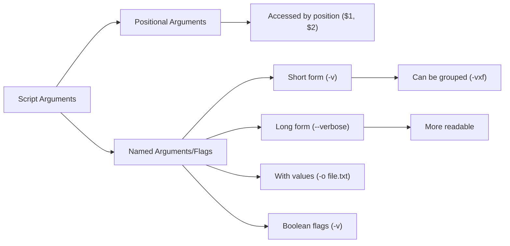

# Debian Script Arguments

## Introduction

When writing shell scripts in Debian (or any Linux distribution), one of the most powerful features is the ability to accept and process command-line arguments. Arguments allow users to provide input to a script when they execute it, making scripts more flexible and reusable. Rather than hardcoding values inside your script, you can create dynamic scripts that behave differently based on the arguments provided.

In this tutorial, we'll explore how to work with script arguments in Debian shell scripts, from basic usage to more advanced techniques.

## Basic Script Arguments

In Bash (the default shell in Debian), command-line arguments passed to a script can be accessed using special variables:

- `$0` - The name of the script itself
- `$1` - The first argument
- `$2` - The second argument
- And so on...
- `$#` - The number of arguments
- `$@` - All arguments as separate strings
- `$*` - All arguments as a single string

Let's create a simple script to demonstrate these concepts:

```bash
#!/bin/bash

echo "Script name: $0"
echo "First argument: $1"
echo "Second argument: $2"
echo "Number of arguments: $#"
echo "All arguments: $@"
```

Save this script as `args_demo.sh` and make it executable:

```bash
chmod +x args_demo.sh
```

Now run it with some arguments:

```bash
./args_demo.sh hello world
```

Output:
```
Script name: ./args_demo.sh
First argument: hello
Second argument: world
Number of arguments: 2
All arguments: hello world
```

## Checking for Required Arguments

A common use case is to check if your script received the expected number of arguments:

```bash
#!/bin/bash

# Check if at least one argument was provided
if [ $# -lt 1 ]; then
  echo "Error: Missing arguments"
  echo "Usage: $0 <filename>"
  exit 1
fi

echo "You provided the filename: $1"
```

Save this as `check_args.sh`, make it executable, and try running it with and without arguments:

With no arguments:
```bash
./check_args.sh
```

Output:
```
Error: Missing arguments
Usage: ./check_args.sh <filename>
```

With an argument:
```bash
./check_args.sh myfile.txt
```

Output:
```
You provided the filename: myfile.txt
```

## Looping Through Arguments

The `$@` variable allows you to iterate through all arguments:

```bash
#!/bin/bash

echo "Processing all arguments:"

for arg in "$@"; do
  echo "- Processing: $arg"
done
```

Save this as `process_args.sh` and run it with multiple arguments:

```bash
./process_args.sh file1.txt file2.txt file3.txt
```

Output:
```
Processing all arguments:
- Processing: file1.txt
- Processing: file2.txt
- Processing: file3.txt
```

## Shift Command

The `shift` command is useful for processing arguments one by one, removing them from the front of the argument list:

```bash
#!/bin/bash

echo "Total arguments: $#"

while [ $# -gt 0 ]; do
  echo "Processing: $1"
  shift
  echo "Remaining arguments: $#"
  echo "---"
done
```

Save this as `shift_demo.sh` and run it:

```bash
./shift_demo.sh a b c
```

Output:
```
Total arguments: 3
Processing: a
Remaining arguments: 2
---
Processing: b
Remaining arguments: 1
---
Processing: c
Remaining arguments: 0
---
```

## Default Values for Arguments

You can provide default values for arguments that might not be supplied:

```bash
#!/bin/bash

# Default values
OUTPUT_DIR=${1:-"./output"}
VERBOSE=${2:-"no"}

echo "Output directory: $OUTPUT_DIR"
echo "Verbose mode: $VERBOSE"
```

Save this as `default_args.sh` and try:

```bash
./default_args.sh
```

Output:
```
Output directory: ./output
Verbose mode: no
```

With arguments:
```bash
./default_args.sh /tmp yes
```

Output:
```
Output directory: /tmp
Verbose mode: yes
```

## Named Arguments with Flags

For more complex scripts, you might want to use flags (like `-f` or `--file`) instead of positional arguments:

```bash
#!/bin/bash

# Initialize variables with default values
VERBOSE=false
OUTPUT=""
COUNT=1

# Parse command line arguments
while [ $# -gt 0 ]; do
  case "$1" in
    -v|--verbose)
      VERBOSE=true
      shift
      ;;
    -o|--output)
      OUTPUT="$2"
      shift 2
      ;;
    -c|--count)
      COUNT="$2"
      shift 2
      ;;
    -h|--help)
      echo "Usage: $0 [-v|--verbose] [-o|--output FILENAME] [-c|--count NUMBER] [-h|--help]"
      exit 0
      ;;
    *)
      echo "Unknown option: $1"
      echo "Use --help for help"
      exit 1
      ;;
  esac
done

# Display the values
echo "Verbose mode: $VERBOSE"
echo "Output file: $OUTPUT"
echo "Count: $COUNT"
```

Save this as `named_args.sh` and try running it with different combinations:

```bash
./named_args.sh --verbose -o output.txt --count 5
```

Output:
```
Verbose mode: true
Output file: output.txt
Count: 5
```

## Using getopts for Option Parsing

Bash provides a built-in function called `getopts` that makes parsing short options easier:

```bash
#!/bin/bash

# Initialize variables
VERBOSE=false
OUTPUT=""
COUNT=1

# Parse options using getopts
while getopts "vo:c:h" opt; do
  case $opt in
    v)
      VERBOSE=true
      ;;
    o)
      OUTPUT=$OPTARG
      ;;
    c)
      COUNT=$OPTARG
      ;;
    h)
      echo "Usage: $0 [-v] [-o output_file] [-c count] [-h]"
      echo "  -v: Enable verbose mode"
      echo "  -o: Specify output file"
      echo "  -c: Set count value"
      echo "  -h: Show this help"
      exit 0
      ;;
    \?)
      echo "Invalid option: -$OPTARG" >&2
      exit 1
      ;;
    :)
      echo "Option -$OPTARG requires an argument." >&2
      exit 1
      ;;
  esac
done

# Display the values
echo "Verbose mode: $VERBOSE"
echo "Output file: $OUTPUT"
echo "Count: $COUNT"
```

Save this as `getopts_demo.sh` and try:

```bash
./getopts_demo.sh -v -o output.txt -c 10
```

Output:
```
Verbose mode: true
Output file: output.txt
Count: 10
```

## Real-World Example: Batch File Processor

Let's create a more practical example that processes files based on arguments:

```bash
#!/bin/bash

# Default values
EXTENSION="txt"
OUTPUT_DIR="./processed"
VERBOSE=false

# Function to display usage
usage() {
  echo "Usage: $0 [OPTIONS] <directory>"
  echo "Process files in a directory"
  echo
  echo "Options:"
  echo "  -e, --extension EXT    Process only files with extension EXT (default: txt)"
  echo "  -o, --output DIR       Output directory (default: ./processed)"
  echo "  -v, --verbose          Enable verbose output"
  echo "  -h, --help             Display this help message"
  exit 1
}

# Parse command line arguments
while [ $# -gt 0 ]; do
  case "$1" in
    -e|--extension)
      EXTENSION="$2"
      shift 2
      ;;
    -o|--output)
      OUTPUT_DIR="$2"
      shift 2
      ;;
    -v|--verbose)
      VERBOSE=true
      shift
      ;;
    -h|--help)
      usage
      ;;
    -*)
      echo "Unknown option: $1"
      usage
      ;;
    *)
      # First non-option argument is the directory
      if [ -z "$DIRECTORY" ]; then
        DIRECTORY="$1"
      else
        echo "Too many arguments"
        usage
      fi
      shift
      ;;
  esac
done

# Check if directory was provided
if [ -z "$DIRECTORY" ]; then
  echo "Error: No directory specified"
  usage
fi

# Check if the directory exists
if [ ! -d "$DIRECTORY" ]; then
  echo "Error: Directory '$DIRECTORY' does not exist"
  exit 1
fi

# Create output directory if it doesn't exist
mkdir -p "$OUTPUT_DIR"

# Process files
FILE_COUNT=0
for file in "$DIRECTORY"/*."$EXTENSION"; do
  if [ -f "$file" ]; then
    filename=$(basename "$file")
    if $VERBOSE; then
      echo "Processing file: $filename"
    fi
    
    # Example processing: count lines and create a report
    line_count=$(wc -l < "$file")
    echo "File: $filename, Lines: $line_count" >> "$OUTPUT_DIR/report.txt"
    
    # Copy the file to the output directory
    cp "$file" "$OUTPUT_DIR/"
    
    FILE_COUNT=$((FILE_COUNT + 1))
  fi
done

echo "Processed $FILE_COUNT files with extension .$EXTENSION"
echo "Results saved to $OUTPUT_DIR/report.txt"
```

Save this as `process_files.sh` and try it on a directory with some text files:

```bash
./process_files.sh -v -e txt -o /tmp/output ~/documents
```

## Understanding Argument Types

When dealing with script arguments, it's helpful to understand the different types:



## Summary

In this tutorial, we've covered:

1. Basic script arguments using `$1`, `$2`, etc.
2. Checking for required arguments using `$#`
3. Looping through arguments with `$@`
4. The `shift` command for argument processing
5. Setting default values for arguments
6. Named arguments with flags (both short and long forms)
7. Using `getopts` for option parsing
8. A real-world example for processing files based on arguments

Command-line arguments make your scripts more versatile and user-friendly. By mastering these techniques, you can create powerful scripts that adapt to different scenarios without needing to modify the script itself.

## Exercises

To solidify your understanding, try these exercises:

1. Create a script that accepts a filename and a number, then displays that specific line number from the file.
2. Modify the batch file processor to include an option for backing up files before processing.
3. Write a script that accepts multiple file names and concatenates them into a single output file.
4. Create a script with both required positional arguments and optional flags.
5. Build a simple deployment script that uses arguments to determine which environment to deploy to.

## Additional Resources

- The Bash man page: `man bash`
- Advanced Bash-Scripting Guide, particularly the chapter on Command-Line Parameters
- The `getopt` command for more advanced option parsing (different from `getopts`)
- Debian's Shell Scripting Guide documentation