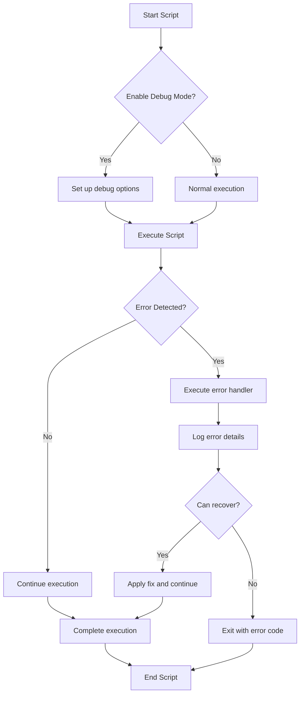

# Debian Script Debugging

## Introduction

Script debugging is an essential skill for any shell script developer. When writing scripts for Debian systems, having a structured approach to finding and fixing errors can save hours of frustration and help you build more robust scripts. This guide will walk you through the common debugging techniques, tools, and best practices specifically for Debian-based systems.

Debugging is not just about fixing errors—it's about understanding how your script executes, identifying unexpected behaviors, and implementing solutions that make your code more reliable. Whether you're dealing with syntax errors, logic issues, or complex runtime problems, the techniques covered here will give you a solid foundation.

## Basic Debugging Techniques

### Using the -x Option (Tracing)

The simplest way to debug a shell script is by enabling the trace mode with the `-x` option:

```bash
bash -x ./myscript.sh
```

Alternatively, you can include it in the shebang line:

```bash
#!/bin/bash -x
```

Or enable it for specific sections:

```bash
#!/bin/bash

# Regular code here
echo "Starting script"

# Enable debugging
set -x
# Problematic code here
for i in {1..5}; do
  result=$((i * 2))
  echo "Processing item $i: $result"
done
# Disable debugging
set +x

echo "Script completed"
```

**Output:**

```
Starting script
+ for i in {1..5}
+ ((i * 2))
+ result=2
+ echo 'Processing item 1: 2'
Processing item 1: 2
+ for i in {1..5}
+ ((i * 2))
+ result=4
+ echo 'Processing item 2: 4'
Processing item 2: 4
+ for i in {1..5}
+ ((i * 2))
+ result=6
+ echo 'Processing item 3: 6'
Processing item 3: 6
+ for i in {1..5}
+ ((i * 2))
+ result=8
+ echo 'Processing item 4: 8'
Processing item 4: 8
+ for i in {1..5}
+ ((i * 2))
+ result=10
+ echo 'Processing item 5: 10'
Processing item 5: 10
+ set +x
Script completed
```

The `+` sign at the beginning of each line shows the exact commands being executed.

### Adding the -v Option (Verbose)

For more detailed output, combine `-x` with `-v`:

```bash
bash -xv ./myscript.sh
```

This displays both the script lines and their values after expansion.

### Custom Debug Statements

Create a debug function to add custom debug statements:

```bash
#!/bin/bash

DEBUG=true

debug() {
  if [ "$DEBUG" = true ]; then
    echo "DEBUG: $*" >&2
  fi
}

# Usage
debug "Starting script with parameters: $@"
count=5
debug "Initial count value: $count"

# More code...
```

You can toggle debugging by changing the `DEBUG` variable to `false`.

## Advanced Debugging Techniques

### Error Trapping

Trap unexpected errors to better understand where and why your script fails:

```bash
#!/bin/bash

set -e  # Exit on error

# Define error handling function
error_handler() {
  local line=$1
  local command=$2
  local code=$3
  echo "Error on line $line, command '$command' exited with code $code" >&2
}

# Set up the trap
trap 'error_handler ${LINENO} "$BASH_COMMAND" $?' ERR

# Your script goes here
echo "Starting operations"
# This will trigger the error handler
cat nonexistent_file.txt
echo "This won't be executed"
```

**Output:**
```
Starting operations
cat: nonexistent_file.txt: No such file or directory
Error on line 16, command 'cat nonexistent_file.txt' exited with code 1
```

### Using Shell Options for Safer Scripts

Debian scripts can benefit from these shell options:

```bash
#!/bin/bash

# Exit immediately if a command exits with non-zero status
set -e

# Treat unset variables as an error
set -u

# Exit if any command in a pipeline fails
set -o pipefail

# Your script logic here
```

These options help catch errors early and avoid unexpected behavior.

### Debugging Variable Expansion

For complex variable expansions, use `printf` to inspect the values:

```bash
#!/bin/bash

path="/home/user/documents/report.txt"
filename="${path##*/}"
directory="${path%/*}"

printf "Path: %s
Filename: %s
Directory: %s
" "$path" "$filename" "$directory"
```

**Output:**
```
Path: /home/user/documents/report.txt
Filename: report.txt
Directory: /home/user/documents
```

## Debian-Specific Debugging Tools

### Using `shellcheck`

Debian provides the `shellcheck` tool which analyzes shell scripts for common mistakes:

```bash
# Install shellcheck
sudo apt-get install shellcheck

# Check a script
shellcheck myscript.sh
```

**Example output:**
```
In myscript.sh line 15:
if [ $count -eq 0 ]
     ^----^ SC2086: Double quote to prevent globbing and word splitting.

Did you mean:
if [ "$count" -eq 0 ]
```

### Utilizing `bash_unit`

For more formal testing, Debian's `bash_unit` can help:

```bash
# Install bash_unit
sudo apt-get install bash-unit

# Create a test file for your script
cat > test_myscript.sh << 'EOF'
#!/usr/bin/env bash

source $(dirname $0)/myscript.sh

test_function_should_return_expected_value() {
  assert_equals "expected" "$(my_function)"
}

test_error_handling() {
  assert_status_code 1 my_function_with_invalid_input
}
EOF

# Run tests
bash_unit test_myscript.sh
```

### Using Process Substitution for Debugging

Process substitution can help debug scripts that process files:

```bash
#!/bin/bash

process_file() {
  while read -r line; do
    echo "Processing: $line"
    # Process the line...
  done < "$1"
}

# Debug by viewing the input being processed
process_file <(cat input.txt | tee /dev/stderr)
```

## Real-World Debugging Examples

### Example 1: Debugging a File Processing Script

Let's debug a script that processes system logs but fails unexpectedly:

```bash
#!/bin/bash

# Original problematic script
log_analyzer() {
  local logfile=$1
  local pattern=$2
  
  if [ ! -f $logfile ]; then
    echo "Error: Log file not found"
    return 1
  fi
  
  count=$(grep -c $pattern $logfile)
  echo "Found $count occurrences of '$pattern'"
}

log_analyzer /var/log/syslog "error"
```

**Debugging approach:**

```bash
#!/bin/bash

# Set debugging options
set -e
set -u
DEBUG=true

debug() {
  if [ "$DEBUG" = true ]; then
    echo "DEBUG: $*" >&2
  fi
}

log_analyzer() {
  local logfile=$1
  local pattern=$2
  
  debug "Analyzing logfile: $logfile for pattern: '$pattern'"
  
  if [ ! -f "$logfile" ]; then
    debug "File check failed: $logfile does not exist"
    echo "Error: Log file not found"
    return 1
  fi
  
  debug "File exists, proceeding with grep"
  count=$(grep -c "$pattern" "$logfile" || echo 0)
  debug "Grep command returned count: $count"
  
  echo "Found $count occurrences of '$pattern'"
}

debug "Starting script execution"
log_analyzer "/var/log/syslog" "error"
debug "Script completed"
```

This improved version:
1. Properly quotes variables to handle spaces
2. Adds debugging output to track execution
3. Handles grep returning non-zero when no matches are found

### Example 2: Debugging a System Configuration Script

This example shows how to debug a script that configures system settings:

```bash
#!/bin/bash

# Enable strict mode
set -euo pipefail

# Debug logging
exec 5> /tmp/debug_config.log
BASH_XTRACEFD=5
set -x

configure_network() {
  echo "Configuring network settings..."
  
  # Get interface name
  interface=$(ip route | grep default | awk '{print $5}')
  
  if [ -z "$interface" ]; then
    echo "Error: Could not determine default interface" >&2
    return 1
  fi
  
  # Back up current config
  cp "/etc/network/interfaces" "/etc/network/interfaces.bak.$(date +%s)"
  
  # Apply new configuration
  cat > "/etc/network/interfaces.new" << EOF
auto lo
iface lo inet loopback

auto $interface
iface $interface inet dhcp
EOF

  # Test config before applying
  if grep -q "^auto $interface" "/etc/network/interfaces.new"; then
    mv "/etc/network/interfaces.new" "/etc/network/interfaces"
    echo "Network configuration updated successfully"
  else
    echo "Error: Generated config validation failed" >&2
    rm "/etc/network/interfaces.new"
    return 1
  fi
}

restart_network() {
  echo "Restarting network service..."
  systemctl restart networking || {
    echo "Network restart failed, rolling back configuration" >&2
    cp "/etc/network/interfaces.bak."* "/etc/network/interfaces"
    systemctl restart networking
    return 1
  }
  echo "Network service restarted successfully"
}

echo "Starting network configuration"
configure_network
restart_network
echo "Configuration complete"

# Disable tracing
set +x
```

This script:
1. Redirects trace output to a dedicated log file
2. Uses error handling to recover from failures
3. Validates changes before applying them
4. Creates backups before making system changes

## Using `strace` for Advanced Debugging

For particularly difficult bugs, `strace` can show system calls:

```bash
sudo apt-get install strace
strace -f -o strace.log bash myscript.sh
```

Examining the output can reveal issues with file permissions, missing resources, or unexpected system behavior.

## Visualizing Script Flow



## Summary

Effective debugging of Debian shell scripts involves a combination of:

1. **Basic techniques**: Using `-x` and `-v` options, adding debug statements
2. **Error handling**: Setting up traps, using strict mode options
3. **Debian-specific tools**: Leveraging `shellcheck`, `bash_unit`, and system utilities
4. **Structured approach**: Systematically isolating issues through targeted debugging
5. **Defensive programming**: Writing scripts that anticipate and handle potential issues

By incorporating these techniques into your development workflow, you'll write more robust scripts and resolve issues more efficiently when they arise.

## Exercises

1. Take a simple script with a deliberate error and debug it using the `-x` option
2. Modify an existing script to include custom debug functions
3. Install and run `shellcheck` on one of your scripts and fix any issues it identifies
4. Create a test case using `bash_unit` for a function in your script
5. Add error trapping to one of your scripts to make it more robust

## Additional Resources

- The Bash Reference Manual: Available via `man bash` on Debian systems
- [The Advanced Bash Scripting Guide](https://tldp.org/LDP/abs/html/)
- [ShellCheck Wiki](https://github.com/koalaman/shellcheck/wiki)
- [Bash Debugging Techniques](https://wiki.bash-hackers.org/scripting/debuggingtips)
- [Defensive Bash Programming](http://www.kfirlavi.com/blog/2012/11/14/defensive-bash-programming/)