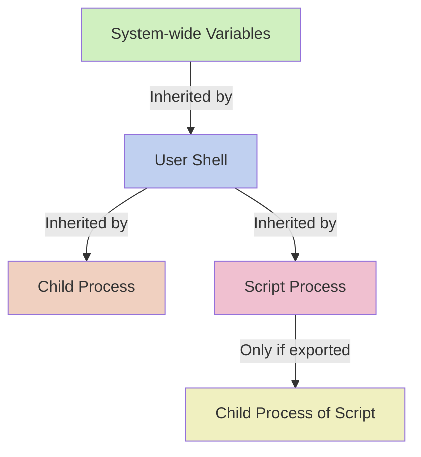

# Debian Environment Variables

## Introduction

Environment variables are special variables that define the environment in which programs run on your Debian system. They store information such as the location of executable files, the default editor, user home directories, and more. Understanding how to use, set, and manipulate environment variables is essential for effective shell scripting and system administration in Debian.

In this guide, we'll explore what environment variables are, how to access and modify them, and how they can be used in shell scripts to create more efficient and flexible programs.

## What Are Environment Variables?

Environment variables are name-value pairs that are available to processes running on your system. They provide a way to pass information to programs and scripts without hardcoding values, making your code more adaptable and maintainable.

Some key characteristics of environment variables in Debian:

- They are typically written in UPPERCASE letters
- They are accessible by any process running in the current shell session
- They can be temporary (set for the current session only) or persistent (available across reboots)
- They follow a naming convention of NAME=value

## Common Environment Variables in Debian

Debian comes with several predefined environment variables that provide useful information about your system:

| Variable | Description | Example Value |
|----------|-------------|---------------|
| `HOME` | User's home directory | `/home/username` |
| `USER` | Current username | `username` |
| `PATH` | Directories to search for executable files | `/usr/local/bin:/usr/bin:/bin` |
| `PWD` | Current working directory | `/home/username/projects` |
| `SHELL` | Path to the current shell | `/bin/bash` |
| `LANG` | System language and locale | `en_US.UTF-8` |
| `TERM` | Terminal type | `xterm-256color` |
| `EDITOR` | Default text editor | `/usr/bin/nano` |

## Viewing Environment Variables

### Viewing All Environment Variables

To view all environment variables currently defined in your shell, use the `env` or `printenv` command:

```bash
env
```

Output example:
```
SHELL=/bin/bash
PWD=/home/username
LOGNAME=username
HOME=/home/username
LANG=en_US.UTF-8
PATH=/usr/local/sbin:/usr/local/bin:/usr/sbin:/usr/bin:/sbin:/bin
...
```

### Viewing a Specific Environment Variable

To view the value of a specific environment variable, use the `echo` command with the `$` prefix:

```bash
echo $HOME
```

Output:
```
/home/username
```

You can also use the `printenv` command with the variable name as an argument:

```bash
printenv PATH
```

Output:
```
/usr/local/sbin:/usr/local/bin:/usr/sbin:/usr/bin:/sbin:/bin
```

## Setting Environment Variables

### Temporary Variables (Current Session Only)

To set an environment variable for the current shell session:

```bash
export MY_VARIABLE="Hello, Debian!"
```

You can now access this variable:

```bash
echo $MY_VARIABLE
```

Output:
```
Hello, Debian!
```

### Making Variables Persistent

To make environment variables persistent (available after reboots), you need to add them to shell configuration files:

1. For system-wide variables, add them to `/etc/environment` or create a file in `/etc/profile.d/`:

```bash
sudo nano /etc/environment
```

Add your variable:
```
MY_GLOBAL_VAR="This is available to all users"
```

2. For user-specific variables, add them to `~/.bashrc`, `~/.profile`, or `~/.bash_profile`:

```bash
nano ~/.bashrc
```

Add your export statement:
```bash
export MY_USER_VAR="This is only for current user"
```

After editing these files, either restart your shell or source the file to apply changes immediately:

```bash
source ~/.bashrc
```

## Removing Environment Variables

To unset (remove) an environment variable:

```bash
unset MY_VARIABLE
```

You can verify it's been removed:

```bash
echo $MY_VARIABLE
```

Output: (empty line)

## Environment Variables in Scripts

Environment variables are extremely useful in shell scripts for making code more flexible.

### Example: A Configurable Backup Script

```bash
#!/bin/bash

# Use environment variable with a default fallback value
BACKUP_DIR=${BACKUP_DIR:-"/tmp/backups"}
SOURCE_DIR=${SOURCE_DIR:-"$HOME/documents"}

# Create backup directory if it doesn't exist
mkdir -p $BACKUP_DIR

# Create timestamp
TIMESTAMP=$(date +%Y%m%d_%H%M%S)

# Create archive
tar -czf "$BACKUP_DIR/backup_$TIMESTAMP.tar.gz" "$SOURCE_DIR"

echo "Backup created at $BACKUP_DIR/backup_$TIMESTAMP.tar.gz"
```

This script can be customized by setting environment variables before running:

```bash
export BACKUP_DIR="/media/external/backups"
export SOURCE_DIR="/home/username/projects"
./backup_script.sh
```

### Example: Creating a Development Environment

```bash
#!/bin/bash

# Set up a development environment
export DEV_PROJECT="myapp"
export DEV_ENV="development"
export DEV_DB_HOST="localhost"
export DEV_DB_USER="devuser"
export DEV_DB_PASS="devpass"

# Print the settings
echo "Development environment set up for $DEV_PROJECT in $DEV_ENV mode"
echo "Database configuration: $DEV_DB_USER@$DEV_DB_HOST"

# Launch the application
cd ~/projects/$DEV_PROJECT
./start.sh
```

## Special Environment Variable Manipulations

### Path Manipulation

Adding a directory to the beginning of PATH:

```bash
export PATH="/new/directory:$PATH"
```

Adding a directory to the end of PATH:

```bash
export PATH="$PATH:/new/directory"
```

### Variable Substitution with Default Values

Debian shell scripting allows for sophisticated variable manipulation:

- `${VAR:-default}`: Use `default` if `VAR` is unset or empty
- `${VAR:=default}`: Assign `default` to `VAR` if unset or empty
- `${VAR:+alternative}`: Use `alternative` if `VAR` is set and not empty
- `${VAR:?error_message}`: Display error and exit if `VAR` is unset or empty

Example usage:

```bash
#!/bin/bash

# Use default if not set
echo "LOG_DIR is ${LOG_DIR:-/tmp/logs}"

# Set default if not set
CONFIG_FILE=${CONFIG_FILE:=~/.myapp.conf}
echo "CONFIG_FILE is now $CONFIG_FILE"

# Alternative value if set
echo "Debug value: ${DEBUG:+enabled}"

# Error if required variable not set
${API_KEY:?"API_KEY is required"}
```

## Practical Applications

### 1. Creating Portable Scripts

Environment variables allow you to write scripts that can work across different systems without modifications:

```bash
#!/bin/bash

# Use EDITOR environment variable with fallback
editor=${EDITOR:-nano}

# Create a temporary file
temp_file=$(mktemp)

# Open the file with the chosen editor
$editor "$temp_file"

# Process the file
echo "File edited with $editor"
cat "$temp_file"

# Clean up
rm "$temp_file"
```

### 2. Configuring Development Tools

Many development tools use environment variables for configuration:

```bash
# Set up PostgreSQL connection
export PGHOST="localhost"
export PGPORT="5432"
export PGDATABASE="myproject"
export PGUSER="developer"
export PGPASSWORD="secure_password"

# Now psql will connect automatically without parameters
psql
```

### 3. Environment-Specific Configuration

Create different environment configurations for development, testing, and production:

```bash
#!/bin/bash

# Load the right environment based on ENV variable
ENV=${ENV:-development}

if [ "$ENV" = "development" ]; then
  export DB_HOST="localhost"
  export DEBUG="true"
  export LOG_LEVEL="debug"
elif [ "$ENV" = "testing" ]; then
  export DB_HOST="test-server"
  export DEBUG="true"
  export LOG_LEVEL="info"
elif [ "$ENV" = "production" ]; then
  export DB_HOST="prod-server"
  export DEBUG="false"
  export LOG_LEVEL="warn"
else
  echo "Unknown environment: $ENV"
  exit 1
fi

echo "Loaded configuration for $ENV environment"
echo "Database host: $DB_HOST"
echo "Debug mode: $DEBUG"
echo "Logging level: $LOG_LEVEL"
```

Usage:
```bash
ENV=production ./run_app.sh
```

## Environment Variable Scoping

Understanding variable scope is crucial for proper script behavior:



Important scoping rules:
- Variables declared in a script without `export` are only available within that script
- Exported variables are passed to child processes
- Child processes cannot modify parent environment variables

Example demonstrating scope:

```bash
#!/bin/bash
# parent.sh

# Regular variable (not exported)
REGULAR_VAR="Not exported"

# Exported variable
export EXPORTED_VAR="This is exported"

# Run child script
./child.sh

# Check values
echo "Back in parent script:"
echo "REGULAR_VAR = $REGULAR_VAR"
echo "EXPORTED_VAR = $EXPORTED_VAR"
echo "CHILD_VAR = $CHILD_VAR"
```

```bash
#!/bin/bash
# child.sh

echo "In child script:"
echo "REGULAR_VAR = $REGULAR_VAR"  # Will be empty
echo "EXPORTED_VAR = $EXPORTED_VAR"  # Will show value

# Set a variable in child
export CHILD_VAR="From child script"
```

Output:
```
In child script:
REGULAR_VAR = 
EXPORTED_VAR = This is exported
Back in parent script:
REGULAR_VAR = Not exported
EXPORTED_VAR = This is exported
CHILD_VAR = 
```

## Security Considerations

Environment variables are not designed for sensitive information because:

1. They are visible to all processes running as the same user
2. They may appear in logs or error messages
3. They are inherited by child processes

For sensitive data, consider alternatives:
- Configuration files with restricted permissions
- Secret management tools like `pass`, `vault`, or `credstash`
- Temporary environment variables set only when needed

## Summary

Environment variables are a powerful tool in Debian shell scripting that allow for:

- Dynamic configuration of scripts and applications
- System information access
- Portable and flexible code
- Environment-specific settings

By mastering environment variables, you can create more robust, adaptable, and maintainable shell scripts and better understand how the Debian system operates.

## Exercises

1. Create a script that checks if a required environment variable is set and provides a helpful error message if it's not.
2. Write a script that modifies your PATH temporarily to include a custom directory.
3. Create a configuration script that sets different environment variables based on a specified environment (dev/test/prod).
4. Write a script that saves the current environment variables to a file and can restore them later.
5. Create a script that uses environment variables to customize its behavior, with reasonable defaults for all options.

## Further Resources

- Debian Bash Reference Manual: [https://www.debian.org/doc/manuals/bash-reference/](https://www.debian.org/doc/manuals/bash-reference/)
- GNU Bash Manual: Variable Expansions: [https://www.gnu.org/software/bash/manual/html_node/Shell-Parameter-Expansion.html](https://www.gnu.org/software/bash/manual/html_node/Shell-Parameter-Expansion.html)
- Advanced Bash-Scripting Guide: [https://tldp.org/LDP/abs/html/](https://tldp.org/LDP/abs/html/)