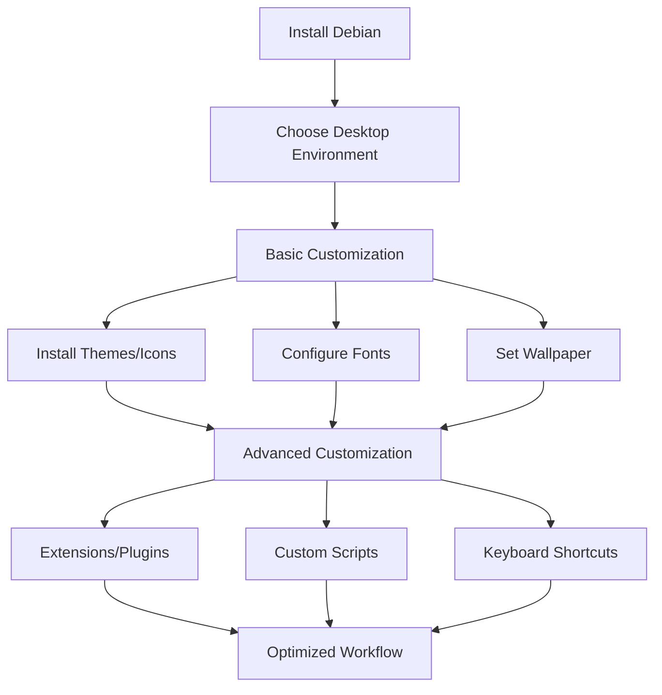

# Debian Desktop Personalization

## Introduction

Debian is known for its stability and versatility, but the default desktop environment can look rather plain. Personalization allows you to transform your Debian desktop into a workspace that not only looks appealing but also enhances your productivity. This guide will walk you through various aspects of desktop personalization in Debian, covering everything from changing themes and icons to installing extensions and configuring system behaviors.

Whether you're using GNOME, KDE, Xfce, or another desktop environment, these customization techniques will help you create a desktop that feels uniquely yours.

## Desktop Environments in Debian

Before diving into personalization, it's important to understand which desktop environment you're using, as customization options vary between them.

### Common Desktop Environments in Debian

- **GNOME**: Modern, minimalistic interface with a focus on simplicity
- **KDE Plasma**: Feature-rich, highly customizable environment
- **Xfce**: Lightweight, traditional desktop experience
- **Cinnamon**: Feature-rich with a traditional layout
- **MATE**: Fork of GNOME 2, offering a classic experience

To check your current desktop environment, run:

```bash
echo $XDG_CURRENT_DESKTOP
```

You can install multiple desktop environments on the same system. For example, to install KDE Plasma:

```bash
sudo apt update
sudo apt install kde-plasma-desktop
```

## Basic Theme Customization

### Changing Themes in GNOME

GNOME offers a straightforward way to change themes through the Settings application.

1. Install GNOME Tweaks:

```bash
sudo apt update
sudo apt install gnome-tweaks
```

2. Launch GNOME Tweaks from your applications menu
3. Navigate to the "Appearance" section
4. Here you can change:
   - Applications (GTK) theme
   - Cursor theme
   - Icon theme
   - Shell theme (requires GNOME Shell extensions)

### Installing New Themes

Themes are typically installed to either:
- System-wide location: `/usr/share/themes/`
- User-specific location: `~/.themes/`

To install a theme manually:

```bash
# Create the themes directory if it doesn't exist
mkdir -p ~/.themes

# Download and extract a theme
cd ~/Downloads
wget https://example.com/mytheme.tar.gz
tar -xf mytheme.tar.gz -C ~/.themes/
```

### Popular Theme Repositories

- **GNOME Look**: [gnome-look.org](https://gnome-look.org/)
- **KDE Store**: [store.kde.org](https://store.kde.org/)
- **Xfce Look**: [xfce-look.org](https://xfce-look.org/)

## Icon Themes

Icon themes can significantly change the look and feel of your desktop environment.

### Installing Icon Themes

Icon themes are typically installed to:
- System-wide location: `/usr/share/icons/`
- User-specific location: `~/.icons/`

To install an icon theme:

```bash
# Create the icons directory if it doesn't exist
mkdir -p ~/.icons

# Download and extract an icon theme
cd ~/Downloads
wget https://example.com/icon-theme.tar.gz
tar -xf icon-theme.tar.gz -C ~/.icons/
```

### Popular Icon Themes for Debian

- **Papirus**: Modern icon theme with a clean design
  ```bash
  sudo apt install papirus-icon-theme
  ```

- **Tela**: Flat, colorful icon theme
  ```bash
  # Clone the repository
  git clone https://github.com/vinceliuice/Tela-icon-theme.git
  cd Tela-icon-theme
  # Install the theme
  ./install.sh
  ```

## Font Customization

Changing fonts can improve readability and aesthetics.

### Installing Fonts

```bash
sudo apt update
sudo apt install fonts-noto fonts-roboto fonts-firacode
```

### Setting Fonts in GNOME

1. Open GNOME Tweaks
2. Go to the "Fonts" section
3. Change the font settings according to your preference

## GNOME Shell Extensions

GNOME Shell extensions add functionality and customization options to the GNOME desktop environment.

### Installing GNOME Extensions Support

```bash
sudo apt update
sudo apt install gnome-shell-extensions gnome-shell-extension-manager
```

Alternatively, install the browser extension and GNOME Shell integration:

```bash
sudo apt install chrome-gnome-shell
```

Then visit [extensions.gnome.org](https://extensions.gnome.org/) in your browser.

### Useful GNOME Extensions

1. **Dash to Dock**: Transforms the dash into a dock
   - Install via Extensions Manager or:
   ```bash
   sudo apt install gnome-shell-extension-dash-to-dock
   ```

2. **User Themes**: Allows changing the GNOME Shell theme
   - Install via Extensions Manager or:
   ```bash
   sudo apt install gnome-shell-extension-user-theme
   ```

3. **GSConnect**: Integration with Android devices
   - Install via Extensions Manager or:
   ```bash
   sudo apt install gnome-shell-extension-gsconnect
   ```

## Desktop Configuration

### Customizing GNOME with dconf-editor

The dconf-editor lets you modify system settings not accessible through the normal Settings interface.

```bash
sudo apt install dconf-editor
```

Launch it from the applications menu and navigate through the settings hierarchy.

Example: To change the number of workspaces:

1. Navigate to `/org/gnome/desktop/wm/preferences/`
2. Modify the `num-workspaces` key

### Using gsettings for Command-Line Configuration

Change settings directly from the terminal:

```bash
# Set the desktop background
gsettings set org.gnome.desktop.background picture-uri 'file:///path/to/image.jpg'

# Enable dark theme
gsettings set org.gnome.desktop.interface gtk-theme 'Adwaita-dark'
```

## Customizing KDE Plasma

KDE Plasma offers extensive customization options through its System Settings application.

### Global Themes

1. Open System Settings
2. Navigate to "Appearance" → "Global Themes"
3. Browse and apply available themes or download new ones

### Plasma Widgets

Widgets can be added to the desktop or panels:

1. Right-click on desktop or panel
2. Select "Add Widgets"
3. Drag and drop widgets to your preferred location

### Custom Shortcuts

1. Open System Settings
2. Navigate to "Shortcuts"
3. Add new or modify existing shortcuts

## Terminal Customization

### Enhancing Bash with .bashrc

Edit your `~/.bashrc` file to customize your Bash experience:

```bash
# Add these to your ~/.bashrc
# Custom prompt
PS1='\[\033[01;32m\]\u@\h\[\033[00m\]:\[\033[01;34m\]\w\[\033[00m\]\$ '

# Useful aliases
alias ll='ls -alF'
alias la='ls -A'
alias l='ls -CF'
alias update='sudo apt update && sudo apt upgrade'
```

After editing, reload with:

```bash
source ~/.bashrc
```

### Installing and Configuring Zsh

Zsh offers more features than Bash:

```bash
# Install Zsh
sudo apt install zsh

# Install Oh My Zsh for easy configuration
sh -c "$(curl -fsSL https://raw.github.com/ohmyzsh/ohmyzsh/master/tools/install.sh)"
```

Edit `~/.zshrc` to customize Zsh:

```bash
# Set theme
ZSH_THEME="agnoster"

# Enable plugins
plugins=(git docker composer npm)
```

## Desktop Effects and Animations

### Compiz for Advanced Desktop Effects

For Ubuntu-based Debian systems:

```bash
sudo apt install compizconfig-settings-manager
```

Launch CompizConfig Settings Manager to customize effects.

### KDE Desktop Effects

1. Open System Settings
2. Navigate to "Workspace Behavior" → "Desktop Effects"
3. Enable or disable effects according to your preference

## Creating a Custom Application Launcher

Create a `.desktop` file to add a custom launcher:

```bash
# Create the application directory if it doesn't exist
mkdir -p ~/.local/share/applications

# Create a desktop file
cat > ~/.local/share/applications/myapp.desktop << EOF
[Desktop Entry]
Name=My Application
Exec=/path/to/application
Icon=/path/to/icon.png
Type=Application
Categories=Utility;
EOF
```

## Workflow Automation with Custom Scripts

Create a script to toggle between light and dark themes:

```bash
#!/bin/bash
# Save as ~/.local/bin/toggle-theme.sh

CURRENT_THEME=$(gsettings get org.gnome.desktop.interface gtk-theme)

if [[ $CURRENT_THEME == "'Adwaita'" ]]; then
    gsettings set org.gnome.desktop.interface gtk-theme 'Adwaita-dark'
    echo "Switched to dark theme"
else
    gsettings set org.gnome.desktop.interface gtk-theme 'Adwaita'
    echo "Switched to light theme"
fi
```

Make it executable and create a keyboard shortcut:

```bash
chmod +x ~/.local/bin/toggle-theme.sh
```

## Desktop Workflow Diagram

The following diagram illustrates a typical Debian desktop customization workflow:



## Practical Examples

### Create a Productivity-Focused Desktop

Let's set up a distraction-free, productivity-focused desktop:

```bash
# Install needed packages
sudo apt install gnome-tweaks dconf-editor gnome-shell-extension-manager

# Set a solid color background
gsettings set org.gnome.desktop.background picture-uri ''
gsettings set org.gnome.desktop.background primary-color '#2c3e50'

# Disable notifications temporarily while working
gsettings set org.gnome.desktop.notifications show-banners false

# Auto-hide the dock
gsettings set org.gnome.shell.extensions.dash-to-dock autohide true
```

### Create a Custom Application Theme Switcher

Let's create a script that switches between light and dark themes based on time of day:

```bash
#!/bin/bash
# Save as ~/.local/bin/auto-theme.sh

HOUR=$(date +%H)

# If it's between 8am and 6pm, use light theme
if [ $HOUR -ge 8 ] && [ $HOUR -lt 18 ]; then
    gsettings set org.gnome.desktop.interface gtk-theme 'Adwaita'
    gsettings set org.gnome.desktop.interface color-scheme 'default'
else
    gsettings set org.gnome.desktop.interface gtk-theme 'Adwaita-dark'
    gsettings set org.gnome.desktop.interface color-scheme 'prefer-dark'
fi
```

Add to crontab to run hourly:

```bash
chmod +x ~/.local/bin/auto-theme.sh
crontab -e
# Add the following line:
# 0 * * * * ~/.local/bin/auto-theme.sh
```

## Troubleshooting

### Fixing Theme Issues

If your theme isn't applying correctly:

```bash
# Restart the GNOME Shell (on X11 only)
Alt+F2, then enter 'r' and press Enter

# Or log out and back in for Wayland sessions
```

### Resetting to Default Settings

If customization causes issues, reset to defaults:

```bash
# For GNOME
dconf reset -f /org/gnome/

# For KDE
rm -rf ~/.config/plasma-org.kde.plasma.desktop-appletsrc
rm -rf ~/.config/plasmarc
```

## Summary

Debian desktop personalization allows you to create a computing environment that matches your personal preferences and enhances your productivity. We've covered:

- Changing desktop environments
- Installing and applying themes and icons
- Customizing fonts
- Using GNOME Shell extensions and KDE widgets
- Configuring terminal settings
- Creating custom scripts for workflow automation

These customizations not only make your desktop more aesthetically pleasing but also improve your overall computing experience by tailoring the system to your specific needs.

## Additional Resources

For further exploration of Debian desktop customization:

- **Debian Wiki**: Comprehensive documentation on Debian system configurations
- **GNOME Extensions Website**: For browsing and installing GNOME Shell extensions
- **KDE Store**: For KDE Plasma themes, widgets, and more
- **r/unixporn**: Reddit community showcasing Linux desktop customization

## Exercises

1. Install and configure at least three different desktop themes and compare their aesthetics and functionality.
2. Create a custom keyboard shortcut that launches your favorite application.
3. Write a bash script that randomizes your desktop wallpaper from a folder of images.
4. Configure a custom dock or panel layout that enhances your workflow.
5. Set up a cronjob that changes your system appearance based on the time of day.