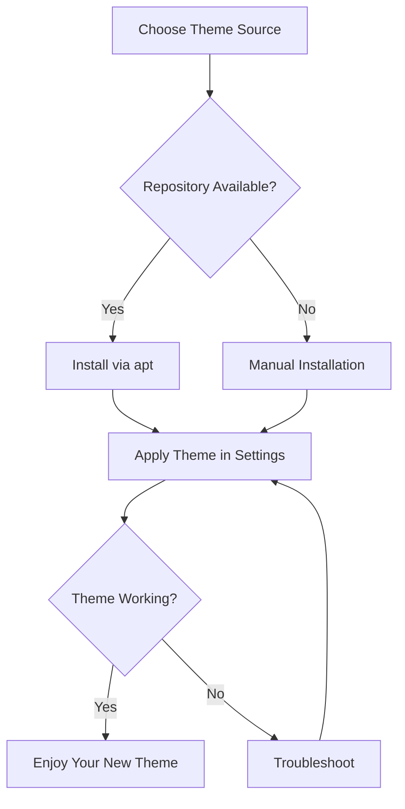

# Debian Theme Installation

## Introduction

Customizing your Debian system is a great way to make your computing experience more personal and enjoyable. One of the most impactful customizations you can make is changing the visual theme of your desktop environment. Themes control the appearance of windows, buttons, menus, and other interface elements.

In this guide, we'll explore various methods to install themes on Debian. We'll cover theme installation for popular desktop environments like GNOME, KDE Plasma, XFCE, and more. By the end of this tutorial, you'll be able to transform the look and feel of your Debian system to match your personal style.

## Prerequisites

Before we begin, make sure you have:

- A working Debian installation
- Basic familiarity with terminal commands
- Your preferred desktop environment installed (GNOME, KDE, XFCE, etc.)
- Administrator (sudo) privileges

## Understanding Debian Themes

### What Are Themes?

Themes in Debian (and Linux in general) typically consist of several components:

- **GTK Themes**: Control the appearance of applications built with GTK (GNOME Toolkit)
- **Qt Themes**: Control the appearance of applications built with Qt framework (used by KDE)
- **Icon Themes**: Replace the default icons with alternative designs
- **Cursor Themes**: Change the appearance of the mouse cursor
- **Font Configuration**: Adjust how text is displayed

These components can be installed independently, allowing you to mix and match according to your preferences.

## Theme Locations

Themes can be installed in two locations:

1. **System-wide**: `/usr/share/themes/` (requires administrator privileges)
2. **User-specific**: `~/.themes/` (only affects the current user)

Icon themes follow a similar pattern but are stored in `/usr/share/icons/` (system-wide) or `~/.icons/` (user-specific).

## Installing Themes on Debian

### Method 1: Using the Package Manager

The simplest way to install themes is through Debian's package repositories.

```bash
# Update package list
sudo apt update

# Install GNOME themes
sudo apt install gnome-themes-extra arc-theme papirus-icon-theme

# Install KDE themes
sudo apt install plasma-theme-oxygen breeze-icon-theme

# Install cursor themes
sudo apt install dmz-cursor-theme
```

This method ensures that themes integrate well with your system and receive updates through the package manager.

### Method 2: Manual Installation

For themes not available in the repositories, you can install them manually:

1. **Create theme directories** (if they don't exist):

```bash
mkdir -p ~/.themes ~/.icons
```

2. **Download your desired theme** (usually as a .tar.gz or .zip file)

3. **Extract the theme** to the appropriate directory:

```bash
# For GTK themes
tar -xf theme-name.tar.gz -C ~/.themes/

# For icon themes
tar -xf icon-theme.tar.gz -C ~/.icons/
```

4. **Apply the theme** using your desktop environment's settings

### Method 3: Using Theme Managers

Some desktop environments offer dedicated tools for managing themes:

#### GNOME Extensions and Tweaks

For GNOME Desktop Environment:

```bash
# Install GNOME Tweaks
sudo apt install gnome-tweaks

# Install GNOME Extensions
sudo apt install gnome-shell-extensions
```

After installation, launch GNOME Tweaks to access theme settings:

```bash
gnome-tweaks
```

#### KDE Theme Management

KDE Plasma includes built-in theme management. Access it through:

System Settings → Appearance

#### XFCE Theme Settings

For XFCE, access theme settings through:

Applications Menu → Settings → Appearance

## Installing Themes from Popular Sources

### GNOME-Look.org and KDE Store

[GNOME-Look.org](https://www.gnome-look.org/) is a popular resource for Linux themes, icons, and other customization elements.

Here's how to install a theme from GNOME-Look:

1. Browse and download your preferred theme
2. Extract the downloaded file
3. Move the extracted folder to the appropriate directory

```bash
# Example for a GTK theme
mkdir -p ~/.themes
tar -xf Theme-Name.tar.xz
mv Theme-Name ~/.themes/

# Example for an icon theme
mkdir -p ~/.icons
tar -xf Icon-Theme.tar.xz
mv Icon-Theme ~/.icons/
```

### Installing Flat-Remix Theme (Example)

Let's walk through a complete example of installing the popular Flat-Remix theme:

```bash
# Clone the repository
git clone https://github.com/daniruiz/flat-remix.git

# Move the theme to the themes directory
mkdir -p ~/.themes
cp -r flat-remix/Flat-Remix* ~/.themes/

# Install matching icons
git clone https://github.com/daniruiz/flat-remix-icons.git
mkdir -p ~/.icons
cp -r flat-remix-icons/Flat-Remix* ~/.icons/
```

## Applying Themes

### GNOME Desktop Environment

1. Install GNOME Tweaks if you haven't already:

```bash
sudo apt install gnome-tweaks
```

2. Open GNOME Tweaks and navigate to the "Appearance" tab
3. Select your installed theme from the dropdown menus for:
   - Applications
   - Cursor
   - Icons

### KDE Plasma Desktop

1. Open System Settings
2. Navigate to "Appearance"
3. Choose the category you want to change:
   - Global Theme
   - Application Style
   - Plasma Style
   - Colors
   - Window Decorations
   - Icons
   - Cursors
4. Select your preferred theme and click "Apply"

### XFCE Desktop

1. Open the Applications Menu
2. Go to Settings → Appearance
3. Select the "Style" tab to change the application theme
4. Go to Settings → Window Manager to change window decorations
5. Go to Settings → Mouse and Touchpad → Theme to change the cursor theme

## Creating a Simple Custom Theme

You can create a simple custom theme by modifying an existing one. Here's a basic example:

1. Copy an existing theme to create a base:

```bash
cp -r ~/.themes/AdwaitaDark ~/.themes/MyCustomTheme
```

2. Edit the `gtk.css` file with your customizations:

```bash
nano ~/.themes/MyCustomTheme/gtk-3.0/gtk.css
```

3. Add your custom CSS, for example:

```css
window {
    background-color: #2d2d2d;
}

headerbar {
    background-color: #1e1e1e;
    color: #ffffff;
}

button {
    background-color: #3d3d3d;
    color: #ffffff;
    border-radius: 5px;
}

button:hover {
    background-color: #4d4d4d;
}
```

4. Save the file and apply your new theme using your desktop environment's settings

## Troubleshooting Theme Issues

### Theme Not Appearing in Settings

If your installed theme doesn't appear in the settings:

- Verify the theme is compatible with your desktop environment version
- Check that the theme is in the correct directory
- Ensure the theme has the correct folder structure
- Try logging out and back in to refresh the theme list

### Applications Not Following Theme

If some applications don't follow your theme:

- GTK applications might not follow Qt themes and vice versa
- Some applications use their own theming systems
- Try installing theme engines that may be required:

```bash
sudo apt install gtk2-engines-murrine gtk2-engines-pixbuf
```

### Fixing Broken Themes

If a theme appears broken:

1. Check for missing dependencies
2. Verify compatibility with your desktop environment version
3. Look for theme-specific configuration options
4. Try resetting your theme settings to default, then reapply

## Theme Management Best Practices

- **Keep backups** of your original configuration before making changes
- **Remove unused themes** to reduce clutter
- **Check for theme updates** periodically for bug fixes and improvements
- **Test themes** in a separate user account before applying system-wide

## Advanced Theme Customization

### Using Custom Color Schemes

Most desktop environments allow you to create custom color schemes:

#### GNOME Custom Colors

Use GNOME Tweaks to adjust the color scheme or install the "GNOME Color Manager" for more options:

```bash
sudo apt install gnome-color-manager
```

#### KDE Custom Colors

1. Open System Settings → Appearance → Colors
2. Click "Get New Color Schemes" to browse online options
3. Or click "Edit Scheme" to create your own

### Theme Variables and Configuration

Many themes allow customization through configuration files:

```bash
# Example: Editing Flat-Remix configuration
nano ~/.themes/Flat-Remix/gtk-3.0/settings.ini
```

Adjust variables like accent colors, opacity levels, and more depending on the theme's capabilities.

## Popular Debian Themes

Here are some popular themes you might want to try:

1. **Arc Theme** - A flat theme with transparent elements
   ```bash
   sudo apt install arc-theme
   ```

2. **Papirus Icons** - Modern icon theme with colorful icons
   ```bash
   sudo apt install papirus-icon-theme
   ```

3. **Numix** - Modern and sleek theme with a distinctive color palette
   ```bash
   sudo apt install numix-gtk-theme numix-icon-theme
   ```

4. **Adapta** - Material Design-inspired theme
   ```bash
   sudo apt install adapta-gtk-theme
   ```

5. **Breeze** - KDE's default theme, also available for GTK
   ```bash
   sudo apt install breeze-gtk-theme
   ```

## Workflow Diagram

Here's a visual representation of the theme installation process:



## Summary

In this guide, we've covered everything you need to know about installing and configuring themes on Debian:

- Understanding theme components and locations
- Various installation methods (package manager, manual, theme managers)
- Desktop environment-specific theme settings
- Creating and customizing your own themes
- Troubleshooting common theme issues

Customizing your Debian system with themes allows you to create a personalized computing environment that's both functional and visually appealing. With the techniques you've learned, you can transform the look and feel of your desktop to match your preferences and work style.

## Additional Resources

- [GNOME Look](https://www.gnome-look.org/) - The main hub for Linux themes and customizations
- [KDE Store](https://store.kde.org/) - Themes and add-ons for KDE Plasma
- [Debian Wiki - Themes](https://wiki.debian.org/Themes) - Official Debian documentation on themes
- [GTK Documentation](https://docs.gtk.org/) - For theme developers who want to create GTK themes

## Exercises

1. Install three different themes and compare their appearance and features
2. Create a simple custom theme by modifying an existing one
3. Create a backup script that saves your theme configurations
4. Try combining different icon themes with different GTK themes to create a unique look
5. Research how to create a complete theme from scratch and outline the steps required