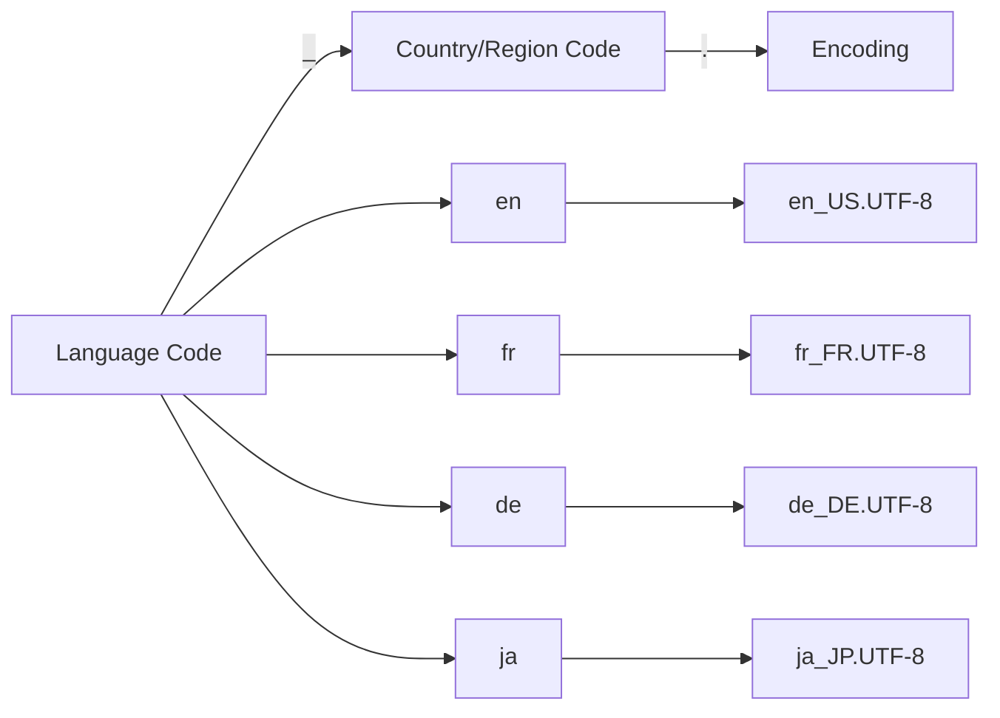

# Debian Language Settings

## Introduction

Language settings in Debian Linux allow you to customize how your system displays text, formats numbers, dates, currency, and handles keyboard input. These settings are crucial for users working in non-English environments or those who need to work with multiple languages. In this guide, we'll explore how to configure, modify, and troubleshoot language settings in Debian to create a comfortable computing environment tailored to your linguistic needs.

## Understanding Localization and Internationalization

Before diving into specific configurations, let's understand two key concepts:

- **Internationalization (i18n)**: The process of designing software to support multiple languages and regional preferences.
- **Localization (l10n)**: The adaptation of software for specific regions or languages by adding locale-specific components and translating text.

In Debian, these concepts are implemented through **locales**, which define language and cultural conventions.

## Locale System in Debian

A locale in Debian consists of several categories that control different aspects of language display and formatting:

| Category | Controls |
|----------|----------|
| `LC_COLLATE` | Text sorting order |
| `LC_CTYPE` | Character classification and handling |
| `LC_MESSAGES` | Language of system messages |
| `LC_MONETARY` | Currency formatting |
| `LC_NUMERIC` | Number formatting |
| `LC_TIME` | Date and time formatting |
| `LC_PAPER` | Paper size defaults |
| `LC_NAME` | Name formatting |
| `LC_ADDRESS` | Address formatting |
| `LC_TELEPHONE` | Telephone number formatting |
| `LC_MEASUREMENT` | Measurement units |
| `LANG` | Default locale for all unset categories |
| `LANGUAGE` | Prioritized list of languages for messages |

## Checking Current Language Settings

To check your current locale settings, use the following command:

```bash
locale
```

Example output:

```
LANG=en_US.UTF-8
LANGUAGE=en_US:en
LC_CTYPE=en_US.UTF-8
LC_NUMERIC=en_US.UTF-8
LC_TIME=en_US.UTF-8
LC_COLLATE=en_US.UTF-8
LC_MONETARY=en_US.UTF-8
LC_MESSAGES=en_US.UTF-8
LC_PAPER=en_US.UTF-8
LC_NAME=en_US.UTF-8
LC_ADDRESS=en_US.UTF-8
LC_TELEPHONE=en_US.UTF-8
LC_MEASUREMENT=en_US.UTF-8
LC_IDENTIFICATION=en_US.UTF-8
LC_ALL=
```

To see all available locales on your system:

```bash
locale -a
```

## Generating and Configuring Locales

### Step 1: Generate New Locales

Before using a locale, you need to generate it. This process compiles the locale definition into a format the system can use.

1. Edit the locales configuration file:

```bash
sudo nano /etc/locale.gen
```

2. Uncomment (remove the `#` from) the lines for the locales you want to use. For example:

```
# en_GB.UTF-8 UTF-8
en_US.UTF-8 UTF-8
# fr_FR.UTF-8 UTF-8
```

To enable French language support, uncomment the `fr_FR.UTF-8 UTF-8` line.

3. Generate the selected locales:

```bash
sudo locale-gen
```

Example output:

```
Generating locales (this might take a while)...
  en_US.UTF-8... done
  fr_FR.UTF-8... done
Generation complete.
```

### Step 2: Set the System-Wide Default Locale

1. Configure the default locale:

```bash
sudo update-locale LANG=fr_FR.UTF-8
```

This command updates the `/etc/default/locale` file.

2. Alternatively, edit the file directly:

```bash
sudo nano /etc/default/locale
```

And modify it to look like:

```
LANG=fr_FR.UTF-8
LANGUAGE=fr_FR:fr
LC_ALL=fr_FR.UTF-8
```

### Step 3: Apply the Changes

For system-wide changes to take effect, you need to reboot:

```bash
sudo reboot
```

For current session only, you can run:

```bash
export LANG=fr_FR.UTF-8
export LANGUAGE=fr_FR:fr
export LC_ALL=fr_FR.UTF-8
```

## Using the Graphical Interface for Locale Settings

Debian provides a graphical tool for managing language settings that's more user-friendly for beginners:

1. Open the Settings application
2. Navigate to "Region & Language"
3. Click on "Language" to change the display language
4. Click on "Formats" to change date, time, and number formats
5. Click "Apply" to save your changes

## Keyboard Layout Configuration

Changing the keyboard layout is a separate but related configuration:

### Command-Line Method

1. View available keyboard layouts:

```bash
localectl list-x11-keymap-layouts
```

2. Set a new keyboard layout (e.g., French):

```bash
sudo localectl set-x11-keymap fr
```

3. For more specific configuration, you can specify the model, layout, variant, and options:

```bash
sudo localectl set-x11-keymap us pc105 intl "grp:alt_shift_toggle"
```

This sets:
- Layout: US
- Model: pc105
- Variant: international
- Options: alt+shift to toggle layouts

### Using the GUI

1. Open Settings
2. Navigate to "Keyboard"
3. Click "Input Sources"
4. Click the "+" button to add a new keyboard layout
5. Select your desired layout and click "Add"

## Managing Multiple Languages

You can set priorities for multiple languages using the `LANGUAGE` variable. For example:

```bash
export LANGUAGE="fr_FR:en_US:en"
```

This tells the system to try French first, then US English, and finally generic English for any messages.

To make this permanent, add to your `~/.bashrc` file:

```bash
echo 'export LANGUAGE="fr_FR:en_US:en"' >> ~/.bashrc
source ~/.bashrc
```

## Configuring Language Settings for Specific Applications

Some applications allow language settings independent of the system locale. For example:

### Firefox

1. Open Firefox
2. Go to Settings > General > Language
3. Select your preferred language for displaying pages

### LibreOffice

1. Open any LibreOffice application
2. Go to Tools > Options > Language Settings > Languages
3. Set your interface, locale, and default document languages

## Troubleshooting Common Issues

### Missing Locale Errors

If you see errors like `locale: Cannot set LC_CTYPE to default locale: No such file or directory`:

```bash
sudo locale-gen en_US.UTF-8  # Replace with your locale
sudo update-locale LANG=en_US.UTF-8
```

### Character Display Issues

If characters appear as boxes or question marks:

1. Ensure you have appropriate fonts installed:

```bash
sudo apt update
sudo apt install fonts-noto fonts-noto-cjk
```

2. Check that your terminal supports UTF-8:

```bash
echo $LANG
```

It should end with `.UTF-8`

### Input Method for Complex Writing Systems

For languages like Chinese, Japanese, or Korean:

```bash
sudo apt install ibus ibus-pinyin ibus-hangul ibus-anthy
```

Then set up with:

```bash
im-config
```

Follow the on-screen instructions to complete setup.

## Practical Examples

### Example 1: Setting Up a Multilingual Development Environment

For a developer working with an international team who needs both English and Japanese:

```bash
# Generate the required locales
sudo sed -i 's/# en_US.UTF-8 UTF-8/en_US.UTF-8 UTF-8/' /etc/locale.gen
sudo sed -i 's/# ja_JP.UTF-8 UTF-8/ja_JP.UTF-8 UTF-8/' /etc/locale.gen
sudo locale-gen

# Set up environment with English interface but Japanese date format
sudo update-locale LANG=en_US.UTF-8 LANGUAGE=en_US:en LC_TIME=ja_JP.UTF-8

# Install Japanese input method
sudo apt install ibus-mozc

# Add to startup applications
echo "ibus-daemon -drx" >> ~/.profile
```

### Example 2: Create a Script to Quickly Switch Between Locales

Create a file named `switch-locale.sh`:

```bash
#!/bin/bash
# Save as ~/switch-locale.sh and make executable with: chmod +x ~/switch-locale.sh

case "$1" in
  "en")
    export LANG=en_US.UTF-8
    export LANGUAGE=en_US:en
    export LC_ALL=en_US.UTF-8
    setxkbmap us
    ;;
  "fr")
    export LANG=fr_FR.UTF-8
    export LANGUAGE=fr_FR:fr
    export LC_ALL=fr_FR.UTF-8
    setxkbmap fr
    ;;
  "de")
    export LANG=de_DE.UTF-8
    export LANGUAGE=de_DE:de
    export LC_ALL=de_DE.UTF-8
    setxkbmap de
    ;;
  *)
    echo "Usage: $0 {en|fr|de}"
    exit 1
    ;;
esac

echo "Locale switched to $1"
locale | grep "LANG\|LANGUAGE"
```

Use it by running:

```bash
source ~/switch-locale.sh en  # Switch to English
source ~/switch-locale.sh fr  # Switch to French
```

## Understanding Locale String Format

Locale strings follow this format:



For example:
- `en_US.UTF-8`: English language, United States region, UTF-8 character encoding
- `fr_CA.UTF-8`: French language, Canadian region, UTF-8 character encoding
- `de_DE.UTF-8`: German language, Germany region, UTF-8 character encoding

## Summary

In this guide, we've covered:

- The basics of localization and internationalization in Debian
- How to check, generate, and configure locales
- Setting keyboard layouts through both command line and GUI
- Managing multiple languages with priority settings
- Application-specific language configurations
- Troubleshooting common locale-related issues
- Practical examples for real-world use cases

By properly configuring your Debian language settings, you can create a comfortable computing environment that matches your linguistic and regional preferences, whether you're using a single language or working in a multilingual context.

## Additional Resources

- [Debian Internationalization Wiki](https://wiki.debian.org/Internationalization)
- [GNU C Library Locales Documentation](https://www.gnu.org/software/libc/manual/html_node/Locales.html)
- [IBus Input Method Framework](https://github.com/ibus/ibus/wiki)

## Exercises

1. Configure your Debian system to use your native language for the interface but English for technical applications.
2. Create a script that launches a specific application with a different locale than your system default.
3. Set up a multilingual environment with three languages of your choice, with proper font support for each.
4. Configure different keyboard layouts and practice switching between them using keyboard shortcuts.
5. Investigate what happens when you set conflicting locale categories (e.g., `LC_MESSAGES` in one language but `LANG` in another).