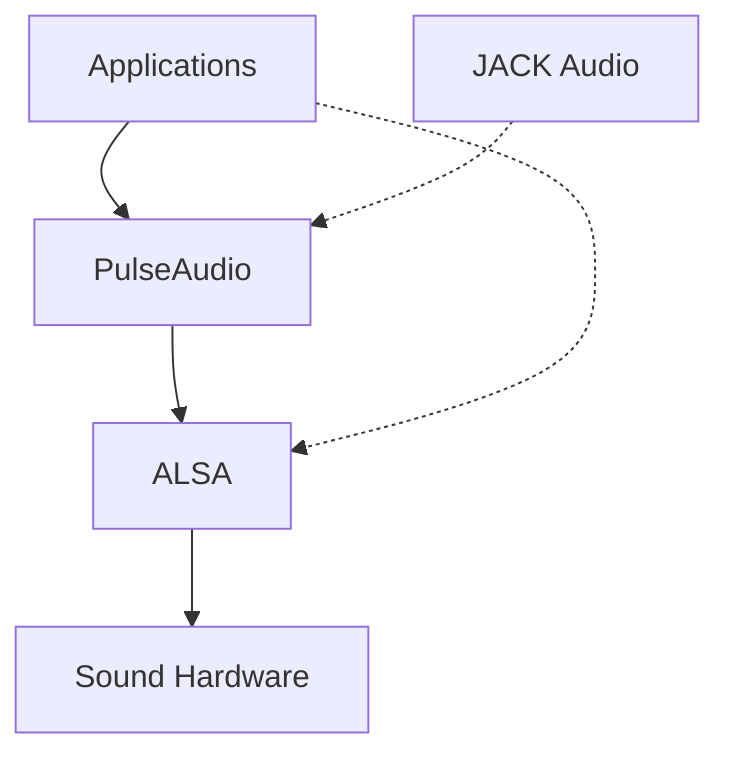

# Debian Sound Customization

## Introduction

Sound customization in Debian involves configuring and optimizing the audio subsystems to meet specific requirements or preferences. Debian primarily uses two sound systems: ALSA (Advanced Linux Sound Architecture) as the low-level foundation and PulseAudio as the higher-level sound server that provides additional features and flexibility. This guide will walk you through various aspects of sound customization in Debian, from basic configuration to advanced tweaks.

## Understanding Debian Sound Architecture

Before diving into customization, it's important to understand how sound works in Debian:



- **ALSA (Advanced Linux Sound Architecture)**: The kernel component that provides device drivers for sound hardware
- **PulseAudio**: A sound server that runs on top of ALSA, providing advanced features like per-application volume control
- **JACK**: A professional audio server for applications that require low-latency audio processing

## Basic Sound Configuration

### Checking Your Sound Setup

First, let's verify your current sound setup:

```bash
# Check loaded sound modules
lsmod | grep snd

# List sound cards
cat /proc/asound/cards

# List PulseAudio information
pactl info
```

Example output:

```
$ cat /proc/asound/cards
 0 [PCH            ]: HDA-Intel - HDA Intel PCH
                      HDA Intel PCH at 0xe1340000 irq 135
 1 [NVidia         ]: HDA-Intel - HDA NVidia
                      HDA NVidia at 0xe1080000 irq 136
```

### Installing Essential Sound Tools

```bash
sudo apt update
sudo apt install pulseaudio pavucontrol alsa-utils
```

These packages provide:
- `pulseaudio`: The PulseAudio sound server
- `pavucontrol`: A graphical utility for controlling PulseAudio
- `alsa-utils`: Command-line utilities for ALSA

## PulseAudio Configuration

### Using PulseAudio Volume Control

The easiest way to configure sound is through the graphical PulseAudio Volume Control:

```bash
pavucontrol
```

This application allows you to:
- Adjust volume levels for output devices
- Configure input devices
- Set per-application volume levels
- Direct audio streams to specific devices

### Customizing PulseAudio Configuration Files

For more advanced configuration, you can modify PulseAudio's configuration files:

1. **System-wide configuration**: Located at `/etc/pulse/`
2. **User configuration**: Located at `~/.config/pulse/`

Let's create a custom configuration to set default sample rates:

```bash
mkdir -p ~/.config/pulse
```

Create or edit `~/.config/pulse/daemon.conf`:

```
# Improved audio quality settings
default-sample-format = s24le
default-sample-rate = 48000
alternate-sample-rate = 44100
default-sample-channels = 2
default-channel-map = front-left,front-right
```

Restart PulseAudio to apply changes:

```bash
pulseaudio -k
pulseaudio --start
```

## ALSA Configuration

ALSA settings can be configured at a lower level for more control over your sound hardware.

### Creating an ALSA Configuration File

Create or edit the `.asoundrc` file in your home directory:

```bash
nano ~/.asoundrc
```

Add the following content to configure default devices:

```
pcm.!default {
    type pulse
    fallback "sysdefault"
    hint {
        show on
        description "Default ALSA Output (PulseAudio Sound Server)"
    }
}

ctl.!default {
    type pulse
    fallback "sysdefault"
}
```

This configuration ensures that ALSA applications use PulseAudio by default.

### Testing ALSA Configuration

Test your ALSA configuration with:

```bash
aplay -l  # List all sound cards and devices
speaker-test -c2 -twav  # Test stereo WAV playback
```

## Troubleshooting Sound Issues

### Common Sound Problems and Solutions

#### No Sound Output

1. Check if the sound is muted:

```bash
amixer sget Master
```

2. Unmute and increase volume:

```bash
amixer sset Master unmute
amixer sset Master 80%
```

#### Sound Crackling or Distorted

Edit `/etc/pulse/daemon.conf` to adjust buffer settings:

```
default-fragments = 8
default-fragment-size-msec = 10
```

Restart PulseAudio:

```bash
pulseaudio -k
pulseaudio --start
```

#### Multiple Sound Cards Configuration

If you have multiple sound cards, you might want to set a specific one as default.

Find your card number:

```bash
cat /proc/asound/cards
```

Create or edit `/etc/modprobe.d/alsa-base.conf`:

```
# Set the USB sound card as default (assuming card 1 is your preferred card)
options snd_usb_audio index=0
options snd_hda_intel index=1
```

After modifying this file, reboot your system:

```bash
sudo reboot
```

## Advanced Sound Customization

### Equalizer Configuration

Install PulseAudio equalizer:

```bash
sudo apt install pulseaudio-equalizer
```

Launch the equalizer:

```bash
qpaeq
```

### Creating Virtual Sound Devices

You can create virtual sound devices for routing audio between applications.

Create a virtual sink in `~/.config/pulse/default.pa`:

```
# Load the null sink module
load-module module-null-sink sink_name=virtual1 sink_properties=device.description="Virtual_Output"

# Create a loopback from the virtual sink to the real output
load-module module-loopback source=virtual1.monitor sink=alsa_output.pci-0000_00_1f.3.analog-stereo
```

Restart PulseAudio to apply changes:

```bash
pulseaudio -k
pulseaudio --start
```

### Bluetooth Audio Configuration

Install Bluetooth audio support:

```bash
sudo apt install pulseaudio-module-bluetooth bluez-tools
```

Restart services:

```bash
sudo systemctl restart bluetooth
pulseaudio -k
pulseaudio --start
```

Connect and pair your Bluetooth device using `bluetoothctl`:

```bash
bluetoothctl
[bluetooth]# power on
[bluetooth]# agent on
[bluetooth]# scan on
[bluetooth]# pair XX:XX:XX:XX:XX:XX
[bluetooth]# connect XX:XX:XX:XX:XX:XX
[bluetooth]# quit
```

## Professional Audio Setup with JACK

For low-latency audio requirements (music production, audio editing), JACK is recommended.

Install JACK and related utilities:

```bash
sudo apt install jackd2 qjackctl pulseaudio-module-jack
```

Configure JACK with QjackCtl (a graphical interface):

```bash
qjackctl
```

In the Setup dialog:
1. Set the audio interface
2. Adjust buffer size and periods for your latency needs
3. Configure sample rate (typically 48000 Hz)

To bridge PulseAudio and JACK, add to `~/.config/pulse/default.pa`:

```
# Load JACK modules when JACK is running
load-module module-jack-sink
load-module module-jack-source
```

## System-Wide Sound Quality Improvements

### Reducing Latency

Edit `/etc/security/limits.conf` to provide real-time privileges:

```
@audio - rtprio 99
@audio - memlock unlimited
```

Add your user to the audio group:

```bash
sudo usermod -a -G audio $(whoami)
```

### Disabling Audio Power Saving

For some hardware, power saving features can cause audio glitches. Create file `/etc/modprobe.d/audio-power-saving.conf`:

```
# Disable audio power saving
options snd_hda_intel power_save=0
```

## Summary

In this guide, we've explored various aspects of sound customization in Debian Linux:

1. Understanding the sound architecture with ALSA and PulseAudio
2. Basic sound configuration and troubleshooting
3. Advanced PulseAudio and ALSA configurations
4. Creating virtual sound devices
5. Setting up professional audio with JACK
6. System-wide optimizations for better sound quality

By applying these configurations, you can significantly improve your Debian audio experience and tailor it to your specific needs, whether you're a casual user, gamer, or audio professional.

## Additional Resources

- [PulseAudio Documentation](https://www.freedesktop.org/wiki/Software/PulseAudio/Documentation/)
- [ALSA Project Wiki](https://www.alsa-project.org/wiki/Main_Page)
- [JACK Audio Connection Kit](https://jackaudio.org/documentation/)

## Exercises

1. Configure PulseAudio to route specific applications to different output devices.
2. Create a script that switches between different audio profiles (e.g., gaming, music production, video conferencing).
3. Set up a virtual audio device to record both system audio and microphone input simultaneously.
4. Configure and test JACK for low-latency audio performance.
5. Set up different equalizer presets for different types of music.