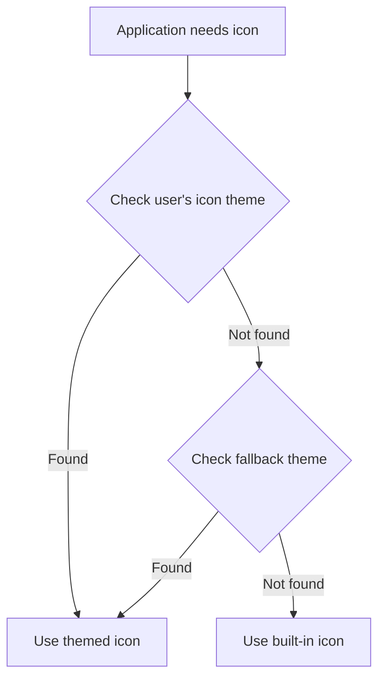

# Debian Icon Themes

## Introduction

Icon themes in Debian are collections of graphical icons that provide a consistent look and feel across your desktop environment and applications. They play a crucial role in the visual experience of your Debian system, making it more personalized and aesthetically pleasing.

In this guide, we'll explore how to install, configure, and even create custom icon themes in Debian. Whether you're looking to give your system a fresh look or developing a consistent theme for an application, understanding icon themes will help you customize your Debian experience.

## Understanding Icon Themes in Debian

### What Are Icon Themes?

Icon themes in Debian are organized collections of icon files (typically PNG or SVG format) that follow specific naming conventions and directory structures. These themes are designed to replace the default system icons across all applications and system components.

### How Icon Themes Work

Debian uses the [XDG Icon Theme Specification](https://specifications.freedesktop.org/icon-theme-spec/icon-theme-spec-latest.html), which is part of the freedesktop.org standards. This specification defines:

1. How icon themes are structured
2. Where themes should be installed
3. How applications find and use the appropriate icons

Icon themes work by providing standardized icons for common actions, applications, and file types. When an application needs to display an icon, it searches for it in the currently selected theme's directory hierarchy.

Let's visualize the icon theme lookup process:



## Installing Icon Themes in Debian

### Using APT (Debian Repositories)

The easiest way to install icon themes is through Debian's package manager. Several popular icon themes are available in the repositories:

```bash
# Update package list
sudo apt update

# Install some popular icon themes
sudo apt install papirus-icon-theme            # Modern and colorful
sudo apt install adwaita-icon-theme            # GNOME default
sudo apt install breeze-icon-theme             # KDE Plasma default
sudo apt install elementary-xfce-icon-theme    # Elementary OS style
```

After installation, you can select these themes through your desktop environment's appearance settings.

### Installing Manually from Archive Files

For themes not available in the repositories, you can install them manually:

1. Download the theme archive (usually .tar.gz or .zip)
2. Extract it to either:
   - `~/.local/share/icons/` (for current user only)
   - `/usr/share/icons/` (for all users, requires sudo)

Here's an example of installing a downloaded theme:

```bash
# For current user only
mkdir -p ~/.local/share/icons
tar -xzf ~/Downloads/awesome-theme.tar.gz -C ~/.local/share/icons/

# OR for all users
sudo tar -xzf ~/Downloads/awesome-theme.tar.gz -C /usr/share/icons/
```

### Using Theme Managers

Some desktop environments provide GUI tools for managing themes:

- GNOME: GNOME Tweaks (`sudo apt install gnome-tweaks`)
- KDE Plasma: System Settings → Appearance → Icons
- XFCE: Settings → Appearance → Icons
- Cinnamon: System Settings → Themes → Icons

## Configuring and Switching Icon Themes

### Command Line Configuration

You can change icon themes via command line for specific desktop environments:

```bash
# For GNOME
gsettings set org.gnome.desktop.interface icon-theme "Papirus"

# For XFCE
xfconf-query -c xsettings -p /Net/IconThemeName -s "Papirus"

# For KDE Plasma
kwriteconfig5 --file kdeglobals --group Icons --key Theme "breeze"
```

### Via Configuration Files

You can also directly edit configuration files:

For GTK-based environments, edit `~/.config/gtk-3.0/settings.ini`:

```ini
[Settings]
gtk-icon-theme-name=Papirus
```

### Making Custom Adjustments

You can override specific icons without creating a full theme:

```bash
# Create a custom icon directory
mkdir -p ~/.local/share/icons/custom-adjustments/apps/scalable/

# Copy your custom icon
cp ~/my-custom-firefox-icon.svg ~/.local/share/icons/custom-adjustments/apps/scalable/firefox.svg
```

Then create an `index.theme` file in the custom-adjustments directory:

```ini
[Icon Theme]
Name=Custom Adjustments
Comment=My personal icon adjustments
Inherits=Papirus,Adwaita,hicolor
```

## Creating Your Own Icon Theme

### Basic Structure

Let's create a simple icon theme from scratch:

```bash
# Create the basic structure
mkdir -p ~/my-icon-theme/{16x16,22x22,24x24,32x32,48x48,scalable}/{actions,apps,devices,places}
```

### Creating the Index File

Every icon theme needs an `index.theme` file in the root directory:

```bash
cat > ~/my-icon-theme/index.theme << 'EOF'
[Icon Theme]
Name=My Custom Theme
Comment=My first Debian icon theme
Directories=16x16/actions,16x16/apps,22x22/actions,22x22/apps,24x24/actions,24x24/apps,32x32/actions,32x32/apps,48x48/actions,48x48/apps,scalable/actions,scalable/apps,16x16/devices,22x22/devices,24x24/devices,32x32/devices,48x48/devices,scalable/devices,16x16/places,22x22/places,24x24/places,32x32/places,48x48/places,scalable/places

[16x16/actions]
Context=Actions
Size=16
Type=Fixed

[16x16/apps]
Context=Applications
Size=16
Type=Fixed

# ... repeat for other directories
EOF
```

### Adding Icons

Now add your custom icons to the appropriate directories:

- For fixed-size icons: Use PNG format in the corresponding size directory
- For scalable icons: Use SVG format in the scalable directory

For example:

```bash
# Copy a 48x48 app icon
cp ~/my-app-icon.png ~/my-icon-theme/48x48/apps/my-app.png

# Copy a scalable icon
cp ~/my-scalable-icon.svg ~/my-icon-theme/scalable/apps/my-app.svg
```

### Installing Your Theme

To use your new theme:

```bash
# Copy to user's icons directory
cp -r ~/my-icon-theme ~/.local/share/icons/

# OR for all users
sudo cp -r ~/my-icon-theme /usr/share/icons/
```

Then select it using your desktop environment's settings.

## Advanced Techniques

### Inheriting from Existing Themes

You can create a partial theme that inherits missing icons from another theme:

```ini
# In your index.theme file
[Icon Theme]
Name=My Custom Theme
Comment=Based on Papirus
Inherits=Papirus,hicolor
```

This way, you only need to create the icons you want to customize.

### Using the `hicolor` Theme

The `hicolor` theme is the fallback theme for all Debian systems. If an icon isn't found in your selected theme or its inheritance chain, the system will look for it in `hicolor`.

### Icon Naming Conventions

Follow the [freedesktop.org Icon Naming Specification](https://specifications.freedesktop.org/icon-naming-spec/icon-naming-spec-latest.html) for compatibility. For example:

- `document-new.svg` for "New Document" action
- `firefox.svg` for the Firefox application
- `folder-home.svg` for the home folder

### Working with SVG Icons

SVG icons are resolution-independent and work well across different display densities. Here's a simple example of an SVG icon:

```xml
<svg xmlns="http://www.w3.org/2000/svg" width="24" height="24" viewBox="0 0 24 24">
  <circle cx="12" cy="12" r="10" fill="#3584e4"/>
  <path d="M8,12 L16,12 M12,8 L12,16" stroke="white" stroke-width="2" stroke-linecap="round"/>
</svg>
```

## Debugging Icon Theme Issues

### Finding Missing Icons

If an application is displaying the wrong icon or a fallback icon, you can debug it:

```bash
# Enable GTK icon debugging
GTK_DEBUG=icontheme your-application
```

### Refreshing Icon Cache

After installing or modifying themes, update the icon cache:

```bash
# For a specific theme
gtk-update-icon-cache ~/.local/share/icons/my-icon-theme

# For all themes (as root)
sudo gtk-update-icon-cache -f /usr/share/icons/*
```

## Practical Example: Creating a Custom Application Icon

Let's create a custom application icon for a hypothetical app called "CodeBuddy":

1. Create an SVG icon with a text editor:

```xml
<svg xmlns="http://www.w3.org/2000/svg" width="48" height="48" viewBox="0 0 48 48">
  <rect x="4" y="4" width="40" height="40" rx="6" fill="#34a853"/>
  <text x="24" y="30" font-family="Sans" font-size="24" text-anchor="middle" fill="white">CB</text>
</svg>
```

2. Save this as `codebuddy.svg` in your theme's appropriate directories:

```bash
cp codebuddy.svg ~/my-icon-theme/scalable/apps/
# Create raster versions for fixed sizes
for size in 16 22 24 32 48; do
  rsvg-convert -w $size -h $size codebuddy.svg > ~/my-icon-theme/${size}x${size}/apps/codebuddy.png
done
```

3. Update the icon cache:

```bash
gtk-update-icon-cache ~/.local/share/icons/my-icon-theme
```

4. Create a desktop file to use the icon:

```bash
cat > ~/.local/share/applications/codebuddy.desktop << 'EOF'
[Desktop Entry]
Name=CodeBuddy
Exec=codebuddy
Icon=codebuddy
Type=Application
Categories=Development;
EOF
```

## Summary

In this guide, we've explored Debian icon themes in depth:

- We learned how icon themes work within the XDG specification
- We covered multiple ways to install themes: from repositories, manually, and via GUI tools
- We explored how to configure and switch between themes
- We created a basic icon theme from scratch
- We dived into advanced techniques like theme inheritance and SVG icons
- We walked through a practical example of creating a custom application icon

By understanding icon themes, you now have the knowledge to fully customize the look and feel of your Debian system or create consistent icon themes for your applications.

## Additional Resources

- [XDG Icon Theme Specification](https://specifications.freedesktop.org/icon-theme-spec/icon-theme-spec-latest.html)
- [Icon Naming Specification](https://specifications.freedesktop.org/icon-naming-spec/icon-naming-spec-latest.html)
- [Debian Wiki: Icon Themes](https://wiki.debian.org/IconThemes)
- [Inkscape](https://inkscape.org/) - Free SVG editor perfect for creating icons

## Exercises

1. Install three different icon themes and compare their styles and completeness.
2. Create a simple icon theme that inherits from an existing theme but customizes the folder icons.
3. Design a custom application icon for your favorite program and integrate it into your system.
4. Write a bash script that can switch between icon themes based on the time of day (light theme during day, dark theme at night).
5. Find an application with a missing or outdated icon and create a better replacement for it.