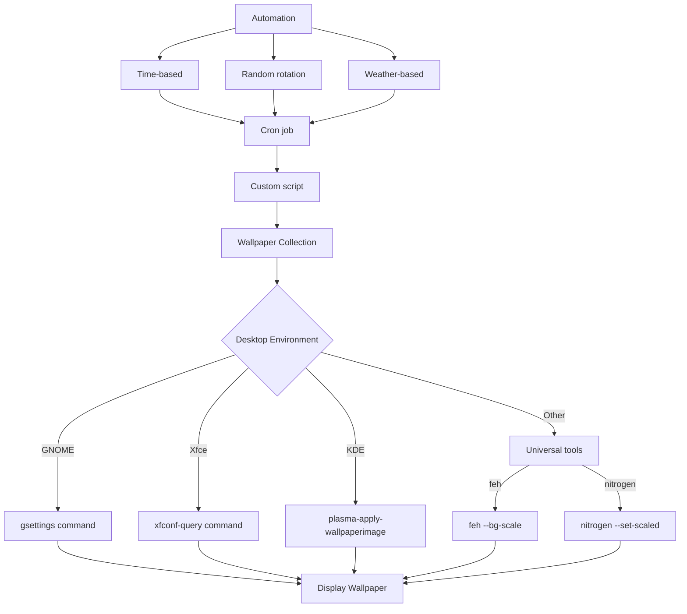

# Debian Wallpaper Management

## Introduction

Wallpapers are an essential part of personalizing your Debian desktop environment. While it might seem like a simple aesthetic choice, properly managing wallpapers in Debian involves understanding various desktop environments, configuration files, and command-line tools. This guide will walk you through everything you need to know about managing wallpapers in Debian, from basic methods to advanced automation techniques.

## Desktop Environments and Wallpaper Handling

Different desktop environments in Debian handle wallpapers differently. Let's explore the most common ones:

### GNOME

GNOME is the default desktop environment for Debian. To change wallpapers in GNOME:

```bash
# Set wallpaper via command line
gsettings set org.gnome.desktop.background picture-uri 'file:///path/to/your/image.jpg'

# For dark mode wallpaper
gsettings set org.gnome.desktop.background picture-uri-dark 'file:///path/to/your/dark-image.jpg'
```

### Xfce

Xfce is a lightweight desktop environment. You can manage wallpapers with:

```bash
# Set wallpaper for all monitors
xfconf-query -c xfce4-desktop -p /backdrop/screen0/monitor0/workspace0/last-image -s /path/to/your/image.jpg

# Refresh the desktop
xfdesktop --reload
```

### KDE Plasma

KDE offers powerful customization options:

```bash
# Using plasma-apply-wallpaperimage
plasma-apply-wallpaperimage /path/to/your/image.jpg
```

### LXDE/LXQt

For the lightweight LXDE/LXQt environments:

```bash
# LXDE
pcmanfm --set-wallpaper=/path/to/your/image.jpg

# LXQt
pcmanfm-qt --set-wallpaper=/path/to/your/image.jpg --wallpaper-mode=stretch
```

## Universal Methods

If you prefer a desktop environment-agnostic approach, there are several tools available:

### feh

`feh` is a lightweight image viewer that can also set wallpapers:

```bash
# Install feh
sudo apt install feh

# Set wallpaper
feh --bg-scale /path/to/your/image.jpg

# To make it persistent, add to ~/.xinitrc or ~/.xprofile
echo 'feh --bg-scale /path/to/your/image.jpg' >> ~/.xprofile
```

### nitrogen

Nitrogen is a GUI wallpaper manager that works with most window managers:

```bash
# Install nitrogen
sudo apt install nitrogen

# Set up nitrogen (GUI will open)
nitrogen /path/to/wallpaper/directory

# For persistence, add to startup
echo 'nitrogen --restore' >> ~/.xprofile
```

## Creating a Wallpaper Directory Structure

Organizing your wallpapers properly can make management easier:

```bash
# Create a wallpaper directory structure
mkdir -p ~/Pictures/Wallpapers/{Nature,Abstract,Minimal,Seasonal}

# Example structure
# ~/Pictures/Wallpapers/
# ├── Nature/
# ├── Abstract/
# ├── Minimal/
# └── Seasonal/
#     ├── Spring/
#     ├── Summer/
#     ├── Fall/
#     └── Winter/
```

## Automated Wallpaper Rotation

### Using cron

You can use cron to schedule wallpaper changes:

```bash
# Open crontab
crontab -e

# Add a line to change wallpaper every hour (for GNOME)
0 * * * * gsettings set org.gnome.desktop.background picture-uri "file://$(find /home/username/Pictures/Wallpapers -type f | shuf -n1)"
```

### Create a Wallpaper Rotation Script

For more control, create a custom script:

```bash
#!/bin/bash
# Save as ~/bin/change-wallpaper.sh

WALLPAPER_DIR="$HOME/Pictures/Wallpapers"
RANDOM_WALLPAPER=$(find "$WALLPAPER_DIR" -type f \( -name "*.jpg" -o -name "*.png" \) | shuf -n1)

# Detect desktop environment and set accordingly
if [ "$XDG_CURRENT_DESKTOP" = "GNOME" ]; then
    gsettings set org.gnome.desktop.background picture-uri "file://$RANDOM_WALLPAPER"
elif [ "$XDG_CURRENT_DESKTOP" = "XFCE" ]; then
    xfconf-query -c xfce4-desktop -p /backdrop/screen0/monitor0/workspace0/last-image -s "$RANDOM_WALLPAPER"
elif [ "$XDG_CURRENT_DESKTOP" = "KDE" ]; then
    plasma-apply-wallpaperimage "$RANDOM_WALLPAPER"
else
    # Fallback to feh
    feh --bg-scale "$RANDOM_WALLPAPER"
fi

echo "Wallpaper changed to: $RANDOM_WALLPAPER"
```

Make it executable and set up a cron job:

```bash
chmod +x ~/bin/change-wallpaper.sh
crontab -e
# Add:
0 */3 * * * ~/bin/change-wallpaper.sh
```

## Time-Based Wallpapers

You can set different wallpapers based on the time of day:

```bash
#!/bin/bash
# Save as ~/bin/time-wallpaper.sh

WALLPAPER_DIR="$HOME/Pictures/Wallpapers"
HOUR=$(date +%H)

# Set wallpaper based on time
if [ $HOUR -ge 6 -a $HOUR -lt 12 ]; then
    # Morning (6 AM - 12 PM)
    WALLPAPER="$WALLPAPER_DIR/morning.jpg"
elif [ $HOUR -ge 12 -a $HOUR -lt 18 ]; then
    # Afternoon (12 PM - 6 PM)
    WALLPAPER="$WALLPAPER_DIR/afternoon.jpg"
elif [ $HOUR -ge 18 -a $HOUR -lt 22 ]; then
    # Evening (6 PM - 10 PM)
    WALLPAPER="$WALLPAPER_DIR/evening.jpg"
else
    # Night (10 PM - 6 AM)
    WALLPAPER="$WALLPAPER_DIR/night.jpg"
fi

# Set the wallpaper (using GNOME in this example)
gsettings set org.gnome.desktop.background picture-uri "file://$WALLPAPER"
```

## Weather-Based Wallpapers

For advanced users, you can change wallpapers based on the current weather:

```bash
#!/bin/bash
# Save as ~/bin/weather-wallpaper.sh

WALLPAPER_DIR="$HOME/Pictures/Wallpapers/Weather"
API_KEY="your_weather_api_key"
CITY="your_city"
WEATHER_URL="http://api.openweathermap.org/data/2.5/weather?q=$CITY&appid=$API_KEY"

# Get current weather condition
WEATHER_CONDITION=$(curl -s "$WEATHER_URL" | jq -r '.weather[0].main')

# Set wallpaper based on weather
case $WEATHER_CONDITION in
    "Clear")
        WALLPAPER="$WALLPAPER_DIR/sunny.jpg"
        ;;
    "Clouds")
        WALLPAPER="$WALLPAPER_DIR/cloudy.jpg"
        ;;
    "Rain"|"Drizzle")
        WALLPAPER="$WALLPAPER_DIR/rainy.jpg"
        ;;
    "Snow")
        WALLPAPER="$WALLPAPER_DIR/snowy.jpg"
        ;;
    "Thunderstorm")
        WALLPAPER="$WALLPAPER_DIR/stormy.jpg"
        ;;
    *)
        WALLPAPER="$WALLPAPER_DIR/default.jpg"
        ;;
esac

# Set the wallpaper (using GNOME in this example)
gsettings set org.gnome.desktop.background picture-uri "file://$WALLPAPER"
```

For this script to work, you'll need:
```bash
sudo apt install jq curl
```

## Wallpaper System Workflow

Here's a visual representation of how the wallpaper management system works:



## Performance Considerations

Keep these factors in mind when managing wallpapers:

1. **File format**: Use optimized JPG or PNG files for faster loading
2. **Resolution**: Match your screen resolution for best quality
3. **File size**: Large images can consume memory, especially on low-resource systems

```bash
# Optimize wallpaper file size (requires imagemagick)
sudo apt install imagemagick
convert large-wallpaper.jpg -quality 85% optimized-wallpaper.jpg
```

## Advanced Tweaks

### Monitor-Specific Wallpapers

For multi-monitor setups, you can set different wallpapers on each screen:

```bash
# For GNOME with multi-monitor
gsettings set org.gnome.desktop.background picture-uri 'file:///path/to/primary.jpg'
gsettings set org.gnome.desktop.background picture-uri-dark 'file:///path/to/primary-dark.jpg'

# For specific monitors in Xfce
xfconf-query -c xfce4-desktop -p /backdrop/screen0/monitor0/workspace0/last-image -s /path/to/monitor1.jpg
xfconf-query -c xfce4-desktop -p /backdrop/screen0/monitor1/workspace0/last-image -s /path/to/monitor2.jpg
```

### Slideshow Mode

Create a simple slideshow mode:

```bash
#!/bin/bash
# Save as ~/bin/wallpaper-slideshow.sh

WALLPAPER_DIR="$HOME/Pictures/Wallpapers"
INTERVAL=300  # Change wallpaper every 5 minutes

while true; do
    RANDOM_WALLPAPER=$(find "$WALLPAPER_DIR" -type f \( -name "*.jpg" -o -name "*.png" \) | shuf -n1)
    gsettings set org.gnome.desktop.background picture-uri "file://$RANDOM_WALLPAPER"
    echo "Wallpaper changed to: $RANDOM_WALLPAPER"
    sleep $INTERVAL
done
```

To use it:
```bash
# Run in background
nohup ~/bin/wallpaper-slideshow.sh &
```

## Troubleshooting Common Issues

### Wallpaper Not Applying

If your wallpaper doesn't apply correctly:

```bash
# Check image permissions
chmod 644 /path/to/wallpaper.jpg

# Verify file format compatibility
file /path/to/wallpaper.jpg
```

### Wallpaper Reset After Reboot

To ensure wallpapers persist after reboots:

```bash
# For feh
echo 'feh --bg-scale /path/to/your/image.jpg' >> ~/.xprofile

# For GNOME autostart
mkdir -p ~/.config/autostart
cat > ~/.config/autostart/wallpaper.desktop << EOF
[Desktop Entry]
Type=Application
Exec=/bin/bash -c "sleep 5 && gsettings set org.gnome.desktop.background picture-uri 'file:///path/to/your/image.jpg'"
Hidden=false
X-GNOME-Autostart-enabled=true
Name=Wallpaper Setter
Comment=Sets the wallpaper on startup
EOF
```

## Summary

We've covered a comprehensive range of techniques for managing wallpapers in Debian:

- Basic wallpaper setting across different desktop environments
- Universal tools like feh and nitrogen
- Organizing wallpapers efficiently
- Automated rotation using cron and custom scripts
- Time-based and weather-based wallpaper changes
- Multi-monitor setups and slideshow mode
- Troubleshooting common wallpaper issues

Effective wallpaper management can enhance your desktop experience and help you create a personalized work environment that adapts to your preferences and needs.

## Additional Resources

- Desktop environment documentation:
  - [GNOME Documentation](https://help.gnome.org/)
  - [Xfce Documentation](https://docs.xfce.org/)
  - [KDE Documentation](https://docs.kde.org/)
- Tools documentation:
  - `man gsettings`
  - `man xfconf-query`
  - `man feh`
  - `man nitrogen`

## Exercises

1. Create a basic wallpaper rotation script that changes your wallpaper daily.
2. Set up a seasonal wallpaper system that changes wallpapers based on the current month.
3. Configure your system to display different wallpapers for weekdays and weekends.
4. Create a script that sets a random wallpaper from a specific category based on user input.
5. Implement a system that gradually transitions between light and dark wallpapers based on sunrise and sunset times.