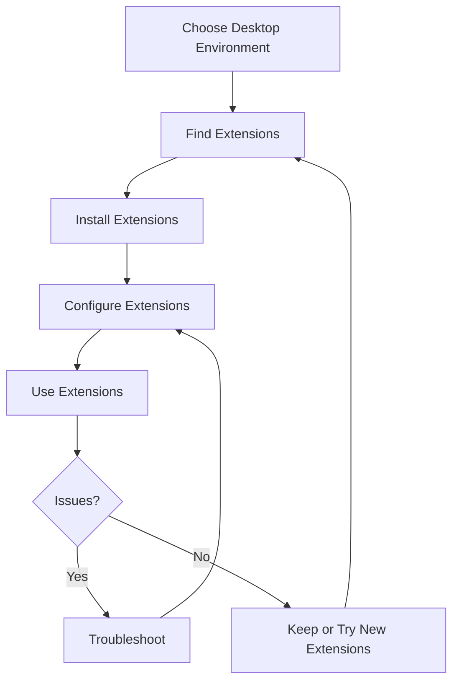

# Debian Desktop Extensions

## Introduction

Desktop extensions in Debian are powerful tools that allow you to customize and enhance your desktop environment's functionality and appearance. Whether you're using GNOME, KDE, Xfce, or another desktop environment, extensions provide a way to modify your interface without having to edit core system files or write complex programs.

In this guide, we'll explore how to find, install, manage, and even create basic desktop extensions for the most popular Debian desktop environments. By the end, you'll be able to transform your Debian desktop into a personalized workspace that suits your workflow and preferences.

## Understanding Desktop Environments and Extensions

Before diving into extensions, it's important to understand what a desktop environment is and how extensions fit into the ecosystem.

### What is a Desktop Environment?

A desktop environment (DE) is a collection of software that provides a graphical interface for your operating system. In Debian, popular desktop environments include:

- GNOME
- KDE Plasma
- Xfce
- MATE
- Cinnamon
- LXQt

Each environment has its own architecture, appearance, and extension system.

### What are Desktop Extensions?

Desktop extensions are add-ons that modify or enhance the functionality of your desktop environment. They can:

- Add new features to your desktop
- Modify existing functionality
- Change the appearance of interface elements
- Integrate new applications or services
- Optimize your workflow

## GNOME Extensions

GNOME is the default desktop environment in many Debian installations, so we'll start with its extension system.

### Installing GNOME Extensions

First, you'll need to install the browser integration and the extensions management tool:

```bash
sudo apt update
sudo apt install gnome-shell-extensions gnome-shell-extension-manager chrome-gnome-shell
```

The `chrome-gnome-shell` package works with both Firefox and Chrome/Chromium browsers, despite its name.

Next, install the browser extension:
- For Firefox: [GNOME Shell Integration](https://addons.mozilla.org/en-US/firefox/addon/gnome-shell-integration/)
- For Chrome/Chromium: [GNOME Shell Integration](https://chrome.google.com/webstore/detail/gnome-shell-integration/gphhapmejobijbbhgpjhcjognlahblep)

### Finding and Installing Extensions

You can browse and install extensions from:

1. The GNOME Extensions website:
```bash
firefox https://extensions.gnome.org
```

2. Or use the Extension Manager application:
```bash
gnome-extension-manager
```

### Example: Installing the "Dash to Dock" Extension

Dash to Dock is a popular extension that transforms the GNOME dash into a more customizable dock.

Using the Extension Manager:
1. Open Extension Manager
2. Search for "Dash to Dock"
3. Click "Install"

Using the command line:
```bash
sudo apt install gnome-shell-extension-dash-to-dock
```

After installation, enable it through the Extensions app or with:
```bash
gnome-extensions enable dash-to-dock@micxgx.gmail.com
```

### Managing GNOME Extensions

You can manage your extensions through:

1. The Extensions application
```bash
gnome-extensions-app
```

2. Or using command line:
```bash
# List all installed extensions
gnome-extensions list

# Enable an extension
gnome-extensions enable extension-id

# Disable an extension
gnome-extensions disable extension-id
```

### Creating a Simple GNOME Extension

Let's create a basic "Hello World" GNOME extension:

1. Create the extension directory structure:
```bash
mkdir -p ~/.local/share/gnome-shell/extensions/hello-world@example.com
cd ~/.local/share/gnome-shell/extensions/hello-world@example.com
```

2. Create a metadata.json file:
```json
{
  "name": "Hello World",
  "description": "A simple example extension",
  "uuid": "hello-world@example.com",
  "shell-version": ["40", "41", "42", "43", "44"],
  "url": "",
  "version": 1
}
```

3. Create the extension.js file:
```javascript
/* extension.js */
const { St, Clutter } = imports.gi;
const Main = imports.ui.main;
const PanelMenu = imports.ui.panelMenu;
const PopupMenu = imports.ui.popupMenu;
const ExtensionUtils = imports.misc.extensionUtils;
const Me = ExtensionUtils.getCurrentExtension();

class HelloWorldMenuButton extends PanelMenu.Button {
    constructor() {
        super(0.0, "Hello World Button");
        
        let box = new St.BoxLayout();
        let icon = new St.Icon({
            icon_name: 'face-smile-symbolic',
            style_class: 'system-status-icon'
        });
        
        box.add(icon);
        this.add_child(box);
        
        let menuItem = new PopupMenu.PopupMenuItem("Hello World!");
        this.menu.addMenuItem(menuItem);
        
        menuItem.connect('activate', () => {
            Main.notify("Hello World Extension", "You clicked the menu item!");
        });
    }
}

let button;

function init() {
    // Called when the extension is loaded
}

function enable() {
    // Called when the extension is enabled
    button = new HelloWorldMenuButton();
    Main.panel.addToStatusArea('hello-world', button, 0, 'right');
}

function disable() {
    // Called when the extension is disabled
    button.destroy();
    button = null;
}
```

4. Restart GNOME Shell:
   - On X11: Press ALT+F2, type 'r' and press Enter
   - On Wayland: Log out and log back in

5. Enable the extension:
```bash
gnome-extensions enable hello-world@example.com
```

You should now see a smiley face icon in your panel that, when clicked, shows a "Hello World" menu item.

## KDE Plasma Extensions

KDE Plasma uses different types of extensions called Plasmoids, themes, and services.

### Installing KDE Plasma Extensions

You can install KDE extensions through:

1. System Settings:
```bash
systemsettings5
```
Go to "Workspace" > "Plasma Style" or "Icons" or other categories depending on what you want to customize.

2. The Get New Stuff dialog within widgets, themes, etc.

3. Command line:
```bash
sudo apt install plasma-widgets-addons
```

### Example: Adding a Widget to the Panel

1. Right-click on the desktop or panel and select "Add Widgets"
2. Browse the available widgets or click "Get New Widgets"
3. Select a widget you like and click "Install"
4. After installation, drag it to your panel or desktop

### Creating a Simple Plasmoid

Let's create a basic Hello World Plasmoid:

1. Install the required tools:
```bash
sudo apt install build-essential cmake extra-cmake-modules kio-dev
```

2. Create a directory for your plasmoid:
```bash
mkdir -p ~/plasmoid-hello-world
cd ~/plasmoid-hello-world
```

3. Create the metadata.desktop file:
```ini
[Desktop Entry]
Name=Hello World
Comment=A simple plasmoid example
Icon=face-smile
Type=Service
X-KDE-ServiceTypes=Plasma/Applet

X-Plasma-API=declarative
X-Plasma-MainScript=ui/main.qml

X-KDE-PluginInfo-Author=Your Name
X-KDE-PluginInfo-Email=your.email@example.com
X-KDE-PluginInfo-Name=org.kde.plasma.helloworld
X-KDE-PluginInfo-Version=1.0
X-KDE-PluginInfo-Website=https://example.com
X-KDE-PluginInfo-Category=Examples
X-KDE-PluginInfo-License=GPL
```

4. Create the directory structure and main QML file:
```bash
mkdir -p contents/ui
```

5. Create contents/ui/main.qml:
```qml
import QtQuick 2.0
import QtQuick.Layouts 1.1
import org.kde.plasma.components 3.0 as PlasmaComponents
import org.kde.plasma.plasmoid 2.0
import org.kde.plasma.core 2.0 as PlasmaCore

Item {
    Plasmoid.fullRepresentation: ColumnLayout {
        PlasmaComponents.Button {
            text: "Click me!"
            Layout.alignment: Qt.AlignHCenter
            onClicked: {
                greeting.visible = !greeting.visible
            }
        }
        
        PlasmaComponents.Label {
            id: greeting
            text: "Hello, Plasma!"
            Layout.alignment: Qt.AlignHCenter
            visible: false
        }
    }
}
```

6. Create a package:
```bash
mkdir -p ~/plasmoid-build
cd ~/plasmoid-build
zip -r helloworld.plasmoid ~/plasmoid-hello-world/*
```

7. Install the plasmoid:
```bash
plasmapkg2 -i helloworld.plasmoid
```

8. To see your widget, right-click on the desktop or panel, choose "Add Widgets" and find "Hello World"

## Xfce Extensions

Xfce uses panel plugins as its primary extension mechanism.

### Installing Xfce Panel Plugins

```bash
sudo apt update
sudo apt install xfce4-goodies
```

This package includes many useful Xfce plugins.

### Adding a Panel Plugin

1. Right-click on a panel and select "Panel" > "Add New Items"
2. Browse the list of available plugins
3. Select the one you want and click "Add"

### Example: Adding the Weather Plugin

1. Install the weather plugin:
```bash
sudo apt install xfce4-weather-plugin
```

2. Right-click on your panel and select "Panel" > "Add New Items"
3. Find "Weather Update" and click "Add"
4. Configure the plugin by right-clicking on it and selecting "Properties"

## Customizing Multiple Desktop Environments

If you switch between different desktop environments, here are some universal customization tools:

### GTK Themes

GTK themes affect the appearance of applications in GNOME, Xfce, MATE, and other GTK-based environments:

1. Install themes:
```bash
sudo apt install arc-theme papirus-icon-theme
```

2. Apply themes using your DE's appearance settings or with:
```bash
# For GTK3
gsettings set org.gnome.desktop.interface gtk-theme "Arc-Dark"
gsettings set org.gnome.desktop.interface icon-theme "Papirus"
```

### Qt Themes

For KDE and other Qt-based applications:

1. Install the Qt style bridge:
```bash
sudo apt install qt5-style-plugins
```

2. Create or edit ~/.profile to add:
```bash
export QT_QPA_PLATFORMTHEME=gtk2
```

This makes Qt applications use your GTK theme for a more consistent look.

## Creating Extension Packs with Scripts

You can create a script to install and configure your favorite extensions all at once:

```bash
#!/bin/bash

# Detect desktop environment
if [ "$XDG_CURRENT_DESKTOP" = "GNOME" ]; then
    echo "Installing GNOME extensions..."
    sudo apt install -y gnome-shell-extensions gnome-shell-extension-dash-to-dock
    
    # Configure extensions
    gsettings set org.gnome.shell.extensions.dash-to-dock dock-position 'BOTTOM'
    
elif [ "$XDG_CURRENT_DESKTOP" = "KDE" ]; then
    echo "Installing KDE extensions..."
    sudo apt install -y plasma-widgets-addons
    
elif [ "$XDG_CURRENT_DESKTOP" = "XFCE" ]; then
    echo "Installing Xfce plugins..."
    sudo apt install -y xfce4-goodies
fi

# Common themes and icons
sudo apt install -y arc-theme papirus-icon-theme

echo "Installation complete!"
```

Save this script as `install-extensions.sh`, make it executable with `chmod +x install-extensions.sh`, and run it with `./install-extensions.sh`.

## Desktop Extension Workflow Diagram

Here's a diagram showing the lifecycle of desktop extensions:



## Common Extension Categories

Here's a breakdown of useful extension categories to consider for your Debian desktop:

1. **System Monitoring**
   - CPU/Memory usage
   - Network traffic
   - Disk space

2. **Productivity**
   - Workspace management
   - Window tiling
   - Application launchers

3. **Appearance**
   - Themes
   - Icon packs
   - Desktop widgets

4. **Functionality**
   - Media controls
   - Clipboard managers
   - Notification enhancements

## Troubleshooting Extensions

When extensions don't work as expected:

1. Check compatibility with your DE version
2. Look for error messages in logs:
```bash
# For GNOME
journalctl -f -o cat /usr/bin/gnome-shell

# For KDE
journalctl -f -o cat /usr/bin/plasmashell

# For Xfce
journalctl -f -o cat /usr/bin/xfce4-panel
```

3. Disable other extensions to check for conflicts
4. Reset to default settings if needed:
```bash
# For GNOME
dconf reset -f /org/gnome/shell/extensions/

# For KDE
mv ~/.config/plasma-org.kde.plasma.desktop-appletsrc ~/.config/plasma-org.kde.plasma.desktop-appletsrc.bak
```

## Summary

Desktop extensions offer a powerful way to customize your Debian desktop experience without advanced technical skills. We've covered:

- The basics of desktop environments and extensions
- Installation and configuration for GNOME, KDE, and Xfce extensions
- Creating simple extensions for different desktop environments
- Universal customization techniques
- Automating extension installation with scripts
- Troubleshooting common issues

By leveraging these tools, you can transform a standard Debian desktop into a personalized environment that enhances your productivity and enjoyment.

## Additional Resources

- [GNOME Extensions Website](https://extensions.gnome.org/)
- [KDE Store](https://store.kde.org/)
- [Xfce Wiki](https://wiki.xfce.org/)
- [Debian Wiki - Desktop Environment](https://wiki.debian.org/DesktopEnvironment)

## Exercises

1. Install a system monitoring extension for your desktop environment and configure it to show CPU and memory usage.
2. Create a simple "Hello World" extension for your preferred desktop environment.
3. Write a script that installs and configures your favorite extensions automatically.
4. Create a custom theme by modifying an existing one (hint: copy an existing theme to ~/.themes and edit the CSS files).
5. Design an extension that solves a specific workflow issue you encounter daily.