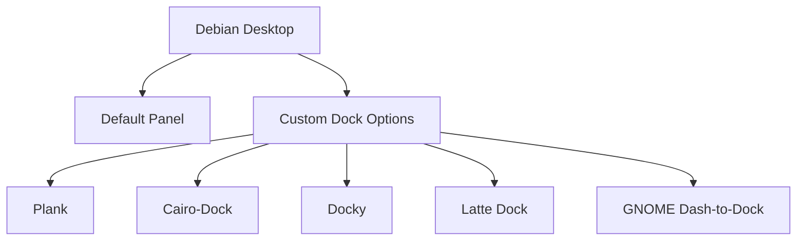

# Debian Dock Customization

## Introduction

A dock is a graphical user interface element that allows users to quickly access their favorite applications, running programs, and system functions. In Debian Linux, customizing your dock can significantly improve your workflow and overall desktop experience. This guide will walk you through various dock options in Debian, how to install them, and how to customize their appearance and functionality to match your preferences.

## Understanding Docks in Debian

Unlike macOS or Windows, Debian doesn't come with a built-in dock by default. Instead, users can choose from several dock applications that offer different features, aesthetics, and levels of customization. This flexibility is one of the strengths of Debian and Linux systems in general.



## Popular Dock Options for Debian

### 1. Plank

Plank is a lightweight, simple dock that follows the "less is more" philosophy. It's perfect for beginners and users who want a clean, minimalist dock.

#### Installation

```bash
sudo apt update
sudo apt install plank
```

#### Basic Configuration

Plank stores its configuration in `~/.config/plank/dock1/settings`. You can edit this file directly, or use Plank's preferences dialog:

```bash
plank --preferences
```

#### Example Customization

```bash
# To make Plank start automatically at login
mkdir -p ~/.config/autostart
cat > ~/.config/autostart/plank.desktop << EOF
[Desktop Entry]
Type=Application
Name=Plank
Exec=plank
Comment=Plank Dock
Icon=plank
Terminal=false
NoDisplay=false
X-GNOME-Autostart-enabled=true
EOF
```

### 2. Cairo-Dock

Cairo-Dock (also known as Glx-Dock) is a feature-rich, highly customizable dock with many plugins and visual effects.

#### Installation

```bash
sudo apt update
sudo apt install cairo-dock cairo-dock-plug-ins
```

#### Basic Configuration

Cairo-Dock comes with a configuration interface that you can access by right-clicking on the dock and selecting "Cairo-Dock" > "Configure".

#### Example: Adding Custom Launchers

1. Right-click on the dock
2. Select "Cairo-Dock" > "Add" > "Custom launcher"
3. Fill in the details:

```
Name: Firefox
Command: firefox
Icon: /usr/share/icons/hicolor/48x48/apps/firefox.png
```

### 3. GNOME Dash-to-Dock

If you're using GNOME Desktop Environment (which comes with some Debian installations), Dash-to-Dock extends the GNOME Dash into a dock.

#### Installation

```bash
sudo apt update
sudo apt install gnome-shell-extension-dash-to-dock
```

After installation, use GNOME Extensions to enable and configure it:

```bash
sudo apt install gnome-shell-extension-prefs
gnome-extensions-app
```

## Step-by-Step Dock Customization Guide

Let's walk through a complete customization example using Plank, which is a great starting point for beginners.

### Step 1: Install Plank

```bash
sudo apt update
sudo apt install plank
```

### Step 2: Launch Plank

```bash
plank
```

### Step 3: Configure Autostart

Create an autostart entry as shown in the example above to make Plank start automatically when you log in.

### Step 4: Basic Appearance Customization

Open Plank preferences:

```bash
plank --preferences
```

From here, you can customize:
- Theme (Appearance)
- Position (Top, Bottom, Left, Right)
- Alignment (Start, Center, End)
- Icon size
- Hiding mode (Intelligent, Auto, Dodge active window, etc.)

### Step 5: Adding Application Launchers

The simplest way to add applications to Plank is to:
1. Open the application from your application menu
2. Right-click on its icon in Plank
3. Select "Keep in dock"

### Step 6: Advanced Customization with Dconf Editor

For more advanced options, you can use dconf-editor:

```bash
sudo apt install dconf-editor
dconf-editor /net/launchpad/plank/docks/
```

Example of what you can modify:
- `pressure-reveal` - Enable edge pressure sensitivity
- `theme` - Set a custom theme
- `zoom-enabled` - Enable zoom effects
- `zoom-percent` - Set zoom level

## Practical Examples

### Example 1: Creating a macOS-like Dock Experience

If you want your Debian system to feel more like macOS:

```bash
# Install Plank
sudo apt install plank

# Create a theme directory
mkdir -p ~/.local/share/plank/themes/macOS

# Create the theme file
cat > ~/.local/share/plank/themes/macOS/dock.theme << EOF
[PlankTheme]
TopRoundness=4
BottomRoundness=0
LineWidth=1
OuterStrokeColor=0;;0;;0;;0
FillStartColor=200;;200;;200;;200
FillEndColor=200;;200;;200;;200
InnerStrokeColor=0;;0;;0;;0

[PlankDockTheme]
HorizPadding=7
TopPadding=-11
BottomPadding=2
ItemPadding=3
IndicatorSize=5
IconShadowSize=1
UrgentBounceHeight=1.6666666666666667
LaunchBounceHeight=0.625
FadeOpacity=1
ClickTime=300
UrgentBounceTime=600
LaunchBounceTime=600
ActiveTime=300
SlideTime=300
FadeTime=250
HideTime=150
GlowSize=30
GlowTime=10000
GlowPulseTime=2000
UrgentHueShift=150
ItemMoveTime=450
CascadeHide=true
EOF

# Set theme and position
dconf write /net/launchpad/plank/docks/dock1/theme "'macOS'"
dconf write /net/launchpad/plank/docks/dock1/position "'bottom'"
dconf write /net/launchpad/plank/docks/dock1/alignment "'center'"
dconf write /net/launchpad/plank/docks/dock1/zoom-enabled true
dconf write /net/launchpad/plank/docks/dock1/zoom-percent 150
```

### Example 2: Setting Up a Developer-Focused Dock

For a dock optimized for programming tasks:

```bash
# Install Cairo-Dock for more advanced features
sudo apt install cairo-dock cairo-dock-plug-ins

# Create a script to set up developer launchers
cat > ~/setup-dev-dock.sh << EOF
#!/bin/bash
# This script adds common developer tools to Cairo-Dock

# Create developer dock section
cairo-dock --add-separator "Developer Tools"

# Add VSCode
cairo-dock --add-launcher "Visual Studio Code;code;/usr/share/icons/visual-studio-code.png"

# Add Terminal
cairo-dock --add-launcher "Terminal;gnome-terminal;/usr/share/icons/gnome/48x48/apps/utilities-terminal.png"

# Add Git GUI
cairo-dock --add-launcher "GitKraken;gitkraken;/usr/share/icons/gitkraken.png"

# Add Browser
cairo-dock --add-launcher "Firefox;firefox;/usr/share/icons/hicolor/48x48/apps/firefox.png"

# Add Database Tool
cairo-dock --add-launcher "DBeaver;dbeaver;/usr/share/icons/hicolor/48x48/apps/dbeaver.png"

# Set dock to vertical layout on left side
gsettings set org.cairo-dock.cairo-dock dock-position left
EOF

# Make script executable
chmod +x ~/setup-dev-dock.sh

# Run the script
~/setup-dev-dock.sh
```

Note: You might need to adjust the paths to your specific system's icon locations.

## Troubleshooting Common Issues

### Dock Doesn't Start at Login

If your dock doesn't start automatically:

1. Verify your autostart entry is correct:
   ```bash
   cat ~/.config/autostart/plank.desktop
   ```

2. Ensure the executable path is correct:
   ```bash
   which plank
   ```

3. Check for any error messages:
   ```bash
   plank --verbose
   ```

### Icons Don't Appear Correctly

If icons are missing or showing generic icons:

1. Ensure icon themes are installed:
   ```bash
   sudo apt install gnome-icon-theme papirus-icon-theme
   ```

2. Verify the icon paths in your launcher configuration

### Dock Conflicts with Panels

If your dock overlaps with existing panels:

1. For Plank, adjust the dock offset:
   ```bash
   dconf write /net/launchpad/plank/docks/dock1/offset 10
   ```

2. Or change the position to a different edge of the screen:
   ```bash
   dconf write /net/launchpad/plank/docks/dock1/position "'left'"
   ```

## Summary

Customizing your dock in Debian is a powerful way to enhance your desktop experience and boost productivity. We've explored various dock options available in Debian, focusing on:

- **Plank** for a lightweight, simple solution
- **Cairo-Dock** for advanced customization and effects
- **GNOME Dash-to-Dock** for GNOME desktop users

We've walked through installation, basic and advanced configuration, and provided practical examples for specific use cases. By following this guide, you should be able to create a dock setup that matches your workflow and aesthetic preferences.

## Additional Resources

- [Plank Documentation](http://wiki.go-docky.com/index.php?title=Plank:Introduction)
- [Cairo-Dock Wiki](http://glx-dock.org/)
- [GNOME Extensions Website](https://extensions.gnome.org/)

## Exercises

1. Install and configure Plank with a custom theme of your choice.
2. Create a themed dock that matches your desktop wallpaper and color scheme.
3. Set up keyboard shortcuts to toggle your dock's visibility.
4. Configure Cairo-Dock with at least three custom application launchers for your most-used programs.
5. Experiment with different dock positions and observe how it affects your workflow over a day of use.