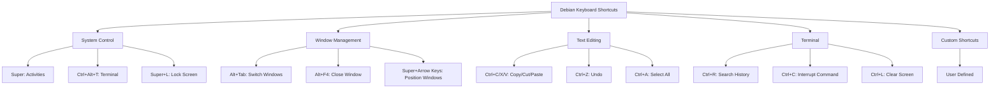

# Debian Keyboard Shortcuts

## Introduction

Keyboard shortcuts are combinations of keys that, when pressed simultaneously or in sequence, perform specific actions in your operating system. In Debian Linux, mastering keyboard shortcuts can significantly enhance your productivity, reduce dependency on the mouse, and speed up your workflow. This guide will introduce you to essential keyboard shortcuts in Debian, explain how they work, and show you how to customize them to match your needs.

## Why Use Keyboard Shortcuts?

Using keyboard shortcuts offers several advantages:

- **Speed**: Executing commands with keyboard shortcuts is faster than navigating through menus
- **Efficiency**: Your hands stay on the keyboard, reducing the need to switch between keyboard and mouse
- **Accessibility**: Important for users with mobility impairments who may find mouse usage difficult
- **Reduced Strain**: Less mouse movement can reduce repetitive strain injuries

## Default Debian Desktop Environment Shortcuts

Debian can use various desktop environments (GNOME, KDE, XFCE, etc.), each with its own set of keyboard shortcuts. The shortcuts below focus on GNOME, which is Debian's default desktop environment.

### System Control Shortcuts

| Shortcut | Action |
|----------|--------|
| `Alt + F1` or `Super` | Open Activities overview |
| `Alt + F2` | Open run command dialog |
| `Ctrl + Alt + T` | Open terminal |
| `Ctrl + Alt + L` | Lock screen |
| `Ctrl + Alt + Delete` | Open power off/logout dialog |
| `Super + A` | Show all applications |
| `Super + L` | Lock screen |
| `Super + V` | Show notification panel |

### Window Management Shortcuts

| Shortcut | Action |
|----------|--------|
| `Alt + Tab` | Switch between windows |
| `Alt + F4` | Close current window |
| `Alt + F7` | Move window |
| `Alt + F8` | Resize window |
| `Alt + F10` | Toggle maximize window |
| `Super + Up` | Maximize window |
| `Super + Down` | Restore/minimize window |
| `Super + Left/Right` | Snap window to left/right half of screen |
| `Super + H` | Minimize (hide) window |
| `Ctrl + Alt + Up/Down` | Switch workspaces |

### Text Editing Shortcuts

These shortcuts work in most text editors and text fields:

| Shortcut | Action |
|----------|--------|
| `Ctrl + C` | Copy selected text |
| `Ctrl + X` | Cut selected text |
| `Ctrl + V` | Paste text from clipboard |
| `Ctrl + Z` | Undo last action |
| `Ctrl + Shift + Z` or `Ctrl + Y` | Redo action |
| `Ctrl + A` | Select all text |
| `Ctrl + Home/End` | Go to beginning/end of document |
| `Ctrl + Left/Right` | Move cursor one word left/right |
| `Ctrl + Backspace` | Delete previous word |
| `Ctrl + Delete` | Delete next word |

### Terminal Shortcuts

Terminal shortcuts are particularly useful for developers:

| Shortcut | Action |
|----------|--------|
| `Ctrl + Alt + T` | Open terminal |
| `Ctrl + Shift + T` | Open new tab in terminal |
| `Ctrl + Shift + N` | Open new terminal window |
| `Ctrl + Shift + W` | Close current tab |
| `Ctrl + Shift + Q` | Close terminal |
| `Ctrl + C` | Interrupt current command |
| `Ctrl + Z` | Suspend current process |
| `Ctrl + D` | Exit shell or logout |
| `Ctrl + L` | Clear terminal screen |
| `Ctrl + R` | Search command history |
| `Ctrl + A` | Move cursor to beginning of line |
| `Ctrl + E` | Move cursor to end of line |
| `Ctrl + U` | Cut from cursor to beginning of line |
| `Ctrl + K` | Cut from cursor to end of line |
| `Ctrl + W` | Cut previous word |
| `Alt + F` | Move forward one word |
| `Alt + B` | Move backward one word |
| `Tab` | Auto-complete command or filename |

## Creating Custom Keyboard Shortcuts

You can create your own custom shortcuts in Debian GNOME by following these steps:

1. Open Settings
2. Go to Keyboard
3. Scroll down to "Keyboard Shortcuts" and click "View and Customize Shortcuts"
4. Click "+" at the bottom to add a new shortcut
5. Enter a name for your shortcut and the command you want to run
6. Click "Set Shortcut" and press the key combination you want to use
7. Click "Add" to save your new shortcut

Here's an example of creating a custom shortcut to open Firefox:

1. Name: "Launch Firefox"
2. Command: `firefox`
3. Shortcut: `Ctrl + Alt + F`

## Modifying Existing Shortcuts

To modify an existing shortcut:

1. Open Settings
2. Go to Keyboard
3. Scroll down to "Keyboard Shortcuts" and click "View and Customize Shortcuts"
4. Find the shortcut you want to modify
5. Click on the shortcut key combination
6. Press the new key combination you want to use

## Using a Shortcut Overview Tool

The GNOME desktop has a built-in shortcut overview that can be accessed by pressing and holding the `Super` key. This displays an overlay showing common shortcuts.

For a more comprehensive view of available shortcuts:

```bash
# Install the shortcut overlay tool
sudo apt install gnome-shell-extension-shortcuts
```

After installation, enable it in the Extensions app or GNOME Tweaks.

## Creating a Shortcut Cheat Sheet with Script

Let's create a simple script that generates a list of your custom keyboard shortcuts:

```bash
#!/bin/bash

# File to save shortcuts
OUTPUT_FILE="$HOME/debian_shortcuts.txt"

# Clear or create file
echo "Debian Keyboard Shortcuts" > $OUTPUT_FILE
echo "=========================" >> $OUTPUT_FILE
echo "" >> $OUTPUT_FILE

# Get custom shortcuts
echo "Custom Shortcuts:" >> $OUTPUT_FILE
gsettings get org.gnome.settings-daemon.plugins.media-keys custom-keybindings | tr -d "[]'" | sed 's/,/
/g' | while read path; do
  if [ -n "$path" ]; then
    name=$(gsettings get org.gnome.settings-daemon.plugins.media-keys.custom-keybinding:$path name | tr -d "'")
    command=$(gsettings get org.gnome.settings-daemon.plugins.media-keys.custom-keybinding:$path command | tr -d "'")
    binding=$(gsettings get org.gnome.settings-daemon.plugins.media-keys.custom-keybinding:$path binding | tr -d "'")
    echo "$name: $binding ($command)" >> $OUTPUT_FILE
  fi
done

echo "" >> $OUTPUT_FILE

# Get some common shortcuts
echo "Common System Shortcuts:" >> $OUTPUT_FILE
echo "Activities Overview: Super key" >> $OUTPUT_FILE
echo "Terminal: Ctrl+Alt+T" >> $OUTPUT_FILE
echo "Lock Screen: Super+L" >> $OUTPUT_FILE

echo "" >> $OUTPUT_FILE
echo "File saved to: $OUTPUT_FILE"
```

Save this script to a file (e.g., `shortcuts-list.sh`), make it executable with `chmod +x shortcuts-list.sh`, and run it to generate a personalized shortcut cheat sheet.

## Visualizing Keyboard Shortcuts

Let's create a flowchart to visualize the keyboard shortcut categories in Debian:



## Common Mistakes to Avoid

When working with keyboard shortcuts in Debian, avoid these common pitfalls:

1. **Conflicting shortcuts**: Assigning the same shortcut to multiple actions will cause conflicts
2. **System-reserved combinations**: Some combinations are reserved by the system or applications
3. **Complex combinations**: Shortcuts that require awkward finger positions can be difficult to use
4. **Inconsistent schemes**: Try to maintain consistency in your shortcut scheme for better memorization

## Practical Examples

### Example 1: Setting Up a Developer Workflow

This example shows how to set up custom shortcuts for a developer workflow:

1. Create a shortcut to open your code editor:
   - Name: "Launch VSCode"
   - Command: `code`
   - Shortcut: `Ctrl + Alt + C`

2. Create a shortcut to open your browser:
   - Name: "Launch Browser"
   - Command: `firefox`
   - Shortcut: `Ctrl + Alt + B`

3. Create a shortcut to open your terminal and navigate to your project directory:
   - Name: "Project Terminal"
   - Command: `gnome-terminal --working-directory=/home/username/projects`
   - Shortcut: `Ctrl + Alt + P`

Now you can quickly launch your development environment with just a few keypresses.

### Example 2: Taking Screenshots

Debian provides several screenshot shortcuts:

- `Print Screen`: Capture full screen
- `Alt + Print Screen`: Capture active window
- `Shift + Print Screen`: Capture selected area

You can also create a custom shortcut for delayed screenshots:

- Name: "Delayed Screenshot"
- Command: `gnome-screenshot --delay=3`
- Shortcut: `Ctrl + Print Screen`

### Example 3: Quick Application Switching

Create shortcuts for your most-used applications:

```bash
# Create shortcuts for common applications
gsettings set org.gnome.settings-daemon.plugins.media-keys.custom-keybinding:/org/gnome/settings-daemon/plugins/media-keys/custom-keybindings/custom0/ name "Terminal"
gsettings set org.gnome.settings-daemon.plugins.media-keys.custom-keybinding:/org/gnome/settings-daemon/plugins/media-keys/custom-keybindings/custom0/ command "gnome-terminal"
gsettings set org.gnome.settings-daemon.plugins.media-keys.custom-keybinding:/org/gnome/settings-daemon/plugins/media-keys/custom-keybindings/custom0/ binding "<Ctrl><Alt>t"

gsettings set org.gnome.settings-daemon.plugins.media-keys.custom-keybinding:/org/gnome/settings-daemon/plugins/media-keys/custom-keybindings/custom1/ name "Browser"
gsettings set org.gnome.settings-daemon.plugins.media-keys.custom-keybinding:/org/gnome/settings-daemon/plugins/media-keys/custom-keybindings/custom1/ command "firefox"
gsettings set org.gnome.settings-daemon.plugins.media-keys.custom-keybinding:/org/gnome/settings-daemon/plugins/media-keys/custom-keybindings/custom1/ binding "<Ctrl><Alt>b"

# Register the custom keybindings
gsettings set org.gnome.settings-daemon.plugins.media-keys custom-keybindings "['/org/gnome/settings-daemon/plugins/media-keys/custom-keybindings/custom0/', '/org/gnome/settings-daemon/plugins/media-keys/custom-keybindings/custom1/']"
```

## Summary

Mastering keyboard shortcuts in Debian is a powerful way to boost your productivity and efficiency. By learning the default shortcuts and creating custom ones tailored to your workflow, you can navigate your system faster and with less effort. The key benefits include:

- Faster access to applications and commands
- Reduced dependency on mouse movement
- Enhanced workflow efficiency
- Customizability to match your specific needs

Keep practicing these shortcuts regularly to build muscle memory, and over time, they'll become second nature.

## Additional Resources

Here are some resources to further explore Debian keyboard shortcuts:

- `man xkeyboard-config`: Detailed information about the X keyboard configuration
- `gsettings list-recursively org.gnome.desktop.wm.keybindings`: Lists all GNOME window manager shortcuts
- `gsettings list-recursively org.gnome.settings-daemon.plugins.media-keys`: Lists media key shortcuts

## Exercises

1. Create a custom keyboard shortcut to open your favorite text editor.
2. Modify the Alt+Tab shortcut to use a different key combination.
3. Write a script that prints all your current keyboard shortcuts to a file.
4. Set up a shortcut that opens a specific folder in the file manager.
5. Create a cheat sheet of your most-used shortcuts and print it out for reference.

Remember, the key to mastering keyboard shortcuts is consistent practice. Start with a few essential shortcuts and gradually expand your repertoire as you become more comfortable.