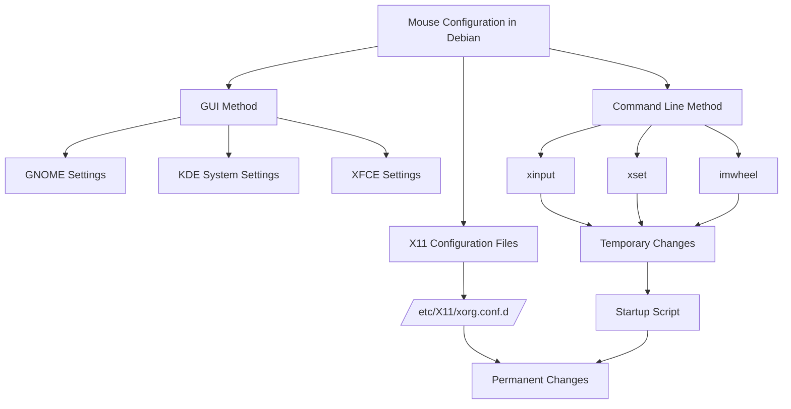

# Debian Mouse Configuration

## Introduction

Mouse configuration in Debian is an essential aspect of customizing your Linux experience. Whether you're a programmer who needs precise cursor control or a regular user who wants to optimize your workflow, understanding how to configure your mouse in Debian can significantly enhance your productivity and comfort.

In this guide, we'll explore various methods to customize mouse settings in Debian, from graphical user interfaces to command-line tools. We'll cover adjusting sensitivity, changing scroll behavior, configuring button mappings, and setting up more advanced options.

## Basic Mouse Configuration via GUI

For beginners, the easiest way to configure your mouse is through Debian's graphical interface. The exact appearance might vary depending on your desktop environment (GNOME, KDE, XFCE, etc.), but the general process is similar.

### GNOME Desktop Environment

If you're using GNOME (Debian's default desktop environment):

1. Open the **Settings** application
2. Navigate to **Mouse & Touchpad** section
3. Adjust the following common settings:
   - Primary button (left or right-handed use)
   - Pointer speed
   - Natural scrolling
   - Acceleration profile

Here's how these settings affect your mouse behavior:

| Setting | Effect |
|---------|--------|
| Primary button | Swaps left and right mouse buttons |
| Pointer speed | Controls how far the cursor moves in response to physical mouse movement |
| Natural scrolling | Reverses scroll direction (like on touchscreens) |
| Acceleration profile | Determines how pointer speed increases with faster movements |

### KDE Plasma Environment

In KDE Plasma:

1. Open **System Settings**
2. Go to **Input Devices** → **Mouse**
3. Configure similar options to those in GNOME

## Command-Line Mouse Configuration

Many Debian users prefer command-line tools for greater control and automation possibilities. Let's look at some powerful CLI tools for mouse configuration.

### Using xinput

The `xinput` tool allows you to list and modify input device properties. It's particularly useful for configuring specific device features.

First, install xinput if you don't have it already:

```bash
sudo apt update
sudo apt install xinput
```

#### Listing Mouse Devices

To see all input devices:

```bash
xinput list
```

Output might look like:

```
⎡ Virtual core pointer                     id=2    [master pointer  (3)]
⎜   ↳ Virtual core XTEST pointer           id=4    [slave  pointer  (2)]
⎜   ↳ Logitech M510                        id=10   [slave  pointer  (2)]
⎣ Virtual core keyboard                    id=3    [master keyboard (2)]
    ↳ Virtual core XTEST keyboard          id=5    [slave  keyboard (3)]
    ↳ Generic Keyboard                     id=9    [slave  keyboard (3)]
```

In this example, our mouse is "Logitech M510" with id=10.

#### Viewing Properties

To see all properties of your mouse:

```bash
xinput list-props 10  # Replace 10 with your device ID
```

#### Changing Settings

To modify a property, use `set-prop`:

```bash
# Set pointer acceleration (sensitivity)
xinput set-prop 10 "libinput Accel Speed" 0.5

# Disable acceleration for more predictable movements (good for gaming)
xinput set-prop 10 "libinput Accel Profile Enabled" 0, 1
```

### Using xset

The `xset` utility provides another way to configure mouse behavior:

```bash
# Set mouse acceleration and threshold
xset m 2 4

# Disable mouse acceleration
xset m 0 0
```

In the first example, `2` is the acceleration multiplier and `4` is the threshold (speed at which acceleration kicks in).

## Configuring Mouse in X11 Configuration Files

For permanent changes that apply at system startup, you can create X11 configuration files.

Create a file in `/etc/X11/xorg.conf.d/` directory (create this directory if it doesn't exist):

```bash
sudo mkdir -p /etc/X11/xorg.conf.d/
sudo nano /etc/X11/xorg.conf.d/90-mouse.conf
```

Add configuration like this:

```
Section "InputClass"
    Identifier "My Mouse"
    MatchIsPointer "yes"
    Option "AccelerationProfile" "0"
    Option "AccelerationScheme" "none"
    Option "AccelSpeed" "-0.5"
EndSection
```

Save and exit. These changes will apply after you restart your X server (or reboot).

## Advanced Mouse Configurations

### Button Mapping

You can reassign the functions of mouse buttons with xinput:

```bash
# First, check current button mapping
xinput get-button-map 10

# Change button mapping (swap left and right buttons)
xinput set-button-map 10 3 2 1
```

The numbers represent button functions in order. The default is typically `1 2 3 4 5 6 7`, where:
- 1 = left click
- 2 = middle click
- 3 = right click
- 4 = scroll up
- 5 = scroll down
- 6, 7 = side buttons

### Using imwheel for Custom Scroll Behavior

The `imwheel` utility allows for more customizable scroll behavior:

```bash
sudo apt install imwheel
```

Create a configuration file:

```bash
nano ~/.imwheelrc
```

Add customizations like:

```
".*"
None,      Up,   Button4, 3
None,      Down, Button5, 3
Control_L, Up,   Control_L|Button4
Control_L, Down, Control_L|Button5
Shift_L,   Up,   Shift_L|Button4
Shift_L,   Down, Shift_L|Button5
```

This configuration:
- Makes the scroll wheel move 3 lines at a time
- Maintains Ctrl+scroll and Shift+scroll behaviors

Start imwheel:

```bash
imwheel -b "4 5"
```

To have imwheel start automatically, add it to your startup applications.

## Configuring Gaming Mice

Gaming mice often have additional buttons and DPI settings. While some might need proprietary software, many can be configured in Debian:

### Using Piper for Gaming Mice

Piper is a GTK application to configure gaming mice supported by libratbag:

```bash
sudo apt install piper
```

Launch Piper and you can configure:
- Button mappings
- LED colors (for RGB mice)
- DPI settings
- Polling rate

### Using the HID Driver Directly

For advanced users, you can configure certain aspects by writing to sysfs:

```bash
# Example: Changing polling rate to 1000Hz for a device
echo 1 > /sys/bus/usb/devices/YOUR_DEVICE_ID/polling_rate
```

## Troubleshooting Common Issues

### Mouse Too Fast/Slow

If your mouse is too sensitive or not sensitive enough:

```bash
# Using xinput (adjust value between -1 and 1)
xinput set-prop "Your Mouse Name" "libinput Accel Speed" -0.5

# Using xset (first number is acceleration, second is threshold)
xset m 1 1
```

### Erratic Movement

If your mouse movement is erratic, try disabling acceleration:

```bash
xinput set-prop "Your Mouse Name" "libinput Accel Profile Enabled" 0, 1
```

### Middle-Click Paste Not Working

If middle-click paste isn't working:

```bash
# Check button mapping
xinput get-button-map "Your Mouse Name"

# Ensure middle button (usually 2) is correctly mapped
xinput set-button-map "Your Mouse Name" 1 2 3 4 5 6 7
```

## Making Configurations Persistent

To make mouse configurations apply at every boot:

1. Create a startup script:

```bash
nano ~/.config/autostart/mouse-config.sh
```

2. Add your configuration commands:

```bash
#!/bin/bash
xinput set-prop "Your Mouse Name" "libinput Accel Speed" -0.5
xinput set-prop "Your Mouse Name" "libinput Accel Profile Enabled" 0, 1
```

3. Make the script executable:

```bash
chmod +x ~/.config/autostart/mouse-config.sh
```

4. Create a desktop entry:

```bash
nano ~/.config/autostart/mouse-config.desktop
```

5. Add:

```
[Desktop Entry]
Type=Application
Name=Mouse Configuration
Exec=/home/YOUR_USERNAME/.config/autostart/mouse-config.sh
Hidden=false
X-GNOME-Autostart-enabled=true
```

## Flow Diagram of Mouse Configuration Methods



## Summary

Configuring your mouse in Debian can greatly enhance your computing experience. We've covered:

- Basic configuration through graphical interfaces
- Command-line configuration with xinput and xset
- Permanent configuration with X11 config files
- Advanced settings like button mapping and scroll adjustments
- Gaming mouse configuration
- Troubleshooting common issues
- Making configurations persistent

By mastering these techniques, you can customize your mouse behavior to perfectly match your preferences and workflow requirements.

## Additional Resources

- The Debian Wiki has an excellent page on [Input Devices](https://wiki.debian.org/InputDevices)
- For more information on xinput, check the manual: `man xinput`
- For X11 configuration options, see: `man xorg.conf`

## Exercises

1. Use `xinput list` to identify your mouse, then use `xinput list-props` to examine all available properties.
2. Create a script that configures your mouse to your liking and add it to your startup applications.
3. Experiment with different acceleration profiles to find which works best for you.
4. If you have a multi-button mouse, try remapping some of the extra buttons to useful functions.
5. Configure natural scrolling and test whether you prefer it over traditional scrolling.