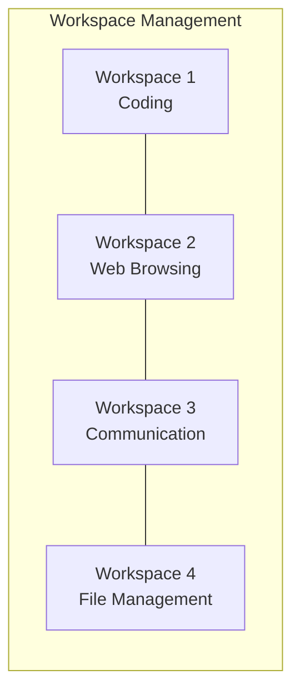

# Debian Workspace Management

## Introduction

Workspaces (sometimes called virtual desktops) are one of the most powerful productivity features in Linux systems like Debian. They allow you to organize your applications across multiple virtual screens, reducing clutter and helping you focus on specific tasks. This guide will walk you through understanding, configuring, and mastering workspace management in Debian to significantly enhance your workflow.

## Understanding Workspaces in Debian

Workspaces in Debian function as virtual screens that exist simultaneously. Think of them as having multiple monitors, but instead of physically separate screens, you switch between them with keyboard shortcuts or mouse actions.



### Default Workspace Behavior

By default, Debian's GNOME desktop environment comes with:
- Dynamic workspaces (creates new ones as needed)
- Keyboard shortcuts for navigation
- The ability to move windows between workspaces

Different desktop environments handle workspaces differently:
- **GNOME**: Dynamic workspaces arranged vertically
- **KDE Plasma**: Fixed number of workspaces in a grid
- **XFCE**: Fixed number of workspaces arranged horizontally
- **Cinnamon**: Fixed workspaces with customizable layouts

## Basic Workspace Operations

### Navigating Between Workspaces

GNOME provides several ways to navigate workspaces:

**Keyboard Shortcuts:**
- `Super + Page Up`: Switch to workspace above
- `Super + Page Down`: Switch to workspace below
- `Super + Home`: Switch to first workspace
- `Super + End`: Switch to last workspace

**Using the Activities Overview:**
1. Press the `Super` key or click "Activities" in the top-left corner
2. The right side of the screen shows your workspaces
3. Click on a workspace to switch to it

**Using the Workspace Switcher:**
```bash
# Install workspace switcher extension
sudo apt install gnome-shell-extension-workspace-indicator
```

After installation and enabling the extension, you'll see a workspace indicator in your top panel.

### Moving Windows Between Workspaces

**Keyboard method:**
- `Super + Shift + Page Up`: Move current window to workspace above
- `Super + Shift + Page Down`: Move current window to workspace below

**Mouse method:**
1. Click and hold the title bar of a window
2. Press `Super` key to enter Activities overview
3. Drag the window to the desired workspace
4. Release to drop the window there

### Creating and Removing Workspaces

In GNOME's default dynamic workspace mode:
- New workspaces are created automatically when you place windows at the bottom workspace
- Empty workspaces (except the last one) are automatically removed

## Advanced Workspace Configuration

### Setting a Fixed Number of Workspaces

For users who prefer a fixed number of workspaces:

```bash
# Install GNOME Tweaks
sudo apt install gnome-tweaks
```

After installation:
1. Open GNOME Tweaks
2. Navigate to the "Workspaces" section
3. Change "Dynamic Workspaces" to "Fixed Number"
4. Set your desired number of workspaces

Alternatively, use the gsettings command:

```bash
# Disable dynamic workspaces
gsettings set org.gnome.mutter dynamic-workspaces false

# Set a fixed number of workspaces (e.g., 4)
gsettings set org.gnome.desktop.wm.preferences num-workspaces 4
```

### Customizing Workspace Behavior

Modify how workspaces behave with these settings:

```bash
# Enable workspace switching when scrolling over desktop
gsettings set org.gnome.desktop.wm.preferences workspace-scroll true

# Enable or disable workspace wrap-around
gsettings set org.gnome.shell.overrides workspaces-wrap-around true
```

### Creating Named Workspaces with Extensions

For more advanced functionality, you can use GNOME extensions:

1. Install the GNOME Shell Extensions package:
   ```bash
   sudo apt install gnome-shell-extensions
   ```

2. Install the "Workspace Names" extension through the Extensions app or from [extensions.gnome.org](https://extensions.gnome.org)

3. Once installed, you can right-click on the workspace indicator to rename workspaces according to their purpose (e.g., "Coding", "Web", "Communication")

## Practical Workspace Strategies

### Task-Based Organization

Organize workspaces by task category:

| Workspace | Purpose       | Applications                      |
|-----------|---------------|-----------------------------------|
| 1         | Development   | Terminal, Code Editor, Git Client |
| 2         | Research      | Web Browser, PDF Reader, Notes    |
| 3         | Communication | Email, Messaging, Video Calls     |
| 4         | Media         | Music Player, Image Editor, Video |

### Setting Up a Productive Workspace Flow

Here's how to set up an automatic workspace configuration on startup:

1. Create a script to set up your workspace layout:

```bash
#!/bin/bash

# Start applications in specific workspaces
# Workspace 1: Development
gnome-terminal --working-directory=$HOME/projects &
code $HOME/projects &
sleep 2

# Workspace 2: Research
firefox &
sleep 1

# Workspace 3: Communication
thunderbird &
sleep 1

# Move windows to appropriate workspaces
wmctrl -r "Terminal" -t 0
wmctrl -r "Visual Studio Code" -t 0
wmctrl -r "Firefox" -t 1
wmctrl -r "Thunderbird" -t 2
```

2. Save this script as `~/bin/workspace-setup.sh`
3. Make it executable: `chmod +x ~/bin/workspace-setup.sh`
4. Add it to your startup applications:
   - Open "Startup Applications"
   - Click "Add"
   - Name: "Workspace Setup"
   - Command: `/home/yourusername/bin/workspace-setup.sh`
   - Comment: "Sets up my workspace layout"

## Advanced Workspace Management with Keyboard Shortcuts

Create custom keyboard shortcuts for advanced workspace actions:

1. Open Settings → Keyboard → Shortcuts → Custom Shortcuts
2. Click the "+" button to add a new shortcut
3. Enter a name and the command to execute

Examples of useful custom shortcuts:

```bash
# Move current window to workspace 1
Name: Move to Workspace 1
Command: wmctrl -r :ACTIVE: -t 0
Shortcut: Ctrl+Alt+1

# Move current window to workspace 2
Name: Move to Workspace 2
Command: wmctrl -r :ACTIVE: -t 1
Shortcut: Ctrl+Alt+2
```

## Workspace Management in Different Desktop Environments

While this guide focuses primarily on GNOME, here's how to access workspace settings in other popular Debian desktop environments:

### KDE Plasma
1. Right-click on desktop → "Configure Desktop"
2. Go to "Virtual Desktops"
3. Set number of rows, columns, and navigation options

### XFCE
1. Open Settings → Workspaces
2. Configure workspace count and names
3. Set workspace margins and workspace switching

### Cinnamon
1. Open System Settings → Workspaces
2. Configure the number of workspaces
3. Enable/disable OSD notifications and set workspace names

## Workspace Management Tools

Several third-party tools can enhance your workspace management experience:

```bash
# Install wmctrl for command-line window management
sudo apt install wmctrl

# Install devilspie2 for automatic window placement
sudo apt install devilspie2
```

Example devilspie2 script (save as `~/.config/devilspie2/rules.lua`):

```lua
-- Place Firefox on workspace 2
if (get_application_name() == "Firefox") then
    set_window_workspace(2);
end

-- Place terminals on workspace 1
if (get_application_name() == "Terminal") then
    set_window_workspace(1);
end
```

## Summary

Debian's workspace management capabilities offer powerful ways to organize your desktop environment and improve productivity. By mastering workspaces, you can:

- Reduce visual clutter by separating applications across workspaces
- Group related tasks together for better focus
- Create a more organized workflow
- Switch contexts quickly without closing applications
- Maximize screen real estate, especially on smaller displays

Experiment with different workspace strategies to find the setup that works best for your workflow. Remember that the goal of workspace management is to make your computing experience more efficient and enjoyable.

## Further Resources and Exercises

### Exercises

1. Create a four-workspace setup with each workspace dedicated to a specific task.
2. Write a startup script that opens your commonly used applications in their appropriate workspaces.
3. Set up custom keyboard shortcuts for moving between specific workspaces.
4. Try using different workspace layouts (vertical vs. horizontal) to see which works better for your workflow.

### Additional Resources

- [Debian Wiki: WorkspaceHowto](https://wiki.debian.org/WorkspaceHowto)
- [GNOME Help: Workspaces](https://help.gnome.org/users/gnome-help/stable/shell-workspaces.html)
- [The Linux Command Line](http://linuxcommand.org/) for more terminal-based workspace management
- Debian User Forums for community support and additional tips