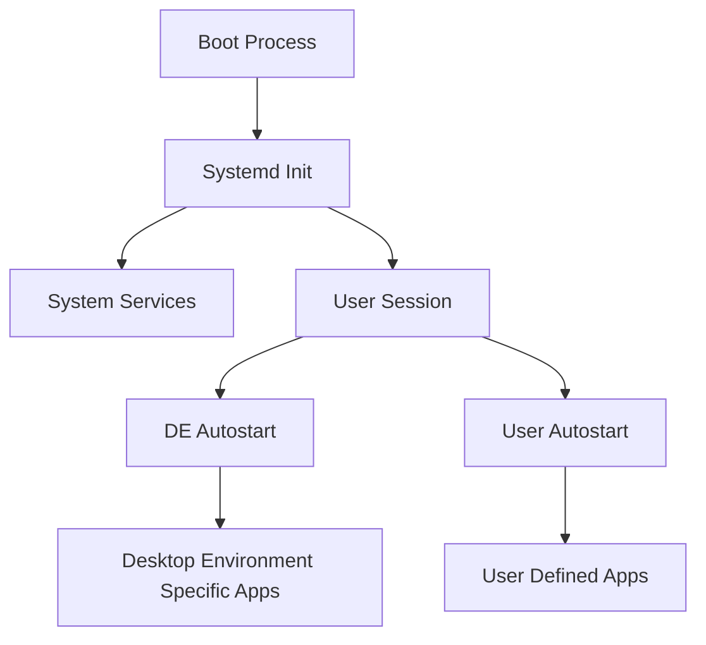

# Debian Startup Applications

## Introduction

When you boot up your Debian system, several applications and services automatically start in the background. These startup applications provide essential functionality but can also impact your system's boot time and overall performance. Understanding how to manage these startup applications is a crucial skill for customizing your Debian experience.

In this tutorial, you'll learn how to:
- View currently configured startup applications
- Add new applications to startup
- Remove unwanted applications from startup
- Create custom startup scripts
- Understand the different startup mechanisms in Debian

## Understanding Startup Mechanisms in Debian

Debian uses several methods to start applications automatically:

1. **Systemd Services**: The primary service manager in modern Debian
2. **Desktop Environment Autostart**: Applications that start with your desktop environment
3. **Init Scripts**: Traditional startup scripts (less common in modern Debian)
4. **User Configuration**: Per-user startup applications

Let's visualize how these mechanisms work together:



## Managing Desktop Environment Startup Applications

Most Debian desktop environments provide a graphical interface to manage startup applications.

### Using the GUI Autostart Manager

Depending on your desktop environment, you'll find a startup application manager:

- **GNOME**: Settings → Apps → Startup Applications
- **KDE Plasma**: System Settings → Startup and Shutdown → Autostart
- **Xfce**: Settings → Session and Startup → Application Autostart
- **MATE**: Control Center → Startup Applications
- **Cinnamon**: Preferences → Startup Applications

Let's use GNOME as an example:

1. Open the Activities overview and search for "Startup Applications"
2. Click "Add" to add a new startup item
3. Provide a name, command, and optional comment
4. Click "Add" to save the new startup item

### Understanding .desktop Files

Startup applications are defined by `.desktop` files located in the autostart directories:

- System-wide: `/etc/xdg/autostart/`
- User-specific: `~/.config/autostart/`

Let's examine a typical `.desktop` file:

```
[Desktop Entry]
Type=Application
Exec=/usr/bin/firefox
Hidden=false
NoDisplay=false
X-GNOME-Autostart-enabled=true
Name[en_US]=Firefox Web Browser
Name=Firefox Web Browser
Comment[en_US]=Start Firefox automatically when I log in
Comment=Start Firefox automatically when I log in
```

### Creating Custom Startup Applications

You can create your own `.desktop` file to start any application:

1. Create a new file in `~/.config/autostart/` with a `.desktop` extension
2. Add the required information using a text editor:

```bash
mkdir -p ~/.config/autostart
nano ~/.config/autostart/myapp.desktop
```

Add the following content:

```
[Desktop Entry]
Type=Application
Exec=/path/to/your/application
Hidden=false
NoDisplay=false
X-GNOME-Autostart-enabled=true
Name=My Application
Comment=Starts my custom application at login
```

Save and close the file. Your application will now start automatically when you log in.

## Managing System Services with Systemd

For system-level services, Debian uses systemd. These services start before or during the login process.

### Listing Enabled Services

To see which services are enabled to start at boot:

```bash
systemctl list-unit-files --state=enabled
```

Example output:

```
UNIT FILE                                  STATE   
accounts-daemon.service                    enabled
apparmor.service                           enabled
avahi-daemon.service                       enabled
bluetooth.service                          enabled
...
```

### Enabling a Service

To enable a service to start at boot:

```bash
sudo systemctl enable service-name.service
```

For example, to enable the SSH server:

```bash
sudo systemctl enable ssh.service
```

Output:
```
Synchronizing state of ssh.service with SysV service script with /lib/systemd/systemd-sysv-install.
Executing: /lib/systemd/systemd-sysv-install enable ssh
Created symlink /etc/systemd/system/multi-user.target.wants/ssh.service → /lib/systemd/system/ssh.service.
```

### Disabling a Service

To prevent a service from starting at boot:

```bash
sudo systemctl disable service-name.service
```

For example, to disable the Bluetooth service:

```bash
sudo systemctl disable bluetooth.service
```

Output:
```
Removed /etc/systemd/system/dbus-org.bluez.service.
Removed /etc/systemd/system/bluetooth.target.wants/bluetooth.service.
```

### Creating a Custom System Service

You can create your own system service by defining a service unit file:

1. Create a new service file:

```bash
sudo nano /etc/systemd/system/myservice.service
```

2. Add the service definition:

```
[Unit]
Description=My Custom Service
After=network.target

[Service]
Type=simple
User=yourusername
ExecStart=/path/to/your/script.sh
Restart=on-failure

[Install]
WantedBy=multi-user.target
```

3. Enable the service:

```bash
sudo systemctl daemon-reload
sudo systemctl enable myservice.service
sudo systemctl start myservice.service
```

## Managing User Session Startup Scripts

### The .bashrc Approach

For terminal applications, you can add commands to your `.bashrc` file:

```bash
nano ~/.bashrc
```

Add your commands at the end of the file:

```bash
# Start my custom application
if [ -f /path/to/myapp ]; then
    nohup /path/to/myapp &>/dev/null &
fi
```

### Using the .xprofile File

For graphical applications that should start before your desktop environment:

```bash
nano ~/.xprofile
```

Add your commands:

```bash
# Start compositor
picom -b

# Start network manager applet
nm-applet &
```

## Debugging Startup Issues

If you're experiencing problems with startup applications, you can:

1. Check the system logs:

```bash
journalctl -b | grep application-name
```

2. Create a startup script with logging:

```bash
#!/bin/bash
# Save this as ~/.config/autostart/debug-script.sh
echo "Starting debug at $(date)" >> ~/startup-debug.log
/path/to/problematic/app >> ~/startup-debug.log 2>&1
echo "Finished at $(date)" >> ~/startup-debug.log
```

Make it executable:

```bash
chmod +x ~/.config/autostart/debug-script.sh
```

Create a .desktop file to run it:

```
[Desktop Entry]
Type=Application
Exec=/home/yourusername/.config/autostart/debug-script.sh
Hidden=false
X-GNOME-Autostart-enabled=true
Name=Debug Script
Comment=Debug startup issues
```

## Optimizing Startup Applications for Better Performance

Too many startup applications can slow down your system boot time. Here are some tips to optimize:

1. **Measure boot time**:

```bash
systemd-analyze
```

2. **Identify slow services**:

```bash
systemd-analyze blame
```

3. **Disable unnecessary services**:

```bash
sudo systemctl disable bluetooth.service
sudo systemctl disable cups.service  # If you don't use a printer
```

4. **Delay non-critical applications**:

Create a delayed startup script:

```bash
#!/bin/bash
# Save as ~/.config/autostart/delayed-start.sh
sleep 30
/path/to/non-critical/app &
```

Make it executable and create a .desktop file for it.

## Practical Examples

### Example 1: Setting Up a Development Environment

Let's create a startup script that prepares a development environment:

```bash
#!/bin/bash
# Save as ~/.config/autostart/dev-environment.sh

# Start development tools
code ~/projects &  # VS Code
firefox "http://localhost:8000" &  # Local development server

# Start database
sudo systemctl start postgresql

echo "Development environment started!"
```

Make it executable:

```bash
chmod +x ~/.config/autostart/dev-environment.sh
```

Create the .desktop file:

```
[Desktop Entry]
Type=Application
Exec=/home/yourusername/.config/autostart/dev-environment.sh
Hidden=false
X-GNOME-Autostart-enabled=true
Name=Development Environment
Comment=Set up my development environment at login
```

### Example 2: Custom System Monitoring

Let's set up a system monitoring service that runs at startup:

```bash
#!/bin/bash
# Save as /usr/local/bin/system-monitor.sh

while true; do
    date >> /var/log/system-stats.log
    echo "Memory usage:" >> /var/log/system-stats.log
    free -h >> /var/log/system-stats.log
    echo "Disk usage:" >> /var/log/system-stats.log
    df -h / /home >> /var/log/system-stats.log
    echo "--------------------" >> /var/log/system-stats.log
    sleep 3600  # Run every hour
done
```

Make it executable:

```bash
sudo chmod +x /usr/local/bin/system-monitor.sh
```

Create a systemd service file:

```bash
sudo nano /etc/systemd/system/system-monitor.service
```

Add the service definition:

```
[Unit]
Description=Custom System Monitoring
After=network.target

[Service]
Type=simple
ExecStart=/usr/local/bin/system-monitor.sh
Restart=on-failure

[Install]
WantedBy=multi-user.target
```

Enable and start the service:

```bash
sudo systemctl daemon-reload
sudo systemctl enable system-monitor.service
sudo systemctl start system-monitor.service
```

## Summary

In this tutorial, you've learned how to:
- Manage desktop environment startup applications
- Create custom `.desktop` files for autostart
- Control system services with systemd
- Write custom startup scripts
- Debug startup issues
- Optimize your system's startup performance

By mastering these techniques, you can customize your Debian system to automatically set up your preferred working environment while ensuring optimal performance.

## Additional Resources

- [Debian Wiki - Autostart](https://wiki.debian.org/DesktopEnvironment/Autostart)
- [Systemd Documentation](https://www.freedesktop.org/software/systemd/man/)
- [Desktop Entry Specification](https://specifications.freedesktop.org/desktop-entry-spec/desktop-entry-spec-latest.html)

## Exercises

1. Create a startup script that backs up your important documents to a designated folder every time you log in.
2. Write a systemd service that periodically checks your system's temperature and logs warnings if it exceeds a threshold.
3. Identify the three slowest services in your boot process and research whether they can be safely disabled or optimized.
4. Create a delayed startup configuration for non-essential applications to improve your initial login experience.