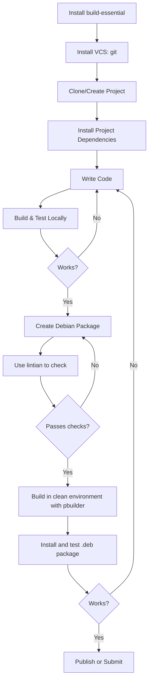

# Debian Development Tools

## Introduction

Debian, one of the oldest and most respected Linux distributions, provides a robust foundation for software development. Whether you're building applications, creating packages, or contributing to the Debian project itself, understanding the available development tools is essential. This guide introduces the core development tools available in Debian, explaining how they work together to create a powerful development environment for beginners and experienced developers alike.

Debian's philosophy of free software and its commitment to stability make it an excellent platform for development work. The tools we'll explore are specifically designed to integrate with Debian's package management system and follow Debian's standards and practices.

## Essential Development Packages

### The build-essential Package

The foundation of any development environment in Debian is the `build-essential` metapackage. This is your starting point for setting up a development environment.

```bash
sudo apt update
sudo apt install build-essential
```

Installing `build-essential` gives you:

- **GCC**: The GNU Compiler Collection for C and C++ compilation
- **make**: The GNU make utility to maintain groups of programs
- **libc6-dev**: C standard library headers and libraries
- **dpkg-dev**: Tools for Debian package development

Let's verify our installation:

```bash
gcc --version
```

Output:
```
gcc (Debian 12.3.0-1) 12.3.0
Copyright (C) 2022 Free Software Foundation, Inc.
This is free software; see the source for copying conditions.  There is NO
warranty; not for MERCHANTABILITY or FITNESS FOR A PARTICULAR PURPOSE.
```

## Version Control Systems

### Git

Git is the most widely used version control system and essential for modern development.

```bash
sudo apt install git
```

Basic Git configuration:

```bash
git config --global user.name "Your Name"
git config --global user.email "your.email@example.com"
```

Creating and managing a basic repository:

```bash
# Initialize a new repository
mkdir my-project
cd my-project
git init

# Create a file and commit it
echo "# My First Debian Project" > README.md
git add README.md
git commit -m "Initial commit"
```

### Subversion (SVN)

Some Debian projects still use Subversion:

```bash
sudo apt install subversion
```

Basic Subversion usage:

```bash
# Check out a repository
svn checkout https://svn.example.org/repos/project project
cd project

# Make changes and commit
echo "# Additional info" >> README
svn add README
svn commit -m "Updated README"
```

## Debian-specific Development Tools

### dpkg-dev and debhelper

These packages contain tools for building Debian packages:

```bash
sudo apt install dpkg-dev debhelper
```

### devscripts

The `devscripts` package provides numerous scripts to make Debian package maintenance easier:

```bash
sudo apt install devscripts
```

Key tools included in devscripts:

- **dch**: Update Debian changelog files
- **uscan**: Scan upstream sites for new releases
- **debuild**: Build a Debian package
- **lintian**: Check Debian packages for common issues

### pbuilder

`pbuilder` creates a clean build environment to ensure package builds are reproducible:

```bash
sudo apt install pbuilder
```

Setting up pbuilder:

```bash
sudo pbuilder create --distribution sid
```

Building a package with pbuilder:

```bash
sudo pbuilder build your-package.dsc
```

## Build Systems

### CMake

CMake is a modern build system generator that works across many platforms:

```bash
sudo apt install cmake
```

A simple CMake example:

```bash
# Create a CMakeLists.txt file
cat > CMakeLists.txt << 'EOF'
cmake_minimum_required(VERSION 3.10)
project(HelloWorld)

add_executable(hello main.cpp)
EOF

# Create a simple C++ file
cat > main.cpp << 'EOF'
#include <iostream>

int main() {
    std::cout << "Hello, Debian Development!" << std::endl;
    return 0;
}
EOF

# Build the project
mkdir build
cd build
cmake ..
make
```

Running the resulting program:

```bash
./hello
```

Output:
```
Hello, Debian Development!
```

### Autotools

The traditional GNU build system:

```bash
sudo apt install autoconf automake libtool
```

## Development Environments

### Visual Studio Code

While not in the official Debian repositories, VS Code is popular for development:

```bash
# Install dependencies
sudo apt install wget gpg apt-transport-https

# Download and install the Microsoft GPG key
wget -qO- https://packages.microsoft.com/keys/microsoft.asc | gpg --dearmor > microsoft.gpg
sudo install -o root -g root -m 644 microsoft.gpg /etc/apt/trusted.gpg.d/
sudo sh -c 'echo "deb [arch=amd64] https://packages.microsoft.com/repos/vscode stable main" > /etc/apt/sources.list.d/vscode.list'

# Update package cache and install VS Code
sudo apt update
sudo apt install code
```

### Eclipse

Eclipse IDE is available in Debian:

```bash
sudo apt install eclipse
```

## Package Maintenance Tools

### Debian Package Management

Creating a basic Debian package structure:

```bash
# Install the required tools
sudo apt install dh-make

# Create a directory for your project
mkdir -p myapp-1.0
cd myapp-1.0

# Create a sample application
cat > main.c << 'EOF'
#include <stdio.h>

int main() {
    printf("Hello, Debian packaging!
");
    return 0;
}
EOF

# Create a simple Makefile
cat > Makefile << 'EOF'
all:
	gcc -o myapp main.c

install:
	mkdir -p $(DESTDIR)/usr/bin
	install -m 755 myapp $(DESTDIR)/usr/bin/myapp

clean:
	rm -f myapp
EOF

# Initialize Debian packaging
cd ..
tar -czf myapp_1.0.orig.tar.gz myapp-1.0
cd myapp-1.0
dh_make -f ../myapp_1.0.orig.tar.gz --single --yes

# Build the package
dpkg-buildpackage -us -uc
```

The resulting `.deb` package will be in the parent directory and can be installed with:

```bash
sudo dpkg -i ../myapp_1.0-1_amd64.deb
```

### Lintian

Lintian checks Debian packages for policy violations and bugs:

```bash
sudo apt install lintian
lintian ../myapp_1.0-1_amd64.deb
```

## Debugging and Profiling Tools

### GDB

The GNU Debugger is essential for debugging C and C++ programs:

```bash
sudo apt install gdb
```

Basic GDB usage with our hello example:

```bash
# Compile with debugging information
gcc -g -o hello main.c

# Debug the program
gdb ./hello
```

GDB commands:
```
(gdb) break main
(gdb) run
(gdb) next
(gdb) print variables
(gdb) continue
(gdb) quit
```

### Valgrind

Valgrind helps detect memory leaks and other memory-related issues:

```bash
sudo apt install valgrind
```

Running a program with Valgrind:

```bash
valgrind --leak-check=full ./hello
```

## Debian Developer Documentation

Debian provides extensive documentation for developers:

```bash
sudo apt install debian-policy developers-reference
```

These packages install important documents like:
- `/usr/share/doc/debian-policy/policy.html/`
- `/usr/share/doc/developers-reference/`

## Development Workflow

Let's visualize a typical Debian development workflow:



## Practical Example: Creating a Simple Debian Package

Let's walk through creating a complete Debian package for a simple "Hello World" Python application:

1. First, create your project structure:

```bash
mkdir -p hello-debian-1.0/src
cd hello-debian-1.0/src

# Create a simple Python script
cat > hello_debian.py << 'EOF'
#!/usr/bin/env python3

def main():
    print("Hello, Debian developer!")
    print("Welcome to the world of Debian packaging!")

if __name__ == "__main__":
    main()
EOF

chmod +x hello_debian.py

cd ..
```

2. Prepare the package source:

```bash
cd ..
tar czf hello-debian_1.0.orig.tar.gz hello-debian-1.0
cd hello-debian-1.0
```

3. Initialize the Debian packaging:

```bash
dh_make --native -p hello-debian_1.0 -s -y
```

4. Edit the control file:

```bash
cat > debian/control << 'EOF'
Source: hello-debian
Section: utils
Priority: optional
Maintainer: Your Name <your.email@example.com>
Build-Depends: debhelper-compat (= 13), dh-python, python3-all
Standards-Version: 4.5.1
Homepage: https://example.org/hello-debian
Rules-Requires-Root: no

Package: hello-debian
Architecture: all
Depends: ${python3:Depends}, ${misc:Depends}
Description: Simple Hello World Debian package
 This is a simple example package that prints a
 hello message for Debian developers.
EOF
```

5. Create an installation file:

```bash
cat > debian/install << 'EOF'
src/hello_debian.py usr/bin
EOF
```

6. Edit the rules file to use dh_python3:

```bash
cat > debian/rules << 'EOF'
#!/usr/bin/make -f
%:
	dh $@ --with python3
EOF
```

7. Build the package:

```bash
dpkg-buildpackage -us -uc
```

8. Install and test the package:

```bash
cd ..
sudo dpkg -i hello-debian_1.0_all.deb
hello_debian.py
```

Output:
```
Hello, Debian developer!
Welcome to the world of Debian packaging!
```

## Summary

Debian provides a comprehensive set of development tools that work together to create a powerful and flexible development environment. We've covered:

- Setting up basic build tools with `build-essential`
- Version control with Git and Subversion
- Debian-specific packaging tools
- Build systems like CMake and Autotools
- IDEs and development environments
- Debugging and profiling tools
- The complete workflow for building Debian packages

By mastering these tools, you'll be well-equipped to develop software on Debian, create packages for distribution, and potentially contribute to the Debian project itself.

## Additional Resources

- [Debian Developer's Corner](https://www.debian.org/devel/)
- [Debian New Maintainers' Guide](https://www.debian.org/doc/manuals/maint-guide/)
- [Debian Policy Manual](https://www.debian.org/doc/debian-policy/)
- [Debian Developer's Reference](https://www.debian.org/doc/manuals/developers-reference/)

## Exercises

1. Install the `build-essential` package and write a simple C program that prints "Hello, Debian!"
2. Create a Git repository and practice basic Git commands
3. Build a simple Debian package following the example in this guide
4. Use `lintian` to check your package for policy violations
5. Modify the example package to add a new feature and rebuild it
6. Create a clean build environment with `pbuilder` and build your package in it
7. Explore the Debian Policy Manual and identify three important policies for package maintainers