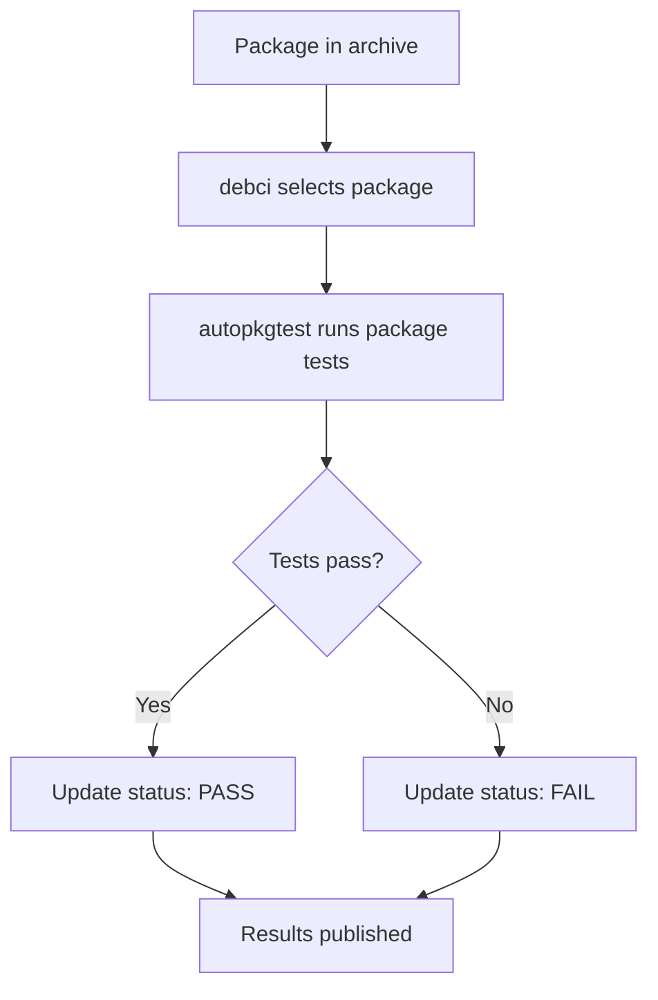
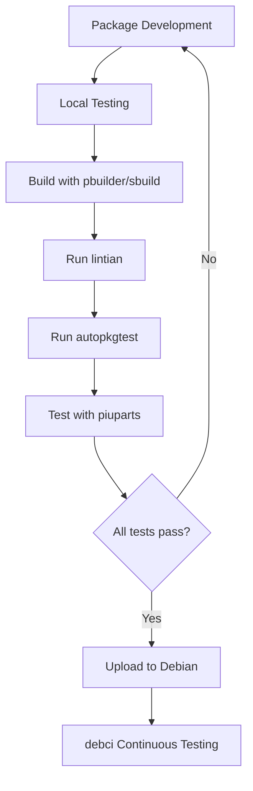

# Debian Testing Tools

Testing is a crucial part of the Debian software development process. As one of the most stable and reliable Linux distributions, Debian maintains strict quality standards for all packages in its repositories. This guide introduces the essential testing tools and methodologies used in Debian development.

## Introduction to Debian Testing

Debian's reputation for stability comes from its rigorous testing procedures. Before any package enters the stable release, it goes through extensive validation using specialized tools designed to catch bugs, inconsistencies, and potential issues.

Testing in Debian serves several crucial purposes:

- Ensuring software reliability and stability
- Maintaining compatibility across the ecosystem
- Verifying proper package integration
- Checking compliance with Debian policies
- Identifying security vulnerabilities

## Core Debian Testing Tools

### 1. autopkgtest (Package Integration Testing)

`autopkgtest` (previously known as `adt-run`) provides automated testing for Debian packages in their installed environment. It verifies that a package functions correctly when installed and used.

#### How autopkgtest Works

`autopkgtest` runs tests against the actual installed package rather than the build tree. This approach confirms that the package works correctly in real-world conditions.

#### Basic Usage Example

```bash
# Install autopkgtest
sudo apt-get install autopkgtest

# Run tests for a package
autopkgtest package-name -- schroot sid-amd64
```

The command above runs tests for `package-name` in a Debian Sid environment using schroot.

#### Example Test Definition

Create a `debian/tests/control` file in your package source:

```
Tests: test-script
Depends: @, other-package, test-dependency

Tests: another-test
Restrictions: needs-root
```

Then create a `debian/tests/test-script` executable:

```bash
#!/bin/sh
set -e
# Your test logic here
echo "Testing functionality..."
if ! my-program --test; then
    echo "Test failed!"
    exit 1
fi
echo "Tests passed!"
```

### 2. lintian (Static Analysis)

`lintian` analyzes Debian packages for common errors, policy violations, and suboptimal practices. It's one of the most important quality assurance tools in the Debian ecosystem.

#### Basic Usage

```bash
# Install lintian
sudo apt-get install lintian

# Analyze a .deb package
lintian package_1.0-1_amd64.deb

# Analyze a .changes file (more comprehensive)
lintian package_1.0-1_amd64.changes

# For more detailed output
lintian -i -I --show-overrides package_1.0-1_amd64.changes
```

#### Example Output

```
W: mypackage: maintainer-script-ignores-errors postinst
E: mypackage: depends-on-obsolete-package depends: python-gtk2
I: mypackage: binary-without-manpage usr/bin/myprogram
```

Each line indicates:
- Warning (W), Error (E), or Information (I)
- Package name
- The specific issue
- Contextual details

### 3. piuparts (Package Installation, Upgrading, and Removal Testing)

`piuparts` (Package Installation, Upgrading, And Removal Testing Suite) verifies that packages can be installed, upgraded, and removed without issues.

#### Basic Usage

```bash
# Install piuparts
sudo apt-get install piuparts

# Test a .deb package
sudo piuparts package_1.0-1_amd64.deb

# Test with distro upgrade
sudo piuparts -d sid -d bullseye package_1.0-1_amd64.deb
```

`piuparts` creates a clean chroot environment for each test, ensuring consistent and reliable results.

### 4. debci (Continuous Integration for Debian)

`debci` runs automated tests on packages in the Debian archive continuously. It uses autopkgtest behind the scenes but provides a framework for large-scale testing.

#### How It Works



#### Checking debci Results

You can check the status of packages on the [debci dashboard](https://ci.debian.net/) or use the debci tool:

```bash
# Install debci
sudo apt-get install debci

# Check status for a package
debci status package-name
```

### 5. pbuilder and sbuild (Clean Building Environments)

While primarily build tools, `pbuilder` and `sbuild` are essential for testing as they provide clean, controlled environments for package building and basic testing.

#### Using pbuilder

```bash
# Install pbuilder
sudo apt-get install pbuilder

# Create a base environment
sudo pbuilder create

# Build and test a package
sudo pbuilder build package_1.0-1.dsc
```

#### Using sbuild

```bash
# Install sbuild
sudo apt-get install sbuild

# Set up sbuild environment
sudo sbuild-createchroot --include=eatmydata,ccache,gnupg unstable /srv/chroot/unstable-amd64-sbuild

# Build and test a package
sbuild -d unstable package_1.0-1.dsc
```

## Automated Testing Workflow

In a typical Debian package development workflow, these tools fit together to provide comprehensive quality assurance:



## Practical Example: Testing a Simple Package

Let's walk through a complete example of testing a fictional package called `hello-debian`:

### 1. Set Up Development Environment

```bash
# Clone the package
git clone https://salsa.debian.org/debian/hello-debian
cd hello-debian

# Install development tools
sudo apt-get install devscripts build-essential lintian autopkgtest pbuilder
```

### 2. Add Automated Tests

Create `debian/tests/control`:

```
Tests: test-basic
Depends: @
```

Create `debian/tests/test-basic`:

```bash
#!/bin/sh
set -e
# Test that the program runs and returns a proper exit code
hello-debian --version
if [ $? -ne 0 ]; then
    echo "Version command failed!"
    exit 1
fi

# Test functionality
output=$(hello-debian)
if ! echo "$output" | grep -q "Hello, Debian!"; then
    echo "Expected output not found!"
    exit 1
fi

echo "All tests passed!"
```

Make the test executable:

```bash
chmod +x debian/tests/test-basic
```

### 3. Build and Test the Package

```bash
# Build the package
debuild -us -uc

# Run lintian
cd ..
lintian hello-debian_1.0-1_amd64.changes

# Run autopkgtest
autopkgtest hello-debian_1.0-1_amd64.changes -- null

# Test installation and removal
sudo piuparts hello-debian_1.0-1_amd64.deb
```

### 4. Resolving Common Issues

If lintian reports issues like:

```
E: hello-debian: missing-dependency-on-libc depends
```

You would update `debian/control` to fix the dependency:

```
Depends: ${shlibs:Depends}, ${misc:Depends}
```

## Integrating with CI/CD

Many Debian packages are now integrated with CI/CD pipelines:

### Example .gitlab-ci.yml for Debian Package Testing

```yaml
stages:
  - build
  - test

build:
  stage: build
  script:
    - apt-get update && apt-get install -y build-essential debhelper devscripts
    - debuild -us -uc
    - mkdir artifacts
    - mv ../hello-debian_*.deb ../hello-debian_*.changes artifacts/
  artifacts:
    paths:
      - artifacts/

lintian:
  stage: test
  script:
    - apt-get update && apt-get install -y lintian
    - lintian artifacts/hello-debian_*.changes

autopkgtest:
  stage: test
  script:
    - apt-get update && apt-get install -y autopkgtest
    - autopkgtest artifacts/hello-debian_*.changes -- null

piuparts:
  stage: test
  script:
    - apt-get update && apt-get install -y piuparts
    - piuparts artifacts/hello-debian_*.deb
```

## Debugging Failed Tests

When tests fail, it's important to have a systematic approach to debugging:

1. **Check build logs**: Often, issues occur during package building
2. **Examine autopkgtest logs**: Look for test failures and their causes
3. **Reproduce in clean environment**: Use pbuilder or sbuild to recreate the issue
4. **Incrementally fix issues**: Address one problem at a time, testing after each fix

### Example Debugging Session

```bash
# Create a clean environment
sudo pbuilder --login --save-after-login

# Inside pbuilder
apt-get install hello-debian
# Try to reproduce the issue
hello-debian --problematic-option
# Check logs
cat /var/log/hello-debian.log
# Exit pbuilder
exit
```

## Summary

Testing is integral to Debian's reputation for stability and reliability. The primary tools in the Debian testing ecosystem are:

- **lintian**: Static analysis for policy compliance
- **autopkgtest**: Functional testing of installed packages
- **piuparts**: Installation, upgrade, and removal testing
- **debci**: Continuous integration framework
- **pbuilder/sbuild**: Clean building and testing environments

By mastering these tools, you can contribute high-quality packages to Debian that meet the distribution's standards for reliability and stability.

## Further Resources

- [Debian Developer's Reference](https://www.debian.org/doc/manuals/developers-reference/)
- [autopkgtest Documentation](https://salsa.debian.org/ci-team/autopkgtest/raw/master/doc/README.package-tests.rst)
- [Debian Policy Manual](https://www.debian.org/doc/debian-policy/)
- [Debian Quality Assurance Team](https://qa.debian.org/)

## Exercises

1. Install lintian and analyze an existing package from your system. How many warnings and errors do you find?
2. Create a simple Debian package with autopkgtest tests that verify basic functionality.
3. Set up a local debci instance to test packages continuously.
4. Use piuparts to test the upgrade path for a package from Debian stable to testing.
5. Write a comprehensive test suite for a simple command-line application that verifies all its functionality.