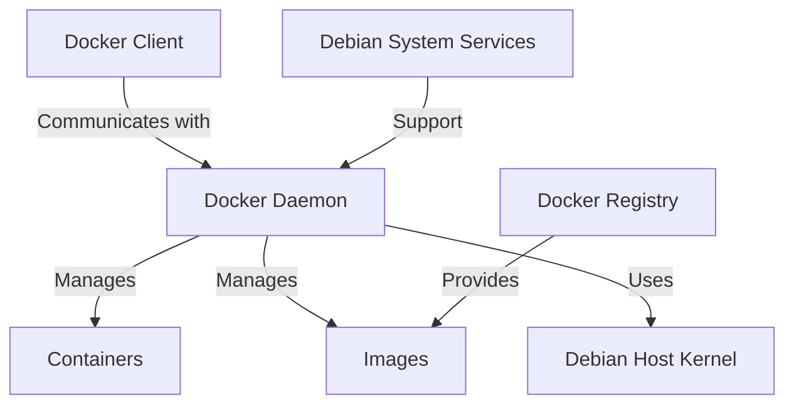

# Debian Docker Integration

## Introduction

Docker has revolutionized software development by providing a consistent, isolated environment for applications through containers. For Debian users, integrating Docker offers powerful capabilities for development, testing, and deployment. This guide will walk you through the process of setting up Docker on Debian, creating your first containers, and implementing best practices for Debian-specific Docker workflows.

Docker containers package applications with their dependencies, ensuring they run consistently across different environments. When working with Debian, Docker integration provides a perfect complement to Debian's stability and security-focused approach.

## Prerequisites

Before we begin, you should have:

- A Debian system (Debian 10 Buster or newer recommended)
- A user account with sudo privileges
- Basic command line knowledge
- Familiarity with Debian package management

## Installing Docker on Debian

Docker installation on Debian involves several steps to ensure proper setup.

### Step 1: Update System Packages

Always start by updating your system packages:

```bash
sudo apt update
sudo apt upgrade -y
```

### Step 2: Install Required Dependencies

Install packages needed for Docker:

```bash
sudo apt install -y apt-transport-https ca-certificates curl gnupg lsb-release
```

### Step 3: Add Docker's Official GPG Key

Add Docker's GPG key to ensure package authenticity:

```bash
curl -fsSL https://download.docker.com/linux/debian/gpg | sudo gpg --dearmor -o /usr/share/keyrings/docker-archive-keyring.gpg
```

### Step 4: Set Up the Docker Repository

Add Docker's repository to your APT sources:

```bash
echo "deb [arch=$(dpkg --print-architecture) signed-by=/usr/share/keyrings/docker-archive-keyring.gpg] https://download.docker.com/linux/debian $(lsb_release -cs) stable" | sudo tee /etc/apt/sources.list.d/docker.list > /dev/null
```

### Step 5: Install Docker Engine

Update your package database and install Docker:

```bash
sudo apt update
sudo apt install -y docker-ce docker-ce-cli containerd.io
```

### Step 6: Verify Installation

Confirm Docker is installed and running:

```bash
sudo systemctl status docker
```

Output should show Docker is active (running):

```
● docker.service - Docker Application Container Engine
     Loaded: loaded (/lib/systemd/system/docker.service; enabled; vendor preset: enabled)
     Active: active (running) since Mon 2023-09-25 14:30:41 UTC; 5s ago
```

Test Docker with the hello-world image:

```bash
sudo docker run hello-world
```

Expected output:

```
Hello from Docker!
This message shows that your installation appears to be working correctly.
...
```

### Step 7: Configure User Permissions (Optional but Recommended)

Add your user to the docker group to run Docker commands without sudo:

```bash
sudo usermod -aG docker $USER
```

For the changes to take effect, log out and back in, or run:

```bash
newgrp docker
```

## Understanding Docker Architecture in Debian

Docker on Debian follows the standard Docker architecture but integrates with Debian's system services and configuration.



## Creating Your First Debian-Based Docker Container

Let's create a simple Debian-based Docker container.

### Step 1: Create a Dockerfile

Create a directory for your project and a Dockerfile:

```bash
mkdir debian-docker-demo
cd debian-docker-demo
touch Dockerfile
```

Edit the Dockerfile:

```Dockerfile
# Use Debian as the base image
FROM debian:stable-slim

# Update packages and install a simple web server
RUN apt-get update && \
    apt-get install -y nginx && \
    apt-get clean && \
    rm -rf /var/lib/apt/lists/*

# Copy a custom HTML file
RUN echo "<html><body><h1>Hello from Debian Docker!</h1></body></html>" > /var/www/html/index.html

# Expose port 80
EXPOSE 80

# Command to run when container starts
CMD ["nginx", "-g", "daemon off;"]
```

### Step 2: Build the Docker Image

Build the image using the Dockerfile:

```bash
docker build -t debian-nginx .
```

Output will show the build process:

```
Sending build context to Docker daemon  2.048kB
Step 1/5 : FROM debian:stable-slim
stable-slim: Pulling from library/debian
...
Successfully built 7a9c1f0b93aa
Successfully tagged debian-nginx:latest
```

### Step 3: Run the Container

Run the container from your image:

```bash
docker run -d -p 8080:80 --name debian-web debian-nginx
```

### Step 4: Test Your Container

Open a web browser and navigate to http://localhost:8080 or use curl:

```bash
curl http://localhost:8080
```

Expected output:

```html
<html><body><h1>Hello from Debian Docker!</h1></body></html>
```

## Working with Debian Package Management in Docker

One of the advantages of using Debian as a base image is its robust package management system.

### Best Practices for Using APT in Dockerfiles

```Dockerfile
FROM debian:stable-slim

# Combine apt commands to reduce layers and set flags for non-interactive installation
RUN apt-get update && \
    DEBIAN_FRONTEND=noninteractive apt-get install -y --no-install-recommends \
    package1 \
    package2 \
    package3 && \
    apt-get clean && \
    rm -rf /var/lib/apt/lists/*
```

Key best practices:
- Combine RUN commands with `&&` to reduce image layers
- Use `--no-install-recommends` to minimize installed packages
- Set `DEBIAN_FRONTEND=noninteractive` for automated installation
- Clean apt cache and remove lists to reduce image size

## Docker Compose with Debian

Docker Compose allows you to define and run multi-container Docker applications. Let's set up a simple web application with Nginx and a Debian-based backend.

### Step 1: Install Docker Compose

```bash
sudo apt install -y docker-compose
```

### Step 2: Create a Docker Compose File

Create a file named `docker-compose.yml`:

```yaml
version: '3'
services:
  web:
    build:
      context: ./web
    ports:
      - "8080:80"
    depends_on:
      - app
  
  app:
    build:
      context: ./app
    environment:
      - DB_HOST=db
    depends_on:
      - db
  
  db:
    image: debian:stable-slim
    command: bash -c "apt-get update && apt-get install -y sqlite3 && sqlite3 /data/test.db 'CREATE TABLE IF NOT EXISTS test (id INTEGER PRIMARY KEY, name TEXT);' && tail -f /dev/null"
    volumes:
      - db-data:/data

volumes:
  db-data:
```

### Step 3: Create the Service Directories and Dockerfiles

For the web service:

```bash
mkdir -p web
cat > web/Dockerfile << 'EOF'
FROM debian:stable-slim
RUN apt-get update && apt-get install -y nginx && rm -rf /var/lib/apt/lists/*
COPY default.conf /etc/nginx/conf.d/default.conf
CMD ["nginx", "-g", "daemon off;"]
EOF
cat > web/default.conf << 'EOF'
server {
    listen 80;
    location / {
        proxy_pass http://app:3000;
    }
}
EOF
```

For the app service:

```bash
mkdir -p app
cat > app/Dockerfile << 'EOF'
FROM debian:stable-slim
RUN apt-get update && apt-get install -y python3 python3-pip && rm -rf /var/lib/apt/lists/*
WORKDIR /app
COPY app.py .
COPY requirements.txt .
RUN pip3 install -r requirements.txt
CMD ["python3", "app.py"]
EOF
cat > app/app.py << 'EOF'
from flask import Flask
import os
app = Flask(__name__)

@app.route('/')
def hello():
    return f"Hello from Debian Docker! (DB Host: {os.environ.get('DB_HOST', 'unknown')})"

if __name__ == '__main__':
    app.run(host='0.0.0.0', port=3000)
EOF
cat > app/requirements.txt << 'EOF'
flask
EOF
```

### Step 4: Run the Docker Compose Stack

```bash
docker-compose up -d
```

### Step 5: Test the Application

Access the application at http://localhost:8080

To shut down the application:

```bash
docker-compose down
```

## Debian-Specific Docker Optimizations

Debian provides excellent opportunities for creating optimized Docker images.

### Using Debian Slim Variants

```Dockerfile
FROM debian:stable-slim

# Install only what's needed
RUN apt-get update && \
    apt-get install -y --no-install-recommends \
    your-required-package && \
    apt-get clean && \
    rm -rf /var/lib/apt/lists/*
```

### Multi-Stage Builds for Smaller Images

```Dockerfile
# Build stage
FROM debian:stable-slim AS builder
RUN apt-get update && apt-get install -y build-essential gcc make
WORKDIR /app
COPY . .
RUN make myapplication

# Runtime stage
FROM debian:stable-slim
COPY --from=builder /app/myapplication /usr/local/bin/
CMD ["myapplication"]
```

## Docker Volume Management with Debian

Volumes allow you to persist data and share it between containers.

### Creating and Managing Data with Volumes

```bash
# Create a volume
docker volume create debian-data

# Run a container with the volume
docker run -d --name debian-storage -v debian-data:/data debian:stable-slim bash -c "echo 'Hello from Debian' > /data/test.txt && tail -f /dev/null"

# Check data persistence
docker exec -it debian-storage cat /data/test.txt
```

Expected output:

```
Hello from Debian
```

## Security Considerations for Debian Docker Integration

Securing Docker deployments on Debian requires specific attention.

### Run Containers as Non-Root

```Dockerfile
FROM debian:stable-slim

# Create a non-root user
RUN groupadd -r appuser && useradd -r -g appuser appuser

# Set permissions
WORKDIR /app
COPY --chown=appuser:appuser . .

# Switch to non-root user
USER appuser

CMD ["./my-application"]
```

### Keep Debian Base Images Updated

Regularly pull the latest Debian images and rebuild your containers:

```bash
docker pull debian:stable-slim
docker build --no-cache -t my-debian-app .
```

## Debugging Debian Docker Containers

Troubleshooting containers is crucial for effective development.

### Interactive Debugging

Access a running container:

```bash
docker exec -it container_name bash
```

Debug a failing container by overriding the entrypoint:

```bash
docker run -it --entrypoint bash your-debian-image
```

### Using Debian Tools Inside Containers

Installing debugging tools when needed:

```bash
docker exec -it container_name bash -c "apt-get update && apt-get install -y procps net-tools && ps aux"
```

## Practical Example: Setting Up a LAMP Stack with Debian and Docker

Let's create a complete LAMP (Linux, Apache, MySQL, PHP) stack using Debian.

### Step 1: Create a Docker Compose Configuration

Create a file named `docker-compose.yml`:

```yaml
version: '3'
services:
  web:
    build: ./web
    ports:
      - "8080:80"
    volumes:
      - ./www:/var/www/html
    depends_on:
      - db

  db:
    image: mariadb:latest
    restart: always
    environment:
      MYSQL_ROOT_PASSWORD: rootpassword
      MYSQL_DATABASE: lampdb
      MYSQL_USER: lampuser
      MYSQL_PASSWORD: lamppassword
    volumes:
      - db-data:/var/lib/mysql

volumes:
  db-data:
```

### Step 2: Create the Web Service Dockerfile

```bash
mkdir -p web
cat > web/Dockerfile << 'EOF'
FROM debian:stable-slim

RUN apt-get update && \
    DEBIAN_FRONTEND=noninteractive apt-get install -y \
    apache2 \
    php \
    php-mysql \
    libapache2-mod-php \
    && apt-get clean \
    && rm -rf /var/lib/apt/lists/*

# Enable Apache modules
RUN a2enmod rewrite

# Configure Apache
RUN echo "ServerName localhost" >> /etc/apache2/apache2.conf

# Start Apache in foreground
CMD ["apache2-foreground"]
EOF
```

### Step 3: Create PHP Test File

```bash
mkdir -p www
cat > www/index.php << 'EOF'
<!DOCTYPE html>
<html>
<head>
    <title>Debian Docker LAMP Stack</title>
    <style>
        body { font-family: Arial, sans-serif; margin: 40px; line-height: 1.6; }
        h1 { color: #4b6584; }
        .info { background-color: #f5f6fa; padding: 20px; border-radius: 5px; }
    </style>
</head>
<body>
    <h1>Debian Docker LAMP Stack</h1>
    <div class="info">
        <?php
        echo "<h2>PHP Information</h2>";
        echo "<p>PHP Version: " . phpversion() . "</p>";
        
        echo "<h2>Database Connection Test</h2>";
        try {
            $conn = new PDO('mysql:host=db;dbname=lampdb', 'lampuser', 'lamppassword');
            echo "<p>Successfully connected to MySQL database!</p>";
            
            // Create a test table
            $conn->exec("CREATE TABLE IF NOT EXISTS test_table (id INT AUTO_INCREMENT PRIMARY KEY, name VARCHAR(255))");
            echo "<p>Test table created or already exists.</p>";
            
            // Insert a record
            $conn->exec("INSERT INTO test_table (name) VALUES ('Test from Docker')");
            $lastId = $conn->lastInsertId();
            echo "<p>New record created. ID: " . $lastId . "</p>";
            
            // Show all records
            $stmt = $conn->query("SELECT id, name FROM test_table");
            echo "<h3>Data in test_table:</h3>";
            echo "<ul>";
            while ($row = $stmt->fetch(PDO::FETCH_ASSOC)) {
                echo "<li>ID: " . $row['id'] . " - Name: " . $row['name'] . "</li>";
            }
            echo "</ul>";
            
        } catch(PDOException $e) {
            echo "<p>Connection failed: " . $e->getMessage() . "</p>";
        }
        ?>
    </div>
    <h2>Server Information</h2>
    <p>Server IP: <?php echo $_SERVER['SERVER_ADDR']; ?></p>
    <p>Client IP: <?php echo $_SERVER['REMOTE_ADDR']; ?></p>
</body>
</html>
EOF
```

### Step 4: Launch the Stack

```bash
docker-compose up -d
```

Visit http://localhost:8080 in your browser to see the LAMP stack in action.

## Deploying Containers on Debian Production Servers

When moving from development to production, consider these Debian-specific deployment practices.

### Setting Up Systemd Service for Docker

Create a systemd service file for your Docker application:

```bash
sudo nano /etc/systemd/system/my-debian-app.service
```

Add this content:

```
[Unit]
Description=My Debian Docker Application
After=docker.service
Requires=docker.service

[Service]
Type=oneshot
RemainAfterExit=yes
WorkingDirectory=/path/to/your/app
ExecStart=/usr/bin/docker-compose up -d
ExecStop=/usr/bin/docker-compose down
TimeoutStartSec=0

[Install]
WantedBy=multi-user.target
```

Enable and start the service:

```bash
sudo systemctl enable my-debian-app.service
sudo systemctl start my-debian-app.service
```

## Integration with Debian CI/CD Pipelines

For continuous integration and deployment, you can integrate Docker with common CI/CD tools.

### Example GitLab CI Configuration for Debian Docker

Create a `.gitlab-ci.yml` file:

```yaml
stages:
  - build
  - test
  - deploy

variables:
  IMAGE_TAG: $CI_REGISTRY_IMAGE:$CI_COMMIT_REF_SLUG

build:
  stage: build
  image: docker:20.10.16
  services:
    - docker:20.10.16-dind
  script:
    - docker login -u $CI_REGISTRY_USER -p $CI_REGISTRY_PASSWORD $CI_REGISTRY
    - docker build -t $IMAGE_TAG .
    - docker push $IMAGE_TAG

test:
  stage: test
  image: $IMAGE_TAG
  script:
    - echo "Running tests..."
    - ./run-tests.sh

deploy:
  stage: deploy
  image: debian:stable-slim
  script:
    - apt-get update && apt-get install -y openssh-client
    - eval $(ssh-agent -s)
    - echo "$SSH_PRIVATE_KEY" | tr -d '\r' | ssh-add -
    - mkdir -p ~/.ssh && chmod 700 ~/.ssh
    - echo "$SSH_KNOWN_HOSTS" > ~/.ssh/known_hosts && chmod 644 ~/.ssh/known_hosts
    - ssh deploy@debian-server "cd /app && docker pull $IMAGE_TAG && docker-compose up -d"
  only:
    - main
```

## Monitoring Docker on Debian

Proper monitoring is essential for production Docker deployments.

### Setting Up Prometheus and Grafana

Docker-Compose for monitoring:

```yaml
version: '3'
services:
  prometheus:
    image: prom/prometheus
    volumes:
      - ./prometheus.yml:/etc/prometheus/prometheus.yml
    ports:
      - "9090:9090"
  
  node-exporter:
    image: prom/node-exporter
    ports:
      - "9100:9100"
    volumes:
      - /proc:/host/proc:ro
      - /sys:/host/sys:ro
      - /:/rootfs:ro
    command:
      - '--path.procfs=/host/proc'
      - '--path.sysfs=/host/sys'
      - '--path.rootfs=/rootfs'
  
  cadvisor:
    image: gcr.io/cadvisor/cadvisor
    ports:
      - "8081:8080"
    volumes:
      - /:/rootfs:ro
      - /var/run:/var/run:ro
      - /sys:/sys:ro
      - /var/lib/docker/:/var/lib/docker:ro
      - /dev/disk/:/dev/disk:ro
  
  grafana:
    image: grafana/grafana
    ports:
      - "3000:3000"
    volumes:
      - grafana-data:/var/lib/grafana
    depends_on:
      - prometheus

volumes:
  grafana-data:
```

Basic Prometheus configuration:

```yaml
# prometheus.yml
global:
  scrape_interval: 15s

scrape_configs:
  - job_name: 'prometheus'
    static_configs:
      - targets: ['localhost:9090']
  
  - job_name: 'node-exporter'
    static_configs:
      - targets: ['node-exporter:9100']
  
  - job_name: 'cadvisor'
    static_configs:
      - targets: ['cadvisor:8080']
```

## Summary

Integrating Docker with Debian provides a powerful and flexible approach to application development and deployment. We've covered:

- Installing Docker on Debian systems
- Creating and running containers with Debian as the base image
- Best practices for Debian-specific Docker optimizations
- Managing multi-container applications with Docker Compose
- Setting up real-world examples like a LAMP stack
- Securing and monitoring your Docker environments
- Deploying containers in production environments

Docker and Debian work exceptionally well together. Debian's stability and security combined with Docker's portability and isolation create an ideal environment for modern application development.

## Additional Resources

- [Official Docker Documentation](https://docs.docker.com/)
- [Debian Wiki - Docker](https://wiki.debian.org/Docker)
- [Docker Hub - Official Debian Images](https://hub.docker.com/_/debian)

## Exercises

1. Create a custom Debian-based Docker image for your own web application.
2. Set up a Docker Compose configuration for a development environment with multiple services.
3. Implement a CI/CD pipeline for a Dockerized Debian application.
4. Optimize a Debian Docker image to reduce its size while maintaining functionality.
5. Configure health checks for a multi-container Debian application.
6. Create a backup and restore strategy for Docker volumes on a Debian server.