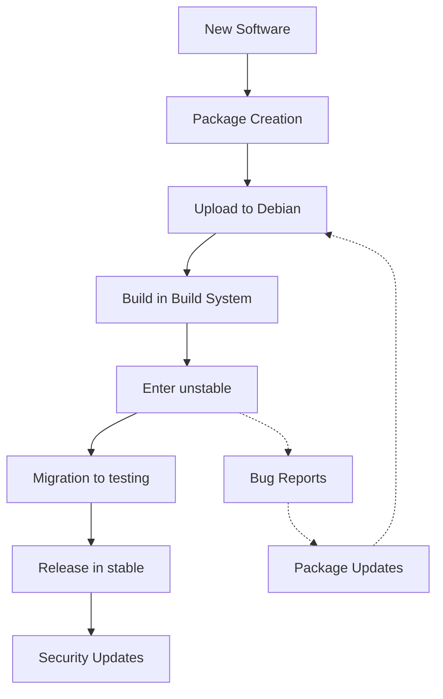

# Debian Development Workflows

## Introduction

Debian is one of the oldest and most respected Linux distributions, known for its stability, security, and vast software repositories. Behind these repositories is a robust development ecosystem with well-established workflows that help maintain thousands of packages. This guide introduces beginners to the standard workflows used in Debian development, helping you understand how software is packaged, maintained, and evolved within the Debian ecosystem.

Whether you're interested in contributing to Debian, creating your own packages, or simply understanding how the system works, this guide will walk you through the fundamental workflows that Debian developers follow.

## Understanding the Debian Package Lifecycle

Before diving into specific workflows, it's important to understand the lifecycle of a Debian package:



This lifecycle shows how software moves from initial packaging through the various Debian repositories before reaching end users.

## Setting Up Your Development Environment

Before starting Debian development, you need to set up a proper environment.

### Essential Tools

First, install the necessary development packages:

```bash
sudo apt update
sudo apt install build-essential devscripts debhelper dh-make lintian
```

### Setting Up Your Identity

Configure your identity for package signing:

```bash
cat > ~/.bashrc << EOF
export DEBFULLNAME="Your Name"
export DEBEMAIL="your.email@example.com"
EOF
source ~/.bashrc
```

### Creating a GPG Key

You'll need a GPG key for package signing:

```bash
gpg --gen-key
```

Follow the prompts to create your key. Make sure to use a strong passphrase.

## Workflow 1: Creating a New Debian Package

Let's walk through the process of creating a new Debian package from scratch.

### Step 1: Obtain the Source Code

First, download the source code of the software you want to package:

```bash
mkdir -p ~/debian-dev/mypackage
cd ~/debian-dev/mypackage
wget https://example.com/mypackage-1.0.tar.gz
tar xf mypackage-1.0.tar.gz
cd mypackage-1.0
```

### Step 2: Initialize the Debian Packaging

Use `dh_make` to create the initial Debian packaging files:

```bash
dh_make -f ../mypackage-1.0.tar.gz
```

This command will prompt you for the package type. For most software, select "single" (s).

### Step 3: Edit the Debian Files

Now edit the generated files in the `debian/` directory:

```bash
# Edit the control file to set package metadata
nano debian/control

# Edit the copyright file
nano debian/copyright

# Create install file if needed
echo "usr/bin/" > debian/install
```

The `control` file is particularly important as it contains metadata about your package:

```
Source: mypackage
Section: utils
Priority: optional
Maintainer: Your Name <your.email@example.com>
Build-Depends: debhelper-compat (= 13)
Standards-Version: 4.5.1
Homepage: https://example.com/mypackage

Package: mypackage
Architecture: any
Depends: ${shlibs:Depends}, ${misc:Depends}
Description: Short description of mypackage
 This is a longer description of mypackage.
 It can span multiple lines.
```

### Step 4: Build the Package

Build the package to create a `.deb` file:

```bash
dpkg-buildpackage -us -uc
```

The output will look something like:

```
dpkg-buildpackage: info: source package mypackage
dpkg-buildpackage: info: source version 1.0-1
dpkg-buildpackage: info: source distribution unstable
dpkg-buildpackage: info: source changed by Your Name <your.email@example.com>
 dpkg-source --before-build .
 debian/rules clean
 debian/rules binary
 dpkg-genbuildinfo --build=binary
 dpkg-genchanges --build=binary >../mypackage_1.0-1_amd64.changes
dpkg-buildpackage: info: binary-only upload (no source included)
```

### Step 5: Test the Package

Test your newly built package:

```bash
cd ..
sudo dpkg -i mypackage_1.0-1_amd64.deb
```

## Workflow 2: Maintaining Existing Packages

Most Debian development work involves maintaining existing packages rather than creating new ones.

### Step 1: Clone the Package Repository

Use `git` to clone the package repository:

```bash
apt source --download-only package-name
dpkg-source -x package-name_version.dsc
cd package-name-version/
```

Alternatively, if the package is maintained in Git:

```bash
git clone https://salsa.debian.org/debian/package-name.git
cd package-name
```

### Step 2: Make Your Changes

Make the necessary changes to the package. This might involve:

1. Updating to a new upstream version
2. Fixing bugs
3. Adding new features
4. Updating dependencies

### Step 3: Update the Changelog

Document your changes in the changelog:

```bash
dch -i
```

This opens an editor with a new changelog entry:

```
package-name (1.2.3-2) unstable; urgency=medium

  * Fix memory leak in function xyz (Closes: #123456)

 -- Your Name <your.email@example.com>  Mon, 01 Jan 2023 12:00:00 +0000
```

### Step 4: Build and Test

Build the package to test your changes:

```bash
dpkg-buildpackage -us -uc
```

Install and test the resulting package:

```bash
cd ..
sudo dpkg -i package-name_version_amd64.deb
```

### Step 5: Create a Debdiff for Review

If you're submitting changes to the package maintainer, create a debdiff:

```bash
debdiff package-name_1.2.3-1.dsc package-name_1.2.3-2.dsc > package-name_1.2.3-1_to_1.2.3-2.debdiff
```

## Workflow 3: Collaborating with Debian Teams

Many packages in Debian are maintained by teams rather than individuals.

### Step 1: Find the Relevant Team

First, identify which team maintains the package:

```bash
apt show package-name | grep Maintainer
```

### Step 2: Join the Team Communication Channels

Most teams have mailing lists or IRC channels. Join these to communicate with team members.

### Step 3: Clone the Team Repository

Many teams use Git repositories on Salsa (Debian's GitLab instance):

```bash
git clone https://salsa.debian.org/debian/package-name.git
cd package-name
```

### Step 4: Create a Feature Branch

Create a branch for your changes:

```bash
git checkout -b fix-bug-123456
```

### Step 5: Make Your Changes and Commit

Make your changes and commit them with a descriptive message:

```bash
# Make changes to files
git add -A
git commit -m "Fix memory leak in function xyz (Closes: #123456)"
```

### Step 6: Push and Create a Merge Request

Push your branch and create a merge request:

```bash
git push -u origin fix-bug-123456
```

Then go to the repository on Salsa and create a merge request for your branch.

## Workflow 4: Handling Bug Reports and Fixes

Debian uses the Bug Tracking System (BTS) to track issues with packages.

### Step 1: Find Bugs for a Package

Check for existing bugs in a package:

```bash
apt-get install debian-goodies
bts show package-name
```

Example output:

```
#123456 - memory leak in function xyz - pending
#123457 - crashes when using UTF-8 filenames - open
```

### Step 2: Reproduce the Bug

Attempt to reproduce the bug to understand it:

```bash
# Install the buggy package
sudo apt install package-name
# Try to reproduce the bug
package-name --problematic-option
```

### Step 3: Fix the Bug

Make changes to fix the bug:

```bash
apt source package-name
cd package-name-version/
# Edit files to fix the bug
```

### Step 4: Test Your Fix

Build and test your fixed package:

```bash
dpkg-buildpackage -us -uc
cd ..
sudo dpkg -i package-name_version_amd64.deb
# Test that the bug is fixed
```

### Step 5: Submit a Patch

Create a patch file:

```bash
cd package-name-version/
git diff > fix-bug-123456.patch
```

Submit the patch to the BTS:

```bash
reportbug package-name
```

Include your patch and reference the bug number in your report.

## Workflow 5: Preparing Security Updates

Security updates in Debian follow a special workflow.

### Step 1: Identify the Security Issue

First, confirm the security vulnerability and determine its severity.

### Step 2: Prepare the Fix

Prepare a minimal fix that addresses only the security issue:

```bash
apt source package-name
cd package-name-version/
# Apply minimal fix for security issue
```

### Step 3: Update the Changelog

Use a special format for security updates:

```bash
dch --security "Fix security issue CVE-2023-12345"
```

This creates a changelog entry like:

```
package-name (1.2.3-1+deb11u1) bullseye-security; urgency=high

  * Security fix: Fix security issue CVE-2023-12345
    - Fix buffer overflow in function xyz

 -- Your Name <your.email@example.com>  Mon, 01 Jan 2023 12:00:00 +0000
```

### Step 4: Build and Test

Build and test the package:

```bash
dpkg-buildpackage -us -uc
cd ..
sudo dpkg -i package-name_version_amd64.deb
# Verify the security issue is fixed
```

### Step 5: Notify the Security Team

For official Debian packages, send the fix to the security team:

```bash
reportbug --severity critical debian-security
```

## Workflow 6: Backporting Packages

Backporting is the process of adapting packages from newer Debian versions to older stable releases.

### Step 1: Get the Source Package

Get the source package from a newer release:

```bash
apt source -t unstable package-name
cd package-name-version/
```

### Step 2: Adapt for Older Release

Modify the package to work with the older release:

```bash
# Edit debian/control if needed to adjust dependencies
nano debian/control
```

### Step 3: Update the Changelog for Backport

Mark the package as a backport:

```bash
dch --bpo "Backport to stable"
```

This creates an entry like:

```
package-name (1.2.3-1~bpo11+1) bullseye-backports; urgency=medium

  * Backport to bullseye

 -- Your Name <your.email@example.com>  Mon, 01 Jan 2023 12:00:00 +0000
```

### Step 4: Build and Test in a Clean Environment

Use pbuilder to build in a clean environment:

```bash
sudo apt install pbuilder
sudo pbuilder create --distribution stable
pdebuild
```

### Step 5: Upload to Backports

If you're a Debian Developer, upload to backports:

```bash
dput backports ../package-name_1.2.3-1~bpo11+1_amd64.changes
```

## Understanding Debian Package Components

To work effectively with Debian packages, understand these key files in the `debian/` directory:

1. `control`: Package metadata and dependencies
2. `rules`: Build instructions (a Makefile)
3. `changelog`: History of package changes
4. `copyright`: Copyright and licensing information
5. `install`: Lists files to install in the package
6. `patches/`: Directory containing patches to apply to the source

Example `rules` file:

```makefile
#!/usr/bin/make -f
%:
	dh $@

override_dh_auto_configure:
	dh_auto_configure -- --enable-feature1 --disable-feature2
```

## Best Practices for Debian Development

Follow these best practices for smooth Debian development:

1. **Always use version control** - Preferably Git
2. **Run lintian** before uploading packages:
   ```bash
   lintian -i *.changes
   ```
3. **Build in clean environments** using pbuilder or sbuild
4. **Test packages thoroughly** before uploading
5. **Follow the Debian Policy Manual**
6. **Communicate with other developers** on mailing lists and IRC
7. **Document your changes** clearly in the changelog

## Troubleshooting Common Issues

### Build Failures

If package building fails, check:

```bash
# Check for missing build dependencies
dpkg-checkbuilddeps

# Look for errors in the build log
less ../build-area/package-name_version.buildlog
```

### Lintian Warnings

Address lintian warnings:

```bash
lintian -i *.changes
```

Example output:

```
W: package-name: binary-without-manpage usr/bin/myprogram
   The binary usr/bin/myprogram in your package does not have a corresponding
   manual page.
```

Solution: Create a man page or exclude the binary.

### Dependency Issues

Resolve dependency issues:

```bash
# Check missing dependencies
dpkg -i package-name_version_amd64.deb 2>&1 | grep "dependency"
```

## Summary

Debian development follows established workflows that ensure the distribution's quality and stability. In this guide, we've covered:

1. Setting up a development environment
2. Creating new packages
3. Maintaining existing packages
4. Collaborating with Debian teams
5. Handling bug reports and fixes
6. Preparing security updates
7. Backporting packages

By following these workflows and best practices, you can contribute effectively to the Debian ecosystem, whether as a casual contributor or a dedicated maintainer.

## Additional Resources

To continue your Debian development journey, explore these resources:

- [Debian New Maintainers' Guide](https://www.debian.org/doc/manuals/maint-guide/)
- [Debian Policy Manual](https://www.debian.org/doc/debian-policy/)
- [Debian Developer's Reference](https://www.debian.org/doc/manuals/developers-reference/)
- [Debian BTS Documentation](https://www.debian.org/Bugs/)
- [Salsa (Debian GitLab) Documentation](https://salsa.debian.org/doc)

## Practice Exercises

1. Create a simple "Hello World" Debian package
2. Find a bug in the Debian BTS and try to reproduce it
3. Create a patch for a simple bug in an existing package
4. Set up pbuilder and build a package in a clean environment
5. Clone a package from Salsa and make a small improvement