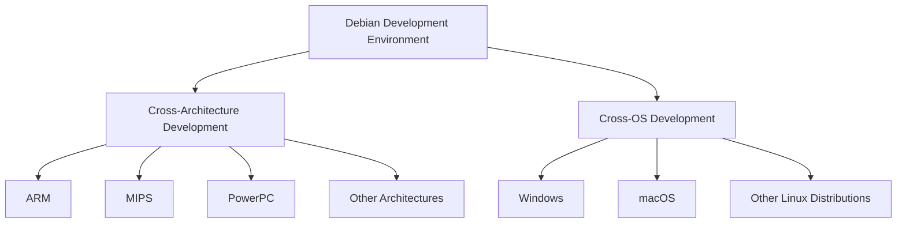

# Debian Cross-Platform Development

## Introduction

Cross-platform development in Debian refers to the process of building applications that can run on multiple hardware architectures or operating systems while using Debian as your development platform. Debian is particularly well-suited for cross-platform development due to its robust package management system, support for multiple architectures, and comprehensive development tools.

This guide will walk you through the fundamentals of cross-platform development in Debian, from setting up your environment to building and testing applications across different platforms. Whether you're developing for ARM devices, Windows systems, or other Linux distributions, the skills you'll learn here will help you create versatile, portable software.

## Understanding Cross-Platform Development

Cross-platform development generally falls into two categories:

1. **Cross-architecture development**: Building software for different CPU architectures (x86, ARM, MIPS, etc.)
2. **Cross-OS development**: Creating applications that run on different operating systems (Linux, Windows, macOS)

Debian provides tools for both types, making it an excellent platform for developers who need to target multiple environments.



## Setting Up Your Cross-Platform Development Environment

### Installing Essential Tools

First, let's install the basic tools needed for cross-platform development:

```bash
sudo apt update
sudo apt install build-essential crossbuild-essential-arm64 crossbuild-essential-armhf
sudo apt install gcc-multilib g++-multilib
sudo apt install mingw-w64 # For Windows cross-compilation
```

This installs tools for building for ARM architectures and Windows. The `gcc-multilib` and `g++-multilib` packages allow compiling for different architectures on your host system.

### Configuring the Debian Multiarch System

Debian's multiarch support allows you to install libraries for multiple architectures on the same system:

```bash
# Add support for 32-bit architecture on a 64-bit system
sudo dpkg --add-architecture i386
sudo apt update

# Install libraries for multiple architectures
sudo apt install libc6:amd64 libc6:i386
```

The output after running these commands should show that the new architecture has been added and the appropriate packages installed.

## Cross-Architecture Development

### Building for ARM Devices

ARM is a popular architecture for mobile devices, embedded systems, and IoT devices. Here's how to compile a simple C program for ARM:

```bash
# Create a simple test program
cat > hello.c << EOF
#include <stdio.h>

int main() {
    printf("Hello from ARM!
");
    return 0;
}
EOF

# Compile for ARM
arm-linux-gnueabihf-gcc -o hello-arm hello.c
```

The output will be an executable named `hello-arm` that can run on ARM devices with the armhf architecture.

### Using QEMU for Testing

QEMU allows you to test your ARM binaries on your x86 machine:

```bash
# Install QEMU
sudo apt install qemu-user

# Test your ARM executable
qemu-arm ./hello-arm
```

The output should be:
```
Hello from ARM!
```

### Creating a Complete Cross-Compilation Toolchain with Buildroot

For more complex projects, you might want to use Buildroot to create a complete cross-compilation environment:

```bash
# Clone Buildroot
git clone https://git.buildroot.net/buildroot
cd buildroot

# Configure for a specific target (example: Raspberry Pi 4)
make raspberrypi4_defconfig

# Customize the configuration if needed
make menuconfig

# Build the toolchain and system
make
```

This process will take time, but the output will be a complete filesystem image and toolchain for your target platform.

## Cross-OS Development

### Compiling for Windows with MinGW

MinGW (Minimalist GNU for Windows) allows you to compile Windows applications from Debian:

```bash
# Create a simple Windows program
cat > hello_win.c << EOF
#include <stdio.h>

int main() {
    printf("Hello from Windows!
");
    return 0;
}
EOF

# Compile for Windows
x86_64-w64-mingw32-gcc -o hello.exe hello_win.c
```

The output file `hello.exe` is a Windows executable that can run on Windows systems.

### Using Wine for Testing Windows Applications

You can test your Windows applications directly in Debian using Wine:

```bash
# Install Wine
sudo apt install wine64

# Run your Windows executable
wine hello.exe
```

The output should be:
```
Hello from Windows!
```

### Cross-Platform Libraries and Frameworks

For more complex applications, you'll want to use cross-platform libraries:

```bash
# Install cross-platform libraries
sudo apt install libsdl2-dev libqt5-dev libgtk-3-dev
```

## Building Cross-Platform Applications with CMake

CMake is an excellent tool for creating cross-platform build systems:

```bash
# Install CMake
sudo apt install cmake

# Create a simple CMake project
mkdir -p cmake_example/src
cat > cmake_example/CMakeLists.txt << EOF
cmake_minimum_required(VERSION 3.10)
project(CrossPlatformExample)

add_executable(example src/main.cpp)
EOF

cat > cmake_example/src/main.cpp << EOF
#include <iostream>

int main() {
    #ifdef _WIN32
    std::cout << "Running on Windows" << std::endl;
    #elif __APPLE__
    std::cout << "Running on macOS" << std::endl;
    #elif __linux__
    std::cout << "Running on Linux" << std::endl;
    #else
    std::cout << "Running on unknown platform" << std::endl;
    #endif
    return 0;
}
EOF

# Build for Linux
cd cmake_example
mkdir build && cd build
cmake ..
make
```

The output will be an executable that detects which platform it's running on and prints an appropriate message.

### Cross-Compiling with CMake

You can also use CMake for cross-compilation:

```bash
# Create a toolchain file for ARM
cat > arm-linux-gnueabihf.cmake << EOF
set(CMAKE_SYSTEM_NAME Linux)
set(CMAKE_SYSTEM_PROCESSOR arm)

set(CMAKE_C_COMPILER arm-linux-gnueabihf-gcc)
set(CMAKE_CXX_COMPILER arm-linux-gnueabihf-g++)

set(CMAKE_FIND_ROOT_PATH /usr/arm-linux-gnueabihf)
set(CMAKE_FIND_ROOT_PATH_MODE_PROGRAM NEVER)
set(CMAKE_FIND_ROOT_PATH_MODE_LIBRARY ONLY)
set(CMAKE_FIND_ROOT_PATH_MODE_INCLUDE ONLY)
EOF

# Build for ARM
cmake -DCMAKE_TOOLCHAIN_FILE=../arm-linux-gnueabihf.cmake ..
make
```

This will produce an executable that can run on ARM Linux systems.

## Real-World Example: Building a Cross-Platform GUI Application

Let's create a simple cross-platform GUI application using GTK:

```bash
# Install GTK development libraries
sudo apt install libgtk-3-dev

# Create a simple GTK application
cat > gtk_example.c << EOF
#include <gtk/gtk.h>

static void on_button_clicked(GtkWidget *widget, gpointer data) {
    g_print("Button clicked!
");
}

static void activate(GtkApplication *app, gpointer user_data) {
    GtkWidget *window;
    GtkWidget *button;
    GtkWidget *box;

    window = gtk_application_window_new(app);
    gtk_window_set_title(GTK_WINDOW(window), "Cross-Platform GTK Example");
    gtk_window_set_default_size(GTK_WINDOW(window), 300, 200);

    box = gtk_box_new(GTK_ORIENTATION_VERTICAL, 0);
    gtk_container_add(GTK_CONTAINER(window), box);

    button = gtk_button_new_with_label("Click Me");
    g_signal_connect(button, "clicked", G_CALLBACK(on_button_clicked), NULL);
    gtk_container_add(GTK_CONTAINER(box), button);

    gtk_widget_show_all(window);
}

int main(int argc, char **argv) {
    GtkApplication *app;
    int status;

    app = gtk_application_new("org.example.CrossPlatform", G_APPLICATION_FLAGS_NONE);
    g_signal_connect(app, "activate", G_CALLBACK(activate), NULL);
    status = g_application_run(G_APPLICATION(app), argc, argv);
    g_object_unref(app);

    return status;
}
EOF

# Compile for Linux
gcc -o gtk_example gtk_example.c `pkg-config --cflags --libs gtk+-3.0`
```

You can run this application on any Linux system with GTK installed. To make it work on Windows, you would need to install the MinGW GTK+ development libraries and cross-compile it.

## Advanced Topic: Container-Based Cross-Platform Development

Docker can provide isolated environments for cross-platform development:

```bash
# Create a Dockerfile for cross-compilation
cat > Dockerfile << EOF
FROM debian:bullseye

RUN apt-get update && apt-get install -y \
    build-essential \
    crossbuild-essential-arm64 \
    mingw-w64 \
    cmake \
    && rm -rf /var/lib/apt/lists/*

WORKDIR /app
EOF

# Build the Docker image
docker build -t cross-platform-dev .

# Use the container for cross-compilation
docker run -it --rm -v $(pwd):/app cross-platform-dev bash -c "arm-linux-gnueabihf-gcc -o hello-arm hello.c"
```

This creates a reproducible build environment that can be shared with your team.

## Debugging Cross-Platform Applications

Debugging cross-platform applications can be challenging. Here are some tools and techniques:

```bash
# Install GDB with multiarch support
sudo apt install gdb-multiarch

# Debug an ARM executable
gdb-multiarch -q ./hello-arm

# In GDB, set the architecture
(gdb) set architecture arm
(gdb) target remote localhost:1234
```

For remote debugging, you can use QEMU with GDB support:

```bash
# In one terminal, run QEMU with GDB server
qemu-arm -g 1234 ./hello-arm

# In another terminal, connect GDB
gdb-multiarch -q ./hello-arm
(gdb) target remote localhost:1234
(gdb) continue
```

## Summary

In this guide, we've explored the essential aspects of cross-platform development in Debian:

1. Setting up a cross-platform development environment in Debian
2. Building applications for different CPU architectures (x86, ARM)
3. Developing applications for different operating systems (Linux, Windows)
4. Using CMake to create cross-platform build systems
5. Creating a real-world cross-platform GUI application
6. Using containers for cross-platform development
7. Debugging cross-platform applications

Debian provides a robust platform for cross-platform development, with excellent tools and libraries that make it easier to build software that works across different architectures and operating systems.

## Additional Resources

- [Debian Wiki: CrossCompiling](https://wiki.debian.org/CrossCompiling)
- [Debian Multiarch HOWTO](https://wiki.debian.org/Multiarch/HOWTO)
- [CMake Documentation](https://cmake.org/documentation/)
- [MinGW-w64 Project](http://mingw-w64.org/doku.php)

## Exercises

1. Build a simple command-line application and compile it for both x86_64 Linux and Windows.
2. Create a CMake project that detects the platform and uses different libraries depending on the target OS.
3. Use Docker to create a reproducible build environment for an ARM target.
4. Create a simple GUI application using a cross-platform framework like Qt or GTK and make it work on both Linux and Windows.
5. Set up remote debugging for an application running on an ARM device.