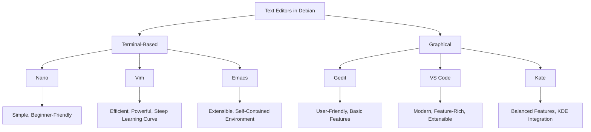

# Debian Text Editors

## Introduction

Text editors are essential tools for any software developer working in a Debian environment. Unlike full-featured Integrated Development Environments (IDEs), text editors are lightweight applications focused primarily on creating and editing text files, including source code. Debian offers a rich ecosystem of text editors ranging from simple, terminal-based tools to sophisticated graphical applications with extensive plugin systems.

In this guide, we'll explore various text editors available in Debian, their features, and how to use them effectively for software development. Whether you're writing a simple script or developing a complex application, understanding the capabilities of different text editors will help you choose the right tool for your workflow.

## Common Text Editors in Debian

Debian provides access to numerous text editors through its package management system. Let's examine the most popular options:

### Terminal-Based Editors

#### 1. Nano

Nano is one of the simplest and most beginner-friendly text editors available in Debian. It's a terminal-based editor that comes pre-installed on most Debian systems.

**Installation:**
```bash
sudo apt install nano
```

**Basic Usage:**
```bash
nano filename.txt
```

**Key Features:**
- Simple, intuitive interface
- Menu-driven commands visible at the bottom of the screen
- Basic syntax highlighting
- Search and replace functionality

**Common Keyboard Shortcuts:**
- `Ctrl+O`: Save file
- `Ctrl+X`: Exit
- `Ctrl+K`: Cut line
- `Ctrl+U`: Paste text
- `Ctrl+W`: Search for text

**Example: Creating a Python Script with Nano**

1. Open a new file:
```bash
nano hello.py
```

2. Enter the following code:
```python
#!/usr/bin/env python3

def greet(name):
    return f"Hello, {name}!"

if __name__ == "__main__":
    print(greet("Debian Developer"))
```

3. Save with `Ctrl+O`, then exit with `Ctrl+X`.

4. Make the script executable and run it:
```bash
chmod +x hello.py
./hello.py
```

Output:
```
Hello, Debian Developer!
```

#### 2. Vim

Vim (Vi Improved) is a powerful, highly configurable text editor known for its efficiency and steep learning curve. It's designed for keyboard-centric editing with different modes for various tasks.

**Installation:**
```bash
sudo apt install vim
```

**Basic Usage:**
```bash
vim filename.txt
```

**Key Features:**
- Modal editing (Normal, Insert, Visual, Command modes)
- Extensive customization through `.vimrc` file
- Powerful search and replace with regular expressions
- Macro recording for automating repetitive tasks
- Syntax highlighting for numerous languages
- Split windows and tabs
- Built-in scripting language

**Basic Vim Modes:**
- Normal Mode (default): For navigating and executing commands
- Insert Mode (`i`): For inserting text
- Visual Mode (`v`): For selecting text
- Command Mode (`:`): For executing Vim commands

**Common Commands:**
- `:w`: Save file
- `:q`: Quit
- `:wq` or `ZZ`: Save and quit
- `:q!`: Quit without saving
- `/pattern`: Search for pattern
- `:%s/old/new/g`: Replace all occurrences of "old" with "new"

**Example: Setting Up a Basic Vim Configuration**

Create or edit your `.vimrc` file:
```bash
vim ~/.vimrc
```

Add these basic configurations:
```vim
" Enable syntax highlighting
syntax on

" Show line numbers
set number

" Enable autoindentation
set autoindent

" Set tab width to 4 spaces
set tabstop=4
set shiftwidth=4
set expandtab

" Enable mouse support
set mouse=a

" Enable search highlighting
set hlsearch
```

#### 3. Emacs

Emacs is more than a text editor—it's a complete working environment. With its extensive customization options and built-in functionality, Emacs can be tailored to handle almost any text editing task.

**Installation:**
```bash
sudo apt install emacs
```

**Basic Usage:**
```bash
emacs filename.txt
```

**Key Features:**
- Highly extensible with Emacs Lisp
- Integrated development environment capabilities
- Version control integration
- Support for multiple major modes for different file types
- Extensive customization through init files
- Built-in package manager

**Common Keyboard Shortcuts:**
- `Ctrl+X Ctrl+S`: Save file
- `Ctrl+X Ctrl+C`: Exit Emacs
- `Ctrl+X Ctrl+F`: Open file
- `Ctrl+Space`: Set mark (for selection)
- `Alt+X`: Execute a command by name

**Example: Creating a Simple Emacs Configuration**

Create or edit your `.emacs` file:
```bash
emacs ~/.emacs
```

Add these basic configurations:
```lisp
;; Enable line numbers
(global-display-line-numbers-mode)

;; Enable syntax highlighting
(global-font-lock-mode 1)

;; Set tab width to 4 spaces
(setq-default tab-width 4)
(setq-default indent-tabs-mode nil)

;; Auto-pair brackets and quotes
(electric-pair-mode 1)

;; Show matching parentheses
(show-paren-mode 1)
```

### Graphical Text Editors

#### 1. Gedit

Gedit is the default text editor for the GNOME desktop environment. It offers a clean, simple interface with the essential features needed for basic coding.

**Installation:**
```bash
sudo apt install gedit
```

**Key Features:**
- Tabbed interface for working with multiple files
- Plugin system for added functionality
- Syntax highlighting
- Search and replace with regex support
- Spell checking
- Configurable highlighting schemes

**Example: Installing Plugins**
```bash
sudo apt install gedit-plugins
```

Then enable plugins through Edit → Preferences → Plugins.

#### 2. Visual Studio Code (VS Code)

VS Code is a modern, powerful code editor developed by Microsoft. Although not included in the default Debian repositories, it's widely used and can be installed easily.

**Installation:**
```bash
# First, download the Debian package from code.visualstudio.com or use:
wget -qO- https://packages.microsoft.com/keys/microsoft.asc | gpg --dearmor > packages.microsoft.gpg
sudo install -o root -g root -m 644 packages.microsoft.gpg /etc/apt/trusted.gpg.d/
sudo sh -c 'echo "deb [arch=amd64,arm64,armhf signed-by=/etc/apt/trusted.gpg.d/packages.microsoft.gpg] https://packages.microsoft.com/repos/code stable main" > /etc/apt/sources.list.d/vscode.list'
rm -f packages.microsoft.gpg

sudo apt update
sudo apt install code
```

**Key Features:**
- Integrated terminal
- Git integration
- Extensive marketplace for extensions
- Intelligent code completion
- Debugging support
- Live Share for collaborative editing
- Customizable interface

**Example: Setting Up Python Development Environment in VS Code**

1. Install VS Code Python extension
2. Create a Python file:
```python
def factorial(n):
    if n == 0 or n == 1:
        return 1
    else:
        return n * factorial(n-1)

# Test the function
print(factorial(5))  # Should output: 120
```

3. Set up a launch configuration for debugging (`.vscode/launch.json`):
```json
{
    "version": "0.2.0",
    "configurations": [
        {
            "name": "Python: Current File",
            "type": "python",
            "request": "launch",
            "program": "${file}",
            "console": "integratedTerminal"
        }
    ]
}
```

#### 3. Kate

Kate (KDE Advanced Text Editor) is the default text editor for the KDE desktop environment. It offers a good balance between features and simplicity.

**Installation:**
```bash
sudo apt install kate
```

**Key Features:**
- Multi-document interface
- Split view
- Built-in terminal
- Project management
- Code folding
- Syntax highlighting
- Plugin system

## Comparing Text Editors

Different text editors excel in different areas. Here's a comparative overview to help you choose the right editor for your needs:



### Feature Comparison Table

| Feature | Nano | Vim | Emacs | Gedit | VS Code | Kate |
|---------|------|-----|-------|-------|---------|------|
| Learning Curve | Low | High | High | Low | Medium | Low |
| Performance | Fast | Very Fast | Moderate | Moderate | Moderate | Fast |
| Customizability | Limited | Extensive | Extensive | Moderate | Extensive | Good |
| Extensions/Plugins | No | Yes | Yes | Yes | Yes | Yes |
| Syntax Highlighting | Basic | Advanced | Advanced | Good | Excellent | Good |
| Code Completion | No | Via plugins | Via packages | Basic | Built-in | Basic |
| Git Integration | No | Via plugins | Built-in | Via plugins | Built-in | Via plugins |
| Split View | No | Yes | Yes | No | Yes | Yes |
| Terminal Integration | N/A | N/A | N/A | No | Yes | Yes |

## Setting Up Your Text Editor for Development

Regardless of which editor you choose, proper configuration can significantly improve your productivity. Here are some general tips:

### 1. Syntax Highlighting

All modern text editors support syntax highlighting, which colorizes different parts of your code (keywords, strings, comments, etc.) to improve readability.

**Example (Vim):**
```vim
" Enable syntax highlighting
syntax on
```

### 2. Line Numbers

Line numbers are crucial for debugging and navigating code.

**Example (VS Code settings.json):**
```json
{
    "editor.lineNumbers": "on"
}
```

### 3. Indentation Settings

Consistent indentation improves code readability. Most editors let you configure tab size and whether to use spaces or tabs.

**Example (Gedit):**
Edit → Preferences → Editor → Tab width: 4, Insert spaces instead of tabs

### 4. File Type Detection

Ensure your editor can detect file types correctly to apply the appropriate syntax highlighting and indentation rules.

### 5. Useful Plugins

Consider installing plugins that enhance your productivity:

- Linters and formatters for code quality
- Git integration
- Language-specific plugins
- Snippet libraries

**Example: Installing Python linting in VS Code**
```bash
pip install pylint
```

Then add to VS Code settings.json:
```json
{
    "python.linting.pylintEnabled": true,
    "python.linting.enabled": true
}
```

## Real-World Applications

### 1. Web Development Workflow

For web development, you might set up your editor to handle HTML, CSS, and JavaScript efficiently.

**Example (VS Code):**

1. Install extensions:
   - HTML CSS Support
   - JavaScript (ES6) code snippets
   - Live Server

2. Create a simple web project:

HTML file (index.html):
```html
<!DOCTYPE html>
<html lang="en">
<head>
    <meta charset="UTF-8" />
    <meta name="viewport" content="width=device-width, initial-scale=1.0" />
    <title>My Debian Project</title>
    <link rel="stylesheet" href="styles.css" />
</head>
<body>
    <h1>Hello from Debian!</h1>
    <p>This is a simple web page created with a Debian text editor.</p>
    <button id="clickMe">Click Me</button>
    
    <script src="script.js"></script>
</body>
</html>
```

CSS file (styles.css):
```css
body {
    font-family: Arial, sans-serif;
    max-width: 800px;
    margin: 0 auto;
    padding: 20px;
}

h1 {
    color: #d70a53;  /* Debian red */
}

button {
    background-color: #d70a53;
    color: white;
    border: none;
    padding: 10px 15px;
    cursor: pointer;
}
```

JavaScript file (script.js):
```javascript
document.getElementById('clickMe').addEventListener('click', function() {
    alert('Hello from Debian JavaScript!');
});
```

### 2. Python Development Environment

Setting up your editor for Python development.

**Example (Vim):**

1. Install plugins using a plugin manager like Vundle:
   - Add to ~/.vimrc:
   ```vim
   " Set up Vundle
   set nocompatible
   filetype off
   set rtp+=~/.vim/bundle/Vundle.vim
   call vundle#begin()
   
   Plugin 'VundleVim/Vundle.vim'
   Plugin 'vim-syntastic/syntastic'  " Syntax checking
   Plugin 'davidhalter/jedi-vim'     " Python autocompletion
   Plugin 'preservim/nerdtree'       " File explorer
   
   call vundle#end()
   filetype plugin indent on
   
   " Python-specific settings
   autocmd FileType python set tabstop=4
   autocmd FileType python set softtabstop=4
   autocmd FileType python set shiftwidth=4
   autocmd FileType python set expandtab
   autocmd FileType python set autoindent
   autocmd FileType python set fileformat=unix
   ```

2. Create a Python script:
```python
#!/usr/bin/env python3

class DebianCalculator:
    def __init__(self):
        self.result = 0
        
    def add(self, x):
        self.result += x
        return self
        
    def subtract(self, x):
        self.result -= x
        return self
        
    def value(self):
        return self.result

# Test the calculator
calc = DebianCalculator()
result = calc.add(10).subtract(5).add(2).value()
print(f"The result is: {result}")  # Should output: The result is: 7
```

### 3. Shell Script Development

Creating shell scripts for automating tasks in Debian.

**Example (Nano):**

```bash
nano sys_info.sh
```

```bash
#!/bin/bash

# System Information Script

echo "======= System Information ======="
echo "Hostname: $(hostname)"
echo "Distribution: $(lsb_release -ds 2>/dev/null || cat /etc/*release | grep -i name | head -1 || echo 'Unknown')"
echo "Kernel: $(uname -r)"
echo "Uptime: $(uptime -p)"
echo "CPU: $(grep 'model name' /proc/cpuinfo | head -1 | cut -d':' -f2 | sed 's/^[ \t]*//')"
echo "RAM: $(free -h | awk '/^Mem:/ {print $2}')"
echo "Disk Usage: $(df -h --output=pcent / | tail -1)"
echo "=================================="
```

Save the file, make it executable, and run it:
```bash
chmod +x sys_info.sh
./sys_info.sh
```

## Summary

Text editors are fundamental tools for software development in Debian. We've explored a variety of options, from the simple and beginner-friendly Nano to the highly customizable Vim and Emacs, as well as graphical options like Gedit, VS Code, and Kate.

The choice of text editor is often a personal one, influenced by your specific needs, workflow, and preferences. Many developers start with a simpler editor like Nano or Gedit and gradually transition to more powerful tools like Vim, Emacs, or VS Code as their skills and requirements evolve.

Remember that the most important factor is not which editor you use, but how comfortable and productive you are with it. Take the time to learn your chosen editor's features and shortcuts, and customize it to suit your specific development needs.

## Additional Resources

- **Nano**: `man nano` or visit [Nano editor homepage](https://www.nano-editor.org/)
- **Vim**: `vimtutor` command or visit [Vim documentation](https://www.vim.org/docs.php)
- **Emacs**: Built-in tutorial (Ctrl+h t) or visit [GNU Emacs documentation](https://www.gnu.org/software/emacs/documentation.html)
- **Gedit**: Visit [Gedit Wiki](https://wiki.gnome.org/Apps/Gedit)
- **VS Code**: Visit [VS Code documentation](https://code.visualstudio.com/docs)
- **Kate**: Visit [Kate editor documentation](https://docs.kde.org/stable5/en/kate/kate/)

## Exercises

1. **Basic Editing**: Create a simple "Hello, World!" program in your preferred programming language using three different text editors. Note the differences in the editing experience.

2. **Editor Customization**: Choose one text editor and customize its configuration file to match your preferences (color scheme, indentation, key bindings).

3. **Plugin Installation**: Install a syntax checking or code completion plugin for your chosen editor and test it with a small code sample.

4. **Project Setup**: Create a small project structure with multiple files and practice navigating between them in your editor.

5. **Advanced Features**: Learn and practice five keyboard shortcuts or commands in your chosen editor that you weren't familiar with before.