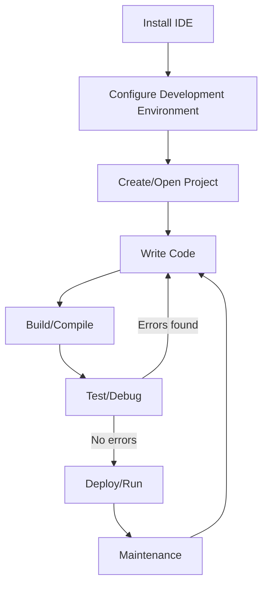

# Debian IDEs

## Introduction

Integrated Development Environments (IDEs) are powerful software applications that provide comprehensive facilities to programmers for software development. They typically include a code editor, build automation tools, debuggers, and intelligent code completion capabilities. On Debian-based systems (like Debian itself, Ubuntu, Linux Mint, etc.), you have access to a wide range of IDEs that can significantly improve your development workflow.

This guide walks you through the most popular and effective IDEs available on Debian systems, helping you choose the right tool for your programming needs. Whether you're developing in Python, Java, C++, web technologies, or other languages, Debian offers robust IDE options to support your work.

## Popular IDEs for Debian

### 1. VS Code

Visual Studio Code (VS Code) has become one of the most popular IDEs across all platforms, including Debian-based systems.

#### Installation

VS Code is not available in the official Debian repositories due to licensing, but you can install it using the official Microsoft repository:

```bash
# Download the Microsoft GPG key
wget -qO- https://packages.microsoft.com/keys/microsoft.asc | gpg --dearmor > microsoft.gpg
sudo mv microsoft.gpg /etc/apt/trusted.gpg.d/microsoft.gpg

# Add the VS Code repository
echo "deb [arch=amd64] https://packages.microsoft.com/repos/vscode stable main" | sudo tee /etc/apt/sources.list.d/vscode.list

# Update package lists and install VS Code
sudo apt update
sudo apt install code
```

Alternatively, you can install the open-source version called "Code - OSS" or "VSCodium" which doesn't include Microsoft's telemetry:

```bash
sudo apt install codium
```

#### Key Features

- Extensive extension marketplace
- Built-in Git integration
- Debugging support
- Intelligent code completion
- Terminal integration
- Live Share for collaborative development

#### Example Usage

Creating and running a simple Python application in VS Code:

1. Create a new file named `hello.py`
2. Add the following code:

```python
def greet(name):
    return f"Hello, {name}!"

print(greet("Debian User"))
```

3. Install the Python extension from the Extensions marketplace
4. Run the code by pressing F5 or clicking the play button

**Output:**
```
Hello, Debian User!
```

### 2. Eclipse

Eclipse is a powerful, language-agnostic IDE that's particularly popular for Java development but supports many languages through plugins.

#### Installation

```bash
sudo apt update
sudo apt install eclipse
```

For specific Eclipse packages (like Eclipse for Java or C/C++ developers), you may want to download from the official website and install manually.

#### Key Features

- Extensive plugin system
- Strong Java development tools
- Integrated debugging
- Git integration
- Comprehensive refactoring tools

#### Example Usage

Creating a simple Java application in Eclipse:

1. Create a new Java project (File > New > Java Project)
2. Create a new class (Right-click on src folder > New > Class)
3. Enter the following code:

```java
public class HelloDebian {
    public static void main(String[] args) {
        System.out.println("Welcome to Eclipse on Debian!");
    }
}
```

4. Run the application (Right-click > Run As > Java Application)

**Output:**
```
Welcome to Eclipse on Debian!
```

### 3. JetBrains IDEs

JetBrains offers a suite of specialized IDEs for different languages and frameworks:

- IntelliJ IDEA (Java)
- PyCharm (Python)
- CLion (C/C++)
- WebStorm (JavaScript/Web)
- PhpStorm (PHP)

#### Installation

JetBrains IDEs aren't available in the default repositories, but you can install them using the JetBrains Toolbox:

```bash
# Download the JetBrains Toolbox App
wget -cO jetbrains-toolbox.tar.gz "https://data.services.jetbrains.com/products/download?platform=linux&code=TBA"

# Extract it
tar -xzf jetbrains-toolbox.tar.gz

# Move to the extracted directory
cd jetbrains-toolbox-*/

# Run the installer
./jetbrains-toolbox
```

Then use the toolbox to install your preferred IDEs.

#### Key Features

- Intelligent code assistance
- Advanced refactoring
- Built-in version control
- Database tools
- Profiling tools
- Framework-specific assistance

#### Example Usage (PyCharm)

Creating a simple Python Flask application in PyCharm:

1. Create a new project
2. Install Flask (Terminal > `pip install flask`)
3. Create a new file `app.py` with the following content:

```python
from flask import Flask

app = Flask(__name__)

@app.route('/')
def hello_world():
    return 'Hello, Debian!'

if __name__ == '__main__':
    app.run(debug=True)
```

4. Run the application
5. Open a browser to `http://127.0.0.1:5000`

**Output in Browser:** `Hello, Debian!`

### 4. NetBeans

NetBeans is a free, open-source IDE that supports multiple languages but is particularly strong for Java development.

#### Installation

```bash
sudo apt update
sudo apt install netbeans
```

#### Key Features

- Cross-platform compatibility
- Support for multiple languages (Java, PHP, C/C++, HTML5)
- GUI builder for Java applications
- Maven integration
- Profiler tools

### 5. Geany

Geany is a lightweight IDE that's perfect for beginners or when working on smaller projects.

#### Installation

```bash
sudo apt update
sudo apt install geany
```

#### Key Features

- Fast startup
- Low resource usage
- Basic IDE features
- Support for many programming languages
- Simple project management

#### Example Usage

Creating a simple HTML file in Geany:

1. Create a new file and save it as `index.html`
2. Add the following content:

```html
<!DOCTYPE html>
<html>
<head>
    <title>Debian Web Development</title>
    <style>
        body {
            font-family: sans-serif;
            color: #333;
            max-width: 800px;
            margin: 0 auto;
            padding: 20px;
        }
        h1 {
            color: #d70a53; /* Debian red */
        }
    </style>
</head>
<body>
    <h1>Hello from Geany on Debian!</h1>
    <p>This is a simple HTML page created using the Geany IDE.</p>
</body>
</html>
```

3. Save the file and open it in a web browser

## Language-Specific IDEs

### For Python: Thonny

Thonny is a beginner-friendly Python IDE that's perfect for learning Python programming.

#### Installation

```bash
sudo apt update
sudo apt install thonny
```

#### Key Features

- Simple, clean interface
- Built-in debugger
- Variable inspector
- Step-through execution
- Syntax highlighting

### For C/C++: CodeBlocks

CodeBlocks is a dedicated IDE for C and C++ development.

#### Installation

```bash
sudo apt update
sudo apt install codeblocks
```

#### Key Features

- Cross-platform
- Supports multiple compilers
- Code profiling
- Debugging support
- Project management

## Development Workflow with IDEs on Debian

The typical development workflow on a Debian system using an IDE follows these steps:



## Customizing Your IDE

Most IDEs on Debian can be customized to better suit your needs:

1. **Themes**: Change the appearance of your IDE
2. **Keybindings**: Modify keyboard shortcuts
3. **Extensions/Plugins**: Add functionality for specific languages or frameworks
4. **Code Templates**: Create reusable code snippets
5. **Build Configurations**: Set up custom build processes

Example for VS Code settings (create or edit `.vscode/settings.json`):

```json
{
    "editor.fontSize": 14,
    "editor.fontFamily": "'JetBrains Mono', 'Droid Sans Mono', 'monospace'",
    "editor.tabSize": 2,
    "editor.wordWrap": "on",
    "workbench.colorTheme": "Monokai",
    "files.autoSave": "afterDelay",
    "terminal.integrated.fontSize": 14
}
```

## Troubleshooting Common IDE Issues on Debian

### Missing Dependencies

If your IDE reports missing dependencies, install them using apt:

```bash
sudo apt install packagename
```

### Java-based IDEs (Eclipse, NetBeans, IntelliJ) Not Starting

Ensure you have the correct Java version installed:

```bash
sudo apt install default-jre default-jdk
```

### Permission Issues

If your IDE can't access certain directories:

```bash
sudo chown -R username:username /path/to/directory
```

## Summary

Integrated Development Environments significantly enhance your programming experience on Debian-based systems by combining various development tools into a single application. The choice of IDE depends on your specific programming needs, project complexity, and personal preferences:

- **VS Code**: Versatile, lightweight, extensive plugins
- **Eclipse**: Powerful, especially for Java
- **JetBrains IDEs**: Professional-grade, language-specific tools
- **NetBeans**: Good all-around IDE with strong Java support
- **Geany**: Lightweight, fast for smaller projects
- **Thonny**: Excellent for beginning Python development
- **CodeBlocks**: Dedicated C/C++ development

By learning to use these IDEs effectively, you'll greatly improve your development productivity on Debian-based Linux systems.

## Additional Resources

1. Documentation for each IDE:
   - [VS Code Documentation](https://code.visualstudio.com/docs)
   - [Eclipse Documentation](https://help.eclipse.org/)
   - [JetBrains IDEs Documentation](https://www.jetbrains.com/help/)

2. Debian Package Management:
   - Learn more about `apt` for installing and managing software: `man apt`

3. Learning Git with IDEs:
   - Most modern IDEs have Git integration - practice creating repositories, committing changes, and managing branches

## Exercises

1. Install two different IDEs and compare their features for your preferred programming language.
2. Set up a simple project in your chosen IDE and configure it to use a version control system.
3. Explore the extension/plugin marketplace for your IDE and install tools that enhance your development workflow.
4. Configure custom keyboard shortcuts in your IDE to speed up common tasks.
5. Create a build/deployment configuration that automates the process of running your application.