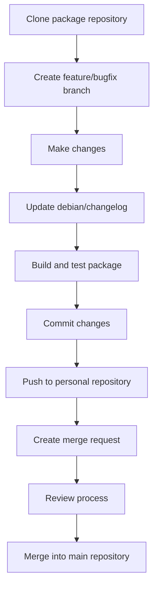

# Debian Version Control

## Introduction

Version control is a fundamental aspect of modern software development that allows developers to track changes, collaborate effectively, and maintain the integrity of their codebase. In the Debian ecosystem, version control systems are essential for both contributing to Debian itself and for developing software on Debian-based systems.

This guide will introduce you to version control concepts in the context of Debian, focusing primarily on Git (the most widely used version control system in the Debian community), while also touching on other systems that you might encounter.

## Understanding Version Control

Version control systems (VCS) track changes to files over time, allowing you to:

- Review the history of your project
- Revert to previous versions
- Compare changes between versions
- Collaborate with multiple developers
- Maintain different development branches

### Why Version Control is Important in Debian

Debian is one of the largest collaborative software projects in the world, with thousands of contributors working on tens of thousands of packages. Without effective version control:

1. Coordinating changes would be nearly impossible
2. Tracking bugs would be much more difficult
3. Package maintenance would become unmanageable
4. The quality and stability that Debian is known for would be compromised

## Git: The Primary Version Control System in Debian

Git has become the standard version control system in the Debian ecosystem. Created by Linus Torvalds (the creator of Linux), Git is a distributed version control system that offers speed, flexibility, and powerful branching capabilities.

### Installing Git on Debian

To begin using Git on your Debian system, install it using the APT package manager:

```bash
sudo apt update
sudo apt install git
```

### Basic Git Configuration

After installation, configure Git with your identity:

```bash
git config --global user.name "Your Name"
git config --global user.email "your.email@example.com"
```

This information will be associated with the commits you make.

### Essential Git Concepts

#### 1. Repositories

A Git repository (or repo) is a collection of files and the complete history of changes made to those files.

**Creating a new repository:**

```bash
mkdir my-debian-project
cd my-debian-project
git init
```

**Output:**
```
Initialized empty Git repository in /home/user/my-debian-project/.git/
```

#### 2. Staging and Committing

The Git workflow involves:
- Making changes to files
- Staging changes (adding them to the index)
- Committing changes (creating a permanent record)

```bash
# Create a sample file
echo "# My Debian Project" > README.md

# Stage the file
git add README.md

# Commit the change
git commit -m "Initial commit with README"
```

**Output:**
```
[master (root-commit) f7d2e3a] Initial commit with README
 1 file changed, 1 insertion(+)
 create mode 100644 README.md
```

#### 3. Viewing History

To see the history of changes:

```bash
git log
```

**Output:**
```
commit f7d2e3a42b1c9e2a3f4d5e6f7a8b9c0d1e2f3a4b
Author: Your Name <your.email@example.com>
Date:   Mon Jan 1 12:00:00 2023 +0000

    Initial commit with README
```

#### 4. Branches

Branches allow you to develop features or fix bugs in isolation:

```bash
# Create a new branch
git branch feature-branch

# Switch to the new branch
git checkout feature-branch

# Or do both at once
git checkout -b bugfix-branch
```

**Output:**
```
Switched to a new branch 'bugfix-branch'
```

#### 5. Merging

Merging combines changes from different branches:

```bash
# Switch back to the main branch
git checkout master

# Merge in your feature branch
git merge feature-branch
```

**Output (for a successful merge):**
```
Updating f7d2e3a..a1b2c3d
Fast-forward
 feature-file.txt | 5 +++++
 1 file changed, 5 insertions(+)
 create mode 100644 feature-file.txt
```

## Debian-Specific Git Repositories

Debian maintains its packages and infrastructure in various Git repositories. Here are some important ones:

### Debian Package Repositories

Most Debian packages are maintained in Git repositories, typically hosted on:

- [Salsa](https://salsa.debian.org/) - Debian's GitLab instance
- [Alioth](https://alioth-archive.debian.org/) - Legacy hosting (archived)

### Cloning a Debian Package Repository

To work on an existing Debian package:

```bash
# Example: Cloning the vim package repository
git clone https://salsa.debian.org/vim-team/vim.git
cd vim
```

## Working with Remote Repositories

### Adding a Remote

```bash
git remote add origin https://salsa.debian.org/yourusername/your-package.git
```

### Pushing Changes

After making and committing changes:

```bash
git push origin master
```

### Pulling Updates

To get the latest changes from the remote repository:

```bash
git pull origin master
```

## Debian Package Version Control Workflow

A typical workflow for maintaining a Debian package:



### Example: Updating a Package

Let's walk through a simple example of updating a package:

```bash
# Clone the repository
git clone https://salsa.debian.org/debian/hello.git
cd hello

# Create a branch for your changes
git checkout -b update-to-2.12

# Make your changes
# (Edit files as needed)

# Update the changelog
dch -v 2.12-1 "New upstream release"

# Build the package for testing
dpkg-buildpackage -us -uc

# Add your changes
git add debian/changelog
git add debian/patches/
# Add other changed files

# Commit your changes
git commit -m "Update to upstream version 2.12"

# Push to your fork (assuming you've set it up)
git push origin update-to-2.12
```

## Advanced Git Features Used in Debian Development

### Patch Management

Debian often uses Git's patch management capabilities for package maintenance:

```bash
# Create a patch for the latest commit
git format-patch -1 HEAD

# Apply a patch
git am 0001-Fix-critical-bug.patch
```

### Submodules

Some complex Debian packages use Git submodules to manage dependencies:

```bash
# Add a submodule
git submodule add https://example.com/repo.git path/to/submodule

# Initialize and update submodules after cloning
git submodule update --init --recursive
```

### Hooks

Git hooks can automate testing and verification:

```bash
# Example pre-commit hook to run lintian (Debian package checker)
cat > .git/hooks/pre-commit << 'EOF'
#!/bin/sh
dpkg-buildpackage -us -uc > /dev/null && lintian -I --show-overrides ../*.changes
if [ $? -ne 0 ]; then
    echo "Lintian check failed, commit aborted"
    exit 1
fi
EOF
chmod +x .git/hooks/pre-commit
```

## Other Version Control Systems in Debian

While Git is the most common, you might encounter other version control systems:

### Subversion (SVN)

Some older Debian packages might still use Subversion:

```bash
# Install SVN
sudo apt install subversion

# Check out a repository
svn checkout https://svn.example.org/repos/project debian-project
cd debian-project

# Make changes and commit
svn commit -m "Fixed issue #123"
```

### Mercurial (hg)

Occasionally used for some packages:

```bash
# Install Mercurial
sudo apt install mercurial

# Clone a repository
hg clone https://hg.example.org/project debian-project
cd debian-project

# Make changes and commit
hg commit -m "Updated documentation"
```

## Debian Package Version Control Best Practices

1. **Always update the changelog**: Use `dch` to maintain a proper Debian changelog

    ```bash
    dch -i "Fixed memory leak in process handling"
    ```

2. **Use meaningful commit messages**: Follow the Debian commit message conventions

    ```bash
    # Good commit message format
    git commit -m "Fix CVE-2023-12345: Buffer overflow in parser"
    ```

3. **Separate logical changes**: Make each commit address a single issue

4. **Test before committing**: Ensure your package builds and functions correctly

5. **Sign your commits** (for official maintainers):

    ```bash
    git commit -S -m "Security update for CVE-2023-67890"
    ```

6. **Follow Debian's branching strategy**:
   - `master` or `main` for current development
   - `debian/sid` for unstable
   - `debian/bullseye` for the bullseye release, etc.

## Integration with Debian Tools

Debian has developed several tools that integrate with version control:

### gbp (Git-buildpackage)

A tool for building Debian packages from Git repositories:

```bash
# Clone a repository using gbp
gbp clone https://salsa.debian.org/debian/bash.git

# Build a package from Git
gbp buildpackage
```

### dgit

A tool for bidirectional gateway between the Debian archive and Git:

```bash
# Clone a package using dgit
dgit clone bash
cd bash

# Make changes and push back to the archive
dgit push
```

## Common Workflows

### Contributing to Debian Packages

1. Fork the package repository on Salsa
2. Clone your fork locally
3. Create a branch for your changes
4. Make and test your changes
5. Update the changelog
6. Commit your changes
7. Push to your fork
8. Create a merge request

### Tracking Upstream Changes

Many Debian packages track upstream projects:

```bash
# Add upstream remote
git remote add upstream https://github.com/upstream/project.git

# Fetch upstream changes
git fetch upstream

# Merge upstream changes
git checkout master
git merge upstream/master

# Update Debian-specific files
dch -i "New upstream version"
```

## Summary

Version control, especially Git, is a critical component of Debian software development. It allows for organized collaboration, quality control, and efficient package maintenance. By mastering Git and understanding Debian's version control practices, you'll be well-equipped to contribute to Debian or develop your own software on Debian systems.

Key takeaways:
- Git is the primary VCS in the Debian ecosystem
- Understanding basic Git operations is essential for Debian development
- Debian has specific workflows and tools that integrate with Git
- Following best practices ensures smooth collaboration
- Proper version control makes package maintenance manageable

## Additional Resources and Exercises

### Resources

- [Debian Developer's Corner](https://www.debian.org/devel/)
- [Debian New Maintainers' Guide](https://www.debian.org/doc/manuals/maint-guide/)
- [Pro Git Book](https://git-scm.com/book/en/v2) (Free online)
- [Salsa Documentation](https://salsa.debian.org/help)

### Exercises

1. **Basic Package Contribution**:
   - Fork a simple Debian package on Salsa
   - Clone it locally and create a branch
   - Make a small improvement (fix a typo, update documentation)
   - Commit your change and create a merge request

2. **Package Update Practice**:
   - Find a package with an outdated upstream version
   - Create a branch for the update
   - Update the package to the latest upstream version
   - Test the build and update the changelog
   - Document your process

3. **Git Conflict Resolution**:
   - Clone a Debian package repository
   - Create two branches that modify the same file
   - Practice merging and resolving conflicts
   - Ensure the package still builds correctly after resolution

4. **Create a Debian Package from Scratch**:
   - Initialize a Git repository for a simple application
   - Add Debian packaging files
   - Set up proper version control with branches
   - Practice building and versioning your package