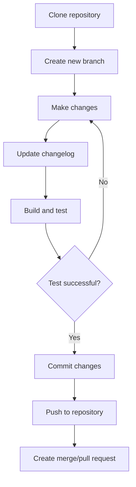

# Debian Git Integration

## Introduction

Debian Git Integration refers to the practices, tools, and workflows used to manage Debian packages and software development using the Git version control system. Git has become an essential tool in modern software development, and Debian, as one of the most established Linux distributions, has developed specific patterns and tools to leverage Git's capabilities for package maintenance and collaborative development.

In this guide, we'll explore how Git integrates with Debian's development ecosystem, enabling developers to effectively manage packages, track changes, collaborate with others, and contribute to Debian's vast software repository.

## Why Git for Debian Development?

Before diving into the specifics, let's understand why Git is particularly valuable for Debian development:

- **Distributed Version Control**: Git allows multiple developers to work on the same package simultaneously.
- **Complete History**: Every change to package code and configuration is tracked and can be referenced or reverted if needed.
- **Branching Capabilities**: Developers can work on experimental features or bug fixes in separate branches without affecting the main codebase.
- **Integration with Hosting Platforms**: Debian uses platforms like Salsa (GitLab) to host its repositories, enabling collaborative workflows.

## Setting Up Your Environment

### Prerequisites

Before working with Git in a Debian development context, you'll need:

```bash
# Install essential packages
sudo apt update
sudo apt install git git-buildpackage devscripts build-essential
```

### Configuring Git for Debian Development

```bash
# Configure your Git identity
git config --global user.name "Your Name"
git config --global user.email "your.email@example.com"

# Set up Git to handle Debian-specific files
git config --global --add debian.dmupload true
git config --global --add debian.component main
```

## Debian-specific Git Tools

Debian has developed several Git-specific tools to streamline package development:

### git-buildpackage (gbp)

`git-buildpackage` is a suite of tools that helps developers work with Debian packages in Git repositories.

```bash
# Clone a Debian package repository
gbp clone git@salsa.debian.org:debian/package-name.git
cd package-name

# Update from upstream and build the package
gbp import-orig --uscan
gbp buildpackage
```

The output of these commands will:
1. Clone the repository and set up the proper branches
2. Import the latest upstream release
3. Build the Debian package, producing `.deb` files in the parent directory

### dgit

`dgit` is another tool for working with Debian package Git repositories:

```bash
# Clone a package repository
dgit clone package-name
cd package-name

# Make changes and push them
# Edit files...
dgit push
```

Output:
```
dgit: processing source package package-name
dgit: using source format 3.0 (quilt)
dgit: building source package
dpkg-buildpackage: info: source package package-name
...
dgit: pushing to salsa.debian.org:/debian/package-name.git
Counting objects: 12, done.
...
```

## Workflow: Maintaining a Debian Package with Git

Let's walk through a complete workflow for maintaining a Debian package using Git:



### Step 1: Clone the Package Repository

```bash
gbp clone git@salsa.debian.org:debian/hello.git
cd hello
```

### Step 2: Create a New Branch for Your Changes

```bash
git checkout -b fix-documentation
```

### Step 3: Make Your Changes

Edit the files that need modification. For example, improving documentation:

```bash
vim debian/control  # Edit package description
vim debian/README.Debian  # Update Debian-specific README
```

### Step 4: Update the Changelog

```bash
dch -i "Improved package documentation"
```

This will open an editor with a new changelog entry for you to modify if needed.

### Step 5: Build and Test the Package

```bash
gbp buildpackage --git-pbuilder
```

Output:
```
gbp:info: Building with git-pbuilder
I: Building the build environment
I: pbuilder-satisfydepends-dummy: Installing dummy package...
...
dpkg-buildpackage: info: binary-only upload (no source)
```

### Step 6: Commit Your Changes

```bash
git add debian/control debian/README.Debian debian/changelog
git commit -m "Improve package documentation"
```

### Step 7: Push Your Changes and Submit for Review

```bash
git push -u origin fix-documentation
```

Then, visit the Salsa GitLab interface to create a merge request from your branch.

## Using Git for Collaborative Debian Development

When working with other Debian developers, following these practices will help ensure smooth collaboration:

### Staying Updated with Remote Changes

```bash
git fetch
git rebase origin/master
```

### Reviewing Others' Changes

```bash
# Check out a colleague's branch
git checkout origin/colleagues-branch

# Build and test their changes
gbp buildpackage
```

### Contributing to Someone Else's Package

```bash
# Fork the package on Salsa
# Then clone your fork
git clone git@salsa.debian.org:yourusername/package-name.git
cd package-name

# Add the official repository as upstream
git remote add upstream git@salsa.debian.org:debian/package-name.git

# Create a branch for your contribution
git checkout -b fix-bug-123
```

## Working with Upstream Git Repositories

Many packages in Debian are maintained in close collaboration with upstream projects. Here's how to work with upstream Git repositories:

### Importing Upstream Releases

```bash
gbp import-orig --uscan
```

This command will:
1. Look at the `debian/watch` file to find the latest upstream release
2. Download it
3. Import it into the Git repository
4. Create a tag for the new version

Output:
```
gbp:info: Using uscan to find upstream tarball
gbp:info: Found upstream version 2.12.1
gbp:info: Importing 'hello-2.12.1.tar.gz' to branch 'upstream'...
gbp:info: Successfully imported upstream version 2.12.1
```

### Cherry-picking Upstream Commits

Sometimes you might want to cherry-pick specific fixes from upstream:

```bash
# Add the upstream repository
git remote add upstream https://github.com/upstream/project.git
git fetch upstream

# Cherry-pick a specific fix
git cherry-pick abcdef123456
```

## Debian Git Repository Structure

Debian Git repositories typically follow this branch structure:

- `master`: Contains the Debian packaging and patched source
- `upstream`: Contains the unmodified upstream source
- `pristine-tar`: Contains metadata to recreate the exact original tarball
- `debian/sid`, `debian/bullseye`, etc.: Branches for specific Debian releases

You can visualize this structure with:

```bash
git log --graph --oneline --decorate --all
```

Output:
```
* abcd123 (HEAD -> master, origin/master) Update changelog for 2.12.1-1
* efgh456 Apply patches for Debian Policy compliance
* ijkl789 Import upstream version 2.12.1
...
```

## Practical Example: Contributing a Bug Fix to a Debian Package

Let's walk through a complete example of fixing a bug in the `cowsay` package:

### 1. Clone the Repository

```bash
gbp clone git@salsa.debian.org:debian/cowsay.git
cd cowsay
```

### 2. Create a Bug Fix Branch

```bash
git checkout -b fix-unicode-support
```

### 3. Identify and Fix the Issue

Let's say we discovered that cowsay doesn't handle Unicode characters properly in its output.

```bash
# Edit the perl script to improve Unicode handling
vim cowsay
```

Add proper Unicode support:

```perl
# Find the line that processes the message
# Change:
$_ = " $_ ";
# To:
use utf8;
use open qw(:std :utf8);
$_ = " $_ ";
```

### 4. Test Your Fix

```bash
# Try with Unicode characters
./cowsay "こんにちは世界"
```

Before the fix, this might have failed or shown garbled output. After the fix, you should see:

```
 ________________
< こんにちは世界 >
 ----------------
        \   ^__^
         \  (oo)\_______
            (__)\       )\/\
                ||----w |
                ||     ||
```

### 5. Update the Changelog

```bash
dch -i "Add Unicode support to cowsay script (Closes: #987654)"
```

### 6. Commit and Push

```bash
git add cowsay debian/changelog
git commit -m "Add Unicode support to cowsay script"
git push -u origin fix-unicode-support
```

### 7. Create a Merge Request

Visit Salsa and create a merge request from your `fix-unicode-support` branch to the `master` branch of the original repository.

## Advanced Git Techniques for Debian Development

### Managing Patches with `quilt` and Git

Debian uses the `quilt` patch system with Git to manage patches to upstream code:

```bash
# Create a new patch
gbp pq import
quilt new fix-memory-leak.patch
quilt edit src/main.c
# Make your changes
quilt refresh
gbp pq export
```

### Resolving Merge Conflicts

Merge conflicts often occur when working with both upstream and Debian changes:

```bash
git merge upstream/master
# If conflicts occur:
git status  # See the conflicted files
# Edit the files to resolve conflicts
git add resolved-file.c
git merge --continue
```

### Creating a Secure Package Archive for Distribution

When you need to distribute your Git-maintained package:

```bash
gbp buildpackage --git-tag
debsign ../mypackage_1.0-1_amd64.changes
dput ../mypackage_1.0-1_amd64.changes
```

## Summary

In this guide, we've explored the integration of Git with Debian development workflows. We've covered:

- Setting up Git for Debian development
- Debian-specific Git tools like `git-buildpackage` and `dgit`
- Typical workflows for package maintenance
- Collaborative development practices
- Working with upstream repositories
- Advanced techniques for managing patches and resolving conflicts

By mastering these Git integration practices, you'll be well-equipped to contribute to Debian packages or maintain your own packages within the Debian ecosystem.

## Additional Resources

- [Debian Developer's Corner](https://www.debian.org/devel/)
- [Git for Debian Packaging Guide](https://wiki.debian.org/PackagingWithGit)
- [Git-buildpackage Documentation](https://honk.sigxcpu.org/piki/projects/git-buildpackage/)
- [Debian Salsa Platform](https://salsa.debian.org/)

## Exercises

1. Clone a simple Debian package, make a minor improvement to its documentation, and build it locally.
2. Create a patch for an existing bug in a Debian package and submit it to the package maintainer.
3. Set up a local Git repository for a new package you want to contribute to Debian.
4. Practice importing a new upstream release for an existing Debian package.
5. Configure a Continuous Integration setup for automated testing of your Debian package.