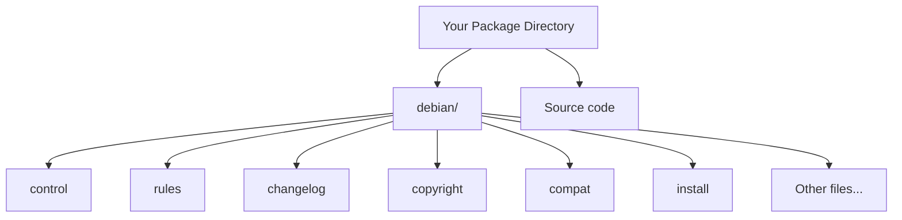

# Debian Build Tools

## Introduction

Debian build tools form the backbone of Debian's packaging system, which is one of the oldest and most robust package management systems in the Linux world. These tools allow developers to create, maintain, and distribute software in the standardized `.deb` package format used by Debian and its derivatives like Ubuntu, Linux Mint, and many others.

In this guide, we'll explore the essential Debian build tools that help transform source code into installable Debian packages. Whether you're a beginner looking to package your application or simply want to understand how Debian packages work, this guide will provide you with a solid foundation.

## Understanding Debian Packages

Before diving into the build tools, let's understand what a Debian package is.

A Debian package (`.deb` file) is an archive that contains:

- The software application (binary files, libraries, data files)
- Metadata about the package (dependencies, version, description)
- Scripts for installation and removal
- Configuration files

The Debian packaging system ensures that software installs correctly, integrates with the system, and can be cleanly removed when no longer needed.

## Essential Debian Build Tools

### 1. dpkg - The Foundation

`dpkg` is the base package management tool in Debian. While users often interact with higher-level tools like `apt`, `dpkg` is the underlying tool that handles the actual installation and manipulation of `.deb` packages.

```bash
# Install a package using dpkg
sudo dpkg -i package.deb

# List installed packages
dpkg -l

# Show information about a package
dpkg -s package-name
```

**Output example:**
```
Package: firefox
Status: install ok installed
Priority: optional
Section: web
Installed-Size: 165084
Maintainer: Ubuntu Mozilla Team <ubuntu-mozillateam@lists.ubuntu.com>
Architecture: amd64
Version: 108.0+build2-0ubuntu0.22.04.1
Depends: [... dependencies list ...]
Description: Safe and easy web browser from Mozilla
```

### 2. dpkg-deb - Package Building

`dpkg-deb` is used to build, analyze, and manipulate Debian packages.

```bash
# Build a Debian package
dpkg-deb --build package_directory

# Extract the contents of a package
dpkg-deb -x package.deb extraction_directory

# Extract control information
dpkg-deb -e package.deb extraction_directory/DEBIAN
```

### 3. debhelper - Simplifying Package Creation

`debhelper` is a collection of scripts that automate common tasks in the package building process. It significantly reduces the amount of code needed in the packaging scripts.

To use debhelper, you need to install it:

```bash
sudo apt install debhelper
```

The debhelper suite includes commands like:

- `dh_make` - Creates a template for a new package
- `dh_install` - Installs files into package build directories
- `dh_auto_configure`, `dh_auto_build`, `dh_auto_test`, `dh_auto_install` - Automatically handle common build system operations

### 4. dh_make - Template Generator

`dh_make` generates the necessary directory structure and files for building a Debian package.

```bash
# Basic usage
cd your-source-code-directory
dh_make -s -p project_name_version
```

This creates a `debian/` directory with template files:

- `control` - Package metadata
- `changelog` - Version history
- `rules` - Build instructions
- `copyright` - License information
- And several other files and scripts

### 5. pbuilder - Clean Build Environment

`pbuilder` creates a clean, isolated build environment to ensure that your package builds correctly and all dependencies are properly declared.

```bash
# Install pbuilder
sudo apt install pbuilder

# Create a base environment
sudo pbuilder create

# Build a package in the clean environment
sudo pbuilder build your-package.dsc
```

## Building Your First Debian Package

Let's walk through the process of creating a simple Debian package for a "Hello World" application:

### Step 1: Create the Application

First, let's create a simple C program:

```bash
mkdir -p hello-debian/src
cd hello-debian/src
```

Create a file `hello.c`:

```c
#include <stdio.h>

int main() {
    printf("Hello from Debian packaging!
");
    return 0;
}
```

Create a basic Makefile:

```makefile
CC=gcc
CFLAGS=-Wall

hello: hello.c
	$(CC) $(CFLAGS) -o hello hello.c

install:
	mkdir -p $(DESTDIR)/usr/bin
	install -m 755 hello $(DESTDIR)/usr/bin

clean:
	rm -f hello
```

### Step 2: Prepare the Package Structure

```bash
cd ..  # Go back to the hello-debian directory
tar -czf hello-debian_1.0.orig.tar.gz src/
cd src
dh_make -s -p hello-debian_1.0 --createorig
```

Choose "s" (single binary) when prompted.

### Step 3: Edit the Control File

Edit `debian/control`:

```
Source: hello-debian
Section: utils
Priority: optional
Maintainer: Your Name <your.email@example.com>
Build-Depends: debhelper-compat (= 13)
Standards-Version: 4.5.1
Homepage: https://your-website.com

Package: hello-debian
Architecture: any
Depends: ${shlibs:Depends}, ${misc:Depends}
Description: Simple hello world Debian package example
 This package provides a simple demonstration
 of Debian packaging with a basic C hello world program.
```

### Step 4: Edit the Rules File

The `debian/rules` file is already prepared by dh_make. For simple packages, the default is usually sufficient:

```makefile
#!/usr/bin/make -f
# See debhelper(7) (uncomment to enable)
# output every command that modifies files on the build system.
#export DH_VERBOSE = 1

%:
	dh $@
```

### Step 5: Build the Package

Now build the package:

```bash
dpkg-buildpackage -us -uc
```

This creates the `.deb` file in the parent directory.

### Step 6: Install and Test

```bash
cd ..
sudo dpkg -i hello-debian_1.0-1_amd64.deb
hello-debian
```

**Output:**
```
Hello from Debian packaging!
```

## Debian Package Structure

Let's examine the structure of a Debian package source directory:



Each file in the `debian/` directory serves a specific purpose:

- `control`: Package metadata and dependencies
- `rules`: Build instructions (a Makefile)
- `changelog`: Version history and changes
- `copyright`: License and copyright information
- `compat`: debhelper compatibility level
- `install`: Lists files to be installed

## Advanced Debian Packaging Concepts

### 1. Package Relationships

Debian packages can specify various relationships in the control file:

- `Depends`: Packages required for operation
- `Recommends`: Packages that are strongly recommended
- `Suggests`: Packages that might be useful
- `Conflicts`: Packages that cannot be installed simultaneously
- `Provides`: Virtual packages this package provides
- `Replaces`: Packages this package replaces

Example in the control file:

```
Depends: libc6 (>= 2.14), python3 (>= 3.9)
Recommends: some-useful-package
Suggests: optional-enhancement
Conflicts: old-incompatible-package
```

### 2. Configuration Files

Debian packages can declare configuration files that should be handled specially during upgrades:

```bash
echo "/etc/myapp/config.ini" > debian/conffiles
```

### 3. Maintainer Scripts

Debian packages can include scripts that run at different points:

- `preinst`: Before package installation
- `postinst`: After package installation
- `prerm`: Before package removal
- `postrm`: After package removal

Example `postinst` script:

```bash
#!/bin/sh
set -e

# Configuration after installation
if [ "$1" = "configure" ]; then
    # Create necessary directories
    mkdir -p /var/lib/myapp

    # Set permissions
    chown www-data:www-data /var/lib/myapp
    
    # Restart a service if it's running
    if systemctl is-active --quiet apache2; then
        systemctl restart apache2
    fi
fi

#DEBHELPER#
exit 0
```

The `#DEBHELPER#` line is a special token that gets replaced with automatically generated code by debhelper.

### 4. Multi-Binary Packages

Sometimes, a single source package needs to create multiple binary packages. This is configured in the control file by declaring additional `Package:` sections.

Example:

```
Source: myapp
Section: utils
[...]

Package: myapp
Architecture: any
[...]
Description: Main application package
 This package contains the main application.

Package: myapp-common
Architecture: all
Depends: ${misc:Depends}
Description: Common files for myapp
 This package contains architecture-independent files.

Package: myapp-dev
Architecture: any
Depends: myapp (= ${binary:Version}), ${misc:Depends}
Description: Development files for myapp
 This package contains headers and libraries for development.
```

## Common Debian Packaging Tools

### 1. lintian - Package Checker

`lintian` checks Debian packages for common issues and policy violations:

```bash
lintian mypackage.deb
```

Example output:
```
E: mypackage: changelog-file-missing-in-native-package
W: mypackage: maintainer-script-ignores-errors postinst
I: mypackage: package-contains-empty-directory usr/share/doc/
```

### 2. debsign - Sign Packages

For official distribution, packages should be cryptographically signed:

```bash
debsign -k YOUR_KEY_ID package_version_source.changes
```

### 3. dupload or dput - Upload Packages

To upload packages to repositories:

```bash
# Using dput
dput repository-name package_version_source.changes

# Using dupload
dupload --to repository-name package_version_source.changes
```

## Best Practices for Debian Packaging

1. **Follow the Debian Policy**: The [Debian Policy Manual](https://www.debian.org/doc/debian-policy/) provides guidelines for creating packages.

2. **Use the Latest debhelper**: Always use the latest debhelper compatibility level for new packages.

3. **Minimize Dependencies**: Only declare dependencies that are actually required.

4. **Test in Clean Environments**: Use tools like pbuilder or sbuild to test builds in clean environments.

5. **Document Changes**: Keep the changelog updated with detailed information about changes.

6. **Handle Configuration Files Properly**: Use conffiles or ucf for configuration files.

7. **Write Good Descriptions**: Package descriptions should be clear and informative.

## Summary

Debian build tools provide a comprehensive system for creating, maintaining, and distributing software packages. While there's a learning curve, mastering these tools gives you the ability to properly package software for Debian-based systems, which represent a large portion of the Linux ecosystem.

The key components we covered are:

- Basic package tools: dpkg, dpkg-deb
- Helper tools: debhelper, dh_make
- Clean build environments: pbuilder
- Quality assurance: lintian
- Advanced topics: dependencies, maintainer scripts, multi-binary packages

By following the Debian packaging standards, you contribute to a consistent and reliable software ecosystem that benefits users with clean installations, upgrades, and removals.

## Additional Resources

For further learning, consider exploring:

- The Debian New Maintainers' Guide
- The Debian Policy Manual
- The Debian Developer's Reference
- The `man` pages for each tool mentioned

## Exercises

1. Create a simple "Hello World" package following the guide above.
2. Modify your package to include a configuration file in `/etc/`.
3. Create a package with pre and post-installation scripts.
4. Build a multi-binary package from a single source.
5. Use lintian to check your package and fix any issues it reports.