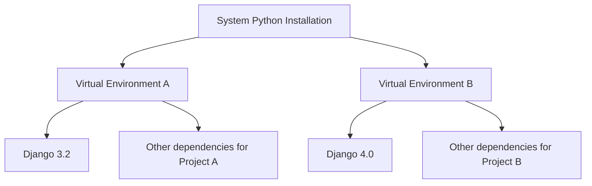

# Debian Virtual Environments

## Introduction

Virtual environments are isolated spaces where you can install packages and dependencies for a specific project without affecting your system-wide Python installation. This isolation helps prevent conflicts between package versions across different projects and maintains a clean, organized development workflow.

In this guide, we'll explore how to set up and use virtual environments on Debian-based systems, understand their benefits, and learn best practices to enhance your development experience.

## Why Use Virtual Environments?

Imagine you're working on two different Python projects:
- Project A requires Django 3.2
- Project B needs Django 4.0

Without virtual environments, you could only have one version of Django installed on your system, creating conflicts between your projects. Virtual environments solve this problem by creating isolated spaces where each project can have its own dependencies.



## Setting Up Virtual Environments on Debian

Debian provides several tools for creating and managing virtual environments. We'll cover the two most common approaches: `venv` (built into Python 3) and `virtualenv`.

### Prerequisites

First, ensure you have Python installed on your Debian system:

```bash
python3 --version
```

If Python is not installed, you can install it with:

```bash
sudo apt update
sudo apt install python3 python3-pip
```

### Method 1: Using `venv` (Python 3.3+)

The `venv` module is included in the Python standard library since Python 3.3, making it the simplest option for most users.

1. Install the venv package:

```bash
sudo apt install python3-venv
```

2. Create a new virtual environment:

```bash
python3 -m venv my_project_env
```

3. Activate the virtual environment:

```bash
source my_project_env/bin/activate
```

Once activated, your terminal prompt will change to indicate the active environment:

```
(my_project_env) user@debian:~$
```

4. To deactivate the virtual environment when you're done:

```bash
deactivate
```

### Method 2: Using `virtualenv`

`virtualenv` is a more feature-rich alternative that works with both Python 2 and 3.

1. Install virtualenv:

```bash
sudo apt install python3-virtualenv
# or
pip3 install virtualenv
```

2. Create a new virtual environment:

```bash
virtualenv my_project_env
```

You can specify a Python version with:

```bash
virtualenv -p python3.9 my_project_env
```

3. Activate and deactivate the environment using the same commands as with `venv`.

## Managing Packages in Virtual Environments

Once your virtual environment is activated, you can install packages using pip without affecting your system Python installation.

### Installing Packages

```bash
pip install django==4.0
```

### Listing Installed Packages

```bash
pip list
```

Example output:
```
Package    Version
---------- -------
asgiref    3.5.0
Django     4.0.0
pip        22.0.4
setuptools 60.5.0
sqlparse   0.4.2
wheel      0.37.1
```

### Creating Requirements Files

To share your project's dependencies, create a requirements.txt file:

```bash
pip freeze > requirements.txt
```

### Installing from Requirements Files

When setting up your project on another machine or environment:

```bash
pip install -r requirements.txt
```

## Practical Examples

Let's walk through some real-world scenarios where virtual environments prove valuable.

### Example 1: Managing Multiple Django Projects

Suppose you're maintaining an older project while developing a new one:

```bash
# Create environment for legacy project
python3 -m venv legacy_project
source legacy_project/bin/activate
pip install django==2.2.28
# Work on your project...
deactivate

# Create environment for new project
python3 -m venv new_project
source new_project/bin/activate
pip install django==4.0.4
# Work on your project...
deactivate
```

### Example 2: Testing a Package Without Installing It System-wide

```bash
# Create a test environment
python3 -m venv test_env
source test_env/bin/activate
pip install experimental-package
# Test the package...
deactivate
```

### Example 3: Creating a Development Environment for a Debian Package

If you're developing a Python application that will be packaged for Debian:

```bash
# Create development environment
python3 -m venv dev_env
source dev_env/bin/activate

# Install development dependencies
pip install pytest black mypy

# Install your project in development mode
pip install -e .

# Run tests
pytest

# When done
deactivate
```

## Advanced Usage

### Using `virtualenvwrapper`

`virtualenvwrapper` provides additional commands to manage your virtual environments more efficiently.

1. Install virtualenvwrapper:

```bash
pip install virtualenvwrapper
```

2. Add these lines to your shell startup file (~/.bashrc or ~/.zshrc):

```bash
export WORKON_HOME=$HOME/.virtualenvs
export VIRTUALENVWRAPPER_PYTHON=/usr/bin/python3
source /usr/local/bin/virtualenvwrapper.sh
```

3. Reload your shell configuration:

```bash
source ~/.bashrc
```

4. Create and manage environments with these simplified commands:

```bash
# Create a new environment
mkvirtualenv my_project

# List environments
lsvirtualenv

# Switch to an environment
workon my_project

# Exit the current environment
deactivate

# Delete an environment
rmvirtualenv my_project
```

### Using `python-poetry` for Modern Dependency Management

Poetry offers a modern approach to Python dependency management.

1. Install Poetry:

```bash
curl -sSL https://install.python-poetry.org | python3 -
```

2. Create a new project:

```bash
poetry new my_project
cd my_project
```

3. Add dependencies:

```bash
poetry add django
poetry add pytest --dev
```

4. Activate the environment:

```bash
poetry shell
```

## Best Practices for Debian Virtual Environments

1. **Name environments meaningfully**: Use project names or clear descriptors.
   
2. **Store virtual environments outside project directories**: This prevents accidental inclusion in version control.
   
3. **Use a .gitignore file**: Add your virtual environment directory to prevent it from being committed.
   
4. **Document dependencies**: Always maintain an updated requirements.txt or pyproject.toml file.
   
5. **Periodically update packages**: Run `pip list --outdated` to identify packages needing updates.
   
6. **Clean up unused environments**: Remove environments for completed or abandoned projects.

## Troubleshooting Common Issues

### Issue: "Command 'python' not found"

Solution: Use python3 explicitly or create a symlink:

```bash
sudo update-alternatives --install /usr/bin/python python /usr/bin/python3 1
```

### Issue: "No module named venv"

Solution: Install the venv package:

```bash
sudo apt install python3-venv
```

### Issue: Permission errors when installing packages

Solution: Never use sudo with pip inside a virtual environment. If you encounter permission issues, check that your virtual environment is activated.

## Summary

Virtual environments are essential tools for Python development on Debian systems. They provide isolated environments for your projects, helping you:

- Avoid dependency conflicts between projects
- Test different package versions without affecting your system
- Create reproducible environments for collaboration
- Keep your system Python clean and stable

By following the practices outlined in this guide, you'll be able to manage virtual environments effectively and improve your development workflow on Debian.

## Additional Resources

- [Python Virtual Environments Official Documentation](https://docs.python.org/3/library/venv.html)
- [Virtualenv Documentation](https://virtualenv.pypa.io/en/latest/)
- [Poetry Documentation](https://python-poetry.org/docs/)
- [Debian Python Packaging Guide](https://www.debian.org/doc/packaging-manuals/python-policy/)

## Exercises

1. Create two different virtual environments, one using Python 3.8 and another using Python 3.10 (if available on your system).

2. Set up a virtual environment for a simple Flask application, install Flask and required dependencies, and create a minimal web application.

3. Create a requirements.txt file for an existing project and then create a new virtual environment and install all dependencies from the file.

4. Try using `virtualenvwrapper` to manage multiple environments and practice switching between them.

5. Create a project using Poetry, add some dependencies, and explore how Poetry manages the virtual environment compared to traditional methods.