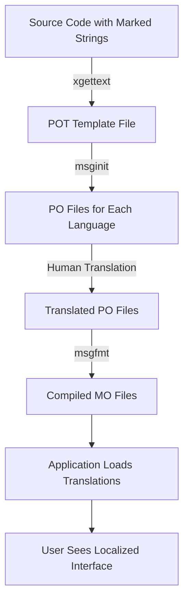

# Debian Language Support

## Introduction

Language support in Debian is a crucial aspect of software development that enables applications to reach users worldwide. Debian, a popular Linux distribution, provides robust tools and frameworks for internationalization (i18n) and localization (l10n) of software. This guide will walk you through understanding, configuring, and implementing language support in Debian for your software projects.

## Understanding Internationalization and Localization

Before diving into the technical details, let's clarify two key concepts:

- **Internationalization (i18n)**: The process of designing software so it can potentially be adapted to various languages and regions without engineering changes.
- **Localization (l10n)**: The process of adapting internationalized software for a specific region or language by translating text and adapting locale-specific components.

## Setting Up Debian Language Environment

### Checking Current Language Settings

To check your current language settings in Debian, you can use the following command:

```bash
locale
```

This will output something like:

```
LANG=en_US.UTF-8
LANGUAGE=en_US:en
LC_CTYPE="en_US.UTF-8"
LC_NUMERIC="en_US.UTF-8"
LC_TIME="en_US.UTF-8"
LC_COLLATE="en_US.UTF-8"
LC_MONETARY="en_US.UTF-8"
LC_MESSAGES="en_US.UTF-8"
LC_PAPER="en_US.UTF-8"
LC_NAME="en_US.UTF-8"
LC_ADDRESS="en_US.UTF-8"
LC_TELEPHONE="en_US.UTF-8"
LC_MEASUREMENT="en_US.UTF-8"
LC_IDENTIFICATION="en_US.UTF-8"
LC_ALL=
```

### Installing Additional Language Support

To install support for additional languages, use the `apt` package manager:

```bash
sudo apt update
sudo apt install locales
```

Next, generate the locales you need:

```bash
sudo dpkg-reconfigure locales
```

This will open a dialog where you can select which locales to generate. For example, to add Spanish support, select `es_ES.UTF-8`.

### Setting the System Language

To change the system language temporarily for the current session:

```bash
export LANG=es_ES.UTF-8
```

To make the change permanent, edit the `/etc/default/locale` file:

```bash
sudo nano /etc/default/locale
```

And set the desired language:

```
LANG=es_ES.UTF-8
```

## Tools for Translation and Localization in Debian

Debian provides several tools to help with translation and localization of software:

### 1. GNU gettext

The `gettext` package is the standard for internationalization in many open-source projects:

```bash
sudo apt install gettext
```

Basic workflow with gettext:

1. Mark strings for translation in your code using `gettext()` or `_()`:

```c
#include <libintl.h>
#include <locale.h>
#define _(string) gettext(string)

int main() {
    setlocale(LC_ALL, "");
    bindtextdomain("myapp", "/usr/share/locale");
    textdomain("myapp");
    
    printf(_("Hello, world!
"));
    return 0;
}
```

2. Extract translatable strings into a POT (Portable Object Template) file:

```bash
xgettext -k_ -o myapp.pot myapp.c
```

3. Create a PO (Portable Object) file for each language:

```bash
msginit -l es -o es.po -i myapp.pot
```

4. Translate the strings in the PO file:

```
msgid "Hello, world!"
msgstr "¡Hola, mundo!"
```

5. Compile the PO file to an MO (Machine Object) file:

```bash
msgfmt -o myapp.mo es.po
```

6. Install the MO file to the appropriate location:

```bash
sudo install -D myapp.mo /usr/share/locale/es/LC_MESSAGES/myapp.mo
```

### 2. Poedit

Poedit is a GUI tool for translating PO files:

```bash
sudo apt install poedit
```

### 3. intltool

For GNOME and GTK+ applications:

```bash
sudo apt install intltool
```

## Language Support in Python Development

Python has excellent internationalization support through the `gettext` module:

```python
import gettext
import locale

# Set up localization
locale.setlocale(locale.LC_ALL, '')  # Use the system's default locale
gettext.bindtextdomain('myapp', '/usr/share/locale')
gettext.textdomain('myapp')
_ = gettext.gettext

# Use translation
print(_("Hello, world!"))
```

## Language Support in Web Applications

For web applications, you might want to use specific frameworks:

### Django Internationalization

```bash
sudo apt install python3-django
```

Example of Django translation:

```python
from django.utils.translation import gettext as _

def my_view(request):
    output = _("Welcome to my site.")
    return HttpResponse(output)
```

In templates:

```html

<h1></h1>
```

## Testing Localization

To test your application with different locales:

```bash
LANG=es_ES.UTF-8 ./myapp
```

Or for web applications, set the browser language preference.

## Real-world Example: Creating a Multi-language Command-line Tool

Let's create a simple "hello world" program with support for multiple languages:

1. Create project structure:

```bash
mkdir -p hello-world/po
cd hello-world
```

2. Create the main script `hello.py`:

```python
#!/usr/bin/env python3
import gettext
import locale
import os

# Set up localization
locale.setlocale(locale.LC_ALL, '')
localedir = os.path.join(os.path.abspath(os.path.dirname(__file__)), 'locale')
gettext.bindtextdomain('hello', localedir)
gettext.textdomain('hello')
_ = gettext.gettext

def main():
    name = input(_("Please enter your name: "))
    print(_("Hello, {}!").format(name))
    print(_("Welcome to the world of Debian internationalization."))

if __name__ == "__main__":
    main()
```

3. Create the POT file:

```bash
mkdir -p locale/es/LC_MESSAGES
xgettext -L Python -o po/hello.pot hello.py
```

4. Create a Spanish translation:

```bash
msginit -l es -o po/es.po -i po/hello.pot
```

5. Edit `po/es.po` to include translations:

```
msgid "Please enter your name: "
msgstr "Por favor, introduzca su nombre: "

msgid "Hello, {}!"
msgstr "¡Hola, {}!"

msgid "Welcome to the world of Debian internationalization."
msgstr "Bienvenido al mundo de la internacionalización de Debian."
```

6. Compile the translation:

```bash
msgfmt -o locale/es/LC_MESSAGES/hello.mo po/es.po
```

7. Test the application:

```bash
# In English
./hello.py

# In Spanish
LANG=es_ES.UTF-8 ./hello.py
```

Output in English:
```
Please enter your name: John
Hello, John!
Welcome to the world of Debian internationalization.
```

Output in Spanish:
```
Por favor, introduzca su nombre: Juan
¡Hola, Juan!
Bienvenido al mundo de la internacionalización de Debian.
```

## Internationalization Workflow

The following diagram illustrates the typical internationalization workflow:



## Common Challenges and Solutions

### Challenge 1: Character Encoding Issues

Solutions:
- Always use UTF-8 encoding
- Ensure locale is correctly set
- Check terminal or editor encoding settings

### Challenge 2: Right-to-Left (RTL) Languages

Solutions:
- Use supporting libraries (like GNU FriBidi)
- Test with RTL locales

```bash
sudo apt install libfribidi-dev
```

### Challenge 3: Plural Forms

Different languages have different plural rules. Use `ngettext`:

```python
from gettext import ngettext

def display_results(count):
    message = ngettext(
        "Found %d result",
        "Found %d results",
        count
    ) % count
    print(message)
```

## Debian-specific Localization Resources

Debian provides resources to help with localization:

- The Debian Internationalization team: https://www.debian.org/intl/
- Debian Translator's Guide: https://www.debian.org/doc/manuals/developers-reference/l10n.html
- The `debian-i18n` mailing list

## Summary

Language support in Debian is a powerful feature that allows your software to reach users worldwide. By following proper internationalization practices and using the tools provided by Debian, you can create applications that speak the user's language, respect cultural differences, and provide a better user experience.

Key points to remember:
- Separate code from translatable strings
- Use standard tools like `gettext`
- Test with multiple locales
- Consider cultural differences beyond just language
- Make internationalization part of your development workflow from the beginning

## Additional Resources and Exercises

### Additional Resources

- GNU gettext manual: https://www.gnu.org/software/gettext/manual/gettext.html
- Debian i18n/l10n documentation: https://www.debian.org/doc/manuals/intro-i18n/
- The Python `gettext` module documentation: https://docs.python.org/3/library/gettext.html

### Exercises

1. Create a simple application with support for at least three languages.
2. Modify an existing open-source application to support a new language.
3. Create a translation memory for your project to speed up future translations.
4. Implement a language selection feature in a web application.
5. Add support for date formatting according to different locale conventions.