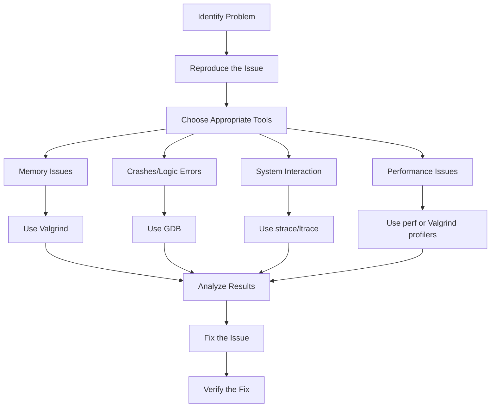

# Debian Debugging Tools

## Introduction

Debugging is an essential skill for any software developer. When developing software on Debian systems, you have access to a powerful suite of debugging tools that can help identify and fix issues in your code. This guide introduces the most important debugging tools available in Debian, explains how they work, and demonstrates their practical applications with examples.

Whether you're tracking down memory leaks, investigating unexpected behavior, or optimizing performance, understanding these tools will significantly improve your development workflow and help you create more reliable software.

## Essential Debugging Tools in Debian

Debian provides several powerful debugging tools that serve different purposes. Let's explore the most important ones:

### 1. GDB (GNU Debugger)

GDB is the standard debugger for the GNU software system and is one of the most powerful debugging tools available on Debian.

#### Installation

```bash
sudo apt install gdb
```

#### Basic Usage

GDB allows you to:
- Set breakpoints in your code
- Step through program execution line by line
- Examine variable values during execution
- View the call stack
- Modify variables during runtime

#### Example: Debugging a Simple C Program

Let's debug a simple program with a segmentation fault:

```c
// buggy.c
#include <stdio.h>

void process_data(int* data) {
    // Bug: dereferencing null pointer
    printf("Data value: %d
", *data);
}

int main() {
    int* ptr = NULL;
    process_data(ptr);
    return 0;
}
```

Compile with debugging symbols:

```bash
gcc -g -o buggy buggy.c
```

Debug with GDB:

```bash
gdb ./buggy
```

GDB session:

```
(gdb) run
Starting program: /home/user/buggy

Program received signal SIGSEGV, Segmentation fault.
0x0000555555555149 in process_data (data=0x0) at buggy.c:5
5       printf("Data value: %d
", *data);
(gdb) backtrace
#0  0x0000555555555149 in process_data (data=0x0) at buggy.c:5
#1  0x0000555555555165 in main () at buggy.c:10
(gdb) print data
$1 = (int *) 0x0
```

Here, GDB shows us exactly where the program crashed (line 5 of buggy.c), what caused it (trying to dereference a NULL pointer), and the call stack that led to the error.

### 2. Valgrind

Valgrind is a powerful tool for memory debugging, memory leak detection, and profiling.

#### Installation

```bash
sudo apt install valgrind
```

#### Basic Usage

Valgrind consists of multiple tools:
- **Memcheck**: Detects memory management problems
- **Cachegrind**: Profiles CPU cache usage
- **Callgrind**: Profiles function calls
- **Helgrind**: Detects thread synchronization issues
- **Massif**: Analyzes heap memory usage

#### Example: Detecting Memory Leaks

Let's check a program with a memory leak:

```c
// leaky.c
#include <stdlib.h>

int main() {
    int* numbers = malloc(10 * sizeof(int));
    // Fill array with values
    for (int i = 0; i < 10; i++) {
        numbers[i] = i;
    }
    
    // Bug: forgot to free the allocated memory
    // free(numbers);
    
    return 0;
}
```

Compile and run with Valgrind:

```bash
gcc -g -o leaky leaky.c
valgrind --leak-check=full ./leaky
```

Output:

```
==12345== Memcheck, a memory error detector
==12345== Copyright (C) 2002-2017, and GNU GPL'd, by Julian Seward et al.
==12345== Using Valgrind-3.16.1 and LibVEX; rerun with -h for copyright info
==12345== Command: ./leaky
==12345== 
==12345== 
==12345== HEAP SUMMARY:
==12345==     in use at exit: 40 bytes in 1 blocks
==12345==   total heap usage: 1 allocs, 0 frees, 40 bytes allocated
==12345== 
==12345== 40 bytes in 1 blocks are definitely lost in loss record 1 of 1
==12345==    at 0x483B7F3: malloc (in /usr/lib/x86_64-linux-gnu/valgrind/vgpreload_memcheck-amd64-linux.so)
==12345==    by 0x10915A: main (leaky.c:4)
==12345== 
==12345== LEAK SUMMARY:
==12345==    definitely lost: 40 bytes in 1 blocks
==12345==    indirectly lost: 0 bytes in 0 blocks
==12345==      possibly lost: 0 bytes in 0 blocks
==12345==    still reachable: 0 bytes in 0 blocks
==12345==         suppressed: 0 bytes in 0 blocks
==12345== 
==12345== For lists of detected and suppressed errors, rerun with: -s
==12345== ERROR SUMMARY: 1 errors from 1 contexts (suppressed: 0 from 0)
```

Valgrind identified that we allocated 40 bytes (10 integers) but never freed them, and it even shows exactly where the allocation happened (leaky.c, line 4).

### 3. strace

strace traces system calls and signals, making it useful for understanding how a program interacts with the operating system.

#### Installation

```bash
sudo apt install strace
```

#### Basic Usage

strace shows all system calls made by a program, including:
- File operations
- Network operations
- Process management
- Memory management

#### Example: Tracing System Calls

Let's trace a simple program that opens a file:

```c
// file_reader.c
#include <stdio.h>

int main() {
    FILE* file = fopen("example.txt", "r");
    if (file == NULL) {
        perror("Error opening file");
        return 1;
    }
    
    char buffer[100];
    fgets(buffer, sizeof(buffer), file);
    printf("Read: %s", buffer);
    
    fclose(file);
    return 0;
}
```

Run with strace:

```bash
gcc -o file_reader file_reader.c
touch example.txt
echo "Hello, Debian!" > example.txt
strace ./file_reader
```

Partial output:

```
execve("./file_reader", ["./file_reader"], 0x7ffc55ccb4d0 /* 66 vars */) = 0
brk(NULL)                               = 0x559eba910000
access("/etc/ld.so.preload", R_OK)      = -1 ENOENT (No such file or directory)
openat(AT_FDCWD, "/etc/ld.so.cache", O_RDONLY|O_CLOEXEC) = 3
...
openat(AT_FDCWD, "example.txt", O_RDONLY) = 3
fstat(3, {st_mode=S_IFREG|0644, st_size=14, ...}) = 0
read(3, "Hello, Debian!
", 100)        = 14
fstat(1, {st_mode=S_IFCHR|0620, st_rdev=makedev(136, 0), ...}) = 0
write(1, "Read: Hello, Debian!
", 21)   = 21
close(3)                                = 0
exit_group(0)                           = ?
+++ exited with 0 +++
```

This output shows all system calls, including opening the file (`openat`), reading from it (`read`), writing to stdout (`write`), and closing the file (`close`).

### 4. ltrace

ltrace traces library calls, which helps analyze how a program uses external libraries.

#### Installation

```bash
sudo apt install ltrace
```

#### Basic Usage

ltrace shows all library function calls, including:
- Standard library calls (libc)
- Dynamic library calls
- Function parameters and return values

#### Example: Tracing Library Calls

Using the same file_reader.c program:

```bash
ltrace ./file_reader
```

Output:

```
fopen("example.txt", "r")                         = 0x55a46be89260
fgets(0x7ffeea4ff180, 100, 0x55a46be89260)        = 0x7ffeea4ff180
printf("Read: %s", "Hello, Debian!
")            = 21
fclose(0x55a46be89260)                            = 0
+++ exited (status 0) +++
```

This output clearly shows the library calls being made, including the parameters passed to each function and their return values.

### 5. Debian Source Packages and Debug Symbols

For effective debugging of system libraries, you'll need debug symbols for installed packages.

#### Installing Debug Symbols

Debian provides debug symbols in separate packages. First, configure the debug repositories:

```bash
echo "deb http://deb.debian.org/debian-debug/ $(lsb_release -cs)-debug main" | sudo tee /etc/apt/sources.list.d/debug.list
sudo apt update
```

Install debug symbols for a specific package:

```bash
sudo apt install libc6-dbg
```

Or use the `apt-get source` command to get the source code of a package:

```bash
apt-get source nginx
```

## Debugging Workflow

Now let's put everything together into a practical debugging workflow:



### Practical Example: Debugging a Real Application

Let's debug a more complex program that manages a list of tasks:

```c
// task_manager.c
#include <stdio.h>
#include <stdlib.h>
#include <string.h>

typedef struct {
    int id;
    char* description;
} Task;

Task* tasks = NULL;
int task_count = 0;

void add_task(int id, const char* description) {
    tasks = realloc(tasks, (task_count + 1) * sizeof(Task));
    tasks[task_count].id = id;
    
    // Bug: not allocating memory for description
    tasks[task_count].description = (char*)description;
    
    task_count++;
    printf("Added task %d: %s
", id, description);
}

void print_tasks() {
    printf("Task List:
");
    for (int i = 0; i < task_count; i++) {
        printf("  %d: %s
", tasks[i].id, tasks[i].description);
    }
}

void free_tasks() {
    // Bug: not freeing the description strings
    free(tasks);
    tasks = NULL;
    task_count = 0;
}

int main() {
    add_task(1, "Complete debugging tutorial");
    add_task(2, "Practice using GDB");
    
    // Local variable will be invalid after function returns
    char local_desc[100] = "Learn Valgrind";
    add_task(3, local_desc);
    
    print_tasks();
    
    // Modify local variable after it's referenced in task
    strcpy(local_desc, "Modified description");
    
    print_tasks();  // Will show the modified description for task 3
    
    free_tasks();
    return 0;
}
```

This program has multiple issues:
1. It stores a pointer to a string without copying the data
2. It doesn't free individual task descriptions
3. It uses a local variable that goes out of scope

Let's debug these issues step by step:

#### 1. Compile with debugging symbols

```bash
gcc -g -o task_manager task_manager.c
```

#### 2. Run with Valgrind to check for memory issues

```bash
valgrind --leak-check=full ./task_manager
```

Valgrind will report memory leaks because we're not freeing each task's description.

#### 3. Use GDB to investigate the issue with the local variable

```bash
gdb ./task_manager
```

GDB commands:
```
(gdb) break main
(gdb) run
(gdb) next
... (continue stepping through the program)
(gdb) print tasks[2].description
(gdb) continue
... (after modification)
(gdb) print tasks[2].description
```

#### 4. Fix the issues:

```c
// Fixed version
void add_task(int id, const char* description) {
    tasks = realloc(tasks, (task_count + 1) * sizeof(Task));
    tasks[task_count].id = id;
    
    // Fix: Allocate memory and copy the description
    tasks[task_count].description = strdup(description);
    
    task_count++;
    printf("Added task %d: %s
", id, description);
}

void free_tasks() {
    // Fix: Free each description string
    for (int i = 0; i < task_count; i++) {
        free(tasks[i].description);
    }
    free(tasks);
    tasks = NULL;
    task_count = 0;
}
```

## Advanced Debugging Techniques

### Core Dumps

Core dumps are files that contain a process's memory when it crashes. They're invaluable for debugging.

#### Enabling Core Dumps

```bash
ulimit -c unlimited
```

#### Analyzing Core Dumps with GDB

After a program crashes and generates a core dump:

```bash
gdb ./program core
```

### Remote Debugging

GDB supports debugging programs running on remote machines:

On the target machine:
```bash
gdbserver host:port ./program
```

On your development machine:
```bash
gdb ./program
(gdb) target remote target-machine:port
```

### Automated Testing with Sanitizers

Debian supports various sanitizers that can be activated during compilation:

```bash
# Address Sanitizer (ASan)
gcc -fsanitize=address -g -o program program.c

# Thread Sanitizer (TSan)
gcc -fsanitize=thread -g -o program program.c

# Undefined Behavior Sanitizer (UBSan)
gcc -fsanitize=undefined -g -o program program.c
```

## Summary

Debian provides a comprehensive suite of debugging tools that can help you identify and fix issues in your code. By mastering tools like GDB, Valgrind, strace, and ltrace, you'll be better equipped to develop reliable and efficient software.

Remember this debugging workflow:
1. Identify and reproduce the issue
2. Choose the appropriate tool based on the problem type
3. Analyze the results to understand the root cause
4. Fix the issue and verify the solution

Debugging is both an art and a science, and becoming proficient requires practice. Start with small examples and gradually tackle more complex debugging scenarios.

## Additional Resources

- [GNU Debugger Documentation](https://sourceware.org/gdb/documentation/)
- [Valgrind User Manual](https://valgrind.org/docs/manual/manual.html)
- [Debian Developer's Reference](https://www.debian.org/doc/manuals/developers-reference/)
- [Linux Debugging Tools](https://www.linuxjournal.com/content/debugging-tools-linux)

## Exercises

1. Create a program with a deliberate memory leak and use Valgrind to detect it.
2. Use GDB to debug a segmentation fault in a program of your choice.
3. Trace the system calls of a common Linux command (e.g., `ls` or `cat`) using strace.
4. Modify the task manager example to implement proper memory management.
5. Try using address sanitizer on a program with a buffer overflow and analyze the output.