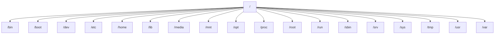

# Ubuntu Introduction

## What is Ubuntu?

Ubuntu is a free, open-source Linux distribution based on Debian. Developed by Canonical Ltd., Ubuntu is designed with ease of use and regular releases in mind, making it an excellent choice for both beginners and experienced users alike. The name "Ubuntu" comes from the Nguni Bantu term meaning "humanity to others" or "I am what I am because of who we all are," reflecting the community-oriented philosophy behind the operating system.

## Why Choose Ubuntu?

Ubuntu has gained popularity for several compelling reasons:

- **Free and Open Source**: Ubuntu is completely free to download, use, and share.
- **User-Friendly**: It offers an intuitive desktop environment that makes the transition from Windows or macOS relatively smooth.
- **Regular Updates**: Ubuntu follows a predictable release schedule, with new versions every six months and Long-Term Support (LTS) releases every two years.
- **Strong Community**: With millions of users worldwide, finding help and resources is easy.
- **Security**: Linux-based systems are generally less vulnerable to malware and viruses compared to Windows.
- **Low Resource Requirements**: Ubuntu can run efficiently on older hardware.

## Ubuntu Versions and Release Cycle

Ubuntu follows a specific naming and versioning convention:

- Each version is named with an adjective and an animal, both starting with the same letter (e.g., Jammy Jellyfish).
- Version numbers follow the year and month of release (YY.MM). For example, Ubuntu 22.04 was released in April 2022.

Ubuntu offers two types of releases:

1. **Regular Releases**: Published every six months with nine months of support.
2. **Long-Term Support (LTS) Releases**: Published every two years with five years of support (or more with paid extensions).

For beginners and production environments, LTS releases are recommended for their stability and long-term support.

## Ubuntu Variants (Flavors)

Ubuntu comes in several official variants called "flavors," each with a different desktop environment:

- **Ubuntu (default)**: Uses the GNOME desktop environment
- **Kubuntu**: Uses KDE Plasma desktop
- **Xubuntu**: Uses Xfce desktop
- **Lubuntu**: Uses LXQt desktop (lightweight for older computers)
- **Ubuntu MATE**: Uses the MATE desktop environment
- **Ubuntu Budgie**: Uses Budgie desktop
- **Ubuntu Studio**: Designed for multimedia production

The primary difference between these flavors is the desktop environment, which affects the look, feel, and resource usage.

## Installing Ubuntu

### System Requirements

For a comfortable experience with Ubuntu Desktop, your computer should have:

- 2 GHz dual-core processor or better
- 4 GB RAM (2 GB minimum)
- 25 GB of free hard drive space
- Internet access (helpful but not required)
- VGA capable of 1024×768 screen resolution

### Installation Methods

There are several ways to install Ubuntu:

1. **Dual Boot**: Install Ubuntu alongside your existing operating system
2. **Single Boot**: Replace your current operating system with Ubuntu
3. **Virtual Machine**: Run Ubuntu within your current operating system
4. **WSL (Windows Subsystem for Linux)**: Run Ubuntu on Windows without dual booting

### Basic Installation Steps

1. Download the Ubuntu ISO file from the [official website](https://ubuntu.com/download)
2. Create a bootable USB drive using tools like Rufus (Windows), Etcher (cross-platform), or Disk Utility (macOS)
3. Boot from the USB drive
4. Choose "Try Ubuntu" to test without installing or "Install Ubuntu" to proceed with installation
5. Follow the on-screen instructions for language, keyboard layout, and installation type
6. Create a user account and password
7. Wait for the installation to complete and restart your computer

## The Ubuntu Desktop Environment

After installing Ubuntu with the default GNOME desktop environment, you'll encounter:

1. **Dock**: Located on the left side (by default), containing frequently used applications
2. **Activities Overview**: Access by clicking "Activities" or pressing the Super (Windows) key
3. **Application Menu**: Accessed through the "Show Applications" button at the bottom of the dock
4. **System Tray**: In the top-right corner, showing network, sound, and power settings

## Basic Terminal Usage

While Ubuntu provides a graphical interface for most tasks, the terminal remains a powerful tool for advanced operations and troubleshooting.

### Opening the Terminal

You can open a terminal by:
- Pressing `Ctrl+Alt+T`
- Searching for "Terminal" in the Activities overview
- Right-clicking on the desktop and selecting "Open in Terminal" (depending on your configuration)

### Essential Terminal Commands

Here are some basic commands to get started:

```bash
# Display current directory
pwd

# List files and directories
ls
ls -la  # List all files (including hidden) with details

# Change directory
cd Documents
cd ..  # Go up one level
cd ~   # Go to home directory

# Create a directory
mkdir my_folder

# Create a file
touch my_file.txt

# View file contents
cat my_file.txt

# Edit a file (using nano editor)
nano my_file.txt

# Copy a file
cp my_file.txt my_file_backup.txt

# Move or rename a file
mv my_file.txt new_name.txt

# Remove a file
rm my_file.txt

# Remove a directory
rmdir my_empty_folder
rm -r my_folder  # Remove directory and all contents (use with caution!)

# View system information
uname -a

# Check disk space
df -h

# View running processes
ps aux
```

## Package Management in Ubuntu

Ubuntu uses the APT (Advanced Package Tool) system for managing software. Here's how to use it:

### Updating Package Lists

Before installing software, it's a good practice to update your package lists:

```bash
sudo apt update
```

### Installing Software

You can install packages using:

```bash
sudo apt install package_name
```

For example, to install the Firefox web browser:

```bash
sudo apt install firefox
```

### Upgrading Installed Packages

To upgrade all installed packages to their latest versions:

```bash
sudo apt upgrade
```

### Removing Software

To remove a package:

```bash
sudo apt remove package_name
```

To remove a package along with its configuration files:

```bash
sudo apt purge package_name
```

### Searching for Packages

To search for available packages:

```bash
apt search keyword
```

### GUI Package Managers

If you prefer graphical interfaces, Ubuntu offers:

- **Ubuntu Software Center**: A user-friendly application store
- **Synaptic Package Manager**: A more detailed package management tool (needs to be installed with `sudo apt install synaptic`)

## File System Structure

Ubuntu, like other Linux distributions, follows the Filesystem Hierarchy Standard (FHS). Here's a simplified overview:



Key directories include:

- **/bin**: Essential command binaries
- **/boot**: Boot loader files
- **/dev**: Device files
- **/etc**: System configuration files
- **/home**: User home directories
- **/lib**: Essential shared libraries
- **/media**: Mount points for removable media
- **/mnt**: Mount point for temporary filesystems
- **/opt**: Optional application software packages
- **/proc**: Virtual filesystem for process information
- **/root**: Home directory for the root user
- **/run**: Run-time variable data
- **/sbin**: System binaries
- **/srv**: Data for services provided by the system
- **/sys**: Virtual filesystem for system information
- **/tmp**: Temporary files
- **/usr**: User utilities and applications
- **/var**: Variable files (logs, mail, etc.)

## Customizing Ubuntu

Ubuntu allows extensive customization of the desktop environment:

### Appearance Settings

Access the appearance settings through:
1. Click on the system menu (top-right corner)
2. Select "Settings"
3. Click on "Appearance"

Here, you can change:
- Light/Dark theme
- Accent colors
- Dock behavior
- Desktop background

### Installing Themes and Icons

To install custom themes and icons:

```bash
# Install GNOME Tweaks
sudo apt install gnome-tweaks

# Install GNOME Shell extensions
sudo apt install gnome-shell-extensions

# Install a sample theme
sudo apt install arc-theme
```

After installation, open GNOME Tweaks to apply the new themes.

## Common Tasks for Beginners

### Setting Up Programming Environment

Ubuntu is excellent for programming. Here's how to set up basic development tools:

```bash
# Install build essentials (gcc, make, etc.)
sudo apt install build-essential

# Install Git
sudo apt install git

# Install Python and pip
sudo apt install python3 python3-pip

# Install Node.js and npm
sudo apt install nodejs npm

# Install Java
sudo apt install default-jdk
```

### Web Development Setup Example

Let's create a simple web development environment:

```bash
# Create a project directory
mkdir ~/my_web_project
cd ~/my_web_project

# Initialize a Git repository
git init

# Create HTML file
cat > index.html << 'EOF'
<!DOCTYPE html>
<html lang="en">
<head>
    <meta charset="UTF-8">
    <meta name="viewport" content="width=device-width, initial-scale=1.0">
    <title>My Ubuntu Web Project</title>
    <style>
        body { 
            font-family: Arial, sans-serif; 
            margin: 40px;
            line-height: 1.6;
        }
        h1 { color: #E95420; }
    </style>
</head>
<body>
    <h1>Hello from Ubuntu!</h1>
    <p>This is my first web project created on Ubuntu.</p>
    <script>
        console.log("Ubuntu is awesome for web development!");
    </script>
</body>
</html>
EOF

# Install a simple HTTP server
sudo apt install python3-http.server

# Run the server (in Python 3)
python3 -m http.server 8080
```

Now open your browser and navigate to `http://localhost:8080` to see your web page.

## Troubleshooting Common Issues

### Package Management Issues

If you encounter errors with package management:

```bash
# Fix broken packages
sudo apt --fix-broken install

# If you see "Could not get lock" errors
sudo killall apt apt-get
sudo rm /var/lib/apt/lists/lock
sudo rm /var/cache/apt/archives/lock
sudo rm /var/lib/dpkg/lock*
sudo dpkg --configure -a
sudo apt update
```

### System Updates Issues

If you have problems updating your system:

```bash
# Refresh package lists forcefully
sudo rm -rf /var/lib/apt/lists/*
sudo apt update

# Upgrade with error correction
sudo apt update && sudo apt upgrade -y
```

## Ubuntu Community and Support

One of Ubuntu's greatest strengths is its active community. Here are some resources for getting help:

- **Ask Ubuntu**: https://askubuntu.com/
- **Ubuntu Forums**: https://ubuntuforums.org/
- **Ubuntu Wiki**: https://wiki.ubuntu.com/
- **Ubuntu Documentation**: https://help.ubuntu.com/

## Summary

Ubuntu is a powerful, flexible, and user-friendly Linux distribution that's perfect for beginners looking to explore the world of open-source operating systems. With its regular release cycle, long-term support options, and strong community backing, Ubuntu provides a solid foundation for both everyday computing and advanced development work.

In this introduction, we've covered:
- What Ubuntu is and why you might choose it
- Ubuntu versions and release cycles
- Installation methods and basic requirements
- Desktop environment basics
- Essential terminal commands
- Package management with APT
- File system structure
- Customization options
- Common tasks for beginners
- Troubleshooting tips
- Community resources

## Exercises for Practice

1. Install Ubuntu in a virtual machine or as a dual-boot with your current operating system.
2. Learn to navigate the file system using terminal commands (no graphical interface).
3. Install three applications: one using the Software Center, one using APT, and one from a downloaded .deb file.
4. Customize your desktop with a new theme, background, and dock settings.
5. Create a basic backup strategy for your home directory using the `rsync` command.

## Additional Resources

For deeper learning, consider exploring:
- The Linux Command Line by William Shotts (free online book)
- Linux Journey: https://linuxjourney.com/
- Ubuntu Manuals: http://manpages.ubuntu.com/
- Canonical's Ubuntu Tutorials: https://ubuntu.com/tutorials