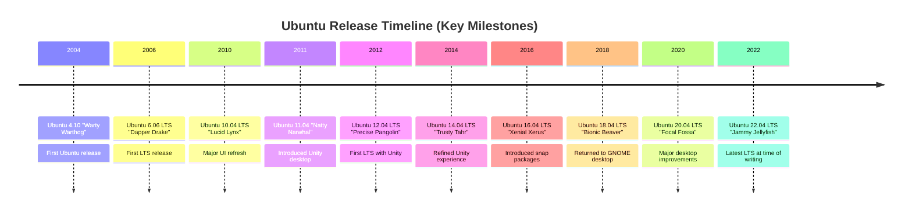

# Ubuntu History

## Introduction

Ubuntu is one of the most popular Linux distributions in the world, known for its ease of use, regular release cycle, and strong community support. Its name comes from the Nguni Bantu term "ubuntu," which roughly translates to "humanity to others" or "I am what I am because of who we all are." This name perfectly reflects the collaborative and community-oriented philosophy behind this operating system.

This guide explores the rich history of Ubuntu, from its origins to its current status in the computing world. Understanding Ubuntu's history provides valuable context for beginners looking to explore Linux and open-source software.

## The Origins of Ubuntu

### Canonical and Mark Shuttleworth

Ubuntu's story begins with Mark Shuttleworth, a South African entrepreneur who made his fortune by founding Thawte, a certificate authority company he later sold to VeriSign for $575 million in 1999. After this success, Shuttleworth became the first African in space as a space tourist in 2002.

In 2004, Shuttleworth founded Canonical Ltd., a company dedicated to the development and support of free software projects. Canonical's flagship project would become Ubuntu Linux.

### The Debian Connection

Ubuntu is based on Debian, one of the oldest and most respected Linux distributions. Debian is known for its stability and commitment to free software principles, but it had a reputation for slow release cycles and not being particularly user-friendly for beginners.

Shuttleworth saw an opportunity to create a more user-friendly and regularly updated Linux distribution that still maintained Debian's commitment to free software. This vision led to the creation of Ubuntu.

## The First Release: Warty Warthog

In October 2004, the first version of Ubuntu, version 4.10 (named "Warty Warthog"), was released. This naming convention—an adjective and an animal, both starting with the same letter—would become a tradition for all subsequent Ubuntu releases.

The version number 4.10 indicates the year and month of release (2004, October), a system that Ubuntu continues to use.

The initial release included:
- The GNOME 2.8 desktop environment
- Firefox web browser
- Evolution email client
- LibreOffice (then called OpenOffice.org)
- A commitment to security updates for 18 months

What made Ubuntu stand out was Canonical's commitment to shipping free CDs to anyone in the world who requested them through the "ShipIt" program. This helped Ubuntu reach users who had limited internet access and contributed significantly to its global adoption.

## Early Growth and Development

### The Release Cycle

From the beginning, Ubuntu established a predictable release schedule:
- Regular releases every six months
- Long-Term Support (LTS) releases every two years (starting with 6.06 LTS)
- Regular releases supported for 9 months
- LTS releases supported for 5 years (server and desktop)

This predictable release cycle provided stability for enterprise users while allowing home users to access new features regularly.



### Community Development

A key aspect of Ubuntu's philosophy has been its community focus. The Ubuntu Community Council was established to govern the project and ensure that it remained true to its principles.

The Ubuntu community grew rapidly, with contributors helping with:
- Software development
- Documentation
- Translation
- Bug reporting and fixing
- User support

This strong community became one of Ubuntu's most valuable assets.

## Key Ubuntu Versions and Milestones

### Ubuntu 6.06 LTS "Dapper Drake" (2006)

The first Long-Term Support release, Ubuntu 6.06 LTS was specifically aimed at business users who needed stability and long-term support. Its release was actually delayed by two months (hence 6.06 instead of 6.04) to ensure quality.

### Ubuntu 8.04 LTS "Hardy Heron" (2008)

This release included better hardware support, particularly for wireless devices, making Ubuntu more accessible to laptop users.

### Ubuntu 10.04 LTS "Lucid Lynx" (2010)

Lucid Lynx featured a major UI redesign with a new theme called "Light" that replaced the previous brown/orange theme with a purple/orange color scheme. This release also saw improvements in boot speed with the adoption of Upstart.

### Ubuntu 11.04 "Natty Narwhal" (2011)

This release introduced the controversial Unity desktop environment, replacing GNOME Shell as the default desktop. Unity featured a vertical launcher on the left side of the screen and was designed to work well on smaller screens. This represented a significant shift in Ubuntu's user interface philosophy.

### Ubuntu 12.04 LTS "Precise Pangolin" (2012)

The first LTS release with Unity as the default desktop environment. This release focused on polishing the Unity experience and improving stability.

### Ubuntu 14.04 LTS "Trusty Tahr" (2014)

This LTS release further refined the Unity desktop and introduced local menus as an option instead of the global menu that had been a defining feature of Unity.

### Ubuntu 16.04 LTS "Xenial Xerus" (2016)

Introduced snap packages, a new packaging system designed to make it easier to install and update applications securely.

### Ubuntu 17.10 "Artful Aardvark" (2017)

Canonical announced that they would stop developing Unity and return to GNOME as the default desktop environment. This release marked the transition back to GNOME.

### Ubuntu 18.04 LTS "Bionic Beaver" (2018)

The first LTS release with GNOME Shell as the default desktop environment since Ubuntu 10.10. It featured a customized version of GNOME with some Unity-like features.

### Ubuntu 20.04 LTS "Focal Fossa" (2020)

Introduced significant performance improvements and visual refinements to the GNOME desktop experience. Dark theme support was improved, and ZFS file system support was added as an experimental feature.

### Ubuntu 22.04 LTS "Jammy Jellyfish" (2022)

The latest LTS release at time of writing, featuring GNOME 42, improved performance, and refinements to the desktop experience.

## Ubuntu Flavors

Over time, Ubuntu has spawned several official "flavors" that use different desktop environments while maintaining compatibility with the Ubuntu base:

- Kubuntu: Uses KDE Plasma desktop
- Xubuntu: Uses Xfce desktop
- Lubuntu: Originally used LXDE, now uses LXQt (lightweight)
- Ubuntu MATE: Uses MATE desktop (a continuation of GNOME 2)
- Ubuntu Budgie: Uses Budgie desktop
- Ubuntu Studio: Designed for multimedia production
- Ubuntu Kylin: Specifically designed for Chinese users

These flavors help Ubuntu cater to different user preferences and hardware capabilities, from high-end workstations to older, resource-constrained computers.

## Ubuntu Beyond the Desktop

### Ubuntu Server

Launched alongside the desktop version, Ubuntu Server has become a popular choice for web servers, cloud infrastructure, and data centers. Key features include:
- Five years of security updates for LTS releases
- Support for major server applications
- Integration with leading cloud platforms
- Minimal installation options

### Ubuntu in the Cloud

Ubuntu has become the most popular operating system for cloud deployments:
- It's the most widely used OS on Amazon EC2
- It has deep integration with OpenStack
- It offers optimized images for all major cloud providers
- Canonical offers commercial support for cloud deployments

### Ubuntu for IoT and Embedded Devices

With the introduction of Ubuntu Core, a minimized version designed for IoT devices and embedded systems, Ubuntu has expanded beyond traditional computing environments:
- Transactional updates for reliability
- Application isolation through snap packages
- Minimal resource requirements
- Focus on security

## The Business Model

Canonical, the company behind Ubuntu, has a unique business model:
- The operating system itself is free and open source
- Revenue comes from:
  - Enterprise support services
  - Cloud management solutions (Landscape)
  - Consulting services
  - Certification programs

This model allows Ubuntu to remain free for personal and community use while generating revenue to sustain its development.

## Technical Evolution

### Package Management

Ubuntu's package management has evolved over time:
- Initially relied solely on Debian's APT (Advanced Package Tool)
- Introduced Personal Package Archives (PPAs) for easier distribution of third-party software
- Added the Software Center for graphical package management
- Introduced snap packages for universal application distribution

Here's a basic example of using APT to install software:

```bash
# Update package listings
sudo apt update

# Install a package
sudo apt install firefox

# Output will show something like:
# Reading package lists... Done
# Building dependency tree... Done
# ...
# The following packages will be upgraded:
#   firefox
# ...
# Do you want to continue? [Y/n] y
```

### Init Systems

Ubuntu has used several init systems over the years:
- Initially used SysVinit (inherited from Debian)
- Switched to Upstart in 2006
- Adopted systemd in 2015 (Ubuntu 15.04)

Here's a simple example of checking a service status with systemd:

```bash
# Check the status of the SSH service
systemctl status ssh

# Output might look like:
# ● ssh.service - OpenBSD Secure Shell server
#    Loaded: loaded (/lib/systemd/system/ssh.service; enabled; vendor preset: enabled)
#    Active: active (running) since Wed 2023-01-04 12:34:56 UTC; 2h 5min ago
#    ...
```

### Display Servers and Compositors

The display technology in Ubuntu has also evolved:
- Originally used X.Org Server
- Developed Mir as an alternative to Wayland and X
- Eventually embraced Wayland, with Ubuntu 21.04 making it the default

## The Philosophy and Impact

### Ubuntu's Core Principles

From the beginning, Ubuntu has been guided by several core principles:
- Ubuntu should be free and accessible to all
- Software should be available in local languages
- People should be able to modify and customize their software
- Ubuntu should work well on a wide range of hardware
- Regular, predictable releases
- Community involvement is essential

### The Impact on Linux Adoption

Ubuntu has significantly contributed to Linux adoption:
- Made Linux more accessible to non-technical users
- Provided a stable platform for developers
- Served as a gateway to open-source for many users
- Drove hardware support improvements
- Popularized Linux in cloud computing

## Summary

Ubuntu's journey from a small project in 2004 to one of the world's leading operating systems is a testament to the power of open-source development and community collaboration. Its commitment to accessibility, regular updates, and user-friendly design has made Linux available to millions of users who might otherwise never have experienced it.

As Ubuntu continues to evolve, it maintains its focus on "humanity to others," ensuring that computing remains open, accessible, and adaptable to everyone's needs. Whether you're a beginner just starting your Linux journey or an experienced system administrator, Ubuntu's history offers valuable insights into the development of modern operating systems and the open-source movement.

## Additional Resources

### Learning More

If you want to continue learning about Ubuntu:

- Try running Ubuntu in a virtual machine with VirtualBox
- Experiment with different Ubuntu flavors to find your preference
- Try installing and using Ubuntu as your daily driver
- Join the Ubuntu community forums or subreddit

### Exercises

1. **Command Line Exploration**: Try to find which version of Ubuntu you're running using the terminal with the command `lsb_release -a`.

2. **Release Comparison**: Choose two LTS releases of Ubuntu and compare their features, desktop environments, and default applications.

3. **Ubuntu Timeline**: Create your own timeline of Ubuntu releases, noting which ones introduced features that are important to you.

4. **Desktop Environment Comparison**: Install two different Ubuntu flavors (like Ubuntu and Kubuntu) in virtual machines and compare their interfaces, resource usage, and features.