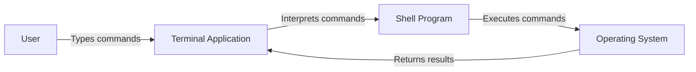

# Ubuntu Terminal Basics

## Introduction

The terminal is one of the most powerful tools in Ubuntu, providing direct access to the underlying system through a text-based interface. While graphical interfaces make many tasks accessible, mastering the terminal unlocks greater efficiency, automation capabilities, and deeper control over your Ubuntu system.

In this guide, we'll explore the fundamental terminal commands and concepts that every Ubuntu user should know. Whether you're completely new to Linux or looking to strengthen your foundation, these basics will set you on the path to terminal proficiency.

## What is the Terminal?

The terminal (also called the command line or shell) is a text-based interface where you type commands to interact with your computer. In Ubuntu, the default terminal application runs a shell program called Bash (Bourne Again SHell), though other shells like Zsh or Fish are also available.



## Opening the Terminal

There are several ways to open a terminal in Ubuntu:

- Press `Ctrl + Alt + T` (keyboard shortcut)
- Search for "Terminal" in the applications menu
- Right-click on the desktop and select "Open Terminal" (if this option is enabled)

## Understanding the Terminal Prompt

When you open the terminal, you'll see a prompt that typically looks like this:

```
username@hostname:~$
```

This prompt tells you:
- Your username
- The hostname of your computer
- Your current directory (`~` represents your home directory)
- The `$` symbol indicates you're logged in as a regular user (a `#` would indicate root user)

## Basic Navigation Commands

### 1. `pwd` - Print Working Directory

Shows your current location in the file system.

```bash
$ pwd
/home/username
```

### 2. `ls` - List Files and Directories

Displays the contents of the current directory.

```bash
$ ls
Documents  Downloads  Music  Pictures  Videos
```

Common options:
- `ls -l` - Long format showing permissions, size, etc.
- `ls -a` - Shows all files including hidden ones (starting with .)
- `ls -h` - Human-readable file sizes

```bash
$ ls -la
total 112
drwxr-xr-x 16 username username 4096 Mar 10 14:22 .
drwxr-xr-x  3 root     root     4096 Jan 15 10:45 ..
-rw-------  1 username username 9320 Mar 10 14:20 .bash_history
drwxr-xr-x  2 username username 4096 Mar  8 09:12 Documents
drwxr-xr-x  3 username username 4096 Mar  9 17:45 Downloads
```

### 3. `cd` - Change Directory

Navigates between directories.

```bash
$ cd Documents
$ pwd
/home/username/Documents
```

Special directory references:
- `cd ~` - Go to your home directory
- `cd ..` - Go up one directory level
- `cd -` - Go to previous directory

## File and Directory Operations

### 1. `mkdir` - Make Directory

Creates a new directory.

```bash
$ mkdir Projects
$ ls
Documents  Downloads  Music  Pictures  Projects  Videos
```

Create nested directories with the `-p` option:

```bash
$ mkdir -p Projects/WebDev/HTML
```

### 2. `touch` - Create Empty Files

Creates a new empty file or updates the timestamp of an existing file.

```bash
$ touch notes.txt
$ ls
Documents  Downloads  Music  notes.txt  Pictures  Projects  Videos
```

### 3. `cp` - Copy Files or Directories

Copies files or directories from one location to another.

```bash
$ cp notes.txt Documents/
$ ls Documents/
notes.txt
```

Copy directories with the `-r` (recursive) option:

```bash
$ cp -r Projects/ Documents/
```

### 4. `mv` - Move or Rename Files

Moves files or directories, also used for renaming.

Move a file:
```bash
$ mv notes.txt Documents/
```

Rename a file:
```bash
$ mv notes.txt todo.txt
```

### 5. `rm` - Remove Files or Directories

Deletes files or directories.

```bash
$ rm todo.txt
```

Remove directories with `-r` (recursive) option:

```bash
$ rm -r Projects/
```

**Warning**: Be careful with `rm`, especially when combined with wildcards or the `-rf` flag, as deleted files cannot be easily recovered!

## Viewing and Editing Files

### 1. `cat` - Concatenate and Display Files

Displays the contents of a file.

```bash
$ cat notes.txt
This is my notes file.
It contains important information.
```

### 2. `less` - View Files with Pagination

Views file contents with scrolling capability.

```bash
$ less large_file.txt
```

Navigation in `less`:
- `Space` or `f` - Forward one page
- `b` - Back one page
- `/pattern` - Search for text
- `q` - Quit

### 3. `head` and `tail` - View Beginning or End of Files

`head` shows the first 10 lines of a file:

```bash
$ head large_file.txt
# Shows first 10 lines
```

`tail` shows the last 10 lines:

```bash
$ tail large_file.txt
# Shows last 10 lines
```

You can specify the number of lines:

```bash
$ head -n 5 large_file.txt
# Shows first 5 lines
```

### 4. Text Editors

Several text editors are available in the terminal:

- `nano` - Beginner-friendly editor
  ```bash
  $ nano filename.txt
  ```

- `vim` - More powerful but has a steeper learning curve
  ```bash
  $ vim filename.txt
  ```

## Finding Files and Content

### 1. `find` - Search for Files

Searches for files in a directory hierarchy.

```bash
$ find . -name "*.txt"
./Documents/notes.txt
./report.txt
```

Find by type:

```bash
$ find . -type d -name "Project*"
./Projects
./Documents/ProjectBackup
```

### 2. `grep` - Search Within Files

Searches for patterns in files.

```bash
$ grep "important" notes.txt
This file contains important information.
```

Recursive search in directories:

```bash
$ grep -r "Ubuntu" Documents/
Documents/notes.txt:Ubuntu is a Linux distribution.
Documents/tutorial.txt:Ubuntu terminal basics are essential.
```

## Working with Permissions

### 1. Understanding Permissions

File permissions are displayed with `ls -l`:

```bash
$ ls -l notes.txt
-rw-r--r-- 1 username groupname 45 Mar 10 14:30 notes.txt
```

The permission string `-rw-r--r--` means:
- First character: File type (`-` for regular file, `d` for directory)
- Next three characters: Owner permissions (`rw-` = read, write, no execute)
- Next three characters: Group permissions (`r--` = read, no write, no execute)
- Last three characters: Others permissions (`r--` = read, no write, no execute)

### 2. `chmod` - Change Permissions

Changes file or directory permissions.

```bash
$ chmod u+x script.sh
$ ls -l script.sh
-rwxr--r-- 1 username groupname 80 Mar 10 14:35 script.sh
```

Common patterns:
- `chmod u+x` - Add execute permission for the owner
- `chmod 755` - Set rwx for owner, rx for group and others
- `chmod 644` - Set rw for owner, r for group and others

## Command Execution and Redirection

### 1. Command History

Access previously used commands:
- Use `↑` and `↓` arrow keys to navigate history
- `history` command shows the command history list

```bash
$ history
  1  pwd
  2  ls -la
  3  cd Documents
```

Execute a command from history:

```bash
$ !3
cd Documents
```

### 2. Input/Output Redirection

Redirect output to a file:

```bash
$ ls -la > file_list.txt
```

Append output to an existing file:

```bash
$ echo "New line" >> notes.txt
```

Redirect input from a file:

```bash
$ sort < unsorted.txt
```

### 3. Pipes

Connect the output of one command to the input of another:

```bash
$ ls -la | grep "Documents"
drwxr-xr-x  2 username username 4096 Mar  8 09:12 Documents
```

Chain multiple commands:

```bash
$ cat large_file.txt | grep "important" | sort > important_lines.txt
```

## Process Management

### 1. `ps` - List Running Processes

Shows currently running processes.

```bash
$ ps
  PID TTY          TIME CMD
 1234 pts/0    00:00:00 bash
 5678 pts/0    00:00:00 ps
```

For more detailed information:

```bash
$ ps aux
```

### 2. `kill` - Terminate Processes

Terminates a process by PID (Process ID).

```bash
$ kill 1234
```

Force kill a stubborn process:

```bash
$ kill -9 1234
```

### 3. Background Processes

Run a command in the background by adding `&`:

```bash
$ long_running_command &
[1] 1234
```

Suspend a running process with `Ctrl+Z`, then:
- `bg` - Continue the process in the background
- `fg` - Bring the process to the foreground

## Terminal Shortcuts

Some helpful keyboard shortcuts to improve efficiency:

- `Ctrl+C` - Cancel the current command
- `Ctrl+L` - Clear the screen (alternative to `clear` command)
- `Ctrl+A` - Move cursor to beginning of line
- `Ctrl+E` - Move cursor to end of line
- `Ctrl+W` - Delete the word before the cursor
- `Ctrl+U` - Delete from cursor to beginning of line
- `Tab` - Auto-complete commands and filenames

## Package Management Basics

Ubuntu uses `apt` (Advanced Package Tool) for package management.

Update package lists:

```bash
$ sudo apt update
```

Upgrade installed packages:

```bash
$ sudo apt upgrade
```

Install a package:

```bash
$ sudo apt install package-name
```

Remove a package:

```bash
$ sudo apt remove package-name
```

Search for packages:

```bash
$ apt search keyword
```

## Getting Help

When you're unsure about a command, there are several ways to get help:

### 1. `man` - Manual Pages

Detailed documentation for commands.

```bash
$ man ls
```

Navigate with the same keys as `less` (Space, b, q, etc.).

### 2. `--help` Option

Most commands provide basic help with the `--help` option.

```bash
$ ls --help
```

### 3. `info` - More Detailed Documentation

Some commands have more extensive documentation in the info system.

```bash
$ info ls
```

## Practical Examples

Let's look at some real-world tasks you might perform with the terminal:

### Example 1: Finding Large Files

```bash
$ find /home -type f -size +100M -exec ls -lh {} \; | sort -k5,5hr
```

This command finds files larger than 100MB in the /home directory and lists them with their sizes in human-readable format, sorted by size.

### Example 2: Batch Renaming Files

```bash
$ for f in *.jpg; do mv "$f" "vacation_$(date +%Y%m%d)_$f"; done
```

This renames all .jpg files by adding "vacation_" and the current date as a prefix.

### Example 3: Creating a Backup

```bash
$ tar -czvf backup_$(date +%Y%m%d).tar.gz Documents/
```

This creates a compressed backup of the Documents directory with the current date in the filename.

### Example 4: System Monitoring

```bash
$ watch -n 1 'free -m; echo ""; df -h'
```

This displays memory and disk usage, updating every second.

## Summary

The Ubuntu terminal provides a powerful interface for interacting with your system. In this guide, we've covered:

- Basic navigation with `pwd`, `ls`, and `cd`
- File operations with `mkdir`, `touch`, `cp`, `mv`, and `rm`
- Viewing and editing files
- Finding files and content with `find` and `grep`
- Working with permissions
- Command execution, redirection, and pipes
- Process management
- Package management with `apt`
- Getting help with `man` and `--help`

While it may seem intimidating at first, regular practice with these commands will build your confidence and efficiency. The terminal is an essential tool for any Ubuntu user, especially those interested in programming or system administration.

## Additional Resources

For further practice and learning:

1. Practice these commands regularly
2. Explore online terminal games like "Terminus" or "Over The Wire: Bandit"
3. Create your own shell scripts to automate common tasks
4. Try to use the terminal for daily tasks instead of the GUI when possible

## Exercises

1. Create a directory structure for a hypothetical project with subdirectories for source code, documentation, and resources.
2. Write a command to find all .txt files in your home directory that contain the word "important".
3. Create a simple shell script that displays the current date, disk usage, and memory usage.
4. Use redirection to combine the contents of multiple text files into a single file.
5. Find the five largest files in your Documents directory.