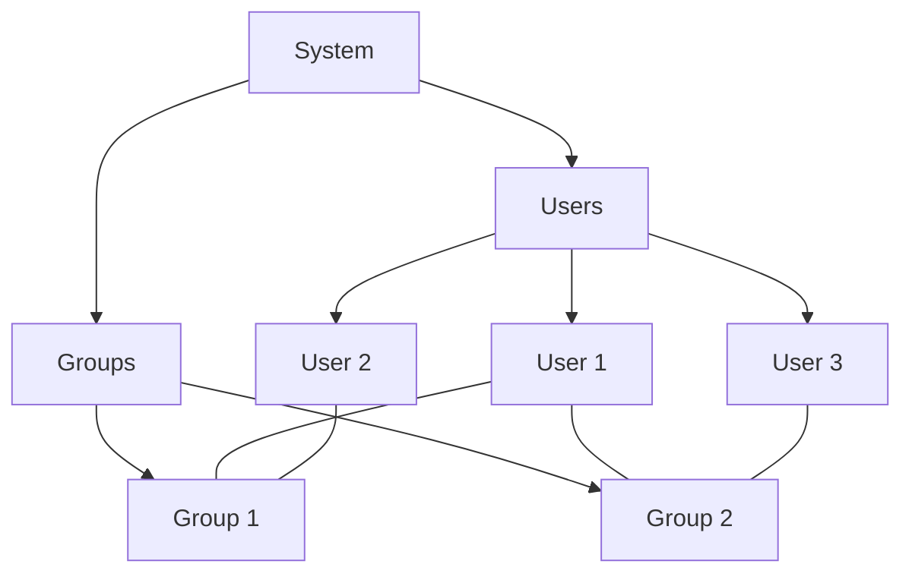

# Ubuntu User Accounts

## Introduction

User account management is a fundamental aspect of any operating system, and Ubuntu is no exception. In multi-user environments like Ubuntu, understanding how user accounts work is essential for system security, resource sharing, and maintaining a well-organized computing environment.

In this guide, we'll explore everything you need to know about Ubuntu user accounts - from creating and managing users to understanding the underlying permission structure that keeps the system secure and organized.

## Understanding Users and Groups in Ubuntu

### The Concept of Users

In Ubuntu (and other Linux distributions), a user is an entity that can interact with the system and own files. Each user has:

- A unique username
- A unique numeric user ID (UID)
- A home directory (typically `/home/username`)
- A login shell
- Password authentication
- Membership in one or more groups

### The Concept of Groups

Groups in Ubuntu are collections of users that share similar access permissions. Key points about groups:

- Each group has a unique name and group ID (GID)
- Every user belongs to at least one group (their primary group)
- Users can belong to multiple groups
- Groups simplify permission management for multiple users

Let's visualize the relationship:



## Types of User Accounts in Ubuntu

Ubuntu has three main types of user accounts:

1. **Root User**: The superuser (UID 0) with unlimited privileges
2. **System Users**: Created by the system for running services
3. **Regular Users**: Normal user accounts for people using the system

## Viewing Existing Users and Groups

### Listing Users

To see all users on your system:

```bash
cat /etc/passwd
```

Output example:
```
root:x:0:0:root:/root:/bin/bash
daemon:x:1:1:daemon:/usr/sbin:/usr/sbin/nologin
bin:x:2:2:bin:/bin:/usr/sbin/nologin
...
ubuntu:x:1000:1000:Ubuntu:/home/ubuntu:/bin/bash
```

For a cleaner list of just usernames:

```bash
cut -d: -f1 /etc/passwd
```

Output example:
```
root
daemon
bin
...
ubuntu
```

### Listing Groups

To see all groups:

```bash
cat /etc/group
```

Output example:
```
root:x:0:
daemon:x:1:
bin:x:2:
...
ubuntu:x:1000:
```

To check which groups a specific user belongs to:

```bash
groups username
```

Output example:
```
ubuntu : ubuntu adm cdrom sudo dip plugdev lpadmin sambashare
```

## Creating User Accounts

### Using adduser (Recommended for Beginners)

The `adduser` command provides an interactive way to create users:

```bash
sudo adduser newusername
```

Output example:
```
Adding user `newusername' ...
Adding new group `newusername' (1001) ...
Adding new user `newusername' (1001) with group `newusername' ...
Creating home directory `/home/newusername' ...
Copying files from `/etc/skel' ...
New password: 
Retype new password: 
passwd: password updated successfully
Changing the user information for newusername
Enter the new value, or press ENTER for the default
        Full Name []: New User
        Room Number []: 
        Work Phone []: 
        Home Phone []: 
        Other []: 
Is the information correct? [Y/n] Y
```

### Using useradd (More Control, Less Interactive)

The `useradd` command gives more control but requires more specific parameters:

```bash
sudo useradd -m -s /bin/bash -G sudo,adm newusername
sudo passwd newusername
```

In this command:
- `-m` creates a home directory
- `-s /bin/bash` sets the default shell
- `-G sudo,adm` adds the user to the sudo and adm groups

## Managing User Accounts

### Modifying User Properties

To modify existing user properties, use the `usermod` command:

```bash
# Add a user to a group
sudo usermod -aG groupname username

# Change a user's shell
sudo usermod -s /bin/zsh username

# Change a user's home directory
sudo usermod -d /newhome/username username
```

### Changing Passwords

Users can change their own passwords:

```bash
passwd
```

Administrators can change any user's password:

```bash
sudo passwd username
```

### Deleting Users

To remove a user account:

```bash
# Keep the home directory
sudo deluser username

# Remove the home directory as well
sudo deluser --remove-home username

# Remove all user files across the system
sudo deluser --remove-all-files username
```

## User Permissions and Ownership

### Understanding File Permissions

In Ubuntu, every file and directory has three permission sets:
- Owner permissions
- Group permissions
- Other (everyone else) permissions

Each set can have read (r), write (w), and execute (x) permissions.

To view permissions:

```bash
ls -l filename
```

Output example:
```
-rw-rw-r-- 1 ubuntu ubuntu 1234 Apr 15 14:30 example.txt
```

Breaking this down:
- `-rw-rw-r--`: Permissions string
  - First character `-` indicates a regular file
  - Next three characters `rw-` are owner permissions (read, write, no execute)
  - Next three characters `rw-` are group permissions (read, write, no execute)
  - Last three characters `r--` are other permissions (read only)
- `ubuntu ubuntu`: Owner and group names
- `1234`: File size in bytes
- `Apr 15 14:30`: Last modification date
- `example.txt`: Filename

### Changing Permissions

To modify file permissions:

```bash
# Using symbolic notation
chmod u+x filename    # Add execute permission for owner
chmod g-w filename    # Remove write permission for group
chmod o=r filename    # Set other permissions to read-only

# Using numeric notation
chmod 755 filename    # rwxr-xr-x
chmod 644 filename    # rw-r--r--
```

### Changing Ownership

To change file ownership:

```bash
# Change owner
sudo chown newowner filename

# Change group
sudo chgrp newgroup filename

# Change both owner and group
sudo chown newowner:newgroup filename
```

## Sudo and Administrative Privileges

### Understanding Sudo

The `sudo` command allows regular users to execute commands with administrative (root) privileges.

```bash
sudo command
```

When you run a command with `sudo`, the system will:
1. Ask for your password
2. Check if you're in the sudo group
3. Execute the command with elevated privileges if authorized

### Adding a User to Sudo Group

To give a user sudo privileges:

```bash
sudo usermod -aG sudo username
```

### Configuring Sudo Settings

Sudo's behavior is controlled by the `/etc/sudoers` file. Always edit this file using:

```bash
sudo visudo
```

Example of granting specific permissions:

```
# Allow user to run apt commands without password
username ALL=(ALL) NOPASSWD:/usr/bin/apt
```

## Working with the Root User

### Root Account in Ubuntu

By default, the root account in Ubuntu has no password set, which means direct login is disabled. Instead, Ubuntu encourages using `sudo` for administrative tasks.

### Switching to Root (Not Recommended for Regular Use)

If you need a root shell temporarily:

```bash
sudo -i
```

This will give you a root shell after entering your password.

### Enabling/Disabling the Root Account

To enable direct root login (not recommended):

```bash
sudo passwd root
```

To disable it again:

```bash
sudo passwd -l root
```

## Multi-User Best Practices

When managing a system with multiple users, follow these best practices:

1. **Principle of Least Privilege**: Give users only the permissions they need
2. **Regular Audits**: Periodically review user accounts and remove unused ones
3. **Strong Passwords**: Enforce strong password policies
4. **Group Organization**: Create logical groups based on roles or departments
5. **Shared Directories**: Use group permissions for collaboration spaces

### Creating Shared Directories

```bash
# Create a shared directory
sudo mkdir /shared/projects

# Set appropriate ownership and permissions
sudo chown root:developers /shared/projects
sudo chmod 2775 /shared/projects
```

In this example:
- The `developers` group owns the directory
- The permissions `2775` include the SGID bit (2) which makes new files inherit the directory's group

## User Management GUI

Ubuntu Desktop provides a graphical interface for user management:

1. Open "Settings"
2. Select "Users"
3. Click the "Unlock" button and enter your password
4. Use the interface to add, remove, or modify user accounts

## Summary

Managing user accounts in Ubuntu is a foundational skill that enables secure multi-user environments. We've covered:

- Understanding the concept of users and groups
- Creating, modifying, and deleting user accounts
- Managing permissions and ownership
- Using sudo for administrative tasks
- Best practices for multi-user systems

By mastering these concepts, you'll be able to manage Ubuntu systems efficiently while maintaining proper security.

## Exercises

1. Create a new user account and add it to the sudo group.
2. Create a shared directory for a group of users with appropriate permissions.
3. Modify file permissions to allow a specific group to edit a file, but others only to read it.
4. Find all files owned by a specific user using the `find` command.
5. Create a new group and add several users to it.

## Additional Resources

- [Ubuntu Community Help Wiki: Users and Groups](https://help.ubuntu.com/community/UsersAndGroups)
- [Ubuntu Server Guide: User Management](https://ubuntu.com/server/docs/security-users)
- The `man` pages for commands like `adduser`, `usermod`, `chmod`, and `chown`
- Run `man 5 passwd` and `man 5 group` to learn about user and group file formats