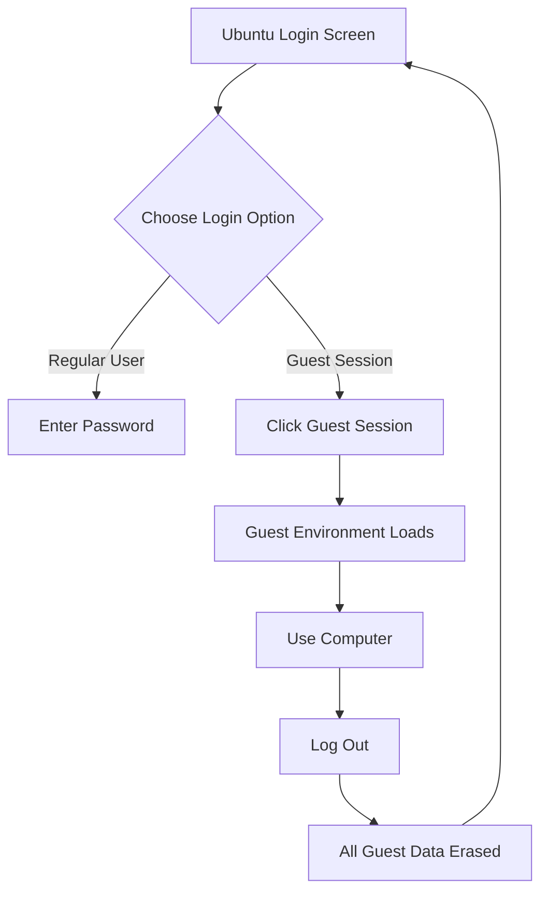

# Ubuntu Guest Session

## Introduction

The Ubuntu Guest Session is a convenient and secure feature that allows someone to temporarily use your Ubuntu system without accessing your personal files or making permanent changes. Think of it as a "visitor mode" for your computer - it provides a fresh, clean environment for guest users that automatically erases all activity once they log out.

Guest sessions are particularly useful in various scenarios:

- Letting a friend quickly check their email
- Providing temporary computer access to visitors
- Setting up public computers in libraries or internet cafés
- Testing software in an isolated environment

In this tutorial, we'll explore how to use, configure, and customize the Guest Session feature in Ubuntu.

## Understanding Guest Sessions

### What is a Guest Session?

A Guest Session in Ubuntu creates a temporary user account with limited privileges. Here are its key characteristics:

- **Temporary**: All data created during the session is deleted upon logout
- **Restricted**: Guest users cannot access your personal files or install software
- **Pre-configured**: Provides a standard Ubuntu desktop environment
- **No Authentication**: No password required to log in

### How Guest Sessions Work

Under the hood, Ubuntu uses a temporary filesystem (tmpfs) to store all guest session data in RAM rather than on the hard drive. This approach ensures that:

1. The session runs in an isolated environment
2. All data is automatically erased when the session ends
3. No traces of guest activity remain on the system

## Using Guest Sessions

### Accessing the Guest Session

To start a Guest Session on Ubuntu:

1. Log out of your current user session or boot your computer
2. At the login screen, look for the "Guest Session" option
3. Click on it to start a temporary session without entering any password



### Using the Guest Account

Once logged in as a guest, you'll see a standard Ubuntu desktop environment. The guest can:

- Use the web browser and other pre-installed applications
- Create and edit documents temporarily
- Download files (which will be erased at logout)
- Adjust temporary settings

### Limitations of Guest Sessions

Guest users cannot:

- Install new software
- Make permanent system changes
- Access other users' home directories
- Save files permanently (without external storage)
- Perform administrative tasks

## Enabling or Disabling Guest Sessions

Ubuntu typically has Guest Sessions enabled by default, but you might need to enable or disable them manually.

### Checking if Guest Sessions are Enabled

You can check if Guest Sessions are enabled with this command:

```bash
ls /etc/lightdm/lightdm.conf.d/
```

If you see a file containing guest session configuration, it's likely enabled.

### Enabling Guest Sessions

If Guest Sessions are disabled, you can enable them by creating or editing a configuration file:

```bash
sudo mkdir -p /etc/lightdm/lightdm.conf.d/
sudo nano /etc/lightdm/lightdm.conf.d/40-enable-guest.conf
```

Add these lines to the file:

```
[SeatDefaults]
allow-guest=true
```

Save the file (Ctrl+O, then Enter, then Ctrl+X to exit nano).

### Disabling Guest Sessions

For security reasons, you might want to disable Guest Sessions, especially on production systems:

```bash
sudo mkdir -p /etc/lightdm/lightdm.conf.d/
sudo nano /etc/lightdm/lightdm.conf.d/40-disable-guest.conf
```

Add these lines to the file:

```
[SeatDefaults]
allow-guest=false
```

Save the file and restart your system or the display manager:

```bash
sudo systemctl restart lightdm
```

## Customizing the Guest Session

### Default Applications

Guest Sessions come with a standard set of applications, but you can modify what's available to guests by customizing the guest template.

Create a custom guest session configuration:

```bash
sudo mkdir -p /etc/guest-session/
sudo nano /etc/guest-session/prefs.sh
```

Add commands to customize the environment. For example, to add bookmarks to Firefox:

```bash
#!/bin/bash
# Custom configuration for guest session

# Add Firefox bookmarks
if [ -d $HOME/.mozilla/firefox ]; then
  PROFILE=$(find $HOME/.mozilla/firefox -name "*.default" -type d)
  if [ -n "$PROFILE" ]; then
    echo '{"guid":"bookmarkMenuFolder","title":"Important Links","index":0,"dateAdded":1298403051000000,"lastModified":1298403051000000,"id":2,"type":"text/x-moz-place-container","children":[{"guid":"bookmark1","title":"Ubuntu Documentation","index":0,"dateAdded":1298403051000000,"lastModified":1298403051000000,"id":3,"type":"text/x-moz-place","uri":"https://help.ubuntu.com/"}]}' > $PROFILE/bookmarks.json
  fi
fi
```

Make the script executable:

```bash
sudo chmod +x /etc/guest-session/prefs.sh
```

### Restricting Features

You can further restrict what guest users can do by creating custom AppArmor profiles or adjusting permissions.

For example, to block access to USB devices, create a custom AppArmor profile:

```bash
sudo nano /etc/apparmor.d/guest-session
```

Add restrictions like:

```
#include <tunables/global>

/usr/lib/lightdm/lightdm-guest-session-wrapper {
  #include <abstractions/base>
  #include <abstractions/X>
  #include <abstractions/gnome>
  
  # Block USB storage access
  deny /media/** rwklmx,
  deny /run/media/** rwklmx,
  
  # Allow basic functionality
  /usr/lib/lightdm/lightdm-guest-session-wrapper r,
  /sbin/initctl rix,
  /bin/* rix,
  /usr/bin/* rix,
}
```

Reload AppArmor:

```bash
sudo systemctl reload apparmor
```

## Real-World Applications

### Public Computer Kiosks

Libraries and internet cafés often use Guest Sessions to provide safe, maintenance-free public access:

```bash
# Script to auto-start guest session after timeout
# Save as /usr/local/bin/kiosk-reset.sh

#!/bin/bash
IDLE_TIME=15  # Minutes of inactivity before reset

while true; do
  # Check user activity
  IDLE=$(xprintidle) # Requires xprintidle package
  
  if [ $IDLE -gt $(($IDLE_TIME * 60 * 1000)) ]; then
    # Force logout if idle
    gnome-session-quit --logout --no-prompt
  fi
  
  sleep 60
done
```

Make it executable and add to startup applications:

```bash
sudo chmod +x /usr/local/bin/kiosk-reset.sh
```

### Educational Environments

Schools often use Guest Sessions to provide students with a consistent environment:

```bash
# Create a custom educational profile
sudo mkdir -p /etc/guest-session/
sudo nano /etc/guest-session/edu-profile.sh

# Add educational tools and restrictions
#!/bin/bash
# Set educational bookmarks
if [ -d $HOME/.config/gtk-3.0 ]; then
  echo "[org.gnome.nautilus.bookmarks]
bookmarks=['file:///home/guest/Documents', 'https://edu-resources.example.org']" > $HOME/.config/gtk-3.0/bookmarks
fi

# Disable social media (by adding to hosts file)
echo "127.0.0.1 facebook.com www.facebook.com twitter.com www.twitter.com" | sudo tee -a /etc/hosts
```

### Testing Environment

Developers can use Guest Sessions to test software in a clean environment:

```bash
# Run a specific application in guest mode without full login
gksudo -u guest -k env DISPLAY=$DISPLAY firefox
```

## Security Considerations

While Guest Sessions are designed to be secure, there are some important security considerations:

1. **Data in RAM**: Guest session data is stored in RAM, but sophisticated attackers might be able to extract RAM contents
2. **Screen Lock**: Remind guests to log out completely rather than just locking the screen
3. **Physical Access**: Guest Sessions don't protect against hardware-level attacks or boot modifications
4. **Resource Limitations**: Consider setting resource limits to prevent denial-of-service attacks

To improve security further:

```bash
# Set memory limits for guest session
sudo nano /etc/security/limits.d/guest-session.conf
```

Add the following lines:

```
guest           hard    nproc           50
guest           hard    as              2097152  # Limit to 2GB RAM
```

## Troubleshooting Guest Sessions

### Guest Option Missing

If the Guest Session option is missing from the login screen:

```bash
# Check if guest sessions are enabled
cat /etc/lightdm/lightdm.conf.d/* | grep allow-guest

# Enable if needed
sudo nano /etc/lightdm/lightdm.conf.d/40-enable-guest.conf
# Add: [SeatDefaults]
#      allow-guest=true

sudo systemctl restart lightdm
```

### File Access Issues

If guests need access to specific shared directories:

```bash
# Create a shared directory
sudo mkdir -p /usr/share/public-files
sudo chmod 755 /usr/share/public-files

# Make it read-only for guests
sudo chown root:root /usr/share/public-files
sudo chmod 755 /usr/share/public-files/*
```

### Guest Session Not Working

If Guest Sessions fail to start:

```bash
# Check lightdm logs
sudo cat /var/log/lightdm/lightdm.log

# Verify tmpfs is properly mounted
mount | grep tmp
```

## Summary

Ubuntu's Guest Session feature provides a secure, isolated environment for temporary users. Key points to remember:

- Guest Sessions create temporary user accounts with limited privileges
- All guest data is automatically erased when the session ends
- Guest users cannot make permanent system changes or access other users' files
- You can enable, disable, and customize Guest Sessions to suit your needs
- Guest Sessions are ideal for public computers, shared systems, and testing environments

By understanding and properly configuring Guest Sessions, you can safely share your Ubuntu system with others while protecting your personal data and system integrity.

## Additional Resources

- [Ubuntu Documentation on User Management](https://help.ubuntu.com/community/UserManagement)
- [LightDM Configuration Guide](https://wiki.ubuntu.com/LightDM)
- [AppArmor Security Profiles](https://wiki.ubuntu.com/AppArmor)

## Exercises

1. Enable Guest Sessions on your Ubuntu system and explore the default environment.
2. Create a custom configuration script that adds a desktop shortcut to a helpful resource.
3. Set up a Guest Session with restricted internet access (hint: use `/etc/hosts` modifications).
4. Configure a Guest Session to automatically log out after 30 minutes of inactivity.
5. Create a shared folder that guest users can read from but not write to.